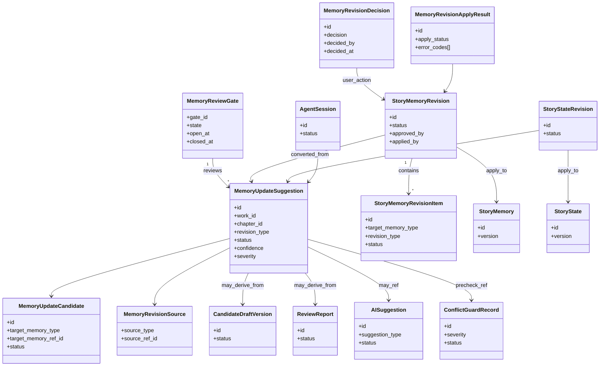
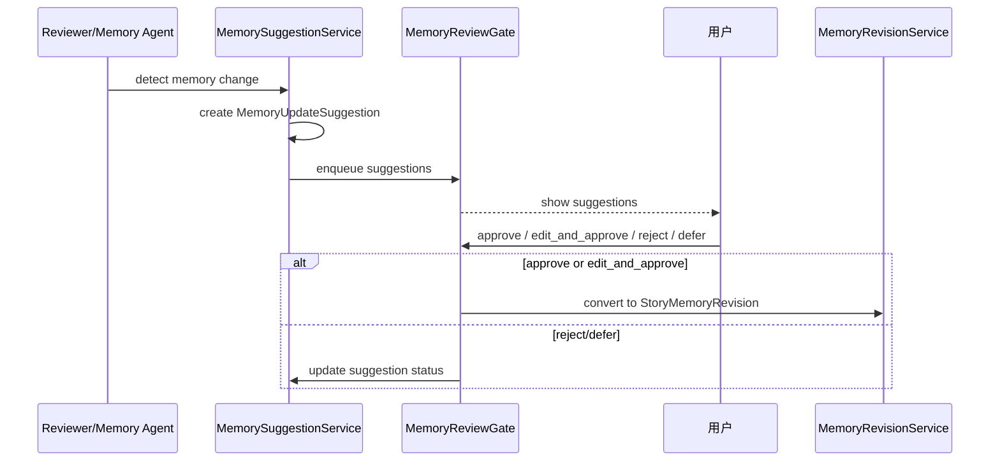
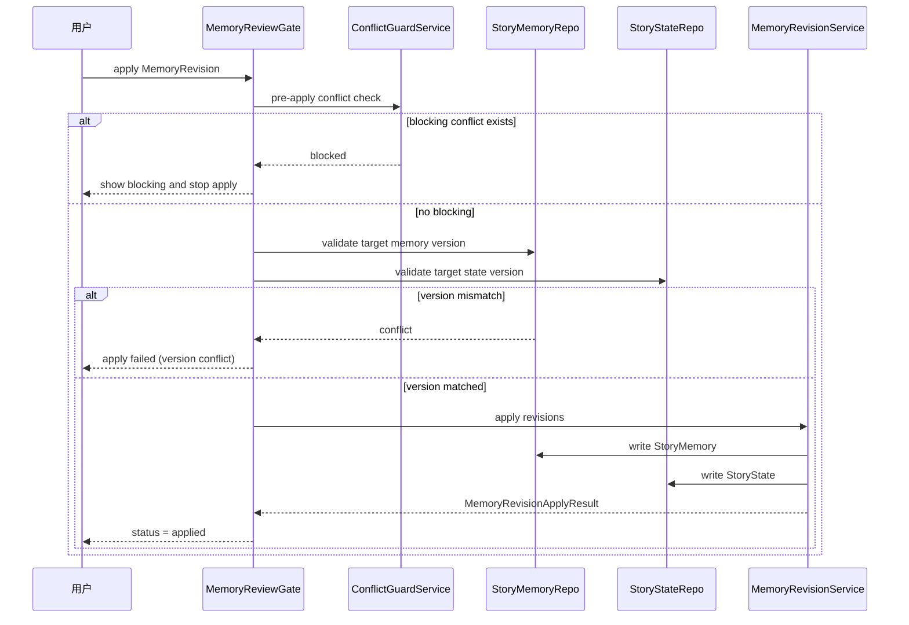
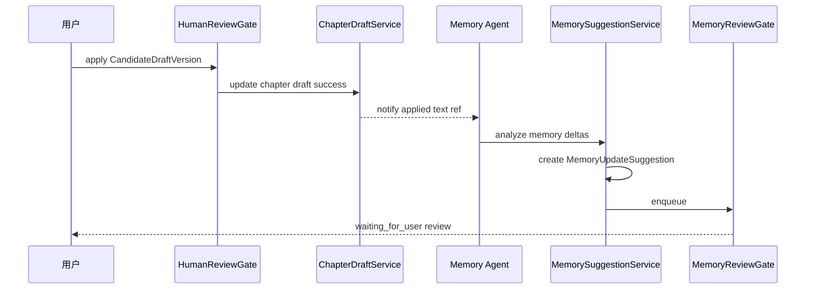
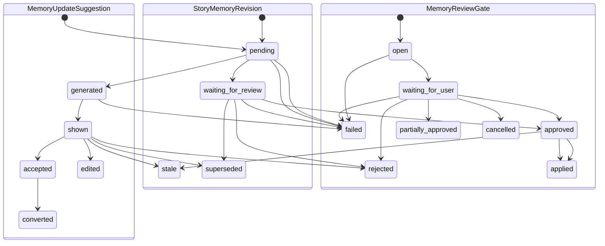

# InkTrace V2.0-P1-09 StoryMemoryRevision 与 MemoryReviewGate 详细设计

版本：v1.1 / P1 模块级详细设计候选冻结版  
状态：候选冻结  
所属阶段：InkTrace V2.0 P1

## 一、文档定位与设计范围

本文档只覆盖 P1-09 StoryMemoryRevision 与 MemoryReviewGate 详细设计。

设计范围：

1. MemoryUpdateSuggestion 的定位、来源、边界与类型。
2. MemoryReviewGate 用户确认门。
3. StoryMemoryRevision / StoryStateRevision 正式变更记录。
4. 建议到修订再到应用的状态机与生命周期。
5. 与 AISuggestion / ConflictGuard / CandidateDraftVersion / HumanReviewGate 的边界。
6. 与 StoryMemory / StoryState 的版本校验与写入规则。
7. UI 展示方向与安全约束。

不覆盖范围：

1. 不定义 P1-08 ConflictGuard 规则矩阵（已由 P1-08 冻结）。
2. 不定义 P1-11 API / DTO 细节。
3. 不引入 P2 自动记忆归纳、复杂知识图谱、批量自动更新、自动连续续写队列。
4. 不写代码、不生成开发计划、不处理 Git。

依据文档：

- `docs/01_requirements/InkTrace-V2.0-需求规格说明书.md`
- `docs/07_overview/InkTrace-V2.0-概要设计说明书.md`
- `docs/02_architecture/InkTrace-V2.0-架构设计说明书.md`
- `docs/03_design/InkTrace-V2.0-P1-详细设计总纲.md`
- `docs/03_design/InkTrace-V2.0-P1-01-AgentRuntime详细设计.md`
- `docs/03_design/InkTrace-V2.0-P1-02-AgentWorkflow详细设计.md`
- `docs/03_design/InkTrace-V2.0-P1-03-五Agent职责与编排详细设计.md`
- `docs/03_design/InkTrace-V2.0-P1-04-四层剧情轨道详细设计.md`
- `docs/03_design/InkTrace-V2.0-P1-05-方向推演与章节计划详细设计.md`
- `docs/03_design/InkTrace-V2.0-P1-06-多轮CandidateDraft迭代详细设计.md`
- `docs/03_design/InkTrace-V2.0-P1-07-AISuggestion详细设计.md`
- `docs/03_design/InkTrace-V2.0-P1-08-ConflictGuard详细设计.md`
- `docs/03_design/InkTrace-V2.0-P1-UI-界面与交互设计.md`
- `docs/03_design/InkTrace-DESIGN.md`
- `docs/03_design/V2/InkTrace-V2.0-P0-04-StoryMemory与StoryState详细设计.md`
- `docs/03_design/V2/InkTrace-V2.0-P0-09-CandidateDraft与HumanReviewGate详细设计.md`
- `docs/03_design/V2/InkTrace-V2.0-P0-10-AIReview详细设计.md`
- `docs/03_design/V2/InkTrace-V2.0-P0-11-API与集成边界详细设计.md`

---

## 二、核心概念与总体流程

核心结论（冻结）：

1. MemoryUpdateSuggestion 是正式记忆更新建议实体，不等于 AISuggestion。
2. AISuggestion 中的 `memory_update_suggestion_ref` 只是轻量引用，不是正式实体。
3. Memory Agent / Reviewer Agent 可以生成 MemoryUpdateSuggestion。
4. AI 不能自动写 StoryMemory。
5. AI 不能自动写 StoryState。
6. AI 不能自动 apply MemoryRevision。
7. MemoryReviewGate 是用户审批记忆更新的唯一门控。
8. 用户确认后，MemoryUpdateSuggestion 才能转化为 StoryMemoryRevision。
9. StoryMemoryRevision 是正式记忆变更记录，必须可审计与可追溯。
10. MemoryRevision apply 必须来自 user_action。
11. MemoryReviewGate 不替代 HumanReviewGate；两者分别管理记忆更新与正文候选门控。
12. ConflictGuard 负责冲突检测与阻断，P1-09 不重定义其规则矩阵。
13. StoryMemoryRevision / StoryStateRevision 遵循版本不可变原则：一旦创建不可原位修改，修正只能通过创建新 Revision。
14. 回滚即新版本：回滚操作创建新的 `revision_type=rollback` 版本，不删除旧版本。
15. 门控独立性固定：`MemoryReviewGate ≠ HumanReviewGate ≠ ConflictGuard`。
16. 建议、修订、审计链路只透传 `safe_ref`/摘要，不透传完整正文。

总体流程：

1. CandidateDraftVersion / ReviewReport / MemoryAgent 输出触发记忆变化识别。
2. 生成 MemoryUpdateSuggestion（仅建议，不落正式记忆）。
3. MemoryReviewGate 展示建议，等待用户 approve / edit_and_approve / reject / defer。
4. approve 后转换为 StoryMemoryRevision / StoryStateRevision（仍未写正式资产）。
5. apply 前执行 ConflictGuard + 目标版本校验。
6. 校验通过后写入 StoryMemory / StoryState，并记录 MemoryRevisionApplyResult。

---

## 三、MemoryUpdateSuggestion 数据模型

### 3.1 MemoryUpdateSuggestion

| 字段 | 类型 | 必填 | 说明 |
|---|---|---|---|
| id | string | 是 | Suggestion 主键 |
| work_id | string | 是 | 作品 ID |
| chapter_id | string | 否 | 章节 ID |
| candidate_draft_id | string | 否 | 关联候选稿容器 |
| candidate_version_id | string | 否 | 关联候选稿版本 |
| review_report_id | string | 否 | 关联审阅报告 |
| ai_suggestion_id | string | 否 | 关联 AISuggestion |
| conflict_guard_record_id | string | 否 | 关联冲突记录 |
| agent_session_id | string | 是 | 产生该建议的会话 |
| source_type | enum | 是 | 来源类型（证据来源+触发链路） |
| source_ref_id | string | 否 | 来源实体引用 |
| target_memory_type | enum | 是 | story_memory / story_state / both |
| target_memory_ref_id | string | 否 | 目标记忆实体引用 |
| revision_type | enum | 是 | 记忆更新类型 |
| proposed_value_summary | string | 是 | 建议值摘要 |
| current_value_summary | string | 是 | 当前值摘要 |
| evidence_refs | MemoryRevisionSource[] | 是 | 证据引用列表 |
| confidence | number | 是 | 置信度（0~1） |
| severity | enum | 是 | info / warning / critical |
| status | enum | 是 | Suggestion 状态 |
| decision | enum | 否 | approved / edited_approved / rejected / deferred |
| decided_by | string | 否 | 决策人（user_action） |
| warning_codes | string[] | 否 | 风险码 |
| created_by | string | 是 | memory_agent / reviewer_agent |
| created_at | datetime | 是 | 创建时间 |
| updated_at | datetime | 是 | 更新时间 |
| request_id | string | 否 | 请求链路 ID |
| trace_id | string | 否 | 追踪链路 ID |

MemoryUpdateSuggestion 只记录建议决策人（`decided_by` / `decided_at`）；正式 apply 操作人只记录在 Revision / ApplyResult 层。

### 3.2 MemoryUpdateCandidate

用于同目标多建议聚合展示与仲裁。

| 字段 | 类型 | 必填 | 说明 |
|---|---|---|---|
| candidate_id | string | 是 | 候选条目标识 |
| suggestion_id | string | 是 | 主归属 Suggestion |
| candidate_no | integer | 是 | 序号 |
| field_path | string | 是 | 目标字段路径 |
| field_label | string | 是 | 目标字段名称 |
| current_value | string | 是 | 当前值摘要 |
| proposed_value | string | 是 | 建议值摘要 |
| change_type | enum | 是 | add / update / delete / note_only |
| rationale | string | 是 | 变更依据 |
| confidence | number | 否 | 条目级置信度 |
| status | enum | 是 | pending / selected / rejected / superseded |
| suggestion_ids | string[] | 否 | 同目标聚合建议集（视图字段） |
| selected_suggestion_id | string | 否 | 聚合视图最终选择建议 |
| created_at | datetime | 是 | 创建时间 |

### 3.3 MemoryRevisionSource

| 字段 | 类型 | 必填 | 说明 |
|---|---|---|---|
| source_id | string | 否 | 来源记录 ID |
| source_type | enum | 是 | 证据来源/触发链路类型 |
| entity_type | string | 否 | 源实体类型 |
| entity_ref_id | string | 否 | 源实体 ID |
| source_ref_id | string | 否 | 链路源引用 |
| source_session_id | string | 否 | 源会话 ID |
| source_version_id | string | 否 | 源版本 ID |
| excerpt | string | 否 | 证据摘录 |
| relevance | string | 否 | 相关性说明 |

### 3.4 MemoryRevisionRef / safe_ref

| 字段 | 类型 | 必填 | 说明 |
|---|---|---|---|
| ref_type | string | 是 | 引用类型 |
| ref_id | string | 是 | 引用 ID |
| ref_scope | enum | 是 | work / chapter / session |
| summary | string | 否 | 安全摘要 |
| checksum | string | 否 | 一致性校验 |
| created_at | datetime | 是 | 创建时间 |

持久化原则：

1. 持久化摘要与证据引用，不持久化完整 Prompt。
2. 普通日志不记录完整 ContextPack / JSON / API Key。

---

## 四、MemoryUpdate 类型体系

memory_update_type / revision_type：

1. `character_update`
2. `setting_update`
3. `timeline_event_add`
4. `timeline_event_update`
5. `foreshadow_add`
6. `foreshadow_update`
7. `foreshadow_resolve`
8. `plot_thread_update`
9. `story_state_update`
10. `arc_note_update`
11. `continuity_note_add`
12. `unknown_memory_update`

类型落点规则：

| revision_type | 主要写入目标 | 仅备注 | 需 ConflictGuard 预检 | 必须进 MemoryReviewGate | 可直接 dismiss |
|---|---|---|---|---|---|
| character_update | StoryMemory | 否 | 是 | 是 | 是 |
| setting_update | StoryMemory | 否 | 是 | 是 | 是 |
| timeline_event_add | StoryMemory | 否 | 是 | 是 | 是 |
| timeline_event_update | StoryMemory | 否 | 是 | 是 | 是 |
| foreshadow_add | StoryMemory | 否 | 是 | 是 | 是 |
| foreshadow_update | StoryMemory | 否 | 是 | 是 | 是 |
| foreshadow_resolve | StoryMemory | 否 | 是 | 是 | 是 |
| plot_thread_update | StoryMemory | 否 | 是 | 是 | 是 |
| story_state_update | StoryState | 否 | 是 | 是 | 是 |
| arc_note_update | StoryMemory/备注域 | 是（优先） | 建议 | 是 | 是 |
| continuity_note_add | StoryMemory/备注域 | 是 | 建议 | 是 | 是 |
| unknown_memory_update | 待用户确认 | 是（默认） | 是 | 是 | 是 |

说明：

1. 所有正式写入类型都必须经过 MemoryReviewGate。
2. `unknown_memory_update` 默认 `severity=critical`，必须人工判断。
3. `arc_note_update` 不直接修改四层轨道结构，只写轨道备注或记忆注释域。

---

## 五、MemoryReviewGate 设计

### 5.1 定位

MemoryReviewGate 是记忆更新审批唯一门控，负责用户对建议的批准、编辑后批准、拒绝与延期处理。

### 5.2 模型要点

| 字段 | 类型 | 必填 | 说明 |
|---|---|---|---|
| gate_id | string | 是 | Gate 主键 |
| work_id | string | 是 | 作品 ID |
| chapter_id | string | 否 | 章节 ID |
| suggestion_ids | string[] | 是 | 审批建议集合 |
| state | enum | 是 | open / waiting_for_user / partially_approved / approved / rejected / applied / cancelled / failed |
| warning_codes | string[] | 否 | 风险码 |
| open_at | datetime | 是 | 打开时间 |
| closed_at | datetime | 否 | 关闭时间 |
| operator_id | string | 否 | 当前操作用户 |

### 5.3 用户操作

1. `approve`
2. `edit_and_approve`
3. `reject`
4. `defer`

`edit_and_approve` 冻结规则：

1. 允许修改：
   - `proposed_value_summary`
   - `MemoryUpdateCandidate.proposed_value`
   - `rationale` / `decision_note`
2. 不允许修改：
   - `target_memory_type`
   - `target_memory_ref_id`
   - `field_path`
   - `field_label`
   - `revision_type`
   - `change_type`
3. 若目标字段错误，必须 `reject` 当前 Suggestion，并重新生成新的 MemoryUpdateSuggestion。

### 5.4 语义边界

1. approve：认可建议，进入 revision waiting/apply 流程。
2. edit_and_approve：用户修改建议值后认可。
3. reject：拒绝建议，不写正式资产。
4. defer：暂缓处理，保留待办。

---

## 六、StoryMemoryRevision 设计

### 6.1 StoryMemoryRevision

正式记忆变更记录实体，审计主线。

字段定义：

| 字段 | 类型 | 必填 | 说明 |
|---|---|---|---|
| id | string | 是 | Revision 主键 |
| work_id | string | 是 | 作品 ID |
| chapter_id | string | 否 | 章节 ID |
| source_suggestion_id | string | 是 | 来源 Suggestion |
| revision_items | StoryMemoryRevisionItem[] | 是 | 变更项集合 |
| revision_type | enum | 是 | normal / rollback |
| status | enum | 是 | pending / waiting_for_review / approved / rejected / applied / stale / superseded / failed |
| approved_by | string | 否 | 审批用户 |
| approved_at | datetime | 否 | 审批时间 |
| applied_by | string | 否 | 应用用户 |
| applied_at | datetime | 否 | 应用时间 |
| apply_result_ref | string | 否 | Apply 结果引用 |
| before_summary | string | 是 | 应用前摘要 |
| after_summary | string | 否 | 应用后摘要 |
| request_id | string | 否 | 请求 ID |
| trace_id | string | 否 | 追踪 ID |
| created_at | datetime | 是 | 创建时间 |
| updated_at | datetime | 是 | 更新时间 |

规则：StoryMemoryRevision 一旦创建不可原位修改；修正只能新建 Revision。

### 6.2 StoryMemoryRevisionItem

| 字段 | 类型 | 必填 | 说明 |
|---|---|---|---|
| id | string | 是 | 条目主键 |
| revision_id | string | 是 | 所属 Revision |
| target_memory_type | enum | 是 | character / setting / timeline / foreshadow / plot_thread / story_state |
| target_memory_ref_id | string | 是 | 目标实体 ID |
| revision_type | enum | 是 | 变更类型 |
| before_value_summary | string | 否 | 变更前摘要 |
| after_value_summary | string | 是 | 变更后摘要 |
| evidence_refs | MemoryRevisionSource[] | 否 | 证据引用 |
| status | enum | 是 | pending / applied / failed / superseded |

### 6.3 MemoryRevisionDecision

| 字段 | 类型 | 必填 | 说明 |
|---|---|---|---|
| id | string | 是 | 决策记录 ID |
| revision_id | string | 是 | 关联 Revision |
| decision | enum | 是 | approved / rejected / deferred |
| decided_by | string | 是 | user_action 用户 |
| decided_at | datetime | 是 | 决策时间 |
| decision_note | string | 否 | 决策备注 |

### 6.4 MemoryRevisionApplyResult

| 字段 | 类型 | 必填 | 说明 |
|---|---|---|---|
| id | string | 是 | Apply 结果 ID |
| revision_id | string | 是 | 关联 Revision |
| apply_status | enum | 是 | success / partial_success / failed |
| applied_memory_refs | string[] | 否 | 成功写入引用 |
| failed_item_refs | string[] | 否 | 失败条目引用 |
| error_codes | string[] | 否 | 错误码 |
| before_after_snapshot_ref | string | 否 | before/after 快照引用 |
| applied_at | datetime | 否 | 应用时间 |

---

## 七、StoryStateRevision 设计

StoryStateRevision 与 StoryMemoryRevision 并列，针对当前章节状态域。

字段定义：

| 字段 | 类型 | 必填 | 说明 |
|---|---|---|---|
| id | string | 是 | StateRevision 主键 |
| work_id | string | 是 | 作品 ID |
| chapter_id | string | 否 | 章节 ID |
| source_suggestion_id | string | 是 | 来源 Suggestion |
| state_items | object[] | 是 | 状态变更项集合 |
| target_state_ref | string | 否 | 目标状态引用 |
| version_guard | string | 否 | 版本校验值 |
| status | enum | 是 | pending / waiting_for_review / approved / rejected / applied / stale / superseded / failed |
| approved_by | string | 否 | 审批用户 |
| approved_at | datetime | 否 | 审批时间 |
| applied_by | string | 否 | 应用用户 |
| applied_at | datetime | 否 | 应用时间 |
| before_summary | string | 是 | 应用前摘要 |
| after_summary | string | 否 | 应用后摘要 |
| request_id | string | 否 | 请求 ID |
| trace_id | string | 否 | 追踪 ID |

规则：

1. StoryStateRevision 仅更新状态资产，不改正文。
2. 目标版本不匹配时必须阻止写入。

---

## 八、状态机与生命周期

### 8.1 MemoryUpdateSuggestion 状态

- `pending`
- `generated`
- `shown`
- `accepted`
- `edited`
- `rejected`
- `converted`
- `stale`
- `superseded`
- `failed`

### 8.2 StoryMemoryRevision 状态

- `pending`
- `waiting_for_review`
- `approved`
- `rejected`
- `applied`
- `stale`
- `superseded`
- `failed`

### 8.3 MemoryReviewGate 状态

- `open`
- `waiting_for_user`
- `partially_approved`
- `approved`
- `rejected`
- `applied`
- `cancelled`
- `failed`

### 8.4 状态语义规则

1. `generated -> shown`：UI 成功拉取并展示。
2. `accepted`：用户认可建议方向；`converted`：已生成正式 revision 实体。
3. `approved`：审批通过；`applied`：已写入正式资产。
4. stale 触发：
   - CandidateDraftVersion stale/superseded；
   - ReviewReport stale；
   - ConflictGuardRecord stale；
   - 上游 session 关闭导致上下文失效。
5. superseded 触发：同目标建议被新建议替代。
6. late result：session 关闭后到达结果标 ignored，不推进状态。
7. partial_success：允许部分建议完成，未完成项保留待处理。

### 8.5 Suggestion / Gate / Revision 状态映射表

| 用户动作 / 系统事件 | MemoryUpdateSuggestion | MemoryReviewGate | StoryMemoryRevision | 说明 |
|---|---|---|---|---|
| 建议生成成功 | generated | open | - | 仅建议层存在 |
| UI 展示建议 | shown | waiting_for_user | - | 用户可审批 |
| 用户 approve | accepted | partially_approved / approved | pending | 可创建 Revision，但未写正式记忆 |
| 用户 edit_and_approve | edited | partially_approved / approved | pending | 只允许改建议值，不允许改目标字段 |
| 用户 reject | rejected | partially_approved / approved | - | 不生成 Revision |
| 用户 defer | shown | waiting_for_user | - | 保留待办 |
| 用户 apply 已批准项 | converted | applied | applied | 写入 StoryMemory / StoryState 成功 |
| apply 前 ConflictGuard blocking | accepted / edited | approved | waiting_for_review | 阻止 apply，等待处理冲突 |
| apply 失败 | accepted / edited | failed | failed | 不写正式资产 |
| 上游候选稿 superseded | stale | open / waiting_for_user | - | 建议过期，用户可确认是否仍处理 |

---

## 九、与 AISuggestion 的关系

1. AISuggestion 是通用建议层。
2. MemoryUpdateSuggestion 是正式记忆更新建议层。
3. AISuggestion 的 `memory_update_suggestion_ref` 可指向正式建议。
4. AISuggestion accept 不等于 MemoryUpdateSuggestion approved。
5. AISuggestion convert 可引导进入 MemoryReviewGate。
6. MemoryReviewGate 的 approved/rejected/applied 不反向修改 AISuggestion 主状态，只追加引用或摘要。
7. 不改变 P1-07 accept/convert/dismissed 语义。

---

## 十、与 ConflictGuard 的关系

1. 涉及正式资产变更的 MemoryUpdateSuggestion 必须经过 ConflictGuard 预检。
2. ConflictGuard 发现 `memory_conflict` 时可触发 MemoryUpdateSuggestion。
3. ConflictGuard blocking 未处理时，MemoryRevision 不得 applied。
4. ConflictGuardRecord 不能自动生成 applied MemoryRevision。
5. MemoryReviewGate 不覆盖 ConflictGuard blocking。
6. 默认顺序：先 ConflictGuard，再 MemoryReviewGate，再 apply 记忆更新。
7. 顺序与 P1-02 AgentWorkflow 多门控原则保持一致。

---

## 十一、与 CandidateDraftVersion / HumanReviewGate 的关系

1. CandidateDraftVersion 可产生 MemoryUpdateSuggestion。
2. ReviewReport / ReviewIssue 可产生 MemoryUpdateSuggestion。
3. CandidateDraft apply 成功后可触发记忆建议生成。
4. apply 成功不等于自动更新 StoryMemory。
5. HumanReviewGate 不审批记忆更新。
6. MemoryReviewGate 不审批正文候选。
7. 候选稿 rejected/superseded 后，关联记忆建议默认 stale 或需用户确认保留。
8. 不改变 P1-06 selected/accepted/applied 三指针规则。

---

## 十二、与 StoryMemory / StoryState 的关系

1. StoryMemoryRevision 可更新人物、设定、伏笔、时间线、剧情线索。
2. StoryStateRevision 可更新当前章节状态、角色位置、关系状态、未解决线索。
3. apply 必须记录 before/after 摘要。
4. 写入前必须校验目标版本，防止覆盖用户/并发流程修改。
5. applied 后更新对应 memory/state 版本号或 revision_ref。
6. failed/rejected/stale 的 revision 不写正式资产。
7. MemoryRevision 不直接修改四层轨道结构，仅可写轨道备注类更新。

---

## 十三、与五 Agent 的关系

1. Memory Agent 是主要建议生成者。
2. Reviewer Agent 可基于审阅问题生成建议。
3. Planner Agent 可生成 arc_note_update / plot_thread_update 建议，但不写记忆。
4. Writer / Rewriter 默认不直接生成正式 MemoryUpdateSuggestion（需经 Reviewer/Memory Agent 派生）。
5. 所有 Agent 不能 approve/reject/apply MemoryRevision。
6. approve/reject/apply 必须 user_action。

---

## 十四、与 UI / DESIGN.md 的关系

1. MemoryReviewGate 在 ReviewTab / AITab 展示。
2. 建议以卡片或列表展示。
3. 每条展示：更新类型、目标类型、当前值摘要、建议值摘要、来源、证据、冲突状态、风险等级。
4. 用户操作：approve / edit_and_approve / reject / defer。
5. approved 与 applied 必须视觉区分。
6. blocking conflict 存在时 apply 按钮必须受限。
7. 普通用户不展示完整 Prompt / ContextPack / JSON / Tool 原始日志。
8. 状态色遵守 InkTrace-DESIGN.md。

---

## 十五、类图、状态图与时序图

### 15.1 Mermaid 类图

### 15.2 MemoryUpdateSuggestion 生成主流程时序图

### 15.3 MemoryRevision apply 时序图

### 15.4 CandidateDraft apply 后触发记忆建议时序图

### 15.5 状态图

---

## 十六、错误处理与降级规则

1. MemoryUpdateSuggestion 生成失败：状态 failed。
2. Suggestion 输出为空：failed 或 skipped（默认 failed）。
3. schema 校验失败：按既有校验重试边界，超限 failed。
4. CandidateDraftVersion stale/superseded：关联建议标 stale。
5. ReviewReport stale：关联建议标 stale。
6. ConflictGuard blocking：阻止 revision apply。
7. ConflictGuard 检测失败：apply 前 fail-safe 阻止。
8. StoryMemory 目标版本冲突：apply 失败，不写入。
9. StoryState 目标版本冲突：apply 失败，不写入。
10. edit_and_approve 校验失败：保持 waiting_for_user 并提示错误。
11. MemoryRevision apply 失败：记录 ApplyResult failed。
12. late result：session 关闭后结果 ignored。
13. AgentSession cancelled/failed/partial_success：已落库保留，未落库忽略。
14. 多个建议指向同目标字段：进入 MemoryUpdateCandidate 聚合，要求用户选定。
15. CandidateDraft apply 后 Memory Agent 生成建议失败：不影响正文已应用状态，仅记警告。

---

## 十七、安全边界与禁止事项

1. 禁止 AI 自动 approve MemoryUpdateSuggestion。
2. 禁止 AI 自动 reject MemoryUpdateSuggestion。
3. 禁止 AI 自动 apply StoryMemoryRevision。
4. 禁止 MemoryReviewGate 绕过 ConflictGuard。
5. 禁止 MemoryReviewGate 绕过 user_action。
6. 禁止 MemoryRevision 直接覆盖用户手动修改。
7. 禁止不做目标版本校验写 StoryMemory。
8. 禁止不做目标版本校验写 StoryState。
9. 禁止记录完整 Prompt / API Key / 完整 ContextPack。
10. 禁止引入 P2 自动记忆归纳。
11. 禁止引入 P2 复杂知识图谱。
12. 禁止引入 P2 批量自动更新。
13. 禁止引入自动连续续写队列。

---

## 十八、P1-09 不做事项清单

1. 不改造成 API / DTO 设计。
2. 不进入 P1-10 AgentTrace 完整字段。
3. 不进入 P1-11 前端集成细节。
4. 不定义 P2 自动化记忆治理能力。
5. 不定义跨作品批量记忆迁移。

---

## 十九、P1-09 验收标准

1. MemoryUpdateSuggestion 与 AISuggestion 定位区分清晰。
2. MemoryReviewGate 作为唯一记忆审批门控已冻结。
3. StoryMemoryRevision / StoryStateRevision 模型完整。
4. approve/reject/apply 必须 user_action。
5. apply 前 ConflictGuard 预检规则明确。
6. apply 前目标版本校验规则明确。
7. approved 与 applied 语义分离。
8. 与 HumanReviewGate 边界清晰。
9. 与 P1-08 / P1-11 边界清晰。
10. UI 展示与操作约束完整。
11. Mermaid 类图、状态图、时序图完整。
12. 错误处理覆盖 stale/superseded/conflict/fail-safe。
13. 未引入任何 P2 功能。

---

## 二十、P1-09 待确认点

1. 多建议同目标字段时默认聚合策略（最新优先/置信度优先/手动选择）。
2. MemoryReviewGate 是否支持批量 approve。
3. apply 前 ConflictGuard 检查失败是否允许管理员特权放行。
4. StoryMemoryRevision 与 StoryStateRevision 是否允许单事务提交。
5. defer 建议的默认过期策略。
6. apply 后是否立即触发一次建议回收检查（避免重复建议）。

---

## 附录 A：模型字段速查表

| 模型 | 字段（与正文一致） |
|---|---|
| MemoryUpdateSuggestion | id, work_id, chapter_id, candidate_draft_id, candidate_version_id, review_report_id, ai_suggestion_id, conflict_guard_record_id, agent_session_id, source_type, source_ref_id, target_memory_type, target_memory_ref_id, revision_type, proposed_value_summary, current_value_summary, evidence_refs, confidence, severity, status, decision, decided_by, warning_codes, created_by, created_at, updated_at, request_id, trace_id |
| MemoryUpdateCandidate | candidate_id, suggestion_id, candidate_no, field_path, field_label, current_value, proposed_value, change_type, rationale, confidence, status, suggestion_ids(可选), selected_suggestion_id(可选), created_at |
| MemoryRevisionSource | source_id, source_type, entity_type, entity_ref_id, source_ref_id, source_session_id, source_version_id, excerpt, relevance |
| MemoryRevisionRef / safe_ref | ref_type, ref_id, ref_scope, summary, checksum, created_at |
| MemoryReviewGate | gate_id, work_id, chapter_id, suggestion_ids, state, warning_codes, open_at, closed_at, operator_id |
| StoryMemoryRevision | id, work_id, chapter_id, source_suggestion_id, revision_items, revision_type, status, approved_by, approved_at, applied_by, applied_at, apply_result_ref, before_summary, after_summary, request_id, trace_id, created_at, updated_at |
| StoryMemoryRevisionItem | id, revision_id, target_memory_type, target_memory_ref_id, revision_type, before_value_summary, after_value_summary, evidence_refs, status |
| StoryStateRevision | id, work_id, chapter_id, source_suggestion_id, state_items, target_state_ref, version_guard, status, approved_by, approved_at, applied_by, applied_at, before_summary, after_summary, request_id, trace_id |
| MemoryRevisionDecision | id, revision_id, decision, decided_by, decided_at, decision_note |
| MemoryRevisionApplyResult | id, revision_id, apply_status, applied_memory_refs, failed_item_refs, error_codes, before_after_snapshot_ref, applied_at |

---

## 附录 B：P1-09 与 P1 总纲对照

| P1 总纲要求 | P1-09 冻结内容 |
|---|---|
| 记忆更新需独立门控 | MemoryReviewGate 作为唯一审批门控 |
| AI 不自动写正式记忆资产 | 明确禁止自动 approve/apply |
| 记忆变更需可审计 | StoryMemoryRevision / Decision / ApplyResult 全链路记录 |
| 与 ConflictGuard 协同 | apply 前预检，blocking 先处理 |
| 与候选稿门控分离 | HumanReviewGate 与 MemoryReviewGate 分工明确 |
| 不提前进入 P2 | 不含自动记忆归纳/批量自动更新/复杂图谱 |
