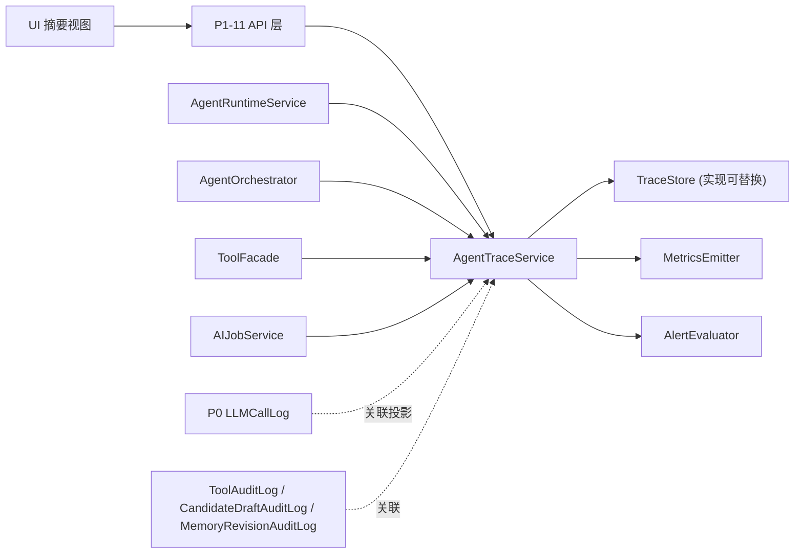
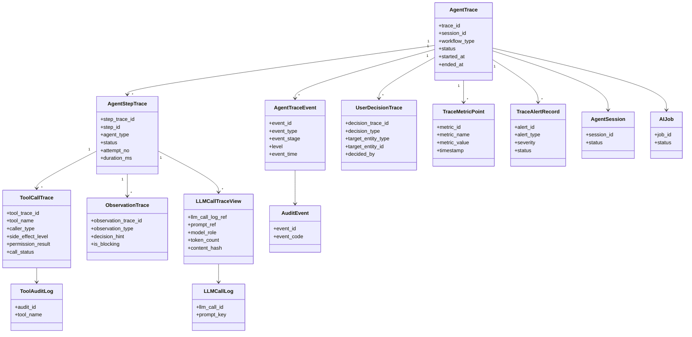
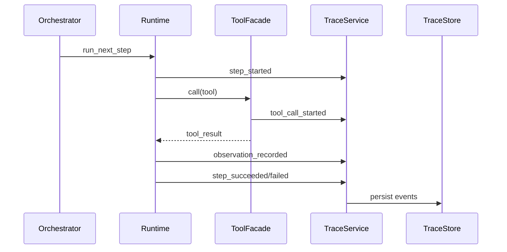
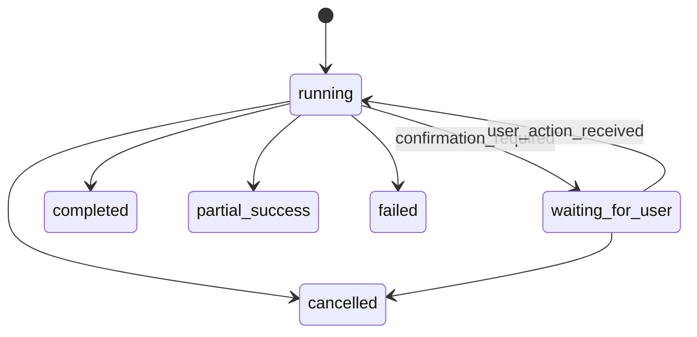
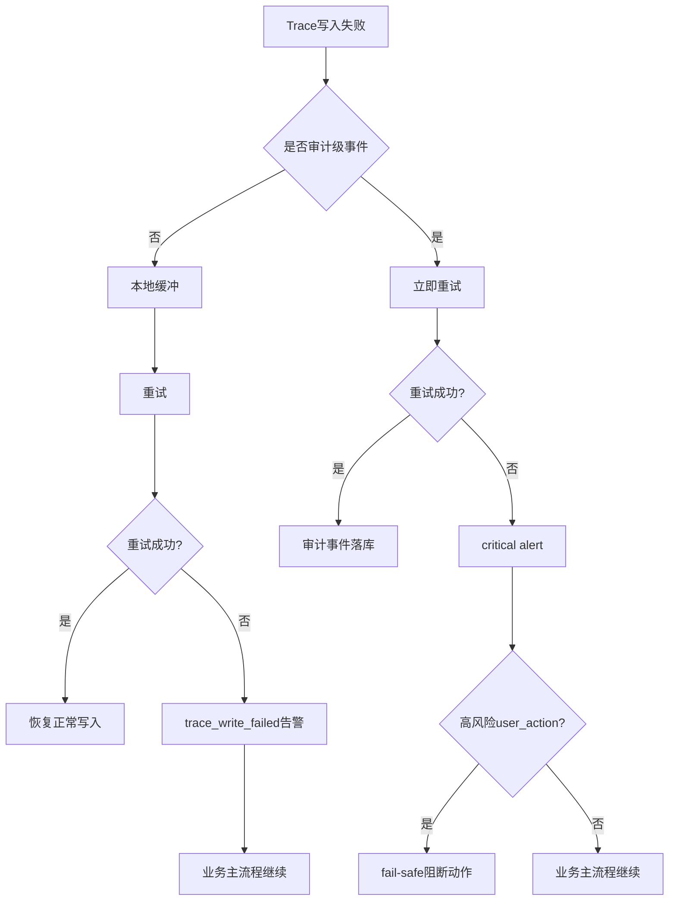

# InkTrace V2.0-P1-10 AgentTrace 与可观测性详细设计

版本：v1.1 / P1 模块级详细设计候选冻结版  
状态：候选冻结  
所属阶段：InkTrace V2.0 P1  
设计范围：AgentTrace、运行观测、审计关联、指标与告警边界

合并说明：本文档以无后缀 `.md` v1.0 为主版本，吸收 `_001.md` 中的三层分层架构、安全引用体系、LLMCallTrace / UserDecisionTrace 视图、审计事件清单、UI 展示约束、存储留存策略和待确认点；`_001.md` 已被完全吸收，不再单独维护。

## 一、文档定位与设计范围

本文档只覆盖 P1-10 AgentTrace 与可观测性详细设计，不写代码、不生成开发计划、不处理 Git。  
本文档冻结“记录什么、如何关联、如何脱敏、如何展示摘要、如何验收”，不冻结具体存储引擎实现细节。

覆盖范围：

1. AgentTrace 的定位与边界。
2. Trace 主模型与子模型。
3. Trace 事件类型体系与审计事件体系。
4. Trace 生命周期与状态机。
5. 与 AgentRuntime / AgentWorkflow 的关系。
6. 与 ToolFacade / AIJob / LLMCallLog / AuditLog 的关联。
7. 可观测性指标（Metrics）与告警（Alerts）方向。
8. 日志与追踪的脱敏、安全与留存策略。
9. UI 摘要展示方向（非 API 细节）。
10. 验收标准与待确认点。

不覆盖范围：

1. 不定义 P1-11 API / DTO 路由细节。
2. 不定义 P1-08 ConflictGuard 规则矩阵。
3. 不定义 P1-09 MemoryRevision 审批流程细节。
4. 不引入 P2 级分析看板、成本看板、自动根因分析、自动修复、跨项目全局画像。
5. 不改动 P0 / P1-01 ~ P1-09 已冻结边界。

## 二、核心定位与冻结结论

1. AgentSession 是运行语义真源；AgentTrace 是可观测、审计和排障视图。
2. AgentTrace 不参与业务决策，不驱动 accept / reject / apply / approve / override。
3. AgentTrace 不写正式正文，不写 StoryMemory / StoryState。
4. Session Trace / Step Trace / Detail Trace 是展示与查询分层，不是三套业务真源。
5. request_id / trace_id / session_id / step_id 必须贯穿全链路。
6. cancelled / failed / completed 后到达的迟到结果只记录 `ignored_late_result`，不得回推业务状态。
7. LLMCallTrace 是 P0 LLMCallLog 的 Trace 视图 / 关联投影，不新增重复真源。
8. UserDecisionTrace 必须保留，记录关键 user_action 决策轨迹，但不替代各业务模块 Decision/AuditLog。

## 三、AgentTrace 总体架构

约束：

1. AgentTraceService 只接收事件与查询请求，不直接触发业务写入。
2. AlertEvaluator 只通知，不自动修复。
3. UI 默认展示摘要层，Detail Trace 默认折叠。

## 四、Trace 分层视图与安全引用体系

### 4.1 三层 Trace 视图

1. Session Trace（用户可见摘要）：会话级状态、结果、总耗时、总 token、告警摘要。
2. Step Trace（展开可见）：每步输入输出摘要、工具调用摘要、耗时与状态。
3. Detail Trace（开发者面板）：ToolCallTrace / ObservationTrace / LLMCallTrace / UserDecisionTrace 的脱敏细节。

### 4.2 AgentSessionTrace（Session-level view）

`AgentSessionTrace` 是 `AgentTrace` 的会话投影视图，不是独立业务真源。

| 字段 | 类型 | 必填 | 说明 |
|---|---|---|---|
| trace_id | string | 是 | 会话追踪主键 |
| session_id | string | 是 | AgentSession ID |
| workflow_type | enum | 是 | continuation / revision / planning / memory_update / review / full |
| agent_sequence | string[] | 是 | Agent 执行顺序 |
| total_steps | int | 是 | 总步数 |
| result_summary | string | 否 | 结果摘要 |
| result_refs | string[] | 否 | 结果引用 |
| total_elapsed_ms | int | 否 | 总耗时 |
| total_tokens | int | 否 | token 摘要 |
| warning_codes | string[] | 否 | 警告码 |

### 4.3 六类安全引用

| 引用类型 | 定义 | 允许层级 | 说明 |
|---|---|---|---|
| safe_ref | 安全实体引用 | Session / Step / Detail | 业务对象主键引用 |
| content_ref | 内容引用 | Step / Detail | 指向受控内容对象 |
| content_hash | 内容哈希 | Detail | 一致性校验，不可逆 |
| excerpt | 截断摘要 | Session / Step / Detail | 脱敏短摘录 |
| prompt_ref | Prompt 引用 | Detail | 仅 key/version，不含原文 |
| context_pack_ref | ContextPack 引用 | Step / Detail | 仅引用，不含完整内容 |

## 五、核心数据模型

### 5.1 AgentTrace

| 字段 | 类型 | 必填 | 说明 |
|---|---|---|---|
| trace_id | string | 是 | 全链路 Trace 主键 |
| work_id | string | 是 | 作品 ID |
| chapter_id | string | 否 | 章节 ID |
| session_id | string | 是 | AgentSession ID |
| workflow_run_id | string | 否 | WorkflowRun 引用 |
| workflow_type | enum | 否 | continuation / revision / planning / memory_update / review / full |
| status | enum | 是 | running / waiting_for_user / completed / partial_success / failed / cancelled |
| started_at | datetime | 是 | 开始时间 |
| ended_at | datetime | 否 | 结束时间 |
| duration_ms | int | 否 | 总耗时 |
| result_ref_ids | string[] | 否 | 可交付结果引用 |
| warning_codes | string[] | 否 | 警告码 |
| error_code | string | 否 | 终态错误码 |
| created_at | datetime | 是 | 创建时间 |
| updated_at | datetime | 是 | 更新时间 |

### 5.2 AgentTraceEvent

| 字段 | 类型 | 必填 | 说明 |
|---|---|---|---|
| event_id | string | 是 | 事件 ID |
| trace_id | string | 是 | 所属 Trace |
| session_id | string | 是 | AgentSession |
| step_id | string | 否 | AgentStep |
| event_type | enum | 是 | 事件类型 |
| event_stage | enum | 否 | perception / planning / action / observation / orchestration / audit |
| event_time | datetime | 是 | 事件时间 |
| level | enum | 是 | info / warning / error / critical |
| summary | string | 是 | 安全摘要 |
| safe_refs | string[] | 否 | 安全引用 |
| payload_digest | object | 否 | 脱敏摘要 |
| request_id | string | 否 | 请求 ID |
| correlation_id | string | 否 | 关联 ID |

### 5.3 AgentStepTrace

| 字段 | 类型 | 必填 | 说明 |
|---|---|---|---|
| step_trace_id | string | 是 | StepTrace ID |
| trace_id | string | 是 | 所属 Trace |
| step_id | string | 是 | AgentStep ID |
| agent_type | enum | 是 | memory / planner / writer / reviewer / rewriter |
| action | string | 是 | Step 动作名 |
| attempt_no | int | 是 | 尝试次数 |
| status | enum | 是 | pending / running / waiting_observation / waiting_user / succeeded / failed / skipped / cancelled / ignored_late_result |
| started_at | datetime | 否 | 开始时间 |
| ended_at | datetime | 否 | 结束时间 |
| duration_ms | int | 否 | 耗时 |
| warning_codes | string[] | 否 | 警告码 |
| error_code | string | 否 | 错误码 |

### 5.4 ToolCallTrace

| 字段 | 类型 | 必填 | 说明 |
|---|---|---|---|
| tool_trace_id | string | 是 | 工具调用追踪 ID |
| trace_id | string | 是 | 所属 Trace |
| step_id | string | 是 | 所属 Step |
| tool_name | string | 是 | 工具名 |
| caller_type | enum | 是 | agent / workflow_compat / system_maintenance / user_action |
| side_effect_level | enum | 是 | read / plan_write / candidate_write / review_write / suggestion_write / trace_only / formal_write_forbidden |
| permission_result | enum | 是 | allow / deny / conditional_allow |
| call_status | enum | 是 | started / succeeded / failed / timeout / cancelled / ignored_late_result |
| duration_ms | int | 否 | 调用耗时 |
| error_code | string | 否 | 错误码 |
| safe_input_digest | object | 否 | 输入脱敏摘要 |
| safe_output_digest | object | 否 | 输出脱敏摘要 |
| tool_audit_log_ref | string | 否 | ToolAuditLog 引用 |

### 5.5 ObservationTrace

| 字段 | 类型 | 必填 | 说明 |
|---|---|---|---|
| observation_trace_id | string | 是 | 观察追踪 ID |
| trace_id | string | 是 | 所属 Trace |
| step_id | string | 是 | 所属 Step |
| observation_type | enum | 是 | tool_result / model_result / validation_result / guard_result / user_input |
| decision_hint | enum | 否 | continue / wait_for_user / retry_step / retry_stage / skip_optional_stage / fail_workflow / complete_workflow |
| decision_source | enum | 否 | runtime / orchestrator / user_action / policy |
| is_blocking | bool | 是 | 是否阻断 |
| warning_codes | string[] | 否 | 警告码 |
| summary | string | 是 | 摘要 |
| safe_refs | string[] | 否 | 引用 |

### 5.6 LLMCallTraceView（关联投影）

| 字段 | 类型 | 必填 | 说明 |
|---|---|---|---|
| llm_call_log_ref | string | 是 | P0 LLMCallLog 引用 |
| trace_id | string | 是 | 所属 Trace |
| step_id | string | 否 | 所属 Step |
| prompt_ref | string | 是 | prompt_key:prompt_version |
| model_role | enum | 是 | analysis / planning / writer / reviewer / rewriter |
| provider | string | 是 | Provider |
| model | string | 是 | Model |
| context_pack_ref | string | 否 | ContextPack 引用 |
| output_schema_key | string | 否 | 输出 schema |
| token_count | int | 否 | token 摘要 |
| elapsed_ms | int | 否 | 耗时 |
| content_hash | string | 否 | 内容哈希 |

### 5.7 UserDecisionTrace

| 字段 | 类型 | 必填 | 说明 |
|---|---|---|---|
| decision_trace_id | string | 是 | 决策轨迹 ID |
| trace_id | string | 是 | 所属 Trace |
| session_id | string | 是 | AgentSession ID |
| decision_type | enum | 是 | accept_candidate / reject_candidate / apply_candidate / accept_suggestion / dismiss_suggestion / convert_suggestion / resolve_conflict / override_conflict / approve_memory / reject_memory / apply_memory |
| target_entity_type | string | 是 | 目标实体类型 |
| target_entity_id | string | 是 | 目标实体 ID |
| decided_by | string | 是 | user_action |
| decision_note | string | 否 | 决策备注 |
| decided_at | datetime | 是 | 决策时间 |

### 5.8 TraceMetricPoint

| 字段 | 类型 | 必填 | 说明 |
|---|---|---|---|
| metric_id | string | 是 | 指标点 ID |
| trace_id | string | 是 | 所属 Trace |
| metric_name | string | 是 | 指标名 |
| metric_value | number | 是 | 指标值 |
| labels | object | 否 | 标签 |
| timestamp | datetime | 是 | 采样时间 |

### 5.9 TraceAlertRecord

| 字段 | 类型 | 必填 | 说明 |
|---|---|---|---|
| alert_id | string | 是 | 告警 ID |
| trace_id | string | 否 | 可选 Trace 关联 |
| scope | enum | 是 | step / session / workflow / system |
| alert_type | enum | 是 | timeout_spike / failure_spike / blocked_spike / retry_exhausted / queue_backlog / audit_write_failed |
| severity | enum | 是 | info / warning / critical |
| status | enum | 是 | open / acknowledged / resolved / muted |
| summary | string | 是 | 告警摘要 |
| triggered_at | datetime | 是 | 触发时间 |
| resolved_at | datetime | 否 | 解除时间 |

## 六、事件类型与审计事件体系

### 6.1 Trace 事件（运行观测）

1. `session_created`
2. `session_started`
3. `session_paused`
4. `session_resumed`
5. `session_cancelling`
6. `session_cancelled`
7. `session_failed`
8. `session_completed`
9. `session_partial_success`
10. `stage_entered`
11. `stage_exited`
12. `step_created`
13. `step_started`
14. `step_retrying`
15. `step_succeeded`
16. `step_failed`
17. `step_skipped`
18. `step_cancelled`
19. `step_ignored_late_result`
20. `tool_call_started`
21. `tool_call_succeeded`
22. `tool_call_failed`
23. `tool_call_denied`
24. `observation_recorded`
25. `waiting_for_user_entered`
26. `waiting_for_user_resolved`
27. `policy_blocked`
28. `degraded_detected`
29. `blocked_detected`
30. `checkpoint_saved`
31. `checkpoint_restored`
32. `alert_triggered`
33. `alert_resolved`
34. `trace_write_failed`

### 6.2 审计级事件（audit-level）

以下事件作为审计级事件，`event_stage=audit`，与普通 TraceEvent 类型同库可分层索引或异库存储：

1. `agent_session_started`
2. `agent_session_completed`
3. `agent_session_failed`
4. `agent_session_cancelled`
5. `tool_call_forbidden`
6. `user_decision_recorded`
7. `suggestion_accepted`
8. `suggestion_dismissed`
9. `conflict_resolved`
10. `conflict_overridden`
11. `memory_revision_created`
12. `memory_revision_applied`
13. `memory_revision_rolled_back`

## 七、状态机与生命周期

### 7.1 AgentTrace 状态

- `running`
- `waiting_for_user`
- `completed`
- `partial_success`
- `failed`
- `cancelled`

规则：

1. `running -> waiting_for_user`：进入任一确认门。
2. `waiting_for_user -> running`：收到合法 user_action。
3. `running -> partial_success`：存在可交付 result_ref，且有非关键失败。
4. `running -> failed`：关键路径失败且不可恢复。
5. `running / waiting_for_user -> cancelled`：用户或系统取消完成。
6. cancelled / failed / completed 后迟到结果只记 `ignored_late_result`，不改终态。

### 7.2 StepTrace 状态映射

与 P1-01 AgentStep 状态一一对应，保证可回放和排障一致性。

## 八、与 P1-01 AgentRuntime 的关系

1. AgentRuntimeService 是 Trace 主事件生产者。
2. `create/start/run_next_step/record_observation/pause/resume/cancel/complete/fail` 必须可追踪。
3. Trace 不反向驱动 Runtime 决策。
4. Runtime 观测降级时必须产出 `degraded_detected` 事件和 warning_codes。

## 九、与 P1-02 AgentWorkflow 的关系

1. AgentOrchestrator 负责 stage/transition/decision 级事件。
2. waiting_for_user_reason 必须可追溯（direction_selection / plan_confirmation / human_review_gate / memory_review_gate / conflict_guard）。
3. WorkflowCheckpoint 保存/恢复必须产生日志事件。

## 十、与 ToolFacade / AIJob / LLMCallLog / AuditLog 的关联

### 10.1 ToolFacade

1. 每次 Tool 调用应对应 ToolCallTrace。
2. permission deny 必须记录 `tool_call_denied` 与 permission_result。
3. caller_type=agent 不得执行 user_action 专属动作，Trace 只记录判定结果，不改变判定。

### 10.2 AIJobSystem

1. AgentSession 与 AIJob 一对一关联（按 P1-01 口径）。
2. StepTrace 可映射 AIJobStep。
3. Trace 不替代 AIJob 进度投影。

### 10.3 LLMCallLog

1. P0 LLMCallLog 是底层模型调用记录真源。
2. P1-10 通过 LLMCallTraceView 关联投影，不重复存储完整模型调用原文。
3. 关联字段：`llm_call_log_ref / prompt_ref / context_pack_ref / content_hash / token_count`。
4. 去重优先使用 `llm_call_log_ref`。
5. `llm_call_log_ref` 暂不可用时，可使用 `trace_id + step_id + prompt_ref + model_role + content_hash` 临时关联；后续补齐 `llm_call_log_ref` 后合并为同一视图记录。

### 10.4 AuditLog

1. Trace 与 ToolAuditLog / CandidateDraftAuditLog / MemoryRevisionAuditLog 通过 `*_ref` 关联。
2. UserDecisionTrace 不替代业务 Decision/AuditLog，只提供横向检索与会话链路回放。

## 十一、可观测性指标体系

最小指标集：

1. `agent_session_total`
2. `agent_session_running`
3. `agent_session_waiting_for_user`
4. `agent_session_failed_total`
5. `agent_session_partial_success_total`
6. `agent_step_duration_ms`
7. `tool_call_duration_ms`
8. `tool_call_failed_total`
9. `tool_call_denied_total`
10. `workflow_blocked_total`
11. `workflow_degraded_total`
12. `retry_attempt_total`
13. `ignored_late_result_total`
14. `checkpoint_restore_total`
15. `trace_alert_open_total`
16. `audit_event_write_failed_total`

标签方向：

- `agent_type`
- `workflow_type`
- `stage`
- `tool_name`
- `error_code`
- `caller_type`

## 十二、告警策略

最小告警规则方向：

1. `timeout_spike`：Step/Tool 超时率突增。
2. `failure_spike`：失败率超阈值。
3. `blocked_spike`：blocked 事件异常增高。
4. `retry_exhausted`：重试耗尽事件持续。
5. `queue_backlog`：待执行会话积压。
6. `audit_write_failed`：审计事件写入失败。

约束：

1. 告警只通知，不自动修复。
2. critical 告警需要人工确认关闭。
3. muted 只用于短期运维窗口，必须有审计记录。

## 十三、安全、隐私与脱敏规则

1. 禁止记录完整 Prompt。
2. 禁止记录 API Key 明文。
3. 禁止记录完整 ContextPack。
4. 禁止记录完整 CandidateDraft/CandidateDraftVersion 正文。
5. 禁止记录完整用户章节正文。
6. 只记录 safe_ref / content_ref / content_hash / excerpt / prompt_ref / context_pack_ref 与摘要。
7. 错误信息采用 safe_message，不外泄内部堆栈。
8. 普通用户默认不显示 Detail Trace；开发者模式也仅可见脱敏摘要。

## 十四、留存与清理策略

| 数据层 | 保留策略 | 默认周期 | 备注 |
|---|---|---|---|
| Session Trace | 长期保留 | 随作品生命周期 | 可人工清理 |
| Step Trace | 随 Session 保留 | 与 Session 一致 | 会话删除时联动 |
| ToolCallTrace | 细节保留 | 90 天 | 可配置 |
| ObservationTrace | 细节保留 | 90 天 | 可配置 |
| LLMCallTraceView | 关联投影 | 跟随 LLMCallLog | 不重复真源 |
| UserDecisionTrace | 长期保留 | 长期 | 不自动清理 |
| Audit-level Event | 长期保留 | 长期 | 不可修改 |

约束：

1. 清理 Trace 不得删除业务真源（AgentSession、CandidateDraft、MemoryRevision 等）。
2. Trace 存储满时按策略优先清理旧 Detail Trace，不清理 Session Trace 与审计事件。
3. Detail Trace 默认保留 90 天，且必须可配置：`trace.detail_retention_days = 90`。
4. Session Trace / Step Trace 随作品生命周期保留或由用户手动清理。
5. Audit-level Event / UserDecisionTrace 长期保留，不自动清理。
6. Audit-level Event 默认允许与 AgentTrace 同库存储，但必须逻辑分层（`event_stage = audit`）、独立索引、不可修改，且不参与普通 Trace 清理；实现层后续可改为异库存储，但语义不变。

## 十四点一、查询能力边界

1. Trace 查询默认支持结构化查询（按 trace_id/session_id/step_id/event_type/status/time_range 等）。
2. `summary / safe_message` 文本搜索为可选增强。
3. P1-11 仅保留 query 扩展位，不强制实现全文搜索。
4. 文本搜索不得突破脱敏边界。

## 十五、与 UI / DESIGN.md 的关系

1. AI Tab 展示 AgentSessionTrace 卡片（摘要）。
2. Agent Trace 面板展示 Step Trace 时间线。
3. Detail Trace 默认折叠，开发者模式按需展开。
4. 普通用户不展示完整 Prompt / Tool 参数原文 / ContextPack 原文。
5. 状态色遵守 DESIGN.md（blocked/failed/degraded/waiting_for_user）。

## 十六、类图、状态图与时序图

### 16.1 AgentTrace 类图

### 16.2 Trace 生产链路时序图

### 16.3 waiting_for_user 状态流图

### 16.4 Trace 写入失败降级流程图

## 十七、错误处理与降级规则

1. 普通 Trace 写入失败不阻断 Agent 主流程，进入观测降级并进行缓冲/重试/告警。
2. 关键 Audit Event 写入失败必须重试，并触发 critical alert。
3. 如果关键 Audit Event 属于高风险 user_action，重试失败后必须 fail-safe 阻断该动作，不得继续执行。
4. 高风险 user_action 至少包括：`apply_candidate`、`override_conflict`、`resolve_conflict`、`approve_memory`、`reject_memory`、`apply_memory`、`memory_revision_applied`、`memory_revision_rolled_back`。
5. 不允许出现“正式资产已变更，但审计事件丢失”的状态。
6. Trace 查询超时采用分页返回部分结果，不阻断主流程。
7. 并发写入按事件 ID 幂等，各自成功，不做全局锁阻塞。
8. Trace 存储满时按留存策略优先清理旧 Detail Trace。
9. 终态事件判重键冻结如下：
   - `AgentStepTrace` 终态事件判重键：`trace_id + step_id + attempt_no + terminal_status`
   - `ToolCallTrace` 终态事件判重键：`trace_id + tool_trace_id + call_status`
   - `AgentTrace` 终态事件判重键：`trace_id + terminal_status`
   - 通用 `AgentTraceEvent`：优先 `event_id`；`event_id` 缺失时使用 `trace_id + session_id + step_id + event_type + event_time_bucket`
10. 同一判重键下，只保留第一条终态事件为有效事件；后续重复事件记录为 `duplicate_ignored`。
11. `duplicate_ignored` 不得覆盖原终态，不得回推业务状态。

## 十八、P1-10 不做事项清单

1. 不设计 P1-11 API/DTO 细节。
2. 不重定义 P1-08 冲突矩阵。
3. 不重定义 P1-09 记忆审批细节。
4. 不实现正文 token streaming 观测。
5. 不实现成本看板、分析看板。
6. 不实现自动根因分析、自动修复。
7. 不实现跨项目全局画像。
8. 不改变 P0/P1 已冻结业务边界。

## 十九、P1-10 验收标准

1. AgentTrace 与 AgentSession 真源关系清晰。
2. Session/Step/Detail 三层作为视图分层而非三套真源。
3. 模型覆盖 AgentTraceEvent / AgentStepTrace / ToolCallTrace / ObservationTrace / LLMCallTraceView / UserDecisionTrace / Metrics / Alerts。
4. caller_type 与 side_effect_level 记录口径符合 P1 冻结规则。
5. request_id / trace_id / session_id / step_id 贯通。
6. cancelled 后迟到结果只记 ignored_late_result。
7. 脱敏规则完整，禁止项完整。
8. 与 ToolFacade / AIJob / LLMCallLog / AuditLog 关联可追溯。
9. Trace 写入失败降级策略明确。
10. 未引入任何 P2 能力。
11. 高风险 user_action 的关键 Audit Event 写入失败时必须 fail-safe 阻断。
12. `duplicate_ignored` 判重键已冻结，重复终态事件不得覆盖首条终态。
13. Detail Trace 默认保留 90 天且可配置，Audit-level Event / UserDecisionTrace 长期保留。
14. Audit-level Event 可同库分层或异库存储，但必须不可修改、长期保留、可追溯。
15. Trace 默认支持结构化查询，文本搜索为可选增强且不得突破脱敏边界。
16. LLMCallTraceView 以 P0 LLMCallLog 为真源，不新增重复模型调用真源。

## 二十、P1-10 待确认点

P1-10 封板前待确认点已全部落地，无阻塞待确认点。

后续仅允许在 P1-11 或实现阶段细化：

1. `trace.detail_retention_days` 在不同部署环境中的默认值。
2. Audit-level Event 同库或异库的实际存储实现。
3. `summary / safe_message` 文本搜索是否在 P1-11 API 中开放。
4. LLMCallTraceView 与 P0 LLMCallLog 的具体索引优化方式。

## 附录 A：模型字段速查表

| 模型 | 关键字段 |
|---|---|
| AgentTrace | trace_id, session_id, workflow_type, status, duration_ms, warning_codes, error_code |
| AgentSessionTrace(view) | workflow_type, agent_sequence, total_steps, result_summary, result_refs, total_elapsed_ms, total_tokens |
| AgentTraceEvent | event_id, event_type, event_stage, level, summary, safe_refs |
| AgentStepTrace | step_id, agent_type, action, attempt_no, status, duration_ms |
| ToolCallTrace | tool_name, caller_type, side_effect_level, permission_result, call_status |
| ObservationTrace | observation_type, decision_hint, decision_source, is_blocking, warning_codes |
| LLMCallTraceView | llm_call_log_ref, prompt_ref, model_role, provider, model, context_pack_ref, token_count, content_hash |
| UserDecisionTrace | decision_type, target_entity_type, target_entity_id, decided_by, decided_at |
| TraceMetricPoint | metric_name, metric_value, labels, timestamp |
| TraceAlertRecord | alert_type, severity, status, triggered_at, resolved_at |

## 附录 B：P1-10 与 P1 总纲对照

| P1 总纲要求 | P1-10 冻结内容 |
|---|---|
| AgentTrace 全链路可观测 | Session/Step/Detail 分层 + 全模型覆盖 |
| 不泄露敏感内容 | 六类安全引用 + 禁止项明确 |
| 与 Runtime/Workflow 协同 | 事件生产边界与状态回放规则明确 |
| 复用 P0 能力 | LLMCallLog 关联投影，不新增重复真源 |
| user_action 决策可追踪 | UserDecisionTrace 记录关键决策轨迹 |
| 等待/取消/迟到结果可审计 | waiting_for_user 流 + ignored_late_result 规则 |
| 可观测降级不拖垮业务 | Trace 写入失败降级与告警策略 |
| 不引入 P2 | 不做事项显式排除 |
