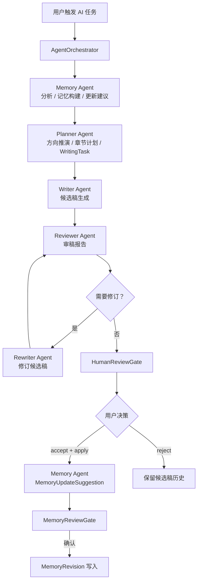
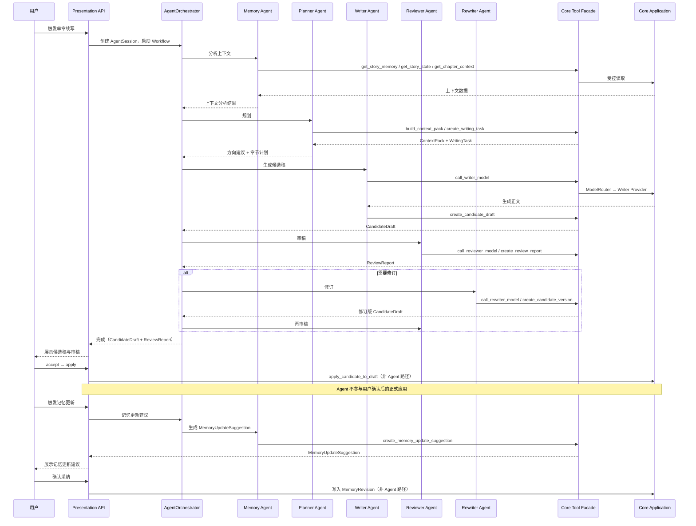
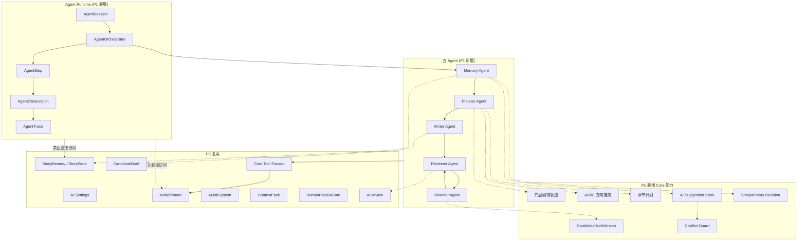
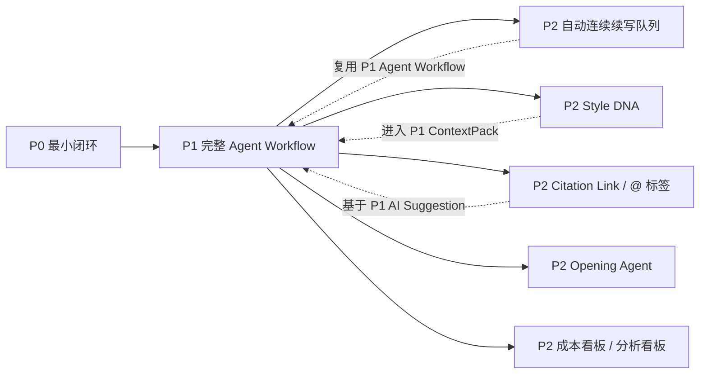
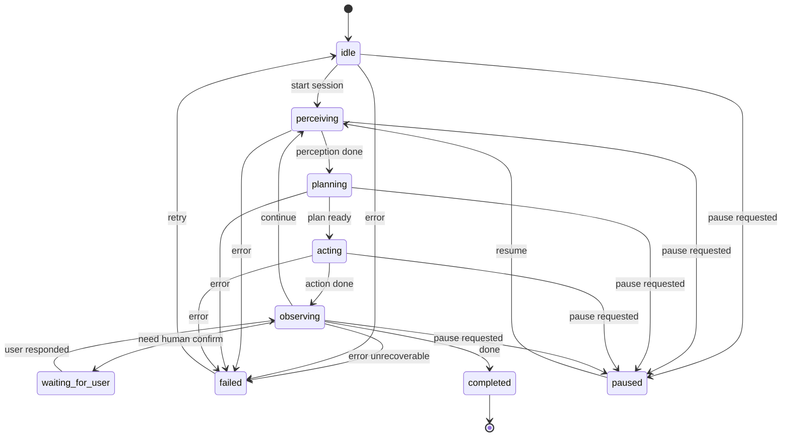
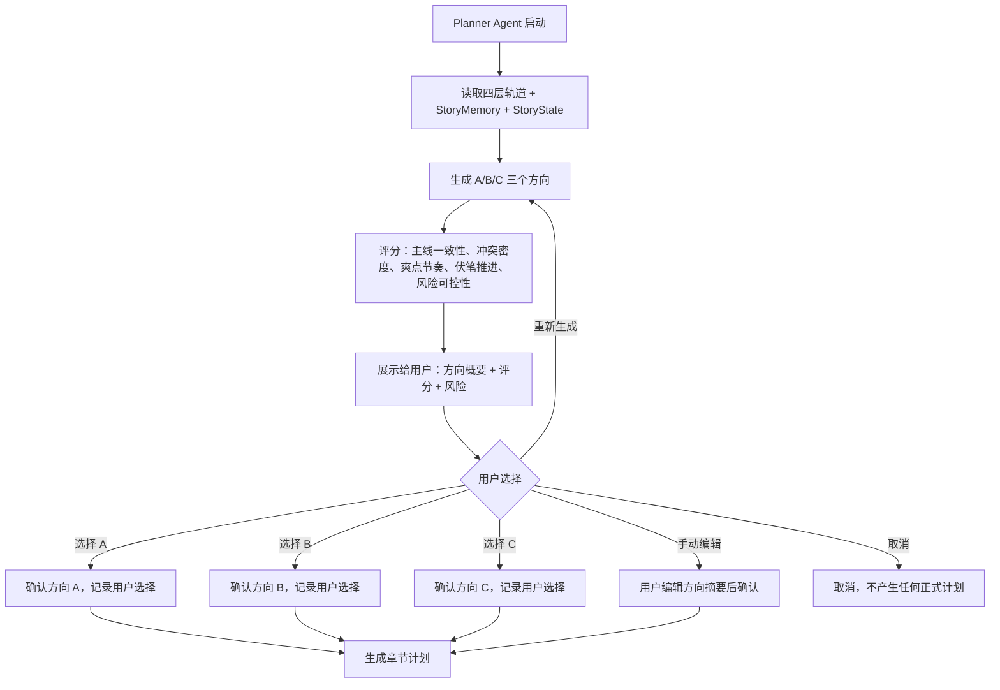
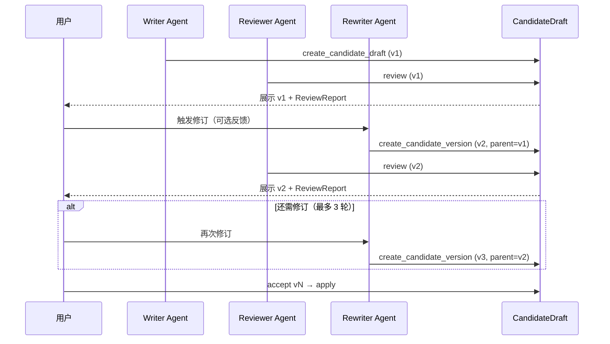
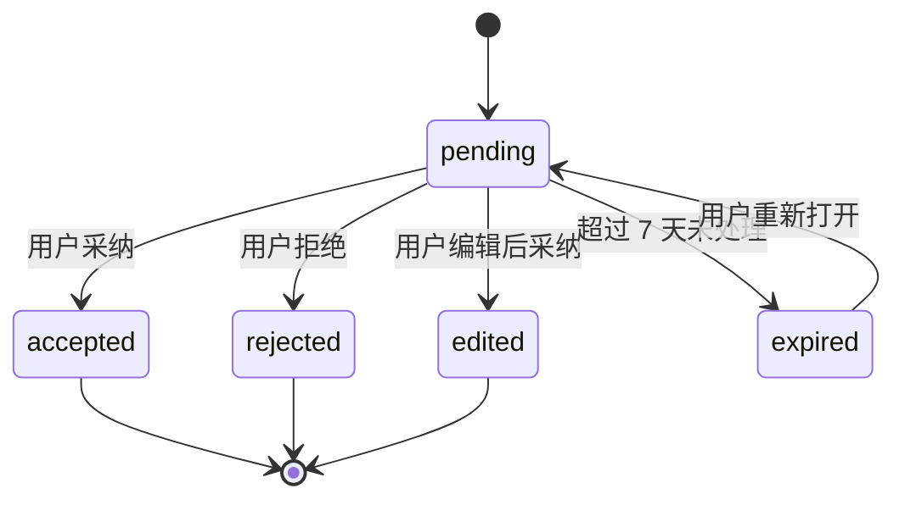
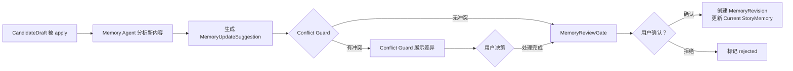

# InkTrace V2.0-P1 详细设计总纲

版本：v1.0 / P1 详细设计候选版
状态：候选
所属阶段：InkTrace V2.0 P1
设计范围：智能体工作流与剧情轨道系统

依据文档：

- `docs/01_requirements/InkTrace-V2.0-需求规格说明书.md`
- `docs/07_overview/InkTrace-V2.0-概要设计说明书.md`
- `docs/02_architecture/InkTrace-V2.0-架构设计说明书.md`
- `docs/03_design/V2/InkTrace-V2.0-P0-详细设计总纲.md`
- `docs/03_design/V2/InkTrace-V2.0-P0-01-AI基础设施详细设计.md`
- `docs/03_design/V2/InkTrace-V2.0-P0-02-AIJobSystem详细设计.md`
- `docs/03_design/V2/InkTrace-V2.0-P0-03-初始化流程详细设计.md`
- `docs/03_design/V2/InkTrace-V2.0-P0-04-StoryMemory与StoryState详细设计.md`
- `docs/03_design/V2/InkTrace-V2.0-P0-05-VectorRecall详细设计.md`
- `docs/03_design/V2/InkTrace-V2.0-P0-06-ContextPack详细设计.md`
- `docs/03_design/V2/InkTrace-V2.0-P0-07-ToolFacade与权限详细设计.md`
- `docs/03_design/V2/InkTrace-V2.0-P0-08-MinimalContinuationWorkflow详细设计.md`
- `docs/03_design/V2/InkTrace-V2.0-P0-09-CandidateDraft与HumanReviewGate详细设计.md`
- `docs/03_design/V2/InkTrace-V2.0-P0-10-AIReview详细设计.md`
- `docs/03_design/V2/InkTrace-V2.0-P0-11-API与集成边界详细设计.md`

说明：本文档忽略所有 `_001.md` 文件。本文档不推翻 P0 已冻结设计，不修改 P0 已实现边界。

---

## 一、P1 详细设计目标与范围

### 1.1 文档定位

本文档是 InkTrace V2.0-P1 的详细设计总纲。

本文档用于指导后续 P1 各模块详细设计文档，不替代模块级详细设计，不进入开发计划，不拆 Task，不写代码，不生成数据库迁移脚本。

本文档为 P1 总体设计总纲。模块内部状态机、字段、错误码、API DTO、权限矩阵等最终口径，以后续 P1-01 ~ P1-11 各模块级详细设计为准；该说明不弱化总纲对 P1 范围和边界的约束。

### 1.2 P1 目标

P1 是 InkTrace V2.0 的核心完整版本，在 P0 最小闭环基础上扩展为完整智能体工作流与剧情轨道系统。

P1 的核心交付：

- 将 P0 MinimalContinuationWorkflow 演进为完整 Agent Runtime，支持 Perception → Planning → Action → Observation 循环。
- 引入五类 Agent（Memory Agent、Planner Agent、Writer Agent、Reviewer Agent、Rewriter Agent），每类 Agent 有明确职责、输入、输出、权限和 Trace。
- 建立四层剧情轨道（Master Arc、Volume/Act Arc、Sequence Arc、Immediate Window），全面约束 AI 生成。
- 建立 A/B/C 剧情方向推演与章节计划能力，让用户在沙盒中预览和选择叙事分支。
- 建立多轮 CandidateDraft 迭代，支持审稿→修订→再审稿的版本树。
- 建立 AI Suggestion Store 与 Conflict Guard，所有 AI 资产建议进入安全隔离区。
- 建立 StoryMemory Revision，记忆正式更新版本化、可回滚。
- 建立 Agent Trace 全链路执行轨迹，可审计、可调试、可安全展示。
- 提供 P1 API 与前端集成边界的方向设计。

### 1.3 P1 与 P0 的关系

P1 继承 P0 的完整成果，不推翻 P0 任何设计或实现：

| P0 成果 | P1 继承方式 |
|---|---|
| AI Settings / Provider / ModelRouter | 直接复用，不修改 |
| AIJobSystem | 复用，P1 Agent Workflow 创建 AgentJob（job_type = agent_session） |
| Initialization | 复用，P1 Memory Agent 增强分析深度，替代 P0 的 writer-like / reviewer-like step |
| StoryMemory / StoryState | 复用基础数据结构，P1 扩展为完整 StoryMemory + StoryMemoryRevision |
| VectorRecall | 复用，P1 接入 Attention Filter 与审稿 |
| ContextPack | 复用，P1 升级为完整四层轨道 ContextPack |
| ToolFacade | 复用 CoreToolFacade，P1 扩展完整 Agent 权限矩阵 |
| MinimalContinuationWorkflow | P1 由 Agent Workflow 替代，WorkflowRunContext 演进为 AgentSession |
| CandidateDraft / HumanReviewGate | 复用，P1 扩展多轮版本树 |
| AIReview | 复用，P1 Reviewer / Rewriter Agent 完整化 |
| Quick Trial | 复用，P1 增强为可选的 Agent 模式试写 |

P1 只扩展，不推翻。

### 1.4 P1 与 P2 的边界

P1 与 P2 的边界以需求规格说明书第 4 节、第 11 节和概要设计说明书第 13.3 节为准。

P1 不进入 P2 的核心领域：

- 多章自动连续续写队列完整实现仍属于 P2。
- Style DNA 完整系统仍属于 P2。
- Citation Link 完整实现仍属于 P2。
- @ 标签引用系统完整实现仍属于 P2。
- Opening Agent 仍属于 P2。
- 成本看板 / 分析看板仍属于 P2。
- 大纲辅助完整产品化、选区改写 / 润色完整产品化仍属于 P2。

P1 可以预留引用建议占位（R-AI-ASSET-02），但不实现正文内 @ 联想、高亮、悬停和 `chapter_mentions` 持久化交互。P1 可以设计章节计划数据结构，但不实现多章无人化生成队列。

### 1.5 P1 必须实现范围

- Agent Runtime（AgentSession、AgentStep、AgentObservation、AgentTrace）。
- Agent 状态机与 PPAO 循环。
- 五类 Agent 完整职责与编排（Memory Agent、Planner Agent、Writer Agent、Reviewer Agent、Rewriter Agent）。
- AgentPermissionPolicy（每个 Agent 的可调用 Tool 白名单与禁止行为）。
- 完整 Tool 权限矩阵（扩展 P0 ToolFacade 权限模型）。
- 四层剧情轨道（Master Arc、Volume/Act Arc、Sequence Arc、Immediate Window）。
- A/B/C 剧情方向推演。
- 章节计划。
- 多轮 CandidateDraft 迭代（CandidateDraftVersion、parent_draft_id、版本树）。
- AI Suggestion Store（建议类型、状态机、过期策略、采纳/拒绝/编辑后采纳）。
- Conflict Guard（冲突触发条件、冲突类型、冲突级别、差异展示、用户处理）。
- StoryMemory Revision（MemoryUpdateSuggestion、MemoryRevision、MemoryDiff、MemoryReviewGate、版本、回滚）。
- Agent Trace（AgentStepTrace、ToolCallTrace、ObservationTrace、安全引用、审计日志）。
- P1 API 方向设计（Agent Session API、Agent Trace API、Plot Arc API、Direction Proposal API、Chapter Plan API、AI Suggestion API、Conflict Guard API、Memory Revision API、Multi-round CandidateDraft API）。
- P1 前端集成边界方向设计（最小前端入口、轮询/SSE 边界）。

### 1.6 P1 明确不包含

以下能力不进入 P1 详细设计，也不进入 P1 开发：

- 多章自动连续续写队列完整实现。
- 多章无人化生成。
- Style DNA 完整系统。
- Citation Link 完整系统（正文内联引用溯源）。
- @ 标签引用系统完整实现（正文内 @ 联想、高亮、悬停摘要、`chapter_mentions` 持久化交互）。
- Opening Agent / 签约向开篇助手。
- 成本看板（token 成本聚合、预算告警、Provider 成本分析）。
- 分析看板（写作质量分析、风格统计、剧情分析看板）。
- 大纲辅助完整产品化（AI 辅助大纲润色、扩写、章节细纲交互产品化）。
- 选区改写 / 润色完整产品化（选区改写结果的完整 UX 流程）。
- 无人化自动写书。
- AI 自动合并正式正文。
- AI 自动覆盖正式资产。
- AI 自动更新正式 StoryMemory。
- AI 自动创建正式章节。
- 完整模型治理（A/B 测试模型版本、自动模型切换、模型性能对比）。

### 1.7 P1 核心安全边界

必须继承并加固以下 P0 安全边界：

1. AI 不能自动写入正式正文。P1 Agent 调用 Writer Agent / Rewriter Agent 产生的正文只能进入 CandidateDraft。
2. 正式正文仍走 V1.1 Local-First 保存链路。P1 Agent 不直接接触 Local-First 接口。
3. CandidateDraft 仍是 AI 正文输出与正式正文之间的隔离层。P1 多轮迭代的每个版本都是 CandidateDraftVersion，都不是正式正文。
4. HumanReviewGate 仍是用户确认门。P1 可以增强门控展示（多版本对比、审稿摘要聚合），但不能让 Agent 绕过它。
5. AIReview 仍是辅助审阅，不是自动裁决。Reviewer Agent 的输出是审稿报告，不是正式资产修改指令。
6. ToolFacade 仍是 Agent / Workflow 调用 Core 的唯一受控入口。P1 Agent 不得绕过 ToolFacade 调用任何 Core 能力。
7. Agent 不得直接访问数据库、Repository、Domain、Provider SDK、ModelRouter、VectorStore、EmbeddingProvider。
8. ModelRouter 只能由 Core Application Service 调用。Agent 通过 Tool（如 `call_writer_model`）间接触发，不持有 ModelRouter 引用。
9. Agent / Workflow 不得伪造 user_action。accept/apply/reject CandidateDraft、采纳 AI Suggestion、确认 Memory Revision 等用户确认操作必须由 Presentation → Core Application 路径完成。
10. StoryMemory / StoryState 的正式更新必须经过 MemoryUpdateSuggestion → MemoryReviewGate → 用户确认 → MemoryRevision 完整链路。
11. P1 可以增强 P0 能力，但不得推翻 P0 安全边界。P0 中所有"禁止"规则在 P1 中继续有效。
12. P1 新增的引用建议占位（R-AI-ASSET-02）只产生 AI Suggestion，不写入正式正文或正式资产，不改变正文内联显示。

---

## 二、P1 总体详细设计视图

### 2.1 P1 模块清单

| 模块 | P1 职责 | 与 P0 的关系 | 与 P2 的边界 |
|---|---|---|---|
| Agent Runtime | AgentSession、AgentStep、AgentObservation、AgentTrace、PPAO 循环、Agent 状态机 | P0 WorkflowRunContext 演进为 AgentSession | P2 不新增 Agent 类型 |
| Agent Workflow | 五 Agent 编排、AgentOrchestrator | 替代 P0 MinimalContinuationWorkflow | P2 自动队列复用同一编排 |
| Memory Agent | 大纲分析、正文分析、StoryMemory/StoryState 构建、MemoryUpdateSuggestion | 替代 P0 的 writer-like / reviewer-like analysis step | P2 Style DNA 提取、@ 引用来源 |
| Planner Agent | A/B/C 方向推演、章节计划、Writing Task | P0 WritingTask 由 Planner Agent 生成 | P2 多章计划、自动队列规划 |
| Writer Agent | 候选稿生成 | P0 writer-like step 升级为完整 Agent | P2 自动连续生成 |
| Reviewer Agent | 完整审稿报告 | P0 reviewer-like step 升级为完整 Agent | P2 签约向审稿 |
| Rewriter Agent | 候选稿修订 | P0 无，P1 新增 | P2 自动修订 |
| 四层剧情轨道 | Master Arc、Volume/Act Arc、Sequence Arc、Immediate Window | P0 只有最小占位 | P2 完整轨道面板 |
| 方向推演 | A/B/C 剧情方向 | P0 无，P1 新增 | P2 自动方向推荐 |
| 章节计划 | 后续 3-5 章章节计划 | P0 WritingTask 单章约束 | P2 多章队列章节计划 |
| 多轮 CandidateDraft | CandidateDraftVersion、版本树 | P0 单版本 CandidateDraft | P2 多章队列候选稿 |
| AI Suggestion | AI 建议区、建议状态机 | P0 无，P1 新增 | P2 @ 引用、Citation Link |
| Conflict Guard | 正式资产冲突检测与保护 | P0 无，P1 新增 | P2 自动冲突建议 |
| StoryMemory Revision | MemoryUpdateSuggestion、MemoryRevision、MemoryDiff | P0 只有 StoryMemorySnapshot | P2 自动记忆维护 |
| Agent Trace | AgentStepTrace、ToolCallTrace、ObservationTrace | P0 只有 LLMCallLog | P2 成本关联 |
| Token Budget Policy 增强 | 四层轨道保底裁剪 | P0 只有基础优先级 | P2 Style DNA 层 |
| P1 API | Agent Session / Trace / Plot Arc / Direction / Chapter Plan / AI Suggestion / Conflict Guard / Memory Revision / Multi-round CandidateDraft | P0 V2 API 基础 | P2 @ 引用 / Opening Agent API |

### 2.2 P1 主链路

P1 标准主线工作流（需求规格 R-AI-WF-01）：

```text
作品初始化（复用 P0）
  → Memory Agent：大纲分析 + 正文分析 + 完整 StoryMemory/StoryState
  → 四层剧情轨道构建
  → Planner Agent：A/B/C 方向推演
  → 用户选择方向
  → Planner Agent：章节计划 + WritingTask
  → Writer Agent：生成 CandidateDraft
  → Reviewer Agent：审稿
  → [可选] Rewriter Agent：修订 → Reviewer Agent：再审稿
  → HumanReviewGate：用户确认
  → [accept → apply → V1.1 Local-First]
  → Memory Agent：MemoryUpdateSuggestion
  → MemoryReviewGate：用户确认
  → MemoryRevision 写入
```

### 2.3 P1 Agent Workflow 主链路



### 2.4 P1 规划/写作/审稿/修订/记忆建议链路



### 2.5 P1 模块关系图



### 2.6 P1 与 P0 已有模块的复用关系

| P0 模块 | P1 复用方式 | 增强内容 |
|---|---|---|
| AI Settings | 直接复用，不修改 | 无 |
| Provider Port / Adapter | 直接复用，不修改 | 无 |
| ModelRouter | 直接复用，不修改 | 无 |
| Prompt Registry | 直接复用，不修改 | P1 新增 Agent 类 prompt key |
| Output Validator | 直接复用，不修改 | 无 |
| LLMCallLog | 直接复用 | P1 增加 Agent Trace 关联 |
| AIJobSystem | 复用，job_type = agent_session | P1 Agent 长流程通过 AIJob 跟踪 |
| Initialization | Memory Agent 增强分析 | 分析深度提升（完整角色卡、完整事件、完整地点、风格画像） |
| StoryMemory / StoryState | 复用基础结构 | P1 增加完整记忆域 + MemoryRevision |
| VectorRecall | 复用 | P1 接入 Attention Filter 与审稿 |
| ContextPack | 复用 ContextPackService | P1 升级为完整四层轨道 ContextPack |
| Core Tool Facade | 复用 CoreToolFacade | P1 扩展完整 Agent 权限矩阵 |
| CandidateDraft | 复用基础状态机 | P1 增加 CandidateDraftVersion、版本树 |
| HumanReviewGate | 复用 accept/reject/apply 规则 | P1 增强门控展示 |
| AIReview | 复用基础审稿 | P1 Reviewer Agent 完整化 |
| Quick Trial | 复用 | P1 可增强为 Agent 模式试写 |
| V1.1 Local-First | 不变 | 不变 |

### 2.7 P1 与 P2 的演进关系



---

## 三、P1 模块拆分建议

建议 P1 至少拆分为以下 11 个模块级详细设计文档：

### 3.1 Agent Runtime

- **职责**：定义 AgentSession、AgentStep、AgentObservation、AgentTrace、AgentRunContext、Agent 状态机、PPAO 循环、Agent 调用 ToolFacade 的方式、Agent 失败/暂停/恢复/取消/重试规则。
- **输入**：用户 AI 任务、作品上下文。
- **输出**：AgentSession 完整生命周期记录、AgentTrace。
- **依赖**：Core Tool Facade、AIJobSystem、P0 ModelRouter（间接）。
- **不做事项**：不直接访问 Infrastructure、不直接调用 ModelRouter、不直接写正式正文、不绕过 HumanReviewGate。
- **与 P0 的关系**：P0 WorkflowRunContext 演进为 AgentSession；P0 MinimalContinuationWorkflow 被 AgentOrchestrator 替代；P0 AIJob 作为 Agent 长流程跟踪容器。
- **与 P2 的边界**：P2 自动续写队列复用同一 Agent Runtime，但队列编排逻辑属于 P2。

### 3.2 Agent Workflow（五 Agent 编排）

- **职责**：AgentOrchestrator 编排五 Agent 执行顺序和条件分支、Agent 间数据传递、流程暂停/恢复/取消控制。
- **输入**：AgentSession、用户任务指令。
- **输出**：编排完成的 AgentResult（含 CandidateDraft、ReviewReport、MemoryUpdateSuggestion 等）。
- **依赖**：Agent Runtime、Core Tool Facade、所有五 Agent。
- **不做事项**：不直接执行任何 Agent 的具体业务逻辑、不直接写正式数据。
- **与 P0 的关系**：替代 P0 MinimalContinuationWorkflow 的编排逻辑。
- **与 P2 的边界**：P2 自动续写编排复用 P1 Agent Workflow，但增加多章循环编排。

### 3.3 五 Agent 职责与编排

覆盖 Memory Agent、Planner Agent、Writer Agent、Reviewer Agent、Rewriter Agent。

每个 Agent 单独说明：

#### 3.3.1 Memory Agent

- **职责**：大纲分析、正文分析、章节摘要、人物状态、剧情事件、伏笔、设定、时间线、风格特征提取、MemoryUpdateSuggestion 生成。
- **输入**：作品大纲、已确认章节正文、P0 StoryMemorySnapshot、P0 StoryState baseline。
- **输出**：完整分析结果、StoryMemory 增量更新、MemoryUpdateSuggestion。
- **可调用 Tool**：`get_work_outline`、`get_chapter_context`、`get_story_memory`、`get_story_state`、`search_related_memories`、`call_memory_extractor_model`、`create_memory_update_suggestion`、`write_agent_trace`。
- **禁止调用 Tool**：`update_official_chapter_content`、`overwrite_character_asset`、`create_official_chapter_directly`、`update_story_memory_directly`、`accept_suggestion_as_user`、`bypass_human_review_gate`、`call_llm_provider_directly`。
- **side_effect_level**：read + suggestion_write（只读正文/资产 + 写建议）。
- **是否可产生 CandidateDraft**：否。
- **是否可产生 AI Suggestion**：是（MemoryUpdateSuggestion、角色建议、伏笔建议、设定建议）。
- **是否可产生 StoryMemoryUpdateSuggestion**：是。
- **是否可触发 HumanReviewGate**：否（MemoryReviewGate 独立于 HumanReviewGate）。
- **是否可触发 ConflictGuard**：可被 Conflict Guard 拦截（当建议涉及正式资产时）。
- **绝对禁止**：直接写入正式 StoryMemory、直接覆盖正式资产、直接创建正式章节。
- **与 P0 的关系**：替代 P0 InitializationApplicationService 中的 writer-like / reviewer-like 分析步骤。
- **与 P2 的边界**：P2 Style DNA 提取由 Memory Agent 执行 StyleDNAExtraction，但 Style DNA 的完整存储和使用策略属于 P2。

#### 3.3.2 Planner Agent

- **职责**：当前进度分析、A/B/C 方向推演、方向评分与风险评估、方向选择支持、章节计划生成、WritingTask 生成。
- **输入**：StoryMemory、StoryState、四层剧情轨道、用户大纲。
- **输出**：DirectionProposal（A/B/C）、DirectionScore、ChapterPlan、WritingTask。
- **可调用 Tool**：`get_story_memory`、`get_story_state`、`get_story_arcs`、`build_context_pack`、`create_writing_task`、`create_direction_proposal`、`create_chapter_plan`、`call_planner_model`、`write_agent_trace`。
- **禁止调用 Tool**：`create_candidate_draft`、`update_official_chapter_content`、`overwrite_character_asset`、`accept_suggestion_as_user`、`bypass_human_review_gate`。
- **side_effect_level**：read + plan_write（只读 + 写规划类结果）。
- **是否可产生 CandidateDraft**：否。
- **是否可产生 AI Suggestion**：是（方向建议、章节计划建议、WritingTask 建议）。
- **是否可产生 StoryMemoryUpdateSuggestion**：否。
- **是否可触发 HumanReviewGate**：否（用户确认方向/计划走 Planner 的用户确认流程，不走 HumanReviewGate）。
- **是否可触发 ConflictGuard**：否。
- **绝对禁止**：直接创建正式章节、直接修改作品大纲、不经过用户确认就执行计划。
- **与 P0 的关系**：P0 WritingTask 由 Planner Agent 生成，不再由 MinimalContinuationWorkflow 直接构建。
- **与 P2 的边界**：P2 多章自动队列的章节计划使用 P1 Planner Agent，但"自动连续生成"编排属于 P2。

#### 3.3.3 Writer Agent

- **职责**：根据 ContextPack 和 WritingTask 生成候选稿正文。
- **输入**：ContextPack、WritingTask、当前章节上下文。
- **输出**：CandidateDraft。
- **可调用 Tool**：`get_chapter_context`、`build_context_pack`、`get_writing_task`、`call_writer_model`、`create_candidate_draft`、`write_agent_trace`。
- **禁止调用 Tool**：`update_official_chapter_content`、`create_review_report`、`create_ai_suggestion`、`accept_suggestion_as_user`、`bypass_human_review_gate`、`call_llm_provider_directly`。
- **side_effect_level**：candidate_write。
- **是否可产生 CandidateDraft**：是。
- **是否可产生 AI Suggestion**：否。
- **是否可产生 StoryMemoryUpdateSuggestion**：否。
- **是否可触发 HumanReviewGate**：否（CandidateDraft 进入待审区后，由用户通过 HumanReviewGate 确认）。
- **是否可触发 ConflictGuard**：否。
- **绝对禁止**：直接写正式正文、绕过 ContextPack 生成。
- **与 P0 的关系**：替代 P0 Continuation Workflow 中的 writer-like step（FakeWriter）。
- **与 P2 的边界**：P2 自动连续生成复用同一 Writer Agent，每次生成独立 CandidateDraft。

#### 3.3.4 Reviewer Agent

- **职责**：对 CandidateDraft 进行多维度审稿。
- **输入**：CandidateDraft、ContextPack、StoryMemory、StoryState、四层剧情轨道、WritingTask。
- **输出**：ReviewReport（含 ReviewIssue 列表、总体评分、风险级别）。
- **可调用 Tool**：`get_story_memory`、`get_story_state`、`get_story_arcs`、`get_writing_task`、`get_candidate_draft`、`build_review_context`、`call_reviewer_model`、`create_review_report`、`create_ai_suggestion`（如审稿过程中发现资产冲突）、`write_agent_trace`。
- **禁止调用 Tool**：`create_candidate_draft`、`update_official_chapter_content`、`accept_suggestion_as_user`、`bypass_human_review_gate`、`call_llm_provider_directly`。
- **side_effect_level**：review_write。
- **是否可产生 CandidateDraft**：否。
- **是否可产生 AI Suggestion**：是（可产生资产冲突建议）。
- **是否可产生 StoryMemoryUpdateSuggestion**：否。
- **是否可触发 HumanReviewGate**：否（审稿结果展示在 HumanReviewGate 中，但不触发门控）。
- **是否可触发 ConflictGuard**：可被 Conflict Guard 拦截（当审稿生成的资产建议涉及正式资产时）。
- **绝对禁止**：直接修改 CandidateDraft 内容、直接触发 apply。
- **与 P0 的关系**：替代 P0 Continuation Workflow 中的 reviewer-like step（FakeReviewer）。
- **与 P2 的边界**：P2 签约向审稿使用同一 Reviewer Agent，增加签约向特定维度。

#### 3.3.5 Rewriter Agent

- **职责**：根据 Reviewer Agent 的审稿问题修订候选稿。
- **输入**：CandidateDraft、ReviewReport、修订指令（用户反馈或自动触发）。
- **输出**：CandidateDraftVersion（新版本，含 parent_draft_id）。
- **可调用 Tool**：`get_candidate_draft`、`get_review_report`、`call_rewriter_model`、`create_candidate_version`、`write_agent_trace`。
- **禁止调用 Tool**：`create_candidate_draft`（只创版本，不创全新）、`update_official_chapter_content`、`accept_suggestion_as_user`、`bypass_human_review_gate`、`call_llm_provider_directly`。
- **side_effect_level**：candidate_write。
- **是否可产生 CandidateDraft**：是（作为 CandidateDraftVersion）。
- **是否可产生 AI Suggestion**：否。
- **是否可产生 StoryMemoryUpdateSuggestion**：否。
- **是否可触发 HumanReviewGate**：否。
- **是否可触发 ConflictGuard**：否。
- **绝对禁止**：超过最大修订轮次后继续修订、直接修改原 CandidateDraft（只新增版本）。
- **与 P0 的关系**：P0 无此能力，P1 新增。
- **与 P2 的边界**：P2 自动修订使用同一 Rewriter Agent，自动触发条件属于 P2。

### 3.4 四层剧情轨道

- **职责**：构建和维护 Master Arc、Volume/Act Arc、Sequence Arc、Immediate Window 四层轨道。进入 ContextPack 作为最高优先级约束层。支撑方向推演、章节计划、Writer 约束、Reviewer 检查、Rewriter 修订。
- **输入**：StoryMemory、StoryState、用户大纲、Planner Agent 分析结果。
- **输出**：StoryArc 四层结构化数据、ArcStatus、ArcProgress。
- **依赖**：StoryMemory、StoryState、Planner Agent、ContextPack。
- **不做事项**：不自动修改用户大纲、不自动决定作品主线走向、不替代 Planner Agent 的方向推演。
- **与 P0 的关系**：P0 ContextPack 只有最小占位（全书当前进度摘要、当前 StoryState、最近章节摘要）。P1 升级为完整四层轨道。
- **与 P2 的边界**：P2 完整剧情轨道面板 UX 属于 P2，但轨道数据结构在 P1 完成。

### 3.5 A/B/C 方向推演与章节计划

- **职责**：方向候选生成（A/B/C）、方向评分（一致性、冲突风险、爽点密度、伏笔推进）、方向选择、章节计划生成（后续 3-5 章）、章节计划与 WritingTask 的映射。
- **输入**：四层剧情轨道、StoryMemory、StoryState、用户大纲、StoryArc 当前位置。
- **输出**：DirectionProposal（A/B/C 各含剧情概要、主要冲突、伏笔使用、风险点、未来 3-5 章预估）、DirectionScore、ChapterPlan（每章含目标、关键事件、冲突推进、伏笔安排、禁止事项）。
- **依赖**：四层剧情轨道、Planner Agent、ContextPack、WritingTask。
- **不做事项**：不自动改变作品主线、不自动创建正式章节、用户确认前不产生 CandidateDraft。
- **与 P0 的关系**：P0 无此能力，P1 新增。
- **与 P2 的边界**：P2 自动方向推荐和自动队列的章节计划编排属于 P2。

### 3.6 多轮 CandidateDraft 迭代

- **职责**：CandidateDraftVersion 数据结构、版本树（parent_draft_id）、版本间 diff、用户反馈标记、修订轮次上限控制、版本兼容 P0 CandidateDraft 状态机。
- **输入**：Writer Agent 输出、Rewriter Agent 输出、用户反馈、ReviewReport。
- **输出**：CandidateDraftVersion、版本树、diff 摘要。
- **依赖**：P0 CandidateDraft、Writer Agent、Rewriter Agent、Reviewer Agent。
- **不做事项**：不创建独立于 P0 CandidateDraft 的新实体。版本树最多 3 轮修订。不自动选择版本。accepted != applied 继续成立。apply 仍走 V1.1 Local-First。
- **与 P0 的关系**：P0 CandidateDraft 是 v1，P1 CandidateDraftVersion 是 v2...vN。P0 状态机不修改，扩展版本层。
- **与 P2 的边界**：P2 多章队列的版本管理复用 P1 版本树，多章编排属于 P2。

### 3.7 AI Suggestion

- **职责**：AI Suggestion Store、建议类型（character_update、foreshadow_add、setting_update、timeline_event、plot_thread、citation_placeholder）、建议状态机（pending → accepted / rejected / edited / expired）、过期策略（默认 7 天）、建议与正式资产的差异记录、采纳/拒绝/编辑后采纳流程。
- **输入**：Memory Agent 提取结果、Reviewer Agent 审稿建议、Planner Agent 计划建议、Rewriter Agent 修订中发现的资产问题。
- **输出**：AISuggestion、SuggestionDiff、采纳/拒绝记录。
- **依赖**：正式资产（人物、伏笔、设定、时间线、大纲）、Conflict Guard。
- **不做事项**：不自动覆盖正式资产、不自动创建正式资产记录、不下发 `accept_suggestion_as_user` Tool。
- **与 P0 的关系**：P0 无此能力，P1 新增。
- **与 P2 的边界**：P2 @ 引用建议使用 AI Suggestion 存储引用建议占位，但不实现正文内联交互；P2 Citation Link 使用 AI Suggestion 存储引用建议。

### 3.8 Conflict Guard

- **职责**：冲突触发条件（AI 建议修改用户手动维护的正式资产）、冲突类型（character_conflict、foreshadow_conflict、setting_conflict、timeline_conflict、outline_conflict）、冲突级别（info、warning、blocking）、差异展示界面（正式资产 vs AI 建议 diff）、用户处理（采纳、拒绝、编辑后采纳）、决策前不得覆盖正式资产。
- **输入**：AI Suggestion、正式资产、用户资产维护记录。
- **输出**：ConflictGuardRecord、ConflictResolution。
- **依赖**：AI Suggestion Store、正式资产（人物、伏笔、设定、时间线、大纲）、Domain Policies。
- **不做事项**：不自动修复冲突、不自动选择版本、不自动覆盖正式资产、不阻断不相关的 AI 操作。
- **与 P0 的关系**：P0 无此能力，P1 新增。P0 HumanReviewGate 仅管控 CandidateDraft 的 accept/apply，Conflict Guard 扩展为管控正式资产变更。
- **与 P2 的边界**：P2 不新增冲突类型，但可扩展冲突处理的 UX 交互。

### 3.9 StoryMemory Revision

- **职责**：MemoryUpdateSuggestion（AI 提出的记忆更新建议）、MemoryRevision（用户确认后的正式记忆版本）、MemoryDiff（前后差异）、MemoryReviewGate（用户确认门控）、记忆版本号、记忆回滚。
- **输入**：Memory Agent 的 MemoryUpdateSuggestion、StoryMemory 当前版本。
- **输出**：MemoryRevision（含 revision_no、source_trace_id、diff、user_decision）。
- **依赖**：P0 StoryMemory / StoryState、Memory Agent、Agent Trace。
- **不做事项**：AI 不自动更新正式 StoryMemory。候选稿未 apply 前不得进入正式记忆。回滚后依赖该版本的未执行任务标记为需要重新确认。
- **与 P0 的关系**：P0 StoryMemorySnapshot 是初始化分析的初始版本。P1 StoryMemoryRevision 是后续增量更新的正式版本。
- **与 P2 的边界**：P2 多章自动队列的记忆更新仍走 MemoryReviewGate，不自动更新。

### 3.10 Agent Trace

- **职责**：AgentStepTrace（每个 Agent 步骤的执行记录）、ToolCallTrace（每次 Tool Facade 调用的记录）、ObservationTrace（每次观察的记录）、Prompt/Context 安全引用（不记录完整正文，使用 safe_ref / content_ref / hash / excerpt）、request_id / trace_id、审计日志、用户可见 trace、开发调试 trace、日志脱敏。
- **输入**：Agent 执行的所有步骤、Tool 调用、Observation。
- **输出**：AgentTrace（含 trace_id、agent_type、steps、tool_calls、observations、user_decisions、timing）。
- **依赖**：Agent Runtime、Core Tool Facade、LLMCallLog。
- **不做事项**：不记录完整正文、不记录完整 Prompt、不记录完整 CandidateDraft、不记录 API Key。
- **与 P0 的关系**：P0 LLMCallLog 记录单次 LLM 调用。P1 AgentTrace 记录完整 Agent 会话的执行轨迹，LLMCallLog 作为其子项。
- **与 P2 的边界**：P2 成本看板将 AgentTrace 中的 token 数据关联成本计算。

### 3.11 Tool 权限矩阵（扩展 P0-07）

- **职责**：扩展 P0 ToolFacade 权限矩阵，覆盖五 Agent 的完整权限。定义每个 Agent 的可调用 Tool 白名单、禁止 Tool 清单、side_effect_level 规则、caller_type 约束。
- **输入**：P0 Tool Registry、AgentPermissionPolicy。
- **输出**：完整的 P1 Tool 权限矩阵（每个 Tool × 每个 Agent 类型 × caller_type 的权限表）。
- **依赖**：P0 Core Tool Facade、P0 Tool Registry、AgentPermissionPolicy。
- **不做事项**：不推翻 P0 权限规则、不为 Agent 开放 forbidden tools、不绕过 HumanReviewGate / ConflictGuard / MemoryReviewGate。
- **与 P0 的关系**：P0 权限矩阵定义 MinimalContinuationWorkflow 的 Tool 权限。P1 扩展为五 Agent 的完整权限矩阵。
- **与 P2 的边界**：P2 Opening Agent 使用同一权限矩阵模板，新增 Agent 类型后在矩阵中追加行。

### 3.12 P1 API 与前端集成边界

- **职责**：方向定义 P1 新增 API 分组和路由前缀方向（Agent Session API、Agent Trace API、Plot Arc API、Direction Proposal API、Chapter Plan API、AI Suggestion API、Conflict Guard API、Memory Revision API、Multi-round CandidateDraft API）。方向定义 P1 前端最小集成边界、轮询/SSE 边界。
- **输入**：以上所有 P1 模块的输出。
- **输出**：API 路由分组方向、通用 Request/Response 方向、SSE 事件白名单方向、前端最小入口定义。
- **依赖**：全部 P1 模块。
- **不做事项**：API 层不承载业务逻辑、API 层不得伪造 user_action、API 层不直接访问 Provider / Repository / ModelRouter。
- **与 P0 的关系**：在 P0 `/api/v2/ai/` 路由体系上扩展 P1 路由分组。复用 P0 统一错误格式和 request_id/trace_id 贯穿机制。
- **与 P2 的边界**：P2 的自动续写队列 API、@ 引用 API、Opening Agent API、成本看板 API 不在 P1 范围内。

---

## 四、P1 Agent Runtime 总体设计

### 4.1 AgentSession

AgentSession 是一个完整 Agent 任务的会话容器。

| 字段方向 | 类型 | 说明 |
|---|---|---|
| session_id | string | Agent 会话唯一 ID |
| work_id | string | 关联作品 |
| chapter_id | string | 目标章节 |
| agent_workflow_type | enum | 任务类型：continuation / revision / planning / memory_update 等 |
| status | enum | Agent 会话状态 |
| current_agent | string | 当前执行的 Agent 类型 |
| current_step_id | string | 当前 Step ID |
| steps | AgentStep[] | 已执行步骤列表 |
| observations | AgentObservation[] | 观察记录列表 |
| result | AgentResult | 最终输出 |
| trace_id | string | 关联 AgentTrace |
| job_id | string | 关联 AIJob |
| request_id | string | 请求 ID |
| trace_id_header | string | 追踪 ID |
| created_at | string | 创建时间 |
| updated_at | string | 更新时间 |
| finished_at | string | 完成时间 |

### 4.2 AgentStep

| 字段方向 | 类型 | 说明 |
|---|---|---|
| step_id | string | 步骤 ID |
| agent_type | enum | 执行的 Agent 类型 |
| step_order | integer | 步骤序号 |
| action | string | 执行的动作 |
| tool_calls | ToolCallTrace[] | 该步骤中的 Tool 调用 |
| model_call | LLMCallRef | 模型调用引用 |
| status | enum | 步骤状态 |
| output_ref | string | 输出引用 |
| error_code | string | 错误码 |
| error_message | string | 错误信息 |
| started_at | string | 开始时间 |
| finished_at | string | 完成时间 |

### 4.3 AgentObservation

| 字段方向 | 类型 | 说明 |
|---|---|---|
| observation_id | string | 观察 ID |
| step_id | string | 关联 Step |
| observation_type | enum | tool_result / model_output / user_feedback / error / warning / validation_result |
| data_ref | string | 观察数据引用 |
| safe_message | string | 安全消息 |
| decision | enum | 后续动作：continue / revise / pause / fail / wait_for_user |
| created_at | string | 创建时间 |

### 4.4 AgentTrace

| 字段方向 | 类型 | 说明 |
|---|---|---|
| trace_id | string | Trace ID |
| session_id | string | 关联 Session |
| work_id | string | 关联作品 |
| agent_type | string | Agent 类型 |
| steps | AgentStepTrace[] | 步骤轨迹 |
| tool_calls | ToolCallTrace[] | Tool 调用轨迹 |
| observations | ObservationTrace[] | 观察轨迹 |
| prompt_ref | string | Prompt 安全引用（prompt_key + version + hash） |
| context_pack_ref | string | ContextPack 安全引用（pack_id + hash） |
| user_decisions | UserDecisionTrace[] | 用户决策轨迹 |
| request_id | string | 请求 ID |
| trace_id_header | string | 追踪 ID |
| created_at | string | 创建时间 |

### 4.5 Agent 状态机



Agent 状态说明：

- idle：会话已创建，等待启动。
- perceiving：感知阶段，Agent 读取上下文（章节、大纲、记忆、状态、轨道）。
- planning：规划阶段，Agent 生成执行计划、WritingTask、章节计划。
- acting：执行阶段，Agent 通过 ToolFacade 调用受控能力。
- observing：观察阶段，Agent 检查 Tool Result、模型输出、校验结果。
- waiting_for_user：等待用户确认或决策。
- paused：用户主动暂停。
- failed：不可恢复错误。
- completed：成功完成。

### 4.6 Agent 调用 ToolFacade 的方式

Agent 通过 ToolFacade 的 Tool 接口调用 Core 能力，遵循以下规则：

- 每次 Tool 调用必须传入 `ToolExecutionContext`（含 session_id、step_id、agent_type、caller_type = agent）。
- Tool 调用结果封装为 ToolResult（含 status、data、warnings、error）。
- Agent 在 Observation 阶段检查 ToolResult，根据结果决定下一步。
- Tool 调用必须记录到 AgentTrace。

### 4.7 Agent 失败、暂停、恢复、取消、重试规则

- **失败**：Agent 步骤失败后，Observation 记录错误信息。可恢复错误（provider_timeout、provider_rate_limited）按 P0-01 retry 策略重试。不可恢复错误（provider_auth_failed、output_validation_failed 超过上限）→ Agent 状态 = failed。
- **暂停**：用户主动暂停 → Agent 状态 = paused。当前 Tool 调用完成后暂停，不中断进行中的 LLM 调用。暂停后迟到结果仍记录，但 Agent 不自动推进到下一步。
- **恢复**：用户恢复 → Agent 从当前 Step 继续。如果暂停前步骤未完成，重新执行该步骤。
- **取消**：用户取消 → Agent 状态 = cancelled。迟到 ToolResult ignored（继承 P0-02 cancel 规则）。已生成的 CandidateDraft / ReviewReport 保留。
- **重试**：用户重试 → 创建新 AgentSession（不修改原 session）。AgentTrace 保持 session 级别的独立追踪。

### 4.8 Agent 与 AIJobSystem 的关系

- Agent 长流程通过 AIJob（job_type = agent_session）跟踪整体进度。
- Agent Session 与 AIJob 一一对应。
- AIJob 的 job_id 作为前端轮询 Agent 进度的主键。
- Agent Step 是 Agent 级别的步骤，AIJobStep 是 Job 级别的步骤。Agent Step 完成时更新 AIJobStep 进度。
- 取消 Agent 会话时同步取消关联 AIJob。

### 4.9 Agent 与 P0 MinimalContinuationWorkflow 的关系

P0 MinimalContinuationWorkflow 在 P1 被 AgentOrchestrator 替代。

演进路径：

```text
P0: User → API → MinimalContinuationWorkflow → Core Tool Facade → Core App

P1: User → API → AgentOrchestrator → AgentSession → [Memory → Planner → Writer → Reviewer → Rewriter] → Core Tool Facade → Core App
```

P0 WorkflowRunContext 的字段（work_id、chapter_id、operation_type、continuation_mode、user_instruction、allow_degraded）作为 P1 AgentSession 的初始化参数。P0 的 writer-like step 和 reviewer-like step 不再存在，由 Writer Agent 和 Reviewer Agent 替代。

### 4.10 AgentRuntime 禁止行为

- Agent Runtime 不直接访问 Infrastructure（数据库、文件系统、向量存储）。
- Agent Runtime 不直接调用 ModelRouter。
- Agent Runtime 不直接写正式正文（不持有 V1.1 Local-First 保存链路引用）。
- Agent Runtime 不绕过 HumanReviewGate（不持有 accept/apply API 的调用权限）。
- Agent Runtime 不维护自己的业务真源（所有正式数据在 Core Domain 中）。

---

## 五、P1 五 Agent Workflow 总体设计

### 5.1 AgentWorkflow 总览

P1 Agent Workflow 是五 Agent 的标准编排流程。

标准流程：
Memory Agent → Planner Agent → Writer Agent → Reviewer Agent → [Rewriter Agent → Reviewer Agent] → HumanReviewGate → [Memory Agent update suggestion → MemoryReviewGate]

用户可在任意节点暂停、取消或请求重新执行某个 Agent。

### 5.2 Memory Agent 详细设计方向

**职责范围**：
- 大纲分析：提取主线、阶段结构、核心冲突、主要人物、势力、世界观、关键伏笔、预期结局方向。
- 正文分析：按章节生成章节摘要、人物状态、剧情事件、伏笔、设定、时间线、风格特征。
- StoryMemory 构建：基于分析结果构建完整 StoryMemory（含阶段摘要、卷摘要、完整角色卡、完整事件、完整地点、完整风格画像）。
- StoryState 维护：更新当前地点、在场角色、当前阶段、禁止事项、当前上下文约束。
- MemoryUpdateSuggestion：在 CandidateDraft 被 apply 后，基于新内容生成 MemoryUpdateSuggestion。

**P1 相对 P0 的增强**：
- P0 只产生基础摘要和 P0 最小 StoryMemory。P1 Memory Agent 产生完整域，包括：阶段摘要、卷摘要、完整角色卡（含角色弧）、完整事件（含时间线）、完整地点、完整风格画像。
- P0 初始化中 writer-like / reviewer-like step 被 Memory Agent 替代。
- Memory Agent 使用 model_role = memory_extractor（默认 Kimi，继承 P0 配置）。

**Model 调用方式**：
- Memory Agent 不直接调用 ModelRouter。Memory Agent 通过 ToolFacade 调用 `call_memory_extractor_model`，该 Tool 由 Core Application 实现，内部通过 ModelRouter 调用 Provider。

### 5.3 Planner Agent 详细设计方向

**职责范围**：
- 方向推演：基于四层剧情轨道、StoryMemory、StoryState 生成 A/B/C 三个后续剧情方向。每个方向含剧情概要、主要冲突、伏笔使用、风险点、未来 3-5 章预估。
- 方向评分：评分维度含主线一致性、冲突密度、爽点节奏、伏笔推进、风险可控性。
- 章节计划：用户选择方向后，生成后续 3-5 章章节计划。每章含章节目标、关键事件、冲突推进、伏笔安排、禁止事项。
- WritingTask：基于章节计划生成当前章节的 WritingTask。

**沙盒隔离**：
- 方向推演属于沙盒推演。用户不确认则不产生 CandidateDraft、不更新 StoryMemory、不更新 StoryState、不影响正式章节计划。
- 用户可选择 A/B/C 之一，也可要求重新生成方向，或手动编辑方向摘要后确认。

**Model 调用方式**：
- Planner Agent 使用 model_role = planner（默认 Kimi）。通过 ToolFacade 调用 `call_planner_model`。

### 5.4 Writer Agent 详细设计方向

**职责范围**：
- 候选稿生成：基于 ContextPack 和 WritingTask 生成候选稿正文。
- 候选稿保存：通过 ToolFacade 的 `create_candidate_draft` 写入 CandidateDraft。
- 不执行审稿、不执行修订、不执行记忆更新。

**与 P0 Writer 的区别**：
- P0 的 writing generation 是 static 方法调用（FakeWriter.generate_candidate_text）。P1 Writer Agent 是完整 Agent 步骤，含 Tool 调用、Observation、AgentTrace。
- P0 使用 writer-like step 直接调用 Core。P1 Writer Agent 通过 ToolFacade 调用 `call_writer_model` Tool。

**Model 调用方式**：
- Writer Agent 使用 model_role = writer（默认 DeepSeek）。通过 ToolFacade 调用 `call_writer_model`。

### 5.5 Reviewer Agent 详细设计方向

**职责范围**：
- 审稿维度：人物一致性、设定冲突、时间线冲突、伏笔误用、风格漂移、AI 味、WritingTask 完成度、四层剧情轨道偏离。
- 审稿报告：结构化输出 ReviewReport，含 overall_severity、summary、ReviewIssue 列表。
- 不修改 CandidateDraft、不触发 apply、不阻断 HumanReviewGate。

**P1 相对 P0 的增强**：
- P0 AIReview 是基础审稿（单次 reviewer-like step）。P1 Reviewer Agent 覆盖完整审稿维度，可与 Rewriter Agent 配合迭代。
- 审稿失败不阻断 HumanReviewGate（继承 P0 规则）。

**Model 调用方式**：
- Reviewer Agent 使用 model_role = reviewer（默认 Kimi）。通过 ToolFacade 调用 `call_reviewer_model`。

### 5.6 Rewriter Agent 详细设计方向

**职责范围**：
- 修订范围：局部修订（降 AI 味、调整节奏、强化钩子和悬念）、根据审稿问题逐条修订。
- 版本管理：修订稿作为新 CandidateDraftVersion，parent_draft_id 指向前一版本。
- 最大修订轮次：默认 3 轮。超过后标记为需要人工处理，不再自动修订。
- 修订后仍需审稿：Rewriter Agent 完成后，回到 Reviewer Agent 再审稿。

**边界约束**：
- Rewriter Agent 只创建 CandidateDraftVersion，不修改原 CandidateDraft。
- 修订稿不自动 apply（继承 P0 CandidateDraft 规则）。
- 修订不改变正式正文。

**Model 调用方式**：
- Rewriter Agent 使用 model_role = rewriter（默认 DeepSeek）。通过 ToolFacade 调用 `call_rewriter_model`。

### 5.7 五 Agent 权限总表

| Tool | Memory Agent | Planner Agent | Writer Agent | Reviewer Agent | Rewriter Agent |
|---|---|---|---|---|---|
| get_work_outline | allow | allow | - | allow | - |
| get_chapter_context | allow | allow | allow | allow | allow |
| get_story_memory | allow | allow | - | allow | - |
| get_story_state | allow | allow | - | allow | - |
| get_story_arcs | - | allow | - | allow | - |
| search_related_memories | allow | allow | - | - | - |
| build_context_pack | - | allow | allow | - | - |
| build_review_context | - | - | - | allow | - |
| get_writing_task | - | allow | allow | allow | - |
| get_candidate_draft | - | - | - | allow | allow |
| get_review_report | - | - | - | - | allow |
| call_memory_extractor_model | allow | - | - | - | - |
| call_planner_model | - | allow | - | - | - |
| call_writer_model | - | - | allow | - | - |
| call_reviewer_model | - | - | - | allow | - |
| call_rewriter_model | - | - | - | - | allow |
| create_writing_task | - | allow | - | - | - |
| create_direction_proposal | - | allow | - | - | - |
| create_chapter_plan | - | allow | - | - | - |
| create_candidate_draft | - | - | allow | - | - |
| create_candidate_version | - | - | - | - | allow |
| create_review_report | - | - | - | allow | - |
| create_memory_update_suggestion | allow | - | - | - | - |
| create_ai_suggestion | allow | - | - | allow | - |
| write_agent_trace | allow | allow | allow | allow | allow |
| update_ai_job_progress | allow | allow | allow | allow | allow |
| request_human_review | - | - | allow | - | - |
| record_tool_observation | allow | allow | allow | allow | allow |

图例：allow = 允许调用，- = 禁止调用。

---

## 六、P1 四层剧情轨道总体设计

### 6.1 四层轨道定义

| 层级 | 名称 | 覆盖范围 | 主要内容 |
|---|---|---|---|
| L1 | Master Arc（全文弧） | 全书 | 终极目标、最终冲突、最终 BOSS、主角长期动机、终局伏笔、当前主线阶段 |
| L2 | Volume/Act Arc（卷弧） | 当前卷/大段落 | 核心矛盾、阶段目标、主要敌人、高潮节点、收束条件、当前阶段位置 |
| L3 | Sequence Arc（剧情波次） | 10-20 章 | 目标、冲突、关键事件、反转点、爽点、预计收束章节 |
| L4 | Immediate Window（临近窗口） | 前 10 章 + 当前章 | 前 10 章摘要、前 3 章精简内容、当前章节上下文、角色情绪、动作轨迹、场景细节、上一章钩子 |

### 6.2 每层职责与数据来源

- **Master Arc**：由 Memory Agent 在初始化时从大纲分析结果中构建，后续由 Planner Agent 在方向推演中根据正文进展维护。不自动修改。
- **Volume/Act Arc**：由 Planner Agent 在方向选择后构建或更新。与当前卷/大段落的收束条件关联。
- **Sequence Arc**：由 Planner Agent 在章节计划中构建，记录 10-20 章级别的剧情循环。Planner Agent 在每次章节计划更新时维护。
- **Immediate Window**：由 ContextPack 构建时动态组装，不持久化。来源为 StoryMemory 的章节摘要。

### 6.3 与 StoryMemory / StoryState 的关系

- StoryMemory 作为长期存储，保存轨道分析结果。
- StoryState 反映当前状态锁，不取代轨道。
- ContextPack 中轨道是最高优先级层，StoryMemory 和 StoryState 是轨道的数据源。

### 6.4 与 ContextPack 的关系

- 四层轨道全部进入 ContextPack，作为最高优先级约束层。
- Token 裁剪时，四层轨道按独立优先级保底规则：Immediate Window 最高 → Sequence Arc → Volume Arc → Master Arc 最后裁剪。Master Arc 可以压缩但不能完全缺失。

### 6.5 与 Planner Agent 的关系

- Planner Agent 读取四层轨道进行方向推演和章节计划。
- 方向推演必须在当前轨道约束下进行，不能凭空发散。
- 章节计划生成后，相应的轨道层（主要是 Volume/Act Arc 和 Sequence Arc）需要更新。

### 6.6 与 Conflict Guard 的关系

- 当 CandidateDraft 经 Reviewer Agent 审稿发现偏离轨道时，标记为轨道偏离级冲突（severity = warning 或 blocking，视偏离程度）。
- 轨道冲突不自动修复。

### 6.7 P1 只做到什么程度

- 构建四层轨道的数据结构和 Persistence。
- 四层轨道进入 ContextPack。
- 四层轨道支撑 Planner Agent 方向推演和章节计划。
- 四层轨道支撑 Reviewer Agent 审稿。

### 6.8 哪些增强留给 P2

- 完整剧情轨道可视化面板 UX。
- 轨道的手动编辑和拖拽调整。
- 轨道的自动检测和重新分析。
- 轨道的跨作品对比分析。

---

## 七、P1 A/B/C 方向推演与章节计划总体设计

### 7.1 方向推演流程



### 7.2 方向数据结构方向

每个方向（A / B / C）至少包含：

| 字段方向 | 说明 |
|---|---|
| direction_id | 方向 ID |
| label | 标签（A / B / C） |
| plot_summary | 剧情概要 |
| main_conflicts | 主要冲突列表 |
| foreshadow_usage | 伏笔使用计划 |
| risk_points | 风险点列表 |
| estimated_chapters | 未来 3-5 章预估 |
| base_arc_refs | 引用的轨道摘要 |
| score | 综合评分 |
| score_breakdown | 评分明细（一致性、冲突密度等） |

### 7.3 章节计划数据结构方向

每个章节计划至少包含：

| 字段方向 | 说明 |
|---|---|
| chapter_plan_id | 计划 ID |
| direction_id | 关联方向 |
| plan_order | 计划中章节序号 |
| chapter_goal | 章节目标 |
| key_events | 关键事件列表 |
| conflict_progression | 冲突推进 |
| foreshadow_arrangement | 伏笔安排 |
| forbidden_items | 禁止事项 |
| estimated_word_count | 预估字数 |
| writing_task_ref | 关联的 WritingTask（生成后填写） |

### 7.4 用户确认边界

- A/B/C 方向是建议，不自动改变作品主线。
- 章节计划是候选计划，不自动创建正式章节。
- 用户选择并确认方向后，系统才能生成章节计划。
- 用户确认章节计划后，系统才能生成 WritingTask 并触发 Writer Agent。
- 用户可在任意环节取消，不产生副作用。

---

## 八、P1 多轮 CandidateDraft 迭代总体设计

### 8.1 CandidateDraftVersion

P1 在 P0 CandidateDraft 的基础上增加版本层。每个 CandidateDraft 可关联多个 CandidateDraftVersion。

| 字段方向 | 类型 | 说明 |
|---|---|---|
| version_id | string | 版本 ID |
| candidate_draft_id | string | 所属 CandidateDraft |
| version_no | integer | 版本号（v1、v2...） |
| parent_version_id | string | 父版本 ID（v1 为空） |
| source | enum | 版本来源：initial_generation / revision / user_edit |
| source_agent_type | string | 生成此版本的 Agent 类型 |
| source_review_id | string | 触发修订的 ReviewReport ID |
| content | string | 版本完整内容 |
| word_count | integer | 字数 |
| validation_status | enum | 校验状态（继承 P0） |
| validation_errors | string[] | 校验错误 |
| created_at | string | 创建时间 |

### 8.2 版本树策略

P1 采用线性版本策略（每个 CandidateDraft 的版本呈线性链），暂不做分支版本树。每次修订产生新版本，parent_version_id 指向前一版本。

P2 可扩展为完整版本树（用户手动分支）。

### 8.3 迭代流程



### 8.4 与 P0 CandidateDraft 状态机的兼容

- P0 CandidateDraft 的状态（generated → reviewed / review_failed → accepted / rejected / discarded）继续成立。
- P1 的 CandidateDraftVersion 不改变 P0 状态机，只扩展"generated"状态下存在多版本。
- accepted != applied 继续成立。用户 accept 某个版本后，该版本成为 accepted_version。
- apply 仍走 V1.1 Local-First，不可被 Agent 绕过。

---

## 九、P1 AI Suggestion 与 Conflict Guard 总体设计

### 9.1 AI Suggestion 类型

| 建议类型 | 来源 Agent | 建议内容 |
|---|---|---|
| character_update | Memory Agent | 角色状态更新、新角色提取、角色关系更新 |
| foreshadow_add | Memory Agent | 新伏笔提取、伏笔状态更新 |
| setting_update | Memory Agent | 新设定提取、设定事实更新 |
| timeline_event | Memory Agent | 时间线事件补充 |
| plot_thread | Planner Agent | 剧情线建议 |
| citation_placeholder | Memory Agent / Reviewer Agent | 引用建议占位（P1 预留，正文交互留到 P2） |
| style_observation | Memory Agent | 风格特征观察 |

### 9.2 AI Suggestion 状态机



### 9.3 Conflict Guard 触发条件

Conflict Guard 在以下情况触发：

1. AI Suggestion 的目标是用户手动维护的正式资产。
2. AI Suggestion 与现有正式资产存在字段级冲突（如同一角色的状态矛盾）。
3. 无法判断资产是否由用户手动维护（默认按正式资产保护）。

### 9.4 冲突类型与级别

| 冲突类型 | 级别 | 说明 |
|---|---|---|
| character_conflict | warning / blocking | 角色状态、关系、属性冲突 |
| foreshadow_conflict | warning | 伏笔揭示状态与正文进度不匹配 |
| setting_conflict | warning / blocking | 设定事实矛盾 |
| timeline_conflict | warning / blocking | 时间线事件不一致 |
| outline_conflict | blocking | AI 建议改变主线方向 |
| arc_deviation | warning / blocking | CandidateDraft 偏离剧情轨道 |

- warning 级别：用户可见提示，不阻止采纳。
- blocking 级别：必须用户确认冲突处理方式后才能继续。默认行为：无法判断来源的资产冲突按 blocking 处理。

### 9.5 用户处理方式

- **采纳**：AI 建议写入正式资产，覆盖原有值。
- **编辑后采纳**：用户修改 AI 建议后写入正式资产。
- **拒绝**：AI 建议标记为 rejected，正式资产不变。
- **延迟**：保持 pending，稍后处理。

Conflict Guard 的决策记录（ConflictGuardRecord）包含：asset_type、asset_id、conflict_type、conflict_severity、ai_value、current_value、user_decision、decided_at。

### 9.6 安全边界

- AI Suggestion 不自动覆盖正式资产。
- Conflict Guard 不自动修复正式资产。
- 用户确认前不写正式资产。
- 无法判断资产来源时按正式资产保护。
- 用户决策可追踪。

---

## 十、P1 StoryMemory Revision 总体设计

### 10.1 核心概念

| 概念 | 说明 |
|---|---|
| StoryMemorySnapshot | P0 已有：初始化分析产生的初始记忆版本 |
| StoryMemory（Current） | 当前生效的正式记忆 |
| MemoryUpdateSuggestion | AI（Memory Agent）提出的记忆更新建议 |
| MemoryRevision | 用户确认后的正式记忆版本（含 diff、source、user_decision） |
| MemoryDiff | 前后差异摘要 |
| MemoryReviewGate | 用户确认记忆更新的门控 |

### 10.2 记忆更新链路



### 10.3 MemoryRevision 数据结构方向

| 字段方向 | 说明 |
|---|---|
| revision_id | 版本 ID |
| work_id | 作品 ID |
| revision_no | 版本号（自增） |
| source_suggestion_id | 来源 MemoryUpdateSuggestion ID |
| source_trace_id | 来源 AgentTrace ID |
| source_job_id | 来源 AIJob ID |
| diff_summary | 差异摘要 |
| affected_domains | 影响域（character / event / foreshadow / setting / timeline / summary） |
| user_decision | 用户决策 |
| created_at | 创建时间 |

### 10.4 记忆回滚

- 用户可回滚到上一个 MemoryRevision。
- 回滚后依赖该版本的未执行任务（pending AgentSession）标记为需要重新确认。
- 回滚是创建新 Revision（rollback_revision），不是删除旧 Revision。

### 10.5 安全边界

- AI 不自动更新正式 StoryMemory。
- 记忆更新必须是建议（MemoryUpdateSuggestion），用户确认后才写入 MemoryRevision。
- CandidateDraft 未 apply 前不得进入正式记忆。
- MemoryUpdateSuggestion 只能由 Memory Agent 产生，Writer/Reviewer/Rewriter Agent 不能直接产生。
- 记忆回滚可审计。

---

## 十一、P1 Agent Trace 总体设计

### 11.1 Agent Trace 分层

Agent Trace 分为三层：

| 层级 | 粒度 | 受众 | 记录内容 |
|---|---|---|---|
| Session Trace | AgentSession 级别 | 用户 + 开发 | 总体流程、Agent 顺序、关键决策、耗时 |
| Step Trace | AgentStep 级别 | 用户 + 开发 | 每个 Agent 步骤的输入摘要、输出摘要、Tool 调用列表 |
| Detail Trace | ToolCall / Observation 级别 | 开发调试 | Tool 调用参数安全引用、模型调用引用、Observation 数据 |

### 11.2 Trace 安全引用

Agent Trace 中不直接内联完整正文、完整 Prompt、完整 ContextPack、完整 CandidateDraft。使用安全引用代替：

| 引用类型 | 格式 | 说明 |
|---|---|---|
| safe_ref | `entity_type:entity_id` | 实体引用（如 `candidate_draft:cd_xxx`） |
| content_ref | `entity_type:entity_id:version` | 带版本的实体引用 |
| content_hash | `sha256:xxxxxxxx` | 内容哈希，可用于校验但不可逆推原文 |
| excerpt | 截断前 120 字符的摘要 | 仅在安全展示必要时代入 |
| prompt_ref | `prompt_key:prompt_version` | Prompt 模板引用 |
| context_pack_ref | `context_pack_id` | ContextPack 引用 |

### 11.3 审计日志

Agent Trace 写入安全日志的审计事件：

| 事件 | 触发条件 |
|---|---|
| agent_session_started | AgentSession 创建 |
| agent_session_completed | AgentSession 完成 |
| agent_session_failed | AgentSession 失败 |
| agent_session_cancelled | AgentSession 取消 |
| tool_call_forbidden | Agent 尝试调用禁止的 Tool（防御性日志） |
| user_decision_recorded | 用户采纳/拒绝/编辑决策 |
| memory_revision_created | MemoryRevision 写入 |
| suggestion_accepted | AI Suggestion 被采纳 |
| conflict_resolved | Conflict Guard 冲突被处理 |

### 11.4 日志安全

- 不记录完整正文到 AgentTrace。
- 不记录完整 Prompt 到 AgentTrace（只记录 prompt_key + version + hash）。
- 不记录完整 CandidateDraft 到 AgentTrace（只记录 safe_ref）。
- 不记录 API Key。
- LLMCallLog 作为 Detail Trace 的底层记录（继承 P0-01 安全规则）。

---

## 十二、P1 API 与前端集成边界

本节只定义方向，不写具体代码、路由、DTO 字段。最终口径以 `InkTrace-V2.0-P1-11-API与前端集成边界详细设计.md` 为准。

### 12.1 API 分组方向

| 分组 | 路由前缀方向 | 核心职责 |
|---|---|---|
| Agent Session | `/api/v2/ai/sessions` | AgentSession 创建、状态查询、暂停、恢复、取消 |
| Agent Trace | `/api/v2/ai/traces` | AgentTrace 查询（session 级别 + step 级别） |
| Plot Arc | `/api/v2/ai/plot-arcs` | 四层剧情轨道 CRUD + 状态查询 |
| Direction Proposal | `/api/v2/ai/directions` | 方向推演触发、方向列表、方向选择、重新生成 |
| Chapter Plan | `/api/v2/ai/chapter-plans` | 章节计划生成、列表、详情 |
| AI Suggestion | `/api/v2/ai/suggestions` | 建议列表（按类型/状态过滤）、建议详情、采纳/拒绝/编辑后采纳 |
| Conflict Guard | `/api/v2/ai/conflicts` | 冲突检测结果、冲突处理 |
| Memory Revision | `/api/v2/ai/memory-revisions` | 记忆版本列表、版本详情、回滚 |
| Multi-round CandidateDraft | 扩展 `/api/v2/ai/candidate-drafts` | 版本列表、版本详情、版本间 diff |

### 12.2 通用 Request / Response 方向

- 继承 P0-11 定义的通用 Request/Response/Error 格式。
- P1 新增 API 沿用 `request_id` / `trace_id` / `status` / `data` / `error` / `polling_hint` 通用结构。
- P1 新增的错误码在模块级详细设计中定义，在总纲中只声明方向。

### 12.3 轮询 / SSE 边界

- P1 默认继续使用轮询获取 Agent Session / AIJob 状态。前端通过 `get_agent_session` / `get_ai_job` 轮询。
- P1 可以设计 SSE 安全状态事件（继承 P0-11 6.3 的事件白名单），新增以下方向性事件名：

| P1 新增事件方向 | 说明 |
|---|---|
| agent_session_started | AgentSession 已创建 |
| agent_step_started | AgentStep 开始 |
| agent_step_completed | AgentStep 完成 |
| agent_step_failed | AgentStep 失败 |
| agent_session_completed | AgentSession 完成 |
| agent_session_failed | AgentSession 失败 |
| direction_proposals_ready | A/B/C 方向已生成 |
| chapter_plan_ready | 章节计划已生成 |
| memory_update_suggestion_ready | 记忆更新建议已就绪 |
| conflict_detected | 检测到资产冲突 |

- P1 仍然不做正文 token streaming。SSE payload 安全规则继承 P0-11 6.3 全部约束。SSE 不推送完整正文、完整 Prompt、完整 ContextPack、完整 CandidateDraft、API Key。

### 12.4 前端最小集成边界

P1 前端最小入口方向：

| 入口 | 最小功能 |
|---|---|
| Agent 进度面板 | 展示 Agent Session 状态、当前 Agent 步骤、进度、暂停/取消入口 |
| 方向推演面板 | 展示 A/B/C 方向概要、评分、风险，支持选择和重新生成 |
| 章节计划面板 | 展示后续 3-5 章章节计划 |
| 候选稿版本面板 | 展示版本列表、版本间切换、版本 diff 摘要 |
| AI 建议面板 | 展示 AI Suggestion 列表（按类型过滤）、采纳/拒绝/编辑操作 |
| Conflict Guard 弹窗 | 展示正式资产 vs AI 建议差异，支持决策 |
| 记忆版本面板 | 展示 MemoryRevision 列表、版本详情、回滚入口 |
| Agent Trace 面板 | 展示 AgentTrace（session 级别），支持展开 detail trace |

### 12.5 API 层安全规则

- API 层不承载业务逻辑。
- API 层不得伪造 user_action。
- accept / apply / reject CandidateDraft 仍由 Presentation → Core Application 路径完成，Agent 不参与。
- AI Suggestion 的采纳/拒绝由 Presentation 调用 Core Application 用例。
- MemoryRevision 的确认由 Presentation 调用 Core Application 用例。
- API 层不直接访问 Provider / Repository / ModelRouter。

---

## 十三、P1 安全与权限总原则

### 13.1 AgentPermissionPolicy

AgentPermissionPolicy 是 Domain Policy，在 ToolFacade 层执行。扩展 P0 AgentPermissionPolicy 到五个 Agent 类型。

核心规则：

1. 每个 Agent 只允许调用权限矩阵中标记为 "allow" 的 Tool。
2. 权限矩阵按 `(Agent 类型 × Tool × caller_type)` 三维校验。
3. caller_type 为 `agent` 时，禁止执行 caller_type = `user_action` 的 user-only 操作。
4. Tool 调用被拒绝时，返回 ToolResult（status = forbidden），并记录到 AgentTrace。
5. P0 中定义的 forbidden tools 在 P1 仍然全部禁止，不向任何 Agent 开放。

### 13.2 caller_type 扩展

P1 在 P0 caller_type 基础上新增：

| caller_type | 说明 |
|---|---|
| agent | Agent 自动化调用（P1 新增） |
| agent_memory | Memory Agent 特定调用 |
| agent_planner | Planner Agent 特定调用 |
| agent_writer | Writer Agent 特定调用 |
| agent_reviewer | Reviewer Agent 特定调用 |
| agent_rewriter | Rewriter Agent 特定调用 |

更细粒度的 agent 子类型用于 AgentTrace 分类和审计，权限校验仍以 agent 为基础 caller_type。

### 13.3 side_effect_level

扩展 P0 side_effect_level：

| level | 说明 | 示例 Tool |
|---|---|---|
| read | 只读 | get_story_memory、get_story_state |
| plan_write | 写规划类结果 | create_writing_task、create_chapter_plan |
| candidate_write | 写候选稿 | create_candidate_draft、create_candidate_version |
| review_write | 写审稿报告 | create_review_report |
| suggestion_write | 写 AI 建议 | create_ai_suggestion、create_memory_update_suggestion |
| formal_write | 写正式数据（P0/P1 禁止 Agent 调用） | update_official_chapter_content、overwrite_character_asset |

Agent 永远不被授予 formal_write 权限。

### 13.4 HumanReviewGate / MemoryReviewGate

- HumanReviewGate：管控 CandidateDraft 的 accept / apply / reject。用户确认前的所有 CandidateDraft 版本均为 pending 状态。
- MemoryReviewGate：管控 MemoryUpdateSuggestion 的确认。用户确认后才写入 MemoryRevision。
- HumanReviewGate 和 MemoryReviewGate 是两个独立门控，记忆更新不要求候选稿必须先 apply（但建议在 apply 后触发记忆更新）。

### 13.5 AuditLog

P1 新增以下 AuditLog 实体方向：

- AgentSessionAuditLog：记录 AgentSession 的创建、状态变更、完成、失败、取消。
- SuggestionAuditLog：记录 AI Suggestion 的创建、状态变更、用户决策。
- ConflictAuditLog：记录 Conflict Guard 的触发、差异、用户决策。
- MemoryRevisionAuditLog：记录 MemoryRevision 的创建、回滚。

所有 AuditLog 遵守：不记录完整正文、不记录完整 Prompt、不记录 API Key。

---

## 十四、P1 与 P0 兼容性要求

P1 必须保证对 P0 的全量兼容。P0 冻结的能力在 P1 中不得退化、不得移除、不得改变行为语义。

### 14.1 复用清单

| P0 模块 | 复用确认 |
|---|---|
| AI Settings / Provider 配置 | ✅ 直接复用，不修改 |
| ModelRouter | ✅ 直接复用，不修改 |
| AIJobSystem | ✅ 复用，P1 Agent Session 通过 AIJob（job_type = agent_session）跟踪 |
| Prompt Registry | ✅ 直接复用，P1 新增 prompt key |
| Output Validator | ✅ 直接复用 |
| LLMCallLog | ✅ 直接复用，P1 增加 AgentTrace 关联 |
| Initialization（两阶段） | ✅ Memory Agent 增强分析深度，但流程结构复用 |
| StoryMemory（初始快照） | ✅ 复用 P0 数据结构，P1 扩展完整域 |
| StoryState（baseline） | ✅ 复用 P0 数据结构 |
| VectorRecall | ✅ 直接复用 |
| ContextPackService | ✅ 直接复用，P1 升级为四层轨道 |
| Core Tool Facade | ✅ 直接复用，P1 扩展 Agent 权限矩阵 |
| CandidateDraft | ✅ 复用状态机，P1 扩展版本树 |
| HumanReviewGate | ✅ 直接复用 |
| AIReview | ✅ 复用，P1 Reviewer Agent 完整化 |
| Quick Trial | ✅ 直接复用 |
| V1.1 Local-First | ✅ 不变，不接触 |

### 14.2 不可推翻的 P0 边界

以下 P0 边界在 P1 中必须继续成立：

1. AI 不能自动写入正式正文。
2. 正式正文仍走 V1.1 Local-First 保存链路。
3. CandidateDraft 仍是 AI 正文输出与正式正文之间的隔离层。
4. HumanReviewGate 仍是用户确认门。
5. AIReview 仍是辅助审阅，不是自动裁决。
6. ToolFacade 仍是 Agent / Workflow 调用 Core 的唯一受控入口。
7. Agent 不得直接访问数据库、Repository、Domain、Provider SDK、ModelRouter、VectorStore、EmbeddingProvider。
8. ModelRouter 只能由 Core Application Service 调用。
9. Agent / Workflow 不得伪造 user_action。
10. StoryMemory / StoryState 的正式更新必须经过建议、审核或明确用户确认。

---

## 十五、P1 不做事项清单

P1 明确不进入以下能力，以下能力属于 P2 或未来阶段：

1. 多章自动连续续写队列完整实现（多章无人化生成编排）。
2. 多章无人化生成（逐章自动生成候选稿、自动触发下一章）。
3. Style DNA 完整系统（完整文风指纹提取、存储、应用、对比分析）。
4. Citation Link 完整系统（正文内联引用溯源、逐句引用关联）。
5. @ 标签引用系统完整实现（正文内 @ 联想、高亮、悬停摘要、`chapter_mentions` 持久化交互）。P1 只做引用建议占位（AI Suggestion 类型 = citation_placeholder）。
6. Opening Agent / 签约向开篇助手。
7. 成本看板（token 成本聚合、预算告警、Provider 成本分析）。
8. 分析看板（写作质量分析、风格统计、剧情分析看板）。
9. 大纲辅助完整产品化（AI 辅助大纲润色、扩写、章节细纲交互的完整 UX）。
10. 选区改写 / 润色完整产品化（选区改写结果的完整交互流程）。
11. 无人化自动写书（无用户确认的一体化生成流水线）。
12. AI 自动合并正式正文。
13. AI 自动覆盖正式资产（人物卡、伏笔、设定、时间线、大纲）。
14. AI 自动更新正式 StoryMemory（跳过 MemoryUpdateSuggestion / MemoryReviewGate）。
15. AI 自动创建正式章节。
16. 完整多路召回融合、重排序（Reranker）。
17. 模型 A/B 测试、自动模型路由、模型性能对比。
18. RBAC 多租户权限体系。
19. 五 Agent 之外的新 Agent 类型（如 Opening Agent、Style Agent）。
20. 完整 Knowledge Graph（实体关系图谱、图遍历推理）。

---

## 十六、P1 模块级详细设计文档建议清单

建议按照以下顺序和文档生成后续 P1 模块级详细设计：

| 序号 | 文档 | 文件名 |
|---|---|---|
| 1 | Agent Runtime 详细设计 | `InkTrace-V2.0-P1-01-AgentRuntime详细设计.md` |
| 2 | Agent Workflow 详细设计 | `InkTrace-V2.0-P1-02-AgentWorkflow详细设计.md` |
| 3 | 五 Agent 职责与编排详细设计 | `InkTrace-V2.0-P1-03-五Agent职责与编排详细设计.md` |
| 4 | 四层剧情轨道详细设计 | `InkTrace-V2.0-P1-04-四层剧情轨道详细设计.md` |
| 5 | 方向推演与章节计划详细设计 | `InkTrace-V2.0-P1-05-方向推演与章节计划详细设计.md` |
| 6 | 多轮 CandidateDraft 迭代详细设计 | `InkTrace-V2.0-P1-06-多轮CandidateDraft迭代详细设计.md` |
| 7 | AI Suggestion 详细设计 | `InkTrace-V2.0-P1-07-AISuggestion详细设计.md` |
| 8 | Conflict Guard 详细设计 | `InkTrace-V2.0-P1-08-ConflictGuard详细设计.md` |
| 9 | StoryMemory Revision 详细设计 | `InkTrace-V2.0-P1-09-StoryMemoryRevision详细设计.md` |
| 10 | Agent Trace 详细设计 | `InkTrace-V2.0-P1-10-AgentTrace详细设计.md` |
| 11 | P1 API 与前端集成边界详细设计 | `InkTrace-V2.0-P1-11-API与前端集成边界详细设计.md` |

建议顺序理由：

- P1-01 AgentRuntime 是所有 Agent 的基础设施，必须先设计。
- P1-02 AgentWorkflow 定义编排逻辑，依赖 AgentRuntime。
- P1-03 五 Agent 职责是 Workflow 的执行者，依赖 AgentRuntime 和 Workflow。
- P1-04 四层剧情轨道是 Planner / Writer / Reviewer 的数据基础，先于方向推演设计。
- P1-05 方向推演与章节计划依赖轨道和 Planner Agent。
- P1-06 多轮 CandidateDraft 依赖 Writer / Rewriter / Reviewer。
- P1-07 AI Suggestion 和 P1-08 Conflict Guard 是平行模块，可并行设计。
- P1-09 StoryMemory Revision 依赖 Memory Agent 和 AI Suggestion。
- P1-10 Agent Trace 是贯穿性能力，可在各模块设计完成后统一设计。
- P1-11 API 与前端集成边界依赖全部模块。

其中 P1-01 ~ P1-06 是 P1 必须优先完成的核心链。P1-07 ~ P1-11 可在核心链跑通后补全。

---

## 十七、P1 设计待确认点

以下为基于现有 P0 文档发现的 P1 设计待确认点。这些点不阻塞 P1 总纲发布，但在进入模块级详细设计前建议确认：

1. **P0 中 `agent_permission_policy` 的 P1 扩展路径**：P0 ToolFacade 已预留 AgentPermissionPolicy 目录，但 P0 只实现了 MinimalContinuationWorkflow 的权限。P1 五 Agent 的完整权限矩阵如何在代码中组织（每个 Agent 一个 Policy 类 vs 统一矩阵配置），留到 P1-02 详细设计确认。

2. **AIJob 与 AgentSession 的一一对应**：P0 AIJob 抽象为 `job_type` 字符串字段。P1 引入 `agent_session` 作为新的 `job_type` 值。是否需要独立的 AgentSessionRepository，还是复用 AIJobRepository，留到 P1-01 详细设计确认。

3. **AgentTrace 与 LLMCallLog 的关系**：P0 LLMCallLog 以 JSONL 文件存储。P1 AgentTrace 是否需要独立存储，还是作为 LLMCallLog 的扩展层，留到 P1-10 详细设计确认。

4. **MemoryRevision 与 StoryMemorySnapshot 的关系**：P0 StoryMemorySnapshot 是初始化产生的初始版本。P1 MemoryRevision 是后续增量更新。两者的 schema 是否需要统一，留到 P1-09 详细设计确认。

5. **P0 ContextPack `continuation_mode` 在 P1 的扩展**：P0 定义 `continue_chapter`、`expand_scene`、`rewrite_selection` 三值。P1 新增 Planner Agent 输出 `writing_task_type`，与 `continuation_mode` 是否需要合并/统一，留到 P1-05 详细设计确认。

6. **P0 `degraded` / `blocked` 判定在 P1 四层轨道 ContextPack 中的变化**：P0 ContextPack 的 blocked 条件含 StoryMemory 缺失、StoryState 缺失、stale 影响目标章节。P1 增加四层轨道后，轨道缺失是否导致 blocked 还是 degraded，留到 P1-04 详细设计确认（需求规格 R-AI-ARC-01 规定 Master Arc 不得缺失，其他层缺失为 degraded）。

7. **P0 `caller_type` 在 P1 Agent 场景的传参约定**：P0 已定义 `user_action`、`workflow`、`quick_trial`、`system`。P1 新增 `agent` 作为 caller_type。ToolExecutionContext 中 caller_type 应设为 `agent`，而非细分的 `agent_memory` 等。细分类别在 AgentTrace 中通过 agent_type 字段区分。此约定留到 P1-01 详细设计确认。

8. **P0 拒绝理由 P1 扩展**：P0 CandidateDraft 有 `reject_reason_text` 和可选的 `reject_reason_code`。P1 扩展 `reject_reason_code` 统计和质量分析能力。扩展粒度留到 P1-06 详细设计确认。

以上待确认点不影响 P1 总纲作为后续设计的指引。各模块级详细设计进入前，建议先过待确认点。

---

## 附录：P1 需求规格引用

P1 总纲对应的需求规格编号（继承自 `docs/01_requirements/InkTrace-V2.0-需求规格说明书.md`）：

| 需求编号 | 需求名称 | P1 覆盖模块 |
|---|---|---|
| R-AI-AGENT-01 | Agent Workflow | Agent Runtime、Agent Workflow |
| R-AI-AGENT-02 | Agent 职责 | 五 Agent 职责与编排 |
| R-AI-AGENT-03 | Agent 权限矩阵 | Tool 权限矩阵 |
| R-AI-AGENT-04 | Agent Trace | Agent Trace |
| R-AI-ARC-01 | 四层剧情轨道 | 四层剧情轨道 |
| R-AI-ARC-02 | Master Arc 全文弧 | 四层剧情轨道 |
| R-AI-ARC-03 | Volume / Act Arc | 四层剧情轨道 |
| R-AI-ARC-04 | Sequence Arc | 四层剧情轨道 |
| R-AI-ARC-05 | Immediate Window | 四层剧情轨道 |
| R-AI-PLAN-02 | 后续方向推演 | 方向推演与章节计划 |
| R-AI-PLAN-03 | 用户选择剧情方向 | 方向推演与章节计划 |
| R-AI-PLAN-04 | 章节计划生成 | 方向推演与章节计划 |
| R-AI-DRAFT-03 | 候选稿多轮迭代 | 多轮 CandidateDraft 迭代 |
| R-AI-REVIEW-02 | Rewriter Agent 修订 | Rewriter Agent |
| R-AI-ASSET-01 | AI Suggestion Store | AI Suggestion |
| R-AI-ASSET-02 | 引用建议占位 | AI Suggestion |
| R-AI-ASSET-03 | Conflict Guard | Conflict Guard |
| R-AI-MEM-04 | Story Memory 版本与回滚 | StoryMemory Revision |
| R-AI-CTX-03 | 四层剧情轨道保底 | ContextPack（增强） |
| R-AI-BOUNDARY-01 ~ 05 | AI 边界与禁止行为 | 全部模块（继承） |
