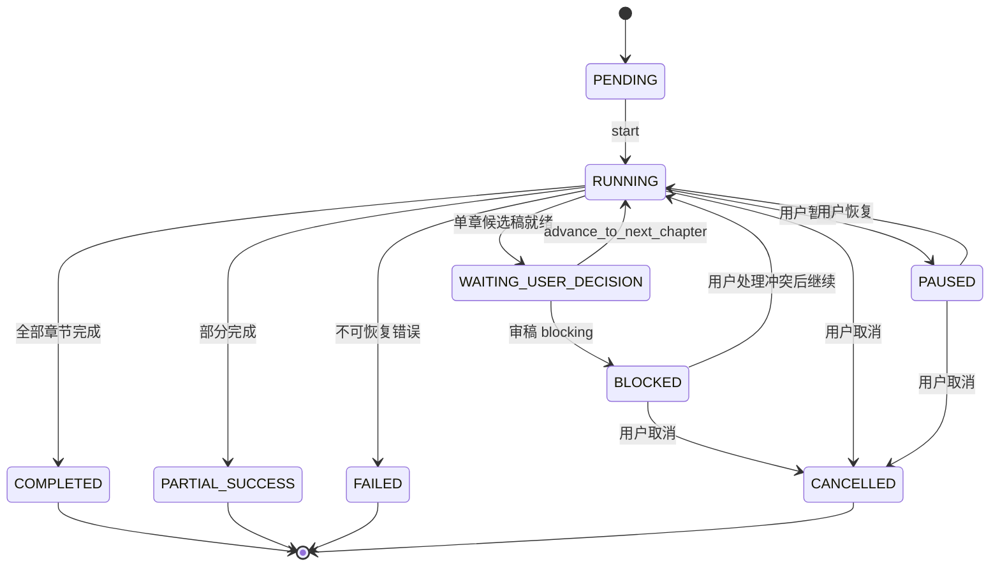
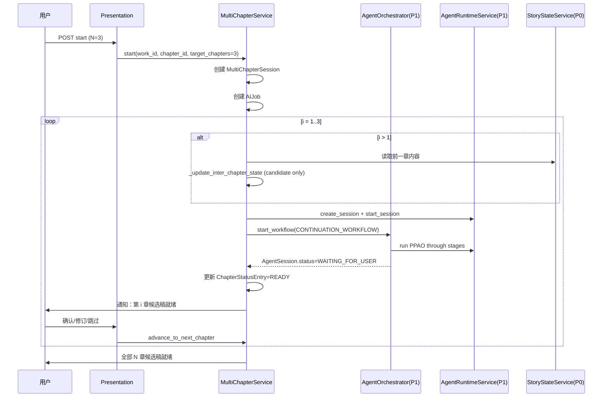

# InkTrace V2.0-P2-01 多章续写详细设计

版本：v1.1 / P2 模块级详细设计冻结版（方案 A 逐章确认已收口）
状态：冻结生效
所属阶段：InkTrace V2.0 P2-S1
设计范围：多章续写编排层

依据文档：

- `docs/01_requirements/InkTrace-V2.0-需求规格说明书.md`（R-AI-DRAFT-04）
- `docs/07_overview/InkTrace-V2.0-概要设计说明书.md`（第 13.3 节）
- `docs/02_architecture/InkTrace-V2.0-架构设计说明书.md`（第 15.3 节）
- `docs/02_architecture/InkTrace-V2.0-P2-架构设计说明书.md`（§4.1）
- `docs/03_design/InkTrace-V2.0-P1-01-AgentRuntime详细设计.md`
- `docs/03_design/InkTrace-V2.0-P1-02-AgentWorkflow详细设计.md`
- `docs/03_design/V2/InkTrace-V2.0-P0-09-CandidateDraft与HumanReviewGate详细设计.md`

说明：本文档冻结多章续写编排层设计，不推翻 P0/P1 已冻结设计，不进入自动续写队列（P2-04）的范围。本文档不写代码、不修改源码、不生成数据库迁移。

---

## 一、文档定位与设计范围

### 1.1 文档定位

本文档是 InkTrace V2.0-P2 的首篇模块级详细设计文档，仅覆盖多章续写编排层设计。

P2-01 的目标是冻结：用户如何一次触发 N 章续写、系统如何逐章调用 P1 AgentWorkflow、章间如何更新候选 StoryState 和 ImmediateWindow、进度如何追踪、暂停/恢复/取消行为如何定义、安全边界如何加固。

本文档只解决"单章续写如何循环为多章"的编排问题。单章内部的 Agent 编排、PPAO 循环、Tool 调用、CandidateDraft 隔离、HumanReviewGate 门控——均以 P1 已冻结设计为准。

### 1.2 设计范围

本模块覆盖：

- MultiChapterSession 领域模型。
- MultiChapterProgress 进度追踪模型。
- MultiChapterStatus 状态机。
- MultiChapterContinuationService 服务接口与编排逻辑。
- InterChapterStateUpdater 章间状态更新规则（候选 StoryState 硬边界）。
- 与 P1 AgentOrchestrator / AgentRuntimeService 的集成方式。
- 暂停 / 恢复 / 取消行为（含对运行中 AgentWorkflow 的处理策略）。
- 审稿 blocking 时的暂停策略。
- Repository 接口与持久化。
- API 端点与 DTO。
- 前端进度面板集成方向。
- 测试策略与安全红线。

**核心交互模式（冻结）**：P2-01 只采用**逐章确认推进**——`start()` 只生成第一章候选稿；每章候选稿就绪后固定进入 `WAITING_USER_DECISION`，只有真实用户操作 `advance_to_next_chapter` 才能启动下一章。用户可以先 apply，也可以保留当前候选稿后继续；两种操作都是独立 user_action。不存在连续自动推进。

### 1.3 不覆盖范围

P2-01 不覆盖：

- 自动续写队列的停止条件、预算、运行历史与恢复封装（属于 P2-04）。
- Style DNA / Citation Link / @ 引用 / Opening Agent / 大纲辅助 / 选区改写 / 成本看板 / 分析看板。
- 单章 AgentWorkflow 内部细节（属于 P1-02 / P1-03）。
- CandidateDraft / HumanReviewGate 内部细节（属于 P0-09）。
- StoryMemory / StoryState 持久化细节（属于 P0-04）。
- Agent Trace 内部细节（属于 P1-10）。

---

## 二、领域模型

### 2.1 MultiChapterStatus 枚举

```python
class MultiChapterStatus(StrEnum):
    PENDING = "pending"             # 已创建，未启动
    RUNNING = "running"             # 正在生成
    PAUSED = "paused"               # 用户暂停
    WAITING_USER_DECISION = "waiting_user_decision"  # 当前章等待用户确认（与 HumanReviewGate 语义一致）
    BLOCKED = "blocked"             # 需用户处理（含 blocked_source + blocked_reason_code 说明原因）
    COMPLETED = "completed"         # 全部章节候选稿生成完毕
    PARTIAL_SUCCESS = "partial_success"  # 部分章节完成，部分跳过/失败
    FAILED = "failed"               # 不可恢复失败
    CANCELLED = "cancelled"         # 用户取消
```

### 2.2 PerChapterStatus 枚举

```python
class ChapterAdvanceDecision(StrEnum):
    """用户对当前章的处理决策（advance_to_next_chapter 的输入）。"""
    APPLIED = "applied"                           # 用户已 accept 并 apply 本章候选稿
    SKIPPED = "skipped"                           # 用户跳过本章（不 apply）
    CONTINUE_WITHOUT_APPLY = "continue_without_apply"  # 保留候选稿但继续下一章
    REGENERATE = "regenerate"                     # 用户要求重新生成本章


class PerChapterStatus(StrEnum):
    PENDING = "pending"             # 等待生成
    GENERATING = "generating"       # AgentWorkflow 执行中
    REVIEWING = "reviewing"         # 审稿中
    READY = "ready"                 # 候选稿就绪，等待用户确认
    BLOCKED = "blocked"             # 审稿 blocking，暂停
    SKIPPED = "skipped"             # 用户跳过本章
    FAILED = "failed"               # 本章生成失败
    APPLIED = "applied"             # 用户已 apply 本章候选稿
```

### 2.3 MultiChapterSession

多章续写会话容器。

| 字段 | 类型 | 说明 |
|---|---|---|
| session_id | str | 多章会话唯一 ID，格式 `mcs_{uuid_hex_12}` |
| work_id | str | 关联作品 ID |
| start_chapter_id | str | 起始章节 ID（开始续写的章节） |
| target_chapters | int | 目标章数（N），1 ≤ N ≤ 10。默认快捷选项 3/5/10。超过 10 应引导用户使用 P2-04 自动续写队列 |
| current_index | int | 当前正在处理的章节序号（从 1 开始，1=start_chapter_id 的下一章） |
| status | MultiChapterStatus | 会话状态 |
| per_chapter_status | list[ChapterStatusEntry] | 每章状态列表 |
| agent_session_ids | list[str] | 每章对应的 AgentSession ID 列表（按序号） |
| candidate_draft_ids | list[str] | 每章对应的 CandidateDraft ID 列表 |
| candidate_story_state | dict | 章间候选 StoryState（仅供续写上下文用，非正式） |
| queue_state_snapshots | list[dict] | 章间 StoryState 快照历史 |
| warning_codes | list[str] | 警告码 |
| error_code | str | 错误码 |
| error_message | str | 错误信息 |
| paused_reason | str | 暂停原因 |
| blocked_source | str | 阻塞来源：review / context / provider / user |
| blocked_reason_code | str | 阻塞原因码（如 review_blocking_issue / context_required_layer_missing / provider_auth_failed / user_manual_block） |
| request_id | str | 请求 ID |
| trace_id | str | 追踪 ID |
| created_by | str | 创建者（user_action） |
| created_at | str | ISO 时间戳 |
| updated_at | str | ISO 时间戳 |
| started_at | str | 启动时间 |
| finished_at | str | 完成时间 |

### 2.4 ChapterStatusEntry

| 字段 | 类型 | 说明 |
|---|---|---|
| chapter_index | int | 章节序号（从 1 开始） |
| chapter_id | str | 目标章节 ID（生成后填充） |
| agent_session_id | str | 对应的 P1 AgentSession ID |
| candidate_draft_id | str | 对应的 CandidateDraft ID |
| status | PerChapterStatus | 本章状态 |
| error_code | str | 本章错误码 |
| started_at | str | 本章生成开始时间 |
| finished_at | str | 本章生成完成时间 |

### 2.5 MultiChapterProgress

前端轮询用的进度视图。

| 字段 | 类型 | 说明 |
|---|---|---|
| session_id | str | 多章会话 ID |
| status | MultiChapterStatus | 整体状态 |
| current_index | int | 当前序号 |
| target_chapters | int | 总章数 |
| completed_count | int | 已完成章数 |
| blocked_count | int | blocking 章数 |
| per_chapter | list[ChapterProgressEntry] | 每章进度摘要 |

### 2.6 ChapterProgressEntry

| 字段 | 类型 | 说明 |
|---|---|---|
| chapter_index | int | 章节序号 |
| status | PerChapterStatus | 本章状态 |
| candidate_draft_id | str | 候选稿 ID（生成后填充） |
| candidate_draft_status | str | 候选稿状态 |
| word_count | int | 候选稿字数 |
| review_summary | str | 审稿摘要（如有） |

---

## 三、服务接口

### 3.1 MultiChapterContinuationService

位于 Application 层。**不新增 Agent 类型，不新增 Workflow Stage**——纯粹的应用层编排。

```python
class MultiChapterContinuationService:
    def __init__(
        self,
        *,
        agent_orchestrator: AgentOrchestrator,         # 复用 P1
        runtime_service: AgentRuntimeService,          # 复用 P1
        context_pack_service: ContextPackService,      # 复用 P0
        story_state_service: StoryStateService,        # 复用 P0
        candidate_draft_repository: CandidateDraftRepository,  # 复用 P0
        multi_chapter_repository: MultiChapterSessionRepository,  # 新增
        job_service: AIJobService,                     # 复用 P0
        trace_service: AgentTraceService | None,       # 复用 P1
    ) -> None: ...

    # ── 生命周期 ──
    async def start(
        self,
        *,
        work_id: str,
        start_chapter_id: str,
        target_chapters: int,
        user_instruction: str = "",
        caller_type: str = "user_action",
    ) -> MultiChapterSession: ...

    async def get_progress(self, session_id: str) -> MultiChapterProgress: ...

    async def pause(self, session_id: str) -> MultiChapterSession: ...
    # 【冻结】不强杀运行中的 AgentWorkflow。
    # - 若当前章正在生成（GENERATING）：标记 pending_pause=true，
    #   当前章完成后进入 PAUSED，不自动推进下一章。
    # - 若已是 WAITING_USER_DECISION：直接 PAUSED。

    async def resume(self, session_id: str) -> MultiChapterSession: ...
    # 【冻结】从当前 chapter_index 继续：
    # - 若当前章状态=READY：直接推进（跳过已生成部分）。
    # - 若当前章状态=GENERATING 且 pending_pause=true：清除 pending_pause，
    #   恢复后台轮询，完成后正常推进。

    async def cancel(self, session_id: str) -> MultiChapterSession: ...
    # 【冻结】温和取消——不强杀 Provider 调用。
    # - 标记 status=CANCELLING。
    # - 若当前 AgentSession 的当前 step 支持取消则请求取消，
    #   否则等待当前 step 返回后丢弃后续推进。
    # - 已生成的 CandidateDraft 全部保留。

    # ── 单章推进（内部调用，也可由 API 手动触发）──
    async def advance_to_next_chapter(
        self,
        session_id: str,
        *,
        decision: ChapterAdvanceDecision,
        action: UserActionContext,
        idempotency_key: str,
    ) -> MultiChapterSession: ...

    # ── 章间状态更新（内部）──
    async def _update_inter_chapter_state(
        self,
        session: MultiChapterSession,
        previous_chapter_id: str,
        previous_candidate_draft_id: str,
    ) -> None: ...
```

### 3.2 执行模型：后台异步 + 前端轮询（冻结）

P1 AgentWorkflow 单章生成可能需要数分钟。多章续写的 HTTP 请求**不能同步等待全部完成**。执行模型采用**后台异步 + 前端轮询**模式，与 P1 AgentSession 的轮询模型一致。

```
POST /start  →  创建 MultiChapterSession + AIJob  →  立即返回 session_id（HTTP 202）
                  ↓
              后台异步任务（ai_job_runner）执行：
                 _start_single_chapter → 保存本章候选结果
                 每章完成后更新 MultiChapterSession 状态
                 非最后一章固定暂停于 WAITING_USER_DECISION
                 只有用户 advance 后才更新章间候选状态并启动下一章
                 队列完成/停止后标记终态
                  ↓
GET /progress →  前端轮询 MultiChapterSession 状态
                 (短任务 2s, 长任务 5s 初始间隔, 终态停止)
```

关键约束：
- `start()` 方法只做：校验参数 → 创建 session + AIJob → 提交后台任务 → 返回 `{session_id, status: "running"}`。
- 后台编排逻辑放在 `_run_chapter_loop()` 中，由 AIJobRunner 驱动（复用 P0 AIJob System）。
- 所有"等待 AgentWorkflow 完成"的逻辑在后台任务中执行，不阻塞 HTTP 响应。
- 前端通过 `GET /progress` 轮询获取当前进度，与 P1 AgentSession 轮询完全一致。

### 3.3 核心编排逻辑（start 方法）

```python
async def start(self, *, work_id, start_chapter_id, target_chapters,
                user_instruction, caller_type) -> MultiChapterSession:
    # 1. 校验：1 <= target_chapters <= 10（超出上限引导使用 P2-04）
    # 2. 创建 MultiChapterSession，status=PENDING
    # 3. 持久化 session（先于后台任务提交，避免竞态）
    # 4. 创建 AIJob（job_type="multi_chapter_continuation"）
    #    【冻结】一个 MultiChapterSession 对应一个 AIJob。
    #    每章生成对应一个 AIJobStep（step_index = chapter_index）。
    #    AIJobStep.status 与 ChapterStatusEntry.status 保持映射。
    # 5. 通过 AIJobRunner 提交后台编排任务 _run_chapter_loop(session_id)
    # 6. HTTP 202 立即返回 { session_id, status: "pending" }
    # ── 以下在后台异步执行，不阻塞 HTTP ──
```

### 3.4 后台编排主循环（_run_chapter_loop）

```python
async def _run_chapter_loop(self, session_id: str) -> None:
    """后台异步执行。由 AIJobRunner 驱动，不阻塞 HTTP。"""
    session = await self._load(session_id)
    session.status = MultiChapterStatus.RUNNING
    await self._save(session)

    for chapter_index in range(1, session.target_chapters + 1):
        session.current_index = chapter_index
        await self._start_single_chapter(session, chapter_index)

        # 检查本章终态
        ch_status = session.per_chapter_status[chapter_index - 1]
        if ch_status.status == PerChapterStatus.BLOCKED:
            session.status = MultiChapterStatus.BLOCKED
            await self._save(session)
            return
        if ch_status.status == PerChapterStatus.FAILED:
            session.status = MultiChapterStatus.PARTIAL_SUCCESS
            await self._save(session)
            return

        # 非最后一章：候选稿就绪后固定暂停，等待真实用户手动 advance
        if chapter_index < session.target_chapters:
            session.status = MultiChapterStatus.WAITING_USER_DECISION
            await self._save(session)
            return

    # 全部章节跑完
    session.status = MultiChapterStatus.COMPLETED
    session.finished_at = _now()
    await self._save(session)
```

### 3.5 单章启动逻辑（_start_single_chapter）

```python
async def _start_single_chapter(
    self, session: MultiChapterSession, chapter_index: int
) -> None:
    """后台执行，不阻塞 HTTP。内部轮询 AgentSession 直到终态。"""
    # 1. 如果是 chapter_index > 1：调用 _update_inter_chapter_state()
    # 2. 重建 ImmediateWindow（通过 ContextPackService）
    # 3. 创建 P1 AgentSession（通过 AgentRuntimeService）
    # 4. 调用 AgentOrchestrator.start_workflow(CONTINUATION_WORKFLOW)
    # 5. 更新 ChapterStatusEntry（status=GENERATING, agent_session_id=...）
    # 6. 后台轮询 AgentSession 状态，每步更新 AIJobStep 进度：
    #    等待 session 进入终态（WAITING_FOR_USER / COMPLETED / FAILED）
    # 7. 终态处理：
    #    - 正常：ChapterStatusEntry.status=READY
    #    - 审稿 blocking：ChapterStatusEntry.status=BLOCKED
    #    - 生成失败：ChapterStatusEntry.status=FAILED
    # 8. 持久化 MultiChapterSession
```

### 3.6 advance_to_next_chapter：触发时机与幂等性（冻结）

`advance_to_next_chapter` 是用户看过当前章候选结果后**手动调用的推进操作**。Application Service 必须复核 `caller_type=user_action`、`user_action=true`、非空 user_id、允许的 action 与 Idempotency-Key；不能只依赖 API 层，也不能由启动时的旧授权、Agent、workflow、system 或服务重启代替本章确认。

**与 CandidateDraft accept/apply 的关系（关键决策）**：

`accept`/`apply` 是 P0-09 CandidateDraft 的操作，`advance` 是 P2-01 的操作——**两者是独立 API 调用**，不自动耦合。原因：
- `apply` 成功后用户可能还想修订其他版本，不一定立即推进下一章。
- 如果 `apply` 自动触发 `advance`，用户会失去对进度的控制感。

**推荐交互模式**（前端实现）：
1. 用户在候选稿区点击 [应用并继续] → 前端依次调用 `PUT /apply` 然后 `POST /advance`。
2. 用户也可以仅 [应用]（不推进），稍后再手动点击多章面板的 [继续下一章]。
3. 用户也可选择 [保留并继续写下一章]，前端只调用 `POST /advance` 并提交 `continue_without_apply`；当前 CandidateDraft 保持隔离，不进入正式正文。
4. 后端不自动耦合 apply 和 advance——组合操作只由前端在用户当次点击后依次发起。

**幂等性**：
- 用户连续调用两次 `advance`：第二次调用时 `current_index` 已推进到下一章，且状态为 `GENERATING` 或 `WAITING_USER_DECISION`——返回 `{ already_advanced: true, current_index }`，不报错。
- 用户在当前章未 apply 时，只有显式 decision=`continue_without_apply` 才可推进；CandidateDraft 状态保持原样，不自动 accept/apply。
- 所有章已完成时调用 `advance`：返回 `{ already_completed: true }`。

```python
async def advance_to_next_chapter(
    self, session_id: str, *, decision: ChapterAdvanceDecision,
    action: UserActionContext, idempotency_key: str
) -> MultiChapterSession:
    self._require_real_user_action(action, expected_action="advance_multi_chapter")
    session = await self._load(session_id)

    # 幂等性检查
    if session.status == MultiChapterStatus.COMPLETED:
        return session  # already_completed
    if session.status != MultiChapterStatus.WAITING_USER_DECISION:
        raise ValueError("not_waiting_user_decision")

    current = session.per_chapter_status[session.current_index - 1]

    # 根据用户决策更新本章状态
    if decision == ChapterAdvanceDecision.APPLIED:
        # 注意：P2-01 不执行 apply —— apply 由 CandidateDraftService/HumanReviewGate 完成。
        # 这里只读取 apply 结果并标记本章状态。
        current.status = PerChapterStatus.APPLIED
    elif decision == ChapterAdvanceDecision.SKIPPED:
        current.status = PerChapterStatus.SKIPPED
    elif decision == ChapterAdvanceDecision.CONTINUE_WITHOUT_APPLY:
        current.status = PerChapterStatus.READY  # 保留候选稿，不标记 applied
    elif decision == ChapterAdvanceDecision.REGENERATE:
        current.status = PerChapterStatus.PENDING
        # 重新启动本章生成（后台任务）
        await self._submit_single_chapter_regeneration(session_id, session.current_index)
        return await self._save(session)

    # 推进到下一章
    next_index = session.current_index + 1
    if next_index > session.target_chapters:
        session.status = MultiChapterStatus.COMPLETED
        session.finished_at = _now()
    else:
        session.current_index = next_index
        await self._submit_continuation(session_id)

    return await self._save(session)
```

### 3.5 章间状态更新（_update_inter_chapter_state）

```python
async def _update_inter_chapter_state(
    self, session, previous_chapter_id, previous_candidate_draft_id
) -> None:
    # 冻结规则：仅生成 candidate_story_state，绝不写正式 StoryState
    # 1. 读取前一章的 CandidateDraft 内容
    # 2. 基于内容推演候选 StoryState（角色位置/状态/在场角色等）
    # 3. 写入 session.candidate_story_state（内存 + 持久化到 session metadata）
    # 4. 写入 session.queue_state_snapshots（留存历史）
    # 5. 禁止调用 story_state_service.update_official_story_state()
    # 6. 禁止调用任何 formal_write 级别的 Tool
```

---

## 四、状态机与流程

### 4.1 状态转换触发条件（冻结）

| 状态转换 | 触发条件 |
|---|---|
| PENDING → RUNNING | `start()` 提交后台任务成功 |
| RUNNING → WAITING_USER_DECISION | 非最后一章的候选稿生成完毕 + 审稿通过 |
| WAITING_USER_DECISION → RUNNING | 用户调用 `advance_to_next_chapter` |
| RUNNING → BLOCKED | 当前章审稿结果为 blocking 级别 |
| BLOCKED → RUNNING | 用户处理冲突后调用 `advance_to_next_chapter` |
| RUNNING → PARTIAL_SUCCESS | **至少 1 章成功但存在 ≥1 章 FAILED 或 SKIPPED**（即没有全部成功也没有全部失败） |
| RUNNING → COMPLETED | 全部 target_chapters 完成且每章状态为 READY/APPLIED |
| RUNNING → FAILED | **全部章节 FAILED**（无任一章节成功）或出现不可恢复的系统错误 |
| RUNNING → CANCELLED | 用户调用 `cancel()` |
| PAUSED → RUNNING | 用户调用 `resume()` |
| PAUSED/CANCELLING → CANCELLED | 取消流程完成 |

**PARTIAL_SUCCESS vs FAILED 判定规则（冻结）**：
- `PARTIAL_SUCCESS`：`completed_count > 0` AND `failed_count > 0`（部分成功部分失败）
- `FAILED`：`completed_count == 0` AND `failed_count > 0`（全部失败）
- 用户 SKIPPED 的章节不计入 failed_count，但计入 PARTIAL_SUCCESS 的"非成功"部分

### 4.2 MultiChapterSession 状态机



### 4.2 整体时序



---

## 五、Repository 接口

### 5.1 MultiChapterSessionRepository

定义在 `domain/repositories/ai/multi_chapter_session_repository.py`。

```python
from abc import ABC, abstractmethod

class MultiChapterSessionRepository(ABC):
    @abstractmethod
    async def save(self, session: MultiChapterSession) -> MultiChapterSession: ...
    # upsert 语义：session_id 不存在则 INSERT，存在则 UPDATE。
    # DDD 仓储惯例——只暴露一个写入方法，实现层自行处理 INSERT/UPDATE 分支。

    @abstractmethod
    async def get_by_id(self, session_id: str) -> MultiChapterSession | None: ...

    @abstractmethod
    async def get_by_work_id(self, work_id: str) -> list[MultiChapterSession]: ...

    @abstractmethod
    async def list_active(self, work_id: str) -> list[MultiChapterSession]: ...
    # status IN ('pending','running','paused','chapter_waiting_review','blocked')
```

### 5.2 持久化表

> **P2-01 简化策略**：`per_chapter_status`、`queue_state_snapshots` 等采用 JSON 字段存储，降低初期迁移复杂度。若后续需要按章节状态复杂查询（如"某章失败原因统计"、"跨会话恢复"），可在 P2-04 自动队列或 P3 中拆分为 `multi_chapter_session_chapters`、`queue_state_snapshots` 独立表。

```sql
CREATE TABLE IF NOT EXISTS multi_chapter_sessions (
    session_id TEXT PRIMARY KEY,
    work_id TEXT NOT NULL,
    start_chapter_id TEXT NOT NULL,
    target_chapters INTEGER NOT NULL DEFAULT 1,
    current_index INTEGER NOT NULL DEFAULT 0,
    status TEXT NOT NULL DEFAULT 'pending',
    per_chapter_status_json TEXT NOT NULL DEFAULT '[]',
    agent_session_ids_json TEXT NOT NULL DEFAULT '[]',
    candidate_draft_ids_json TEXT NOT NULL DEFAULT '[]',
    candidate_story_state_json TEXT DEFAULT '{}',
    queue_state_snapshots_json TEXT DEFAULT '[]',
    warning_codes_json TEXT DEFAULT '[]',
    error_code TEXT DEFAULT '',
    error_message TEXT DEFAULT '',
    paused_reason TEXT DEFAULT '',
    request_id TEXT DEFAULT '',
    trace_id TEXT DEFAULT '',
    created_by TEXT DEFAULT 'user_action',
    created_at TEXT NOT NULL,
    updated_at TEXT NOT NULL,
    started_at TEXT DEFAULT '',
    finished_at TEXT DEFAULT ''
);
```

---

## 六、API 设计

### 6.1 路由前缀

`/api/v2/ai/multi-chapter`

### 6.2 端点

```
POST   /api/v2/ai/multi-chapter/start
  Request:  { work_id, start_chapter_id, target_chapters, user_instruction? }
  Response: { session_id, status, target_chapters, created_at }

GET    /api/v2/ai/multi-chapter/{session_id}/progress
  Response: { session_id, status, current_index, target_chapters,
              completed_count, blocked_count, per_chapter: [...] }

POST   /api/v2/ai/multi-chapter/{session_id}/advance
  Request:  { decision: "applied" | "skipped" | "continue_without_apply" | "regenerate",
              caller_type: "user_action", user_action: true, user_id,
              user_action_context: { action: "advance_multi_chapter" } }
  Header:   Idempotency-Key（必填）
  Response: { session_id, status, current_index, next_chapter_available }

POST   /api/v2/ai/multi-chapter/{session_id}/pause
  Response: { session_id, status, paused_at }

POST   /api/v2/ai/multi-chapter/{session_id}/resume
  Response: { session_id, status, current_index }

POST   /api/v2/ai/multi-chapter/{session_id}/cancel
  Response: { session_id, status, cancelled_at }

GET    /api/v2/ai/multi-chapter/{session_id}/chapters
  Response: { chapters: [{ chapter_index, candidate_draft_id, status, word_count, ... }] }
```

### 6.3 API 安全规则

- `advance` / `pause` / `resume` / `cancel` 必须 `caller_type=user_action + user_action=true + user_id`；advance 额外要求本章独立 Idempotency-Key。
- Agent 不得调用这些端点。
- API 层不承载编排逻辑——只做参数适配和权限校验，核心编排在 `MultiChapterContinuationService`。
- 响应沿用 P0-11 通用格式：`{ request_id, trace_id, status, data, error, polling_hint }`。

---

## 七、前端集成方向

### 7.1 触发入口

在 `WritingStudio.vue` 的 AI 续写入口区增加"多章续写"按钮。点击后弹出配置面板：

- 目标章数选择器（3/5/10/自定义）
- 可选：续写到当前 Sequence Arc 结束
- 用户指令输入框
- "开始生成"按钮

### 7.2 进度面板（MultiChapterPanel.vue）

位于 `RightWorkspacePanel` 新增 Tab 或在 `AIPanel` 内联展示。

展示内容：
- 进度条：`completed / target_chapters`
- 当前状态标识（生成中/等待确认/blocking）
- 每章状态列表：序号 / 状态（图标 + 文字）/ 候选稿 ID（可点击跳转）/ 字数
- 阻塞提示（如有 blocking）：红色高亮 + 处理入口
- 操作按钮：暂停 / 继续 / 取消

### 7.3 与现有 CandidateDraft 交互集成

候选稿区（现有 `AIPanel.vue`）增加章序号标识：

```
[第 2/3 章] 候选稿标题 → 正文预览 → 审稿摘要 → [接受] [修订] [丢弃]
```

---

## 八、测试策略

### 8.1 正向测试

| # | 用例 | 验证点 |
|---|---|---|
| T1 | N=3 多章续写正常完成 | 3 个 CandidateDraft 依次生成，状态均为 READY |
| T2 | 用户逐章 apply | 每章 apply 后下一章开始，最终 status=COMPLETED |
| T3 | N=1 降级为单章 | 【冻结】仍创建 MultiChapterSession，执行一次单章 Workflow；逻辑统一，测试简单。前端可直接引导用户使用单章续写入口 |

### 8.2 边界测试

| # | 用例 | 验证点 |
|---|---|---|
| T4 | 某章审稿 blocking | MultiChapterSession.status=BLOCKED，后续章不生成 |
| T5 | 用户暂停后恢复 | status 正确切换，恢复后从当前章继续 |
| T6 | 用户跳过某章 | ChapterStatusEntry.status=SKIPPED，继续下一章 |
| T7 | 第一章就失败 | status=FAILED，不生成后续章 |

### 8.3 反向测试（安全红线）

| # | 用例 | 验证点 |
|---|---|---|
| T8 | Agent 尝试调用 advance API | 返回 forbidden（caller_type 校验） |
| T8A | system/服务重启尝试自动推进 WAITING_USER_DECISION | 保持等待；未创建下一章 Provider 调用 |
| T8B | 未 apply 时用户选择 continue_without_apply | 允许推进；CandidateDraft 保持隔离且状态不被自动改变 |
| T9 | 章间不更新正式 StoryState | Mock story_state_service，验证 update_official 未被调用 |
| T10 | 多章 apply 不能批量 | 每章 apply 必须独立 user_action，Agent 不能伪造 |
| T11 | formal_write Tool 不可被多章编排调用 | 权限矩阵测试 |

---

## 九、安全边界

### 9.1 继承 P0/P1 红线

| # | 红线 | 本模块加固 |
|---|---|---|
| 1 | AI 不自动写正式正文 | 每章 CandidateDraft 独立走 HumanReviewGate |
| 2 | CandidateDraft 隔离 | 每章独立 CandidateDraft ID，不批量合并 |
| 3 | Agent 不伪造 user_action | advance/apply 必须 user_action caller_type |
| 4 | formal_write 禁止 | 章间不调用 update_story_memory_directly |

### 9.2 P2 新增约束

| # | 约束 | 实施方式 |
|---|---|---|
| 1 | 章间 StoryState 仅为 candidate state | `_update_inter_chapter_state` 写入 `session.candidate_story_state`，不调用 formal_write |
| 2 | Blocking 后必须暂停 | `PerChapterStatus=BLOCKED` → `MultiChapterSession.status=BLOCKED` |
| 3 | 不设计"一键全部接受" | 前端不提供批量 apply 按钮 |

---

## 十、待确认项

以下问题在本模块详细设计中已做默认决策，但需在 P2-S1 开发启动前确认：

1. **多章续写是否需要每章生成前重新执行 Direction Proposal？**
   - 默认决策：不需要。使用第一章的方向持续到最后一章。用户可在任意章暂停后手动触发重新规划。

2. **章间 ImmediateWindow 的 N 值（前几章摘要）？**
   - 默认决策：与 P1 保持一致（前 10 章摘要 + 前 3 章精简 + 当前章上下文）。

3. **如果用户在中间某章想改变方向怎么办？**
   - 默认流程：用户暂停→手动触发 Planner Agent 重新生成 Direction Proposal→用户选择新方向→恢复多章续写。

---

## 附录：代码改动面

### 新增文件

```
application/services/ai/multi_chapter_service.py
domain/repositories/ai/multi_chapter_session_repository.py
infrastructure/persistence/sqlite_multi_chapter_session_repo.py
presentation/api/routers/v2/ai/multi_chapter.py
tests/test_multi_chapter_service.py
```

### 需修改文件

```
domain/entities/ai/models.py          # 追加 MultiChapterSession 等实体类、MultiChapterStatus 枚举
presentation/api/app.py               # 注册 multi_chapter 路由
```

### 不可修改文件

```
application/services/ai/agent_workflow.py         # P1 冻结
application/services/ai/agent_runtime_service.py  # P1 冻结
application/services/ai/tool_facade.py            # P0/P1 冻结
application/services/ai/continuation_workflow.py  # P0 冻结
application/services/v1/*                          # V1.1 冻结
```
