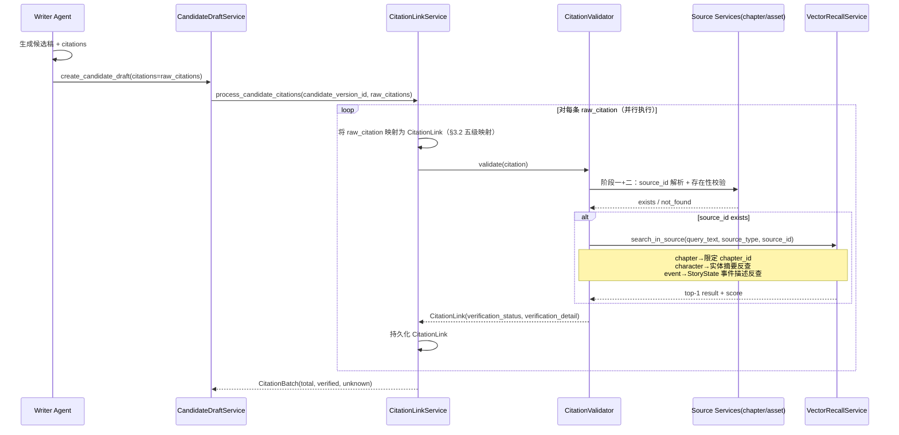
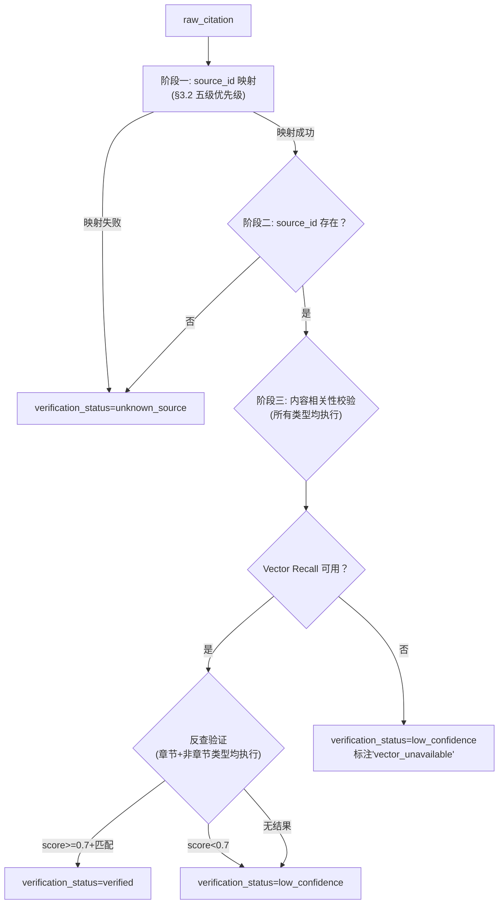

# InkTrace V2.0-P2-02 Citation Link 详细设计

版本：v1.0 / P2 模块级详细设计候选冻结版
状态：候选冻结
所属阶段：InkTrace V2.0 P2-S1
设计范围：候选稿引用溯源系统

依据文档：

- `docs/01_requirements/InkTrace-V2.0-需求规格说明书.md`（R-AI-CITE-01）
- `docs/02_architecture/InkTrace-V2.0-P2-架构设计说明书.md`（§4.4）
- `docs/03_design/V2/InkTrace-V2.0-P0-09-CandidateDraft与HumanReviewGate详细设计.md`
- `docs/03_design/V2/InkTrace-V2.0-P0-05-VectorRecall详细设计.md`

说明：本文档冻结 Citation Link 子系统设计，不推翻 P0/P1 已冻结设计。本文档不写代码、不修改源码、不生成数据库迁移。

---

## 一、文档定位与设计范围

### 1.1 文档定位

本文档是 InkTrace V2.0-P2 的第二篇模块级详细设计文档，仅覆盖 Citation Link（候选稿引用溯源）子系统。

P2-02 的目标是冻结：Writer Agent 如何输出 citation 候选列表、CitationValidator 如何逐条校验、校验通过/失败的不同处理路径、CitationLink 数据结构、前端如何展示引用来源（不污染正文纯文本）、与 Vector Recall 的增强集成方式。

核心原则（来自 P2 架构 §4.4 已冻结）：**Citation Link 采用"模型建议 + 系统校验"双阶段机制，不完全信任模型自报的引用来源。**

### 1.2 设计范围

本模块覆盖：

- CitationLink 领域模型与枚举。
- Writer Agent Output Schema 扩展（citations 字段）。
- CitationValidator 校验逻辑与规则矩阵。
- CitationLinkService（Application 层）。
- Repository 接口与持久化。
- API 端点与 DTO。
- 前端 CandidateDraft 展示区的引用来源浮层。
- 与 Vector Recall 的增强集成。
- 测试策略与安全边界。

### 1.3 不覆盖范围

- Writer Agent 内部 Prompt 模板设计细节（属于 Prompt Registry）。
- Vector Recall 的索引构建与召回算法（属于 P0-05）。
- @ 标签引用系统（属于 P2-05，依赖本模块）。
- 正文内联引用标记（Citation Link 是候选稿元数据，不进入正文）。

---

## 二、领域模型

### 2.1 CitationSourceType 枚举

```python
class CitationSourceType(StrEnum):
    CHAPTER = "chapter"           # 前文章节
    CHARACTER = "character"       # 人物卡
    FORESHADOW = "foreshadow"    # 伏笔
    SETTING = "setting"           # 设定
    EVENT = "event"               # 剧情事件
    LOCATION = "location"         # 地点
```

### 2.2 CitationVerificationStatus 枚举

```python
class CitationVerificationStatus(StrEnum):
    VERIFIED = "verified"               # 校验通过
    UNKNOWN_SOURCE = "unknown_source"    # 来源不存在
    LOW_CONFIDENCE = "low_confidence"    # 来源可能不准确
    VERIFICATION_FAILED = "verification_failed"  # 校验过程出错
```

### 2.3 CitationLink

| 字段 | 类型 | 说明 |
|---|---|---|
| citation_id | str | 引用 ID，格式 `cite_{uuid_hex_12}` |
| candidate_version_id | str | **主归属**：关联候选稿版本 ID。同一 CandidateDraft 的不同版本拥有独立的 CitationLink 批次。用户查看某版本时只展示该版本的 citations |
| candidate_draft_id | str | **冗余索引**：关联候选稿 ID，仅用于按候选稿聚合查询全部版本的 citations |
| source_type | CitationSourceType | 来源类型 |
| source_id | str | 来源实体 ID（chapter_id / character_id 等） |
| source_name_snapshot | str | **快照**：校验时实体名称。实体改名或删除后，前端仍能展示"当时模型引用的是谁"。来源改名不影响历史 citation 展示 |
| source_span | str | 来源位置（如"第3章第12段"） |
| source_excerpt | str | 来源摘要（≤120 字符，**由系统从 source_id 解析生成**，非模型自报。见 §3.5） |
| context_in_draft | str | 在候选稿中的使用上下文（≤80 字符） |
| verification_status | CitationVerificationStatus | 校验状态 |
| verification_detail | str | 校验详情（"source_id 在 chapter_3 中找到匹配片段"） |
| confidence | float | 匹配置信度（0-1），模型自报值 |
| verified_at | str | 校验时间 |
| created_at | str | 创建时间 |

### 2.4 CitationBatch

一次候选稿生成对应的 citation 批次。**纯内存聚合对象**，不持久化独立表。`citation_links` 表中每条 CitationLink 通过 `candidate_version_id` 关联，查询时按版本聚合为 CitationBatch 返回。

| 字段 | 类型 | 说明 |
|---|---|---|
| batch_id | str | 批次 ID（内存生成，格式 `cb_{uuid_hex_12}`，不持久化） |
| candidate_version_id | str | 关联候选稿版本 |
| total_count | int | 总引用数 |
| verified_count | int | 校验通过数 |
| unknown_count | int | 未知来源数 |
| citations | list[CitationLink] | 引用列表 |

---

## 三、服务接口

### 3.1 CitationLinkService

位于 Application 层。

```python
class CitationLinkService:
    def __init__(
        self,
        *,
        citation_repository: CitationLinkRepository,    # 新增
        # 以下复用 P0/P1
        chapter_service: ChapterService,                 # V1.1 章节服务
        writing_asset_service: WritingAssetService,      # V1.1 资产服务
        vector_index_service: VectorIndexService | None, # P0 Vector Recall
    ) -> None: ...

    # ── 批次处理（并行 + 超时）──
    async def process_candidate_citations(
        self,
        *,
        candidate_version_id: str,
        raw_citations: list[RawCitation],
        per_citation_timeout: float = 5.0,
        batch_timeout: float = 30.0,
    ) -> CitationBatch: ...

    # ── 单条处理 ──
    async def _map_raw_to_citation(
        self, raw: RawCitation, candidate_version_id: str
    ) -> CitationLink: ...
    # 执行 §3.2 映射策略，将 source_name/source_id_hint 解析为 source_id

    async def _validate_single(
        self, citation: CitationLink, *, timeout: float = 5.0
    ) -> CitationLink: ...
    # 单条校验（含超时保护），内部调用 CitationValidator.validate

    def _handle_batch_timeout(
        self, citations: list[CitationLink]
    ) -> list[CitationLink]: ...
    # 整批超时时标记未完成条目为 VERIFICATION_FAILED

    # ── 查询 ──
    async def get_by_candidate_version(
        self, candidate_version_id: str
    ) -> CitationBatch: ...

    async def get_by_candidate_draft(
        self, candidate_draft_id: str
    ) -> list[CitationBatch]: ...

    # ── 来源解析 ──
    async def _resolve_source(
        self, source_type: CitationSourceType, source_id: str
    ) -> SourceResolutionResult: ...
```

### 3.2 source_id_hint 映射策略（冻结）

模型自报的 `source_name` / `source_id_hint` 需要映射为系统中实际的 `source_id`。这是 Citation Link 有效性的**关键路径**——映射失败率高会直接导致 verified 率低，用户失去信任。

**映射优先级**（按顺序尝试，命中即停止）：

| 优先级 | 策略 | 适用类型 | 说明 |
|---|---|---|---|
| 1 | **精确 ID 匹配** | 所有 | `source_id_hint` 直接等于系统 entity_id → 直接采用 |
| 2 | **精确名称匹配** | 所有 | `source_name` 与系统中 `entity_name` 完全一致 → 采用该 entity_id |
| 3 | **前缀匹配** | 所有 | `source_name` 是系统中某个 `entity_name` 的前缀 → 如果唯一匹配则采用；多个匹配时进入消歧 |
| 4 | **模糊匹配** | 所有 | 编辑距离 ≤ min(3, len(source_name)/2) → 如果唯一匹配则采用；多个匹配时标记 low_confidence |
| 5 | **无匹配** | 所有 | 以上全部失败 → unknown_source |

**消歧规则**（多个候选时）：
- 如果候选数 = 1：采用该候选。
- 如果候选数 > 1 且包含精确名称匹配：采用精确匹配的候选（优先级 2 的结果优先）。
- 如果候选数 > 1 且全为模糊匹配：标记 `low_confidence`，选择编辑距离最小的候选，验证详情写"multiple_candidates"。
- 如果候选数 = 0：标记 `unknown_source`。

**同名实体处理**：复用 P2-05 MentionService 的同名消歧逻辑——返回候选列表，但 Citation Link 因为是后台自动处理（非用户交互），所以自动选择编辑距离最小的候选并标记 `low_confidence`。

### 3.3 CitationValidator —— 校验规则矩阵（冻结）

```python
class CitationValidator:
    """校验模型自报的 citation 是否真实存在。
       并行执行（每批 citation 并发校验），单条超时 5s，整批超时 30s。"""

    async def validate(self, citation: CitationLink, *, timeout: float = 5.0) -> CitationLink:
        """
        阶段一：source_id 解析（§3.2 映射策略）
          将 source_name / source_id_hint 映射为系统 entity_id。
          映射失败 → unknown_source（终止校验）

        阶段二：存在性校验
          根据 source_type 查找 source_id 是否存在。
          不存在 → unknown_source（终止校验）

        阶段三：内容相关性校验（【冻结】所有类型均执行，不区分 chapter/非 chapter）
          - 通过 VectorRecallService.search(source_excerpt, chapter_id=source_id)
            反查 source_excerpt 是否确实出现在声称的实体/章节。
          - Vector Recall 可用时：top-1 score >= 0.7 且匹配 → verified
                                  score < 0.7 或章节不匹配 → low_confidence
                                  无结果 → low_confidence
          - Vector Recall 不可用时：存在性校验通过即可 → low_confidence（标注 vector_unavailable）
          - 非 chapter 类型（character/foreshadow 等）：同样执行内容反查，
            将 source_name + context_in_draft 作为查询文本，验证实体内容匹配度。

        阶段四：返回
          verification_status + verification_detail
        """
```

### 3.4 批量校验：并行执行 + 超时预算（冻结）

一章候选稿可能有 5-10 条 citation，串行校验延迟不可接受。批量处理采用**并行校验 + 整体超时**。

```python
async def process_candidate_citations(
    self,
    *,
    candidate_version_id: str,
    raw_citations: list[RawCitation],
    per_citation_timeout: float = 5.0,    # 单条超时（秒）
    batch_timeout: float = 30.0,          # 整批超时（秒）
) -> CitationBatch:
    # 1. raw_citations → CitationLink 列表（含 §3.2 映射）
    citations = [self._map_raw_to_citation(r, candidate_version_id)
                 for r in raw_citations]

    # 2. 并行校验所有 citation
    try:
        validated = await asyncio.wait_for(
            asyncio.gather(
                *[self._validate_single(c, timeout=per_citation_timeout)
                  for c in citations],
                return_exceptions=True,
            ),
            timeout=batch_timeout,
        )
    except asyncio.TimeoutError:
        # 整批超时：已完成的保留结果，未完成的标记 verification_failed
        validated = self._handle_batch_timeout(citations)

    # 3. 持久化所有 citation
    await self._citation_repository.save_batch(validated)

    # 4. 返回 CitationBatch
    return CitationBatch(
        batch_id=f"cb_{uuid4().hex[:12]}",
        candidate_version_id=candidate_version_id,
        total_count=len(validated),
        verified_count=sum(1 for c in validated
                          if c.verification_status == CitationVerificationStatus.VERIFIED),
        unknown_count=sum(1 for c in validated
                         if c.verification_status == CitationVerificationStatus.UNKNOWN_SOURCE),
        citations=validated,
    )
```

**异常处理规则**：
- 单条 `_validate_single` 超时 → `verification_status = VERIFICATION_FAILED`，`verification_detail = "timeout"`。
- 整批超时 → 未完成条目标记 `VERIFICATION_FAILED`（detail = "batch_timeout"），已完成条目保留结果。
- 单条抛出其他异常 → `VERIFICATION_FAILED`，detail = 异常信息摘要（≤120 字符）。
- **所有异常不阻断候选稿使用**——用户看到 citation 状态标记后自行判断。

### 3.5 RawCitation —— Writer Agent 输出格式

Writer Agent 的 Output Schema 中 citations 字段的格式：

```json
{
  "text": "...候选稿正文...",
  "citations": [
    {
      "source_type": "character",
      "source_name": "张三",
      "source_id_hint": "character_zhangsan",
      "context_in_draft": "张三拔出长剑",
      "confidence": 0.9
    },
    {
      "source_type": "chapter",
      "chapter_reference": 3,
      "context_in_draft": "如前文所述",
      "confidence": 0.7
    }
  ]
}
```

### 3.6 source_excerpt 生成规则（冻结）

`source_excerpt` **由系统从已验证的 source_id 解析生成**，不直接使用模型自报内容。模型自报的 `context_in_draft` 只作为候选稿中的使用上下文参考。

| source_type | source_excerpt 来源 | 说明 |
|---|---|---|
| chapter | Vector Recall 反查匹配到的片段摘要（≤120字符） | 优先使用反查结果；不可用时使用章节摘要 |
| character / foreshadow / setting / location | 对应资产卡的 `summary` 或 `description` 字段截取（≤120字符） | 从 writing_asset_service 读取 |
| event | StoryState 中的事件描述截取（≤120字符） | 从 story_state_service 读取 |

**模型自报内容不可直接作为 source_excerpt**：模型可能生成幻觉内容。`source_excerpt` 必须来自系统可验证的数据源。

### 3.7 Vector Recall 阈值配置（冻结）

内容相关性校验的相似度阈值 **默认为 0.7，可通过配置调整**，不硬编码为不可变规则。

```python
# 默认配置（AI Settings 可覆盖）
CITATION_VECTOR_SIMILARITY_THRESHOLD = 0.7
```

不同 embedding 模型、不同向量库、不同中文语料下，0.7 的含义不一定稳定。阈值应在 AI Settings 中作为可配置项暴露，P2-02 只定义默认值。

**P0 Vector Recall 兼容性说明**：§3.3 要求所有 source_type 均执行内容反查，这要求 Vector Recall 能接受非 chapter 类型的 source filter（如 character_id、foreshadow_id 等）。如果 P0 Vector Recall 当前仅支持章节 chunk 索引：

- P2-02 实现时需补 `source_type` / `source_id` 索引能力，或
- 先对非 chapter 类型降级为实体摘要相似度/存在性校验，标记 `low_confidence` + `existence_only`，待 P0 Vector Recall 扩展后再升级为完整反查。

此兼容性策略在 P2-02 实现验收时确认，不扩大设计文档范围。

### 3.8 Transaction 边界（冻结）

**CitationLink 是候选稿的附属元数据，不在 CandidateDraft 正文创建的强事务边界内。**

- CandidateDraft 是主结果，CitationLink 是附属元数据。
- CitationLink 校验失败/超时/异常 → 记录 `citation_processing_warning` 到 AgentTrace，**不回滚 CandidateDraft**。
- 候选稿仍可正常 accept/apply，不因 citation 缺失而阻断。

建议处理流程：

```
1. 创建 CandidateDraft → 提交事务
2. 异步/同步处理 CitationLink
   - 成功 → citation 就绪
   - 失败 → 记录 warning，CitationBatch 返回空或部分结果
3. 前端展示候选稿时同时请求 citation 状态
```

### 3.9 Citation Processing Status（冻结）

候选稿需携带 citation 处理状态，供前端区分"尚未处理"和"处理失败"。

在 `CandidateDraft.metadata` 中增加：

```json
{
  "citation_status": "ready" | "processing" | "failed" | "none",
  "citation_count": 3,
  "citation_verified_count": 2,
  "citation_updated_at": "2026-06-08T..."
}
```

| 状态 | 说明 |
|---|---|
| `none` | Writer 未输出任何 citation |
| `processing` | 校验进行中（异步模式） |
| `ready` | 校验完成，可通过 API 获取 CitationBatch |
| `failed` | 校验过程异常，citation 不可用，但不影响候选稿 |

P2-02 初期采用同步处理（候选稿创建时同步完成 citation 校验），但仍保留此状态字段为后续异步化预留。

### 3.10 与 Writer Agent 集成点

Writer Agent 在生成候选稿时：

1. **Prompt 指令**（新增 citation 段落）：
   ```
   如你使用前文设定、伏笔、角色状态或历史事件，请在 citations 字段中标记来源。
   每条 citation 包含：source_type, source_name, source_id_hint, context_in_draft, confidence。
   不确定来源时标记 confidence < 0.5。
   ```

2. **Output Schema 扩展**（Prompt Registry 配置）：
   ```json
   {
     "output_schema_key": "candidate_with_citations",
     "schema": {
       "type": "object",
       "properties": {
         "text": { "type": "string" },
         "citations": {
           "type": "array",
           "items": {
             "type": "object",
             "properties": {
               "source_type": { "enum": ["chapter","character","foreshadow","setting","event","location"] },
               "source_name": { "type": "string" },
               "source_id_hint": { "type": "string" },
               "context_in_draft": { "type": "string" },
               "confidence": { "type": "number", "minimum": 0, "maximum": 1 }
             },
             "required": ["source_type", "source_name", "context_in_draft"]
           }
         }
       },
       "required": ["text"]
     }
   }
   ```

---

## 四、核心流程

### 4.1 完整时序



### 4.2 校验决策树



---

## 五、Repository 接口

### 5.1 CitationLinkRepository

定义在 `domain/repositories/ai/citation_link_repository.py`。

```python
class CitationLinkRepository(ABC):
    @abstractmethod
    async def save(self, citation: CitationLink) -> CitationLink: ...

    @abstractmethod
    async def save_batch(self, citations: list[CitationLink]) -> list[CitationLink]: ...

    @abstractmethod
    async def get_by_candidate_version(
        self, candidate_version_id: str
    ) -> list[CitationLink]: ...

    @abstractmethod
    async def get_by_candidate_draft(
        self, candidate_draft_id: str
    ) -> list[CitationLink]: ...

    @abstractmethod
    async def get_by_source(
        self, source_type: str, source_id: str
    ) -> list[CitationLink]: ...
    # ↑ 反向查询：哪些候选稿引用了某个实体
```

### 5.2 持久化表

```sql
CREATE TABLE IF NOT EXISTS citation_links (
    citation_id TEXT PRIMARY KEY,
    candidate_version_id TEXT NOT NULL,
    candidate_draft_id TEXT NOT NULL,
    source_type TEXT NOT NULL,
    source_id TEXT NOT NULL DEFAULT '',
    source_name_snapshot TEXT DEFAULT '',
    source_span TEXT DEFAULT '',
    source_excerpt TEXT DEFAULT '',
    context_in_draft TEXT DEFAULT '',
    verification_status TEXT NOT NULL DEFAULT 'unknown_source',
    verification_detail TEXT DEFAULT '',
    confidence REAL DEFAULT 0.0,
    verified_at TEXT DEFAULT '',
    created_at TEXT NOT NULL
);

CREATE INDEX IF NOT EXISTS idx_citations_candidate_version
    ON citation_links(candidate_version_id);
CREATE INDEX IF NOT EXISTS idx_citations_candidate_draft
    ON citation_links(candidate_draft_id);
CREATE INDEX IF NOT EXISTS idx_citations_source
    ON citation_links(source_type, source_id);
```

---

## 六、API 设计

### 6.1 路由前缀

`/api/v2/ai/citations`

### 6.2 端点

```
GET  /api/v2/ai/citations/candidate-version/{candidate_version_id}
  Response: {
    batch: {
      batch_id, candidate_version_id, candidate_draft_id,
      total_count, verified_count, unknown_count,
      citations: [{ citation_id, source_type, source_name, source_span,
                     source_name_snapshot, source_excerpt, context_in_draft,
                     verification_status, confidence }]
    Note: API response 中 source_name 字段来源于 CitationLink.source_name_snapshot
    }
  }

GET  /api/v2/ai/citations/candidate-draft/{candidate_draft_id}
  Response: { batches: [...],  }  # 多版本各自的 citation 批次

GET  /api/v2/ai/citations/source?source_type=character&source_id=c_01
  Response: { citations: [...] }  # 哪些候选稿引用了此实体

GET  /api/v2/ai/citations/{citation_id}/source-detail
  Response: {
    source_type, source_id, source_name_snapshot, source_full_summary,
    is_active  # 来源是否仍然有效（实体未被删除）
  }
```

---

## 七、前端集成方向

### 7.1 候选稿区引用展示

在现有 `AIPanel.vue` 候选稿展示区增加"引用来源"区域：

```
┌─────────────────────────────────┐
│  候选稿正文预览                  │
│  ...张三拔出长剑，如前述...      │
├─────────────────────────────────┤
│  📎 引用来源 (3)                │
│  ✅ 张三·人物卡  — "张三拔出长剑" │
│  ⚠️  第3章·章节  — "如前文所述"   │
│  ❓ 幽冥谷·地点  — "来到幽冥谷"   │
└─────────────────────────────────┘
```

- `✅` = verified
- `⚠️` = low_confidence
- `❓` = unknown_source

### 7.2 来源浮层（CitationTooltip.vue）

点击引用条目→弹出浮层：

```
┌──────────────────────────┐
│ 人物：张三               │
│ 来源：第3章第12段        │
│ "张三将长剑插回鞘中..."  │
│                          │
│ 校验状态：✅ 已验证      │
│ [查看完整人物卡]         │
└──────────────────────────┘
```

---

## 八、测试策略

### 8.1 正向测试

| # | 用例 | 验证点 |
|---|---|---|
| T1 | Writer 输出包含 citations | 候选稿生成后 citations 字段非空 |
| T2 | 校验通过 | source_id 存在 + Vector Recall 反查匹配 → verified |
| T3 | 按候选稿版本查询 | get_by_candidate_version 返回正确列表 |

### 8.2 边界测试

| # | 用例 | 验证点 |
|---|---|---|
| T4 | Writer 输出无 citations | 不报错，CitationBatch.total_count=0 |
| T5 | source_id 不存在 | verification_status=unknown_source，候选稿仍可用 |
| T6 | Vector Recall 不可用 | verification_status=low_confidence，标注 vector_unavailable |
| T7 | 候选稿被删除 | citations 仍可查询，但 source_id 可能失效 |

### 8.3 反向测试

| # | 用例 | 验证点 |
|---|---|---|
| T8 | citation 不写入正式正文 | 验证 accept/apply 后正文不包含 citation 标记 |
| T9 | source_excerpt 不超过 120 字符 | 内容截断逻辑测试 |
| T10 | 单条校验超时 | `_validate_single` 超过 5s → `verification_status=VERIFICATION_FAILED`，其他 citation 不受影响 |
| T11 | 整批校验超时 | `process_candidate_citations` 超过 30s → 已完成条目保留，未完成标记 `VERIFICATION_FAILED` |
| T12 | 校验超时不阻断候选稿 | 所有异常路径下，候选稿状态不变，CitationBatch 正常返回 |

---

## 九、安全边界

### 9.1 数据安全

| 约束 | 实施方式 |
|---|---|
| Citation 不写入正文 | CitationLink 是独立元数据表，不嵌入正文内容 |
| 来源摘要脱敏 | source_excerpt ≤120 字符，不存储完整段落 |
| 来源不可逆推 | context_in_draft ≤80 字符，仅记录使用上下文 |
| API Key 不入 citation | 不关联 LLMCallLog |

### 9.2 业务安全

| 约束 | 实施方式 |
|---|---|
| 不完全信任模型 | 所有 citation 必须经 CitationValidator 校验 |
| 校验失败不阻断 | unknown_source / low_confidence 的候选稿仍可使用 |
| 实体删除后 citation 保留 | 标记但悬停提示"来源已删除" |

---

## 十、与 Vector Recall 的集成决策

| 场景 | 策略 |
|---|---|
| Vector Recall 可用 | 所有 source_type 均执行内容反查。chapter 类型按 chapter_id 限定反查范围；character/foreshadow/setting/location 类型使用实体摘要作为查询文本反查；event 类型使用 StoryState 事件描述反查 |
| Vector Recall 不可用 | 跳过反查，标记 low_confidence + vector_unavailable |
| 反查 score < 0.7 | 标记 low_confidence |

---

## 十一、待确认项

1. **Writer Prompt 中的 citation 指令是否默认启用？**
   - 建议：默认启用，提供 AI Settings 关闭开关。

2. **是否需要在 Reviewer Agent 中也输出 citations？**
   - 建议：暂不需要。Reviewer 输出 ReviewIssue 引用即可。Citation 仅限 Writer Agent 输出。

---

## 附录：代码改动面

### 新增文件

```
application/services/ai/citation_link_service.py
domain/repositories/ai/citation_link_repository.py
infrastructure/persistence/sqlite_citation_link_repo.py
presentation/api/routers/v2/ai/citations.py
tests/test_citation_link_service.py
```

### 需修改文件

```
domain/entities/ai/models.py           # 追加 CitationLink, CitationBatch, CitationSourceType 等
presentation/api/app.py                # 注册 citations 路由
# Prompt Registry: 新增 candidate_with_citations output schema
```

### 不可修改文件

```
application/services/ai/tool_facade.py
application/services/ai/writer_service.py   # 尽量不改核心编排；允许通过 Output Schema、Result Parser、CandidateDraftService 入参扩展完成 citation 接入。Writer 输出从纯文本变为 { text, citations } 时，生成结果解析和传参可能需要适配
application/services/v1/*
```
