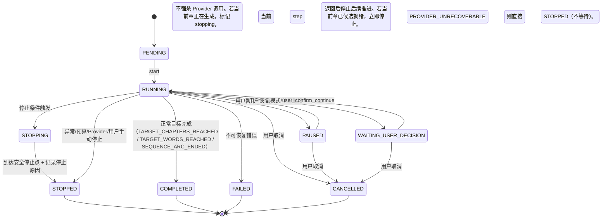
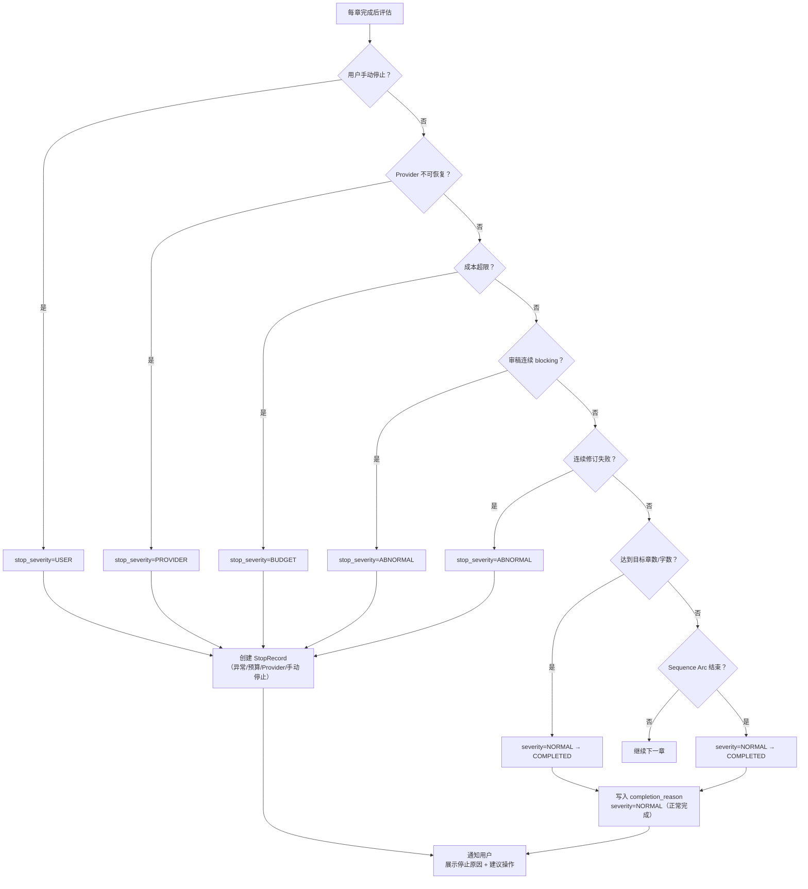

# InkTrace V2.0-P2-04 自动续写队列详细设计

版本：v1.0 / P2 模块级详细设计候选冻结版
状态：候选冻结
所属阶段：InkTrace V2.0 P2-S1
设计范围：受控自动连续续写队列系统

依据文档：

- `docs/01_requirements/InkTrace-V2.0-需求规格说明书.md`（R-AI-DRAFT-05）
- `docs/02_architecture/InkTrace-V2.0-P2-架构设计说明书.md`（§4.2）
- `docs/03_design/InkTrace-V2.0-P2-01-多章续写详细设计.md`
- `docs/03_design/InkTrace-V2.0-P1-02-AgentWorkflow详细设计.md`
- `docs/03_design/V2/InkTrace-V2.0-P0-02-AIJobSystem详细设计.md`

说明：本文档冻结自动续写队列子系统设计。**自动续写队列是多章续写（P2-01）的封装层，增加无人值守编排和 9 重停止条件**。本文档不写代码、不修改源码、不生成数据库迁移。

---

## 一、文档定位与设计范围

### 1.1 文档定位

本文档是 InkTrace V2.0-P2 的第四篇模块级详细设计文档，覆盖受控自动连续续写队列子系统。

P2-04 是 P2-S1 中最复杂的子系统。它在多章续写（P2-01）基础上增加：
- 无人值守逐章编排（用户事后批量审阅，或逐章暂停确认）。
- 9 重停止条件统一评估。
- 成本预算集成。
- 两种队列模式（安全模式 / 连续候选模式）。

**P2-01 与 P2-04 的职责边界（冻结）**：

| 职责 | P2-01（多章续写） | P2-04（自动队列） |
|---|---|---|
| 单章生成 | ✅ 负责（委托 P1 AgentWorkflow） | ❌ 不直接生成 |
| 章间状态推进 | ✅ 负责（InterChapterStateUpdater） | ❌ 不直接操作 |
| 逐章确认推进 | ✅ 提供 advance API | ❌ 安全模式下调用 P2-01 advance |
| 停止条件评估 | ❌ | ✅ 9 重条件统一评估 |
| 预算管理 | ❌ | ✅ 成本追踪 + 超限停止 |
| 队列历史/恢复 | ❌ | ✅ AutoQueueRun 持久化 + 重启恢复 |
| 连续候选自动推进 | ❌ | ✅ 自动调用 P2-01 advance |
| 前端队列面板 | ❌ | ✅ AutoQueuePanel |

P2-04 的价值不是"再做一次安全模式"，而是统一停止条件、预算、队列历史、自动恢复/继续、队列面板。

### 1.2 设计范围

本模块覆盖：

- AutoQueueMode 枚举（safe / continuous）。
- AutoQueueConfig / AutoQueueRun / AutoQueueStopRecord 领域模型。
- StopCondition 枚举与 StopConditionEvaluator 评估器。
- AutoContinuationQueueService 编排服务。
- 安全模式与连续候选模式的编排差异。
- 队列暂停 / 恢复 / 停止行为。
- 与多章续写（P2-01）的集成。
- Repository 接口与持久化。
- API 端点。
- 前端面板。
- 测试策略与安全红线。

### 1.3 不覆盖范围

- 单章 AgentWorkflow 内部细节（属于 P1-02）。
- 多章续写编排细节（属于 P2-01，本模块在其之上封装）。
- 成本计算（属于 P2-09 成本看板）。
- Citation Link / Style DNA。

---

## 二、领域模型

### 2.1 AutoQueueMode 枚举

```python
class AutoQueueMode(StrEnum):
    SAFE = "safe"                # 安全模式（默认）：每章暂停，等待用户确认继续
    CONTINUOUS = "continuous"    # 连续候选模式：审稿通过后自动下一章，但 apply 仍必须用户逐章确认
```

### 2.2 AutoQueueStatus 枚举

```python
class AutoQueueStatus(StrEnum):
    PENDING = "pending"
    RUNNING = "running"
    PAUSED = "paused"
    STOPPING = "stopping"         # 正在停止（处理最后一章）
    STOPPED = "stopped"           # 已停止（含停止原因）
    WAITING_USER_DECISION = "waiting_user_decision"  # 与 P2-01 MultiChapterStatus 对齐  # 安全模式：等待用户确认当前章
    COMPLETED = "completed"       # 全部完成
    FAILED = "failed"
    CANCELLED = "cancelled"
```

### 2.3 StopCondition 枚举

```python
class StopCondition(StrEnum):
    TARGET_CHAPTERS_REACHED = "target_chapters_reached"
    TARGET_WORDS_REACHED = "target_words_reached"
    SEQUENCE_ARC_ENDED = "sequence_arc_ended"
    BLOCKING_REVIEW_CONSECUTIVE = "blocking_review_consecutive"
    FORESHADOW_PREMATURE_REVEAL = "foreshadow_premature_reveal"
    CONSECUTIVE_REVISION_FAILURE = "consecutive_revision_failure"
    BUDGET_EXCEEDED = "budget_exceeded"
    PROVIDER_UNRECOVERABLE = "provider_unrecoverable"
    USER_MANUAL_STOP = "user_manual_stop"
```

### 2.4 StopSeverity 枚举

```python
class StopSeverity(StrEnum):
    NORMAL = "normal"       # 正常终止（达到章数/字数/剧情结束）
    ABNORMAL = "abnormal"   # 异常中断（审稿 blocking/伏笔揭示/修订失败）
    BUDGET = "budget"       # 预算中断
    PROVIDER = "provider"   # Provider 不可用
    USER = "user"           # 用户手动停止
```

### 2.5 AutoQueueConfig

| 字段 | 类型 | 说明 |
|---|---|---|
| config_id | str | 配置 ID，格式 `aqc_{uuid_hex_12}` |
| work_id | str | 作品 ID |
| queue_mode | AutoQueueMode | 队列模式（默认 SAFE） |
| target_chapters | int | 目标章数（0=不限）。【冻结启动校验】至少一个正常停止条件必须启用：target_chapters>0 或 target_word_count>0 或 stop_at_sequence_end=true 或 budget_limit_tokens>0。全部为 0/null/false 时拒绝启动。continuous 模式硬性要求 target_chapters>0 或 budget_limit_tokens>0 |
| target_word_count | int | 目标字数（0=不限） |
| stop_at_sequence_end | bool | Sequence Arc 结束时停止（可配置） |
| stop_on_blocking_review | bool | 审稿连续 blocking 时停止（可配置） |
| max_consecutive_blocking | int | 连续 blocking 章数阈值（默认 2） |
| stop_on_budget_exceeded | bool | 超预算停止（可配置） |
| max_consecutive_revision_failures | int | 连续修订失败阈值（默认 3，P2-04 预留） |
| stop_on_foreshadow_premature | bool | 伏笔提前揭示停止（可配置，默认 true） |
| budget_limit_tokens | int | Token 预算上限（0=不限） |
| enabled | bool | 是否启用 |
| created_at | str | 创建时间 |
| updated_at | str | 更新时间 |

**停止条件可配置性（冻结）**：
- **强制（不可关闭）**：`USER_MANUAL_STOP`、`PROVIDER_UNRECOVERABLE`
- **可配置**：`stop_at_sequence_end`、`stop_on_blocking_review`、`stop_on_budget_exceeded`、`stop_on_foreshadow_premature`
- **预留（P2-04 当前不触发）**：`CONSECUTIVE_REVISION_FAILURE`

### 2.6 AutoQueueRun

| 字段 | 类型 | 说明 |
|---|---|---|
| run_id | str | 运行 ID，格式 `aqr_{uuid_hex_12}` |
| config_id | str | 关联配置 |
| work_id | str | 作品 ID |
| multi_chapter_session_id | str | 关联 P2-01 MultiChapterSession |
| status | AutoQueueStatus | 运行状态 |
| queue_mode | AutoQueueMode | 本次使用的模式 |
| generated_count | int | 已生成 CandidateDraft 的章节数（不要求 apply）。applied_count 如需统计必须单独字段 |
| total_word_count | int | 已生成总字数 |
| consumed_tokens | int | 已消费 token 数 |
| current_stop_evaluation | dict | 最近一次停止条件评估结果 |
| stop_record | AutoQueueStopRecord | 停止记录（停止后填充） |
| current_candidate_story_state | dict | 候选 StoryState 快照冗余。**MultiChapterSession.candidate_story_state 是章间候选状态的权威源**；此字段仅队列层快照副本，用于状态面板展示和停止条件评估，不作为正式状态源。AutoQueue 层不独立修改 |
| queue_state_snapshots | list[dict] | 章间状态快照历史 |
| consecutive_blocking_count | int | 连续 blocking 章数 |
| consecutive_revision_failure_count | int | 连续修订失败次数 |
| error_code | str | 错误码 |
| error_message | str | 错误信息 |
| request_id | str | 请求 ID |
| trace_id | str | 追踪 ID |
| created_at | str | 创建时间 |
| updated_at | str | 更新时间 |
| started_at | str | 启动时间 |
| stopped_at | str | 停止时间 |
| finished_at | str | 完成时间 |

### 2.7 AutoQueueStopRecord

| 字段 | 类型 | 说明 |
|---|---|---|
| stop_reason | StopCondition | 停止条件 |
| stop_severity | StopSeverity | 严重程度 |
| stop_context | dict | 停止上下文（当前章数、字数、触发条件详情） |
| stopped_at | str | 停止时间 |
| user_action_required | bool | 是否需要用户处理 |
| suggested_action | str | 建议操作（"调整预算"/"处理冲突"/"手动继续"等） |

---

## 三、服务接口

### 3.1 执行模型：后台 Task + 持久化状态恢复（冻结）

自动续写队列可能运行数十分钟，不阻塞 HTTP。采用 **后台异步 Task + 持久化状态 + 服务重启可恢复** 模式。

**安全模式**：
```
POST /start → 创建 AutoQueueRun + AIJob → 启动后台 Task → HTTP 202 返回 run_id
后台 Task：_run_chapter_loop → 每章完成后 status=WAITING_USER_DECISION，Task 自挂起
POST /confirm-continue → API 层唤醒 Task，继续 _run_chapter_loop
服务重启：通过 get_active(work_id) 找到 status=WAITING_USER_DECISION 的 run，
          调用 resume() 重新挂载 Task（从 multi_chapter_session.current_index 继续）
```

**连续候选模式**：
```
POST /start → 同上
后台 Task：_run_chapter_loop → 循环直到停止条件触发或完成
                         Task 不挂起，持续运行
服务重启：检测到 status=RUNNING → 判定为中断，自动调用 resume()
          从 multi_chapter_session.current_index 恢复
```

**Task 状态机（内存 + 持久化双写）**：
- 每次状态变化 → 先写 AutoQueueRun 到数据库 → 再推进内存 Task。
- 服务重启后以数据库状态为权威源，内存 Task 重新挂载。

### 3.2 AutoContinuationQueueService

```python
class AutoContinuationQueueService:
    """P2-04 是 P2-01 的封装层，不直接生成单章、不直接调用 AgentOrchestrator。
       单章编排全部委托给 P2-01 MultiChapterContinuationService。"""
    def __init__(
        self,
        *,
        config_repository: AutoQueueConfigRepository,              # 新增
        run_repository: AutoQueueRunRepository,                    # 新增
        multi_chapter_service: MultiChapterContinuationService,    # 复用 P2-01
        stop_evaluator: StopConditionEvaluator,                    # 新增
        job_service: AIJobService,                                 # 复用 P0
        trace_service: AgentTraceService | None,                   # 复用 P1
    ) -> None: ...
    # 【冻结】不在 P2-04 中直接依赖 agent_orchestrator / story_state_service。
    # P2-04 通过 multi_chapter_service 间接使用它们。

    # ── 生命周期 ──
    async def start(self, config_id: str, work_id: str,
                    start_chapter_id: str) -> AutoQueueRun: ...
    async def pause(self, run_id: str) -> AutoQueueRun: ...
    async def resume(self, run_id: str) -> AutoQueueRun: ...
    async def stop(self, run_id: str, *,
                   reason: StopCondition = StopCondition.USER_MANUAL_STOP
                   ) -> AutoQueueRun: ...
    async def get_status(self, run_id: str) -> AutoQueueRun: ...

    # ── 安全模式回调 ──
    async def user_confirm_continue(self, run_id: str) -> AutoQueueRun: ...
    # 【冻结】安全模式下用户确认当前章后继续。内部调用 P2-01 的 advance_to_next_chapter，
    # 然后恢复后台 Task 继续 _run_chapter_loop。
    # 职责边界：当自动续写队列运行时，前端只调用此方法，不直接调 P2-01 的 advance。
    # 如果用户单独使用多章续写（不通过队列），才直接调 P2-01 的 advance。

    # ── 内部 ──
    async def _run_chapter_loop(self, run: AutoQueueRun) -> AutoQueueRun: ...
    async def _evaluate_stop_conditions(self, run: AutoQueueRun,
                                        last_review_result) -> StopEvaluationResult: ...
```

### 3.3 StopConditionEvaluator

```python
class StopConditionEvaluator:
    def __init__(
        self,
        *,
        plot_arc_repository: PlotArcRepository,       # 复用 P1（检查 Sequence Arc 状态）
        foreshadow_repository: ForeshadowRepository,  # 复用 V1.1（检查伏笔状态）
        budget_service: BudgetService | None,         # 可选：P2-09 完成后替换为完整预算服务
                                                     # P2-04 初期通过 LLMCallLog + AIJob token usage
                                                     # 做最小预算统计，不强制依赖 P2-09
    ) -> None: ...

    async def evaluate(
        self,
        run: AutoQueueRun,
        config: AutoQueueConfig,
        last_review_result: AIReviewResult | None,
    ) -> StopEvaluationResult:
        """
        按优先级评估所有停止条件，返回第一个触发的条件。
        评估顺序：
        1. 用户手动停止（立即响应）
        2. Provider 不可恢复（last_review_result 中无有效输出 + provider_error）
        3. 成本超限（budget_service.check）
        4. 审稿连续 blocking（last_review_result.review_issues）
        5. 连续修订失败（run.consecutive_revision_failure_count >= threshold）
        6. 伏笔提前揭示（foreshadow_repository 查询：任何 status=planted
           且揭示阶段在后续章节的伏笔，在候选稿中被标记为 revealed）
        7. 达到目标章数/字数（run.generated_count / run.total_word_count）
        8. Sequence Arc 结束（plot_arc_repository 查询 SequenceArc.status）

        【冻结】伏笔提前揭示的数据来源与判断方式：
        采用方案 B——StopConditionEvaluator 读取已有结构化数据，不重新调用模型。
        数据来源优先级：
        1. CitationLink 中 source_type=foreshadow 的引用（P2-02 已校验）
        2. ReviewReport 中已标记的 foreshadow issue（P1 Reviewer 输出）
        3. ForeshadowRepository 中的 planted_chapter / revealed_status
        不直接扫描候选稿正文做 NLP 语义判断——避免 StopConditionEvaluator 变重。
        不依赖 P1 Reviewer Agent 的 AIReviewResult（避免修改 P1 冻结设计）。
        """
```

### 3.4 StopEvaluationResult

```python
class StopEvaluationResult:
    should_stop: bool
    condition: StopCondition | None
    severity: StopSeverity | None
    reason: str
    user_action_required: bool
    suggested_action: str
```

### 3.5 两种模式的编排差异

**安全模式（safe，默认）**：

```python
async def _run_chapter_loop_safe(self, run):
    while not self._is_complete(run):
        # 1. 生成当前章（复用 P2-01 单章逻辑）
        chapter_result = await self._generate_single_chapter(run)
        # 2. 评估停止条件
        eval_result = await self._evaluate_stop_conditions(run, chapter_result.review)
        if eval_result.should_stop:
            await self._handle_stop(run, eval_result)
            break
        # 3. 暂停，等待用户确认
        run.status = AutoQueueStatus.WAITING_USER_DECISION
        await self._save(run)
        return  # 等待 user_confirm_continue 回调
```

**连续候选模式（continuous）**：

```python
async def _run_chapter_loop_continuous(self, run):
    while not self._is_complete(run):
        chapter_result = await self._generate_single_chapter(run)
        eval_result = await self._evaluate_stop_conditions(run, chapter_result.review)
        if eval_result.should_stop:
            await self._handle_stop(run, eval_result)
            break
        # 自动续下一章（不等待用户确认）
        await self._advance_to_next_chapter(run)
```

两种模式的**共同底线**：
- apply 始终必须 user_action（逐章走 HumanReviewGate）。
- 章间 StoryState 更新仅为 candidate state。
- blocking 后必须暂停（即使 continuous 模式也暂停）。

---

## 四、状态机

### 4.1 AutoQueueRun 状态机



**AutoQueueRun ↔ MultiChapterSession 状态映射（冻结）**：

| MultiChapterSession.status | AutoQueueRun.status | 说明 |
|---|---|---|
| `PENDING` | `PENDING` | 队列未启动 |
| `RUNNING` | `RUNNING` | 队列运行中 |
| `WAITING_USER_DECISION` | `WAITING_USER_DECISION` | 安全模式等待用户确认（两处状态名统一） |
| `BLOCKED` | `STOPPING` → `STOPPED` | P2-01 blocking → 队列停止（不自动恢复） |
| `COMPLETED` | `COMPLETED` | 全部章节完成 |
| `PARTIAL_SUCCESS` | `STOPPED` | 部分完成 = 队列停止 |
| `FAILED` | `FAILED` | 全部失败 |
| `CANCELLED` | `CANCELLED` | 用户取消 |

**连续候选模式下**：P2-01 每章仍会短暂进入 `WAITING_USER_DECISION`（P1 AgentWorkflow 的 HumanReviewGate 特性）。P2-04 连续模式在检测到此状态后**自动调用 P2-01 advance** 继续下一章，不等待用户交互。即连续模式 = 自动 advance，不是跳过 WAITING_USER_DECISION。

**STOPPING 阶段行为矩阵（冻结）**：

| 停止条件 | STOPPING 阶段行为 | 说明 |
|---|---|---|
| `USER_MANUAL_STOP` | 立即标记 STOPPING，若当前 AgentStep 支持取消则请求取消；否则等待当前 step 返回后停止后续推进 | 温和停止，不强杀 Provider 调用。已生成的候选稿全部保留。与 P2-01 取消策略一致 |
| `PROVIDER_UNRECOVERABLE` | 立即中止，不重试 | auth_failed / quota_exceeded 等不可恢复错误 |
| `BUDGET_EXCEEDED` | 等当前章生成完成后停止 | 已消费 token 不可回收 |
| `BLOCKING_REVIEW_CONSECUTIVE` | 等当前章审稿结果出来后停止 | 需要审稿结果来确认是否连续 blocking |
| `CONSECUTIVE_REVISION_FAILURE` | 等当前修订轮次结束后停止 | 【预留】P2-04 当前不自动执行 revision loop。`consecutive_revision_failure_count` 字段预留，默认不触发此停止条件。P2 后续扩展自动修订时启用 |
| `FORESHADOW_PREMATURE_REVEAL` | 等当前章审稿完成后停止 | 需要审稿结果 |
| `TARGET_CHAPTERS_REACHED` | 当前章就是最后一章，正常完成后 → COMPLETED | 正常终止，不入 STOPPING。记录 completion_reason |
| `TARGET_WORDS_REACHED` | 等当前章生成完成后 → COMPLETED | 正常终止，不入 STOPPING |
| `SEQUENCE_ARC_ENDED` | 等当前章生成完成后 → COMPLETED | 正常终止，不入 STOPPING |

**STOPPING → STOPPED 退出条件**：当前章处理完成（生成/审稿/修订完成）且停止条件确认触发 → 写入 StopRecord → status=STOPPED。

### 4.2 停止条件评估流程



---

## 五、Repository 接口与持久化

### 5.1 AutoQueueConfigRepository

```python
class AutoQueueConfigRepository(ABC):
    @abstractmethod
    async def save(self, config: AutoQueueConfig) -> AutoQueueConfig: ...
    @abstractmethod
    async def get_by_work(self, work_id: str) -> AutoQueueConfig | None: ...
    @abstractmethod
    async def get_by_id(self, config_id: str) -> AutoQueueConfig | None: ...
    @abstractmethod
    async def update(self, config: AutoQueueConfig) -> AutoQueueConfig: ...
```

### 5.2 AutoQueueRunRepository

```python
class AutoQueueRunRepository(ABC):
    @abstractmethod
    async def save(self, run: AutoQueueRun) -> AutoQueueRun: ...
    @abstractmethod
    async def get_by_id(self, run_id: str) -> AutoQueueRun | None: ...
    @abstractmethod
    async def get_active(self, work_id: str) -> AutoQueueRun | None: ...
    @abstractmethod
    async def get_history(self, work_id: str, limit: int = 20) -> list[AutoQueueRun]: ...
    @abstractmethod
    async def update(self, run: AutoQueueRun) -> AutoQueueRun: ...
```

### 5.3 持久化表

```sql
CREATE TABLE IF NOT EXISTS auto_queue_configs (
    config_id TEXT PRIMARY KEY,
    work_id TEXT NOT NULL UNIQUE,
    queue_mode TEXT NOT NULL DEFAULT 'safe',
    target_chapters INTEGER DEFAULT 0,
    target_word_count INTEGER DEFAULT 0,
    stop_at_sequence_end INTEGER DEFAULT 1,
    stop_on_blocking_review INTEGER DEFAULT 1,
    max_consecutive_blocking INTEGER DEFAULT 2,
    stop_on_budget_exceeded INTEGER DEFAULT 1,
    stop_on_foreshadow_premature INTEGER DEFAULT 1,
    max_consecutive_revision_failures INTEGER DEFAULT 3,
    budget_limit_tokens INTEGER DEFAULT 0,
    enabled INTEGER DEFAULT 1,
    created_at TEXT NOT NULL,
    updated_at TEXT NOT NULL
);

CREATE TABLE IF NOT EXISTS auto_queue_runs (
    run_id TEXT PRIMARY KEY,
    config_id TEXT NOT NULL,
    work_id TEXT NOT NULL,
    multi_chapter_session_id TEXT NOT NULL,
    status TEXT NOT NULL DEFAULT 'pending',
    queue_mode TEXT NOT NULL,
    generated_count INTEGER DEFAULT 0,
    total_word_count INTEGER DEFAULT 0,
    consumed_tokens INTEGER DEFAULT 0,
    current_stop_evaluation_json TEXT DEFAULT '{}',
    stop_record_json TEXT DEFAULT '{}',
    current_candidate_story_state_json TEXT DEFAULT '{}',
    queue_state_snapshots_json TEXT DEFAULT '[]',
    consecutive_blocking_count INTEGER DEFAULT 0,
    consecutive_revision_failure_count INTEGER DEFAULT 0,
    error_code TEXT DEFAULT '',
    error_message TEXT DEFAULT '',
    request_id TEXT DEFAULT '',
    trace_id TEXT DEFAULT '',
    created_at TEXT NOT NULL,
    updated_at TEXT NOT NULL,
    started_at TEXT DEFAULT '',
    stopped_at TEXT DEFAULT '',
    finished_at TEXT DEFAULT ''
);

CREATE INDEX IF NOT EXISTS idx_auto_queue_runs_work
    ON auto_queue_runs(work_id, status);
```

---

## 六、API 设计

### 6.1 路由前缀

`/api/v2/ai/auto-queues`

### 6.2 端点

```
PUT    /api/v2/ai/auto-queues/config
  Request:  { work_id, queue_mode?, target_chapters?, target_word_count?,
              stop_at_sequence_end?, stop_on_blocking_review?,
              stop_on_budget_exceeded?, budget_limit_tokens?, ... }
  Response: { config }

GET    /api/v2/ai/auto-queues/config/{work_id}
  Response: { config } 或 { config: null }

POST   /api/v2/ai/auto-queues/start
  Request:  { work_id, start_chapter_id }
  Response: { run_id, status, queue_mode }

GET    /api/v2/ai/auto-queues/{run_id}/status
  Response: { run_id, status, queue_mode, generated_count,
              total_word_count, consumed_tokens, stop_record?,
              per_chapter: [...] }

POST   /api/v2/ai/auto-queues/{run_id}/pause
  Response: { run_id, status: "paused" }

POST   /api/v2/ai/auto-queues/{run_id}/resume
  Response: { run_id, status: "running" }

POST   /api/v2/ai/auto-queues/{run_id}/stop
  Response: { run_id, status: "stopped", stop_record }

POST   /api/v2/ai/auto-queues/{run_id}/confirm-continue
  # 安全模式专用：用户确认当前章后继续。
  # 【冻结】confirm-continue ≠ apply。此端点只推进队列到下一章；
  # 如果用户想把当前候选稿应用到正文，必须先走 CandidateDraft apply API。
  # 【冻结职责边界】队列运行时前端只调此端点；P2-04 内部调 P2-01 advance。
  Response: { run_id, status, next_chapter_index }

GET    /api/v2/ai/auto-queues/{work_id}/history
  Response: { runs: [...] }
```

---

## 七、前端集成方向

### 7.1 AutoQueuePanel.vue

位于 `RightWorkspacePanel` 新增 Tab。

```
┌──────────────────────────────────────┐
│  🤖 自动续写队列                     │
│  ─────────────────────────────────── │
│  模式：🔒 安全模式 | [切换连续模式]  │
│                                      │
│  进度：■■■■■□□□□□ 5 / 10 章        │
│  字数：25,000 / 50,000               │
│  Token：120K / 500K                  │
│                                      │
│  ┌ 章节状态 ─────────────────────┐  │
│  │ ✅ 第1章  3,200字  审稿通过    │  │
│  │ ✅ 第2章  2,800字  审稿通过    │  │
│  │ 🔄 第3章  生成中...           │  │
│  │ ⏳ 第4章  等待中              │  │
│  └──────────────────────────────┘  │
│                                      │
│  [暂停] [停止]                       │
└──────────────────────────────────────┘
```

### 7.2 停止通知

队列停止后在面板顶部显示：

```
🛑 队列已停止 — 连续 2 章审稿发现严重冲突
已生成 5 章候选稿，保留在候选稿区。
[查看冲突详情] [继续队列] [放弃队列]
```

---

## 八、测试策略

### 8.1 正向测试

| # | 用例 | 验证点 |
|---|---|---|
| T1 | 安全模式逐章确认 | 每章暂停于 WAITING_USER_DECISION，用户确认后继续 |
| T2 | 连续候选模式自动推进 | 审稿通过后自动下一章 |
| T3 | 达到目标章数正常停止 | stop_reason=target_chapters_reached, severity=NORMAL |
| T4 | Sequence Arc 结束正常停止 | stop_reason=sequence_arc_ended |

### 8.2 边界测试

| # | 用例 | 验证点 |
|---|---|---|
| T5 | 连续 2 章 blocking → 停止 | stop_reason=blocking_review_consecutive |
| T6 | 连续修订失败条件预留不触发 | 【冻结】P2-04 当前不自动执行 revision loop。验证 `CONSECUTIVE_REVISION_FAILURE` 不在 StopConditionEvaluator 的活跃条件列表中，`consecutive_revision_failure_count` 字段存在但不触发停止 |
| T7 | Token 超限 → 停止 | stop_reason=budget_exceeded |
| T8 | 用户手动停止 | stop_reason=user_manual_stop |
| T9 | 连续候选模式下 blocking → 仍然暂停 | continuous 模式也不跳过 blocking |

### 8.3 安全红线测试

| # | 用例 | 验证点 |
|---|---|---|
| T10 | 队列不自动 apply | 所有 apply 动作必须有 user_action trace |
| T11 | 章间不写正式 StoryState | 验证 story_state_service.update_official 未被调用 |
| T12 | 停止后候选稿全部保留 | 停止后 candidate_draft 不被删除 |
| T13 | Agent 不能调用 confirm-continue | caller_type 校验拒绝 agent 调用 |

---

## 九、安全边界

| # | 红线 | 本模块加固 |
|---|---|---|
| 1 | 不自动 apply | 自动队列只控制生成节奏，apply 始终 user_action |
| 2 | 章间 StoryState 仅为 candidate | 写入 `current_candidate_story_state`，不调 formal_write |
| 3 | 停止后候选稿保留 | 不丢弃任何已生成的 CandidateDraft |
| 4 | 成本停止后不丢失消费记录 | 写入 AgentTrace 审计事件 |
| 5 | 安全模式为默认 | `queue_mode` 默认值 = SAFE |
| 6 | Blocking 不可被连续模式跳过 | `_evaluate_stop_conditions` 执行在模式无关层 |

---

## 十、已冻结决策

1. **成本预算数据来源**：P2-04 初期通过 P0 LLMCallLog + AIJob token usage 做最小预算统计，不强制依赖 P2-09。P2-09 完成后可接入 BudgetService 作为增强替换。
2. **正常完成 vs 异常停止**：`TARGET_CHAPTERS_REACHED` / `TARGET_WORDS_REACHED` / `SEQUENCE_ARC_ENDED` 属正常完成条件，最终状态为 `COMPLETED`。它们在 `stop_record_json` 中记录 `severity=NORMAL` 的 completion reason，不视为异常中断。
3. **队列停止后允许从停止点继续**：用户处理停止原因后可选择"继续队列"。

## 十一、待确认项

1. **连续候选模式的 UI 开关位置？**
   - 建议：在 AutoQueuePanel 中作为高级选项，默认不开启。

---

## 附录：代码改动面

### 新增文件

```
application/services/ai/auto_queue_service.py
application/services/ai/stop_condition_evaluator.py
domain/repositories/ai/auto_queue_config_repository.py
domain/repositories/ai/auto_queue_run_repository.py
infrastructure/persistence/sqlite_auto_queue_config_repo.py
infrastructure/persistence/sqlite_auto_queue_run_repo.py
presentation/api/routers/v2/ai/auto_queues.py
tests/test_auto_queue_service.py
tests/test_stop_condition_evaluator.py
```

### 需修改文件

```
domain/entities/ai/models.py   # 追加 AutoQueueConfig, AutoQueueRun, 枚举等
presentation/api/app.py        # 注册 auto-queues 路由
```

### 不可修改文件

```
application/services/ai/agent_workflow.py
application/services/ai/agent_runtime_service.py
application/services/ai/tool_facade.py
application/services/v1/*
```
