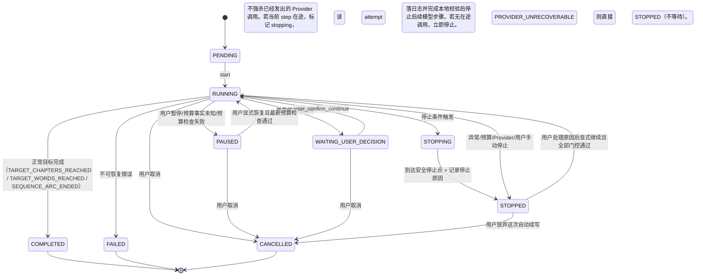
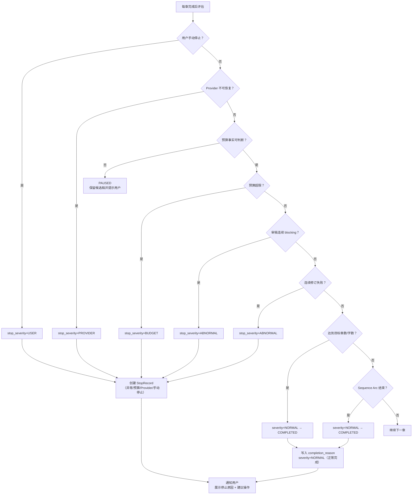

# InkTrace V2.0-P2-04 自动续写队列详细设计

版本：v1.3 / P2 模块级详细设计冻结版（“接着写”作者入口已同步）
状态：冻结生效
所属阶段：InkTrace V2.0 P2-S1
设计范围：受控自动逐章续写队列系统

依据文档：

- `docs/01_requirements/InkTrace-V2.0-需求规格说明书.md`（R-AI-DRAFT-05）
- `docs/02_architecture/InkTrace-V2.0-P2-架构设计说明书.md`（§4.2）
- `docs/03_design/InkTrace-V2.0-P2-01-多章续写详细设计.md`
- `docs/03_design/InkTrace-V2.0-P1-02-AgentWorkflow详细设计.md`
- `docs/03_design/V2/InkTrace-V2.0-P0-02-AIJobSystem详细设计.md`
- `docs/03_design/InkTrace-V2.0-P2-09-成本看板详细设计.md`（v1.3）
- `docs/03_design/InkTrace-V2.0-P2-11-API与前端集成边界详细设计.md`（v2.5）

说明：本文档冻结自动续写队列子系统设计。**自动续写队列是多章续写（P2-01）的封装层，增加逐章确认编排和 9 重停止条件；每章候选稿就绪后必须等待真实用户确认，不存在连续候选自动推进模式**。AutoQueue、`auto-queues` 等名称仅用于代码和接口；面向作者的固定名称为“接着写”。v1.3 在不新增领域状态、错误码或持久化字段的前提下，增加作者可选的一句话写作意图。本文档不写代码、不修改源码、不生成数据库迁移。

---

## 一、文档定位与设计范围

### 1.1 文档定位

本文档是 InkTrace V2.0-P2 的第四篇模块级详细设计文档，覆盖受控自动逐章续写队列子系统。

P2-04 是 P2-S1 中最复杂的子系统。它在多章续写（P2-01）基础上增加：
- 逐章确认编排（每章候选稿就绪后固定等待真实用户确认是否继续）。
- 9 重停止条件统一评估。
- 成本预算集成。
- 单一逐章确认模式；不提供连续候选自动推进开关。

**P2-01 与 P2-04 的职责边界（冻结）**：

| 职责 | P2-01（多章续写） | P2-04（自动队列） |
|---|---|---|
| 单章生成 | ✅ 负责（委托 P1 AgentWorkflow） | ❌ 不直接生成 |
| 章间状态推进 | ✅ 负责（InterChapterStateUpdater） | ❌ 不直接操作 |
| 逐章确认推进 | ✅ 提供 advance API | ✅ 仅在真实 `confirm-continue` 后调用 P2-01 advance |
| 停止条件评估 | ❌ | ✅ 9 重条件统一评估 |
| 预算管理 | ❌ | ✅ 成本追踪 + 超限停止 |
| 队列历史/恢复 | ❌ | ✅ AutoQueueRun 持久化 + 重启恢复 |
| 连续候选自动推进 | ❌ | ❌ 禁止 |
| 前端队列面板 | ❌ | ✅ AutoQueuePanel |

P2-04 的价值是统一逐章确认、停止条件、预算、队列历史、受控恢复/继续和队列面板。

### 1.2 设计范围

本模块覆盖：

- AutoQueueConfig / AutoQueueRun / AutoQueueStopRecord 领域模型。
- StopCondition 枚举与 StopConditionEvaluator 评估器。
- AutoContinuationQueueService 编排服务。
- 单一逐章确认编排。
- 队列暂停 / 恢复 / 停止行为。
- 与多章续写（P2-01）的集成。
- Repository 接口与持久化。
- API 端点。
- 前端面板。
- 测试策略与安全红线。

### 1.3 不覆盖范围

- 单章 AgentWorkflow 内部细节（属于 P1-02）。
- 多章续写编排细节（属于 P2-01，本模块在其之上封装）。
- 成本计算（属于 P2-09 成本看板）。
- Citation Link / Style DNA。

---

## 二、领域模型

### 2.1 章间推进模式（冻结）

P2-04 只有逐章确认一种模式，不定义 `AutoQueueMode`，也不接受 `queue_mode` 配置。每章候选稿完成后固定进入 `WAITING_USER_DECISION`；只有真实用户 `confirm-continue` 才能推进下一章。

### 2.2 AutoQueueStatus 枚举

```python
class AutoQueueStatus(StrEnum):
    PENDING = "pending"
    RUNNING = "running"
    PAUSED = "paused"
    STOPPING = "stopping"         # 正在停止（等待当前在途安全 step 收口）
    STOPPED = "stopped"           # 已停止（含停止原因）
    WAITING_USER_DECISION = "waiting_user_decision"  # 与 P2-01 MultiChapterStatus 对齐；等待真实用户确认是否继续
    COMPLETED = "completed"       # 全部完成
    FAILED = "failed"
    CANCELLED = "cancelled"
```

### 2.3 StopCondition 枚举

```python
class StopCondition(StrEnum):
    TARGET_CHAPTERS_REACHED = "target_chapters_reached"
    TARGET_WORDS_REACHED = "target_words_reached"
    SEQUENCE_ARC_ENDED = "sequence_arc_ended"
    BLOCKING_REVIEW_CONSECUTIVE = "blocking_review_consecutive"
    FORESHADOW_PREMATURE_REVEAL = "foreshadow_premature_reveal"
    CONSECUTIVE_REVISION_FAILURE = "consecutive_revision_failure"
    BUDGET_EXCEEDED = "budget_exceeded"
    PROVIDER_UNRECOVERABLE = "provider_unrecoverable"
    USER_MANUAL_STOP = "user_manual_stop"
```

### 2.4 StopSeverity 枚举

```python
class StopSeverity(StrEnum):
    NORMAL = "normal"       # 正常终止（达到章数/字数/剧情结束）
    ABNORMAL = "abnormal"   # 异常中断（审稿 blocking/伏笔揭示/修订失败）
    BUDGET = "budget"       # 预算中断
    PROVIDER = "provider"   # Provider 不可用
    USER = "user"           # 用户手动停止
```

### 2.5 AutoQueueConfig

| 字段 | 类型 | 说明 |
|---|---|---|
| config_id | str | 配置 ID，格式 `aqc_{uuid_hex_12}` |
| work_id | str | 作品 ID |
| target_chapters | int | 目标章数（0=不限）。【冻结启动校验】至少一个正常停止条件必须启用：target_chapters>0、target_word_count>0、stop_at_sequence_end=true，或 `stop_on_budget_exceeded=true 且 budget_limit_tokens>0`。全部未启用时拒绝启动 |
| target_word_count | int | 目标字数（0=不限） |
| stop_at_sequence_end | bool | Sequence Arc 结束时停止（可配置） |
| stop_on_blocking_review | bool | 审稿连续 blocking 时停止（可配置） |
| max_consecutive_blocking | int | 连续 blocking 章数阈值（默认 2） |
| stop_on_budget_exceeded | bool | 超预算停止（可配置） |
| budget_alert_threshold | Decimal | 提醒比例，默认 `0.8`，取值 `(0, 1]`；只影响提醒，不改变停止阈值 |
| max_consecutive_revision_failures | int | 连续修订失败阈值（默认 3，P2-04 预留） |
| stop_on_foreshadow_premature | bool | 伏笔提前揭示停止（可配置，默认 true） |
| budget_limit_tokens | int | Token 预算上限（0=不限） |
| config_revision | int | 乐观并发版本，从 1 递增；预算和其他队列配置在同一次保存中原子更新 |
| enabled | bool | 是否启用 |
| created_at | str | 创建时间 |
| updated_at | str | 更新时间 |

**停止条件可配置性（冻结）**：
- **强制（不可关闭）**：`USER_MANUAL_STOP`、`PROVIDER_UNRECOVERABLE`
- **可配置**：`stop_at_sequence_end`、`stop_on_blocking_review`、`stop_on_budget_exceeded`、`stop_on_foreshadow_premature`
- **预留（P2-04 当前不触发）**：`CONSECUTIVE_REVISION_FAILURE`
- `stop_on_budget_exceeded=false` 时，`budget_limit_tokens` 只保留用户上次填写值，不参与启动条件或门控；关闭预算保护必须走 P2-09 的显式用户确认、幂等与审计流程。

### 2.6 AutoQueueRun

| 字段 | 类型 | 说明 |
|---|---|---|
| run_id | str | 运行 ID，格式 `aqr_{uuid_hex_12}` |
| config_id | str | 关联配置 |
| work_id | str | 作品 ID |
| multi_chapter_session_id | str | 关联 P2-01 MultiChapterSession |
| status | AutoQueueStatus | 运行状态 |
| generated_count | int | 已生成 CandidateDraft 的章节数（不要求 apply）。applied_count 如需统计必须单独字段 |
| total_word_count | int | 已生成总字数 |
| consumed_tokens | int | 展示用投影缓存；只可由 `LLMCallLog` 中相同 `run_id` 的已知用量重算，不是预算事实源，BudgetGate 不得直接信任或由调用方累加 |
| budget_policy_snapshot_json | dict | 本次运行使用的预算快照：`current` 保存 limit/threshold/enabled/config_revision/captured_at，`history` 保存显式恢复时替换过的旧快照；禁止在运行中静默漂移 |
| current_stop_evaluation | dict | 最近一次停止条件评估结果 |
| stop_record | AutoQueueStopRecord | 当前停止记录；RUNNING 时为空 |
| stop_record_history | list[AutoQueueStopRecord] | 历次停止记录，只追加不覆盖 |
| resume_allowed | bool | 当前 STOPPED 是否仍可恢复；用户放弃/归档后为 false |
| current_candidate_story_state | dict | 候选 StoryState 快照冗余。**MultiChapterSession.candidate_story_state 是章间候选状态的权威源**；此字段仅队列层快照副本，用于状态面板展示和停止条件评估，不作为正式状态源。AutoQueue 层不独立修改 |
| queue_state_snapshots | list[dict] | 章间状态快照历史 |
| consecutive_blocking_count | int | 连续 blocking 章数 |
| consecutive_revision_failure_count | int | 连续修订失败次数 |
| error_code | str | 错误码 |
| error_message | str | 错误信息 |
| request_id | str | 请求 ID |
| trace_id | str | 追踪 ID |
| created_at | str | 创建时间 |
| updated_at | str | 更新时间 |
| started_at | str | 启动时间 |
| stopped_at | str | 停止时间 |
| finished_at | str | 完成时间 |

### 2.7 AutoQueueStopRecord

| 字段 | 类型 | 说明 |
|---|---|---|
| stop_reason | StopCondition | 停止条件 |
| stop_record_id | str | 唯一 ID，格式 `aqs_{uuid_hex_12}`；用于幂等归档 |
| stop_severity | StopSeverity | 严重程度 |
| stop_context | dict | 停止上下文（当前章数、字数、触发条件详情） |
| stopped_at | str | 停止时间 |
| user_action_required | bool | 是否需要用户处理 |
| suggested_action | str | 建议操作（"调整预算"/"处理冲突"/"手动继续"等） |

---

## 三、服务接口

### 3.1 执行模型：后台 Task + 持久化状态恢复（冻结）

自动续写队列可能运行数十分钟，不阻塞 HTTP。采用 **后台异步 Task + 持久化状态 + 服务重启可恢复** 模式。

**统一逐章确认模式**：
```
POST /start → 创建 AutoQueueRun + AIJob → 启动后台 Task → HTTP 202 返回 run_id
后台 Task：_run_chapter_loop → 每章完成后 status=WAITING_USER_DECISION，Task 自挂起
POST /confirm-continue → API 层唤醒 Task，继续 _run_chapter_loop
服务重启：status=WAITING_USER_DECISION 的 run 保持等待态，不重新挂载 Task，
          只有新的真实用户 confirm-continue 才创建后续调度
```

**Task 状态机（内存 + 持久化双写）**：
- 每次状态变化 → 先写 AutoQueueRun 到数据库 → 再推进内存 Task。
- 服务重启后以数据库状态为权威源，内存 Task 重新挂载。

### 3.2 AutoContinuationQueueService

```python
class AutoContinuationQueueService:
    """P2-04 是 P2-01 的封装层，不直接生成单章、不直接调用 AgentOrchestrator。
       单章编排全部委托给 P2-01 MultiChapterContinuationService。"""
    def __init__(
        self,
        *,
        config_repository: AutoQueueConfigRepository,              # 新增
        run_repository: AutoQueueRunRepository,                    # 新增
        multi_chapter_service: MultiChapterContinuationService,    # 复用 P2-01
        stop_evaluator: StopConditionEvaluator,                    # 新增
        budget_gate_service: BudgetGateService,                   # 必需，P2-09 Application Service
        job_service: AIJobService,                                 # 复用 P0
        trace_service: AgentTraceService | None,                   # 复用 P1
    ) -> None: ...
    # 【冻结】不在 P2-04 中直接依赖 agent_orchestrator / story_state_service。
    # P2-04 通过 multi_chapter_service 间接使用它们。

    # ── 生命周期 ──
    async def start(self, config_id: str, work_id: str,
                    start_chapter_id: str,
                    user_instruction: str,
                    expected_config_revision: int,
                    action: UserActionContext,
                    idempotency_key: str) -> AutoQueueRun: ...
    async def pause_by_user(self, run_id: str,
                            action: UserActionContext,
                            idempotency_key: str) -> AutoQueueRun: ...
    async def resume_by_user(self, run_id: str,
                             expected_config_revision: int,
                             action: UserActionContext,
                             idempotency_key: str) -> AutoQueueRun: ...
    async def recover_running_task(self, run_id: str,
                                   recovery: SystemRecoveryContext) -> AutoQueueRun: ...
    async def stop_by_user(self, run_id: str, *,
                   action: UserActionContext,
                   idempotency_key: str,
                   reason: StopCondition = StopCondition.USER_MANUAL_STOP
                   ) -> AutoQueueRun: ...
    async def cancel_by_user(self, run_id: str, *,
                    action: UserActionContext,
                    idempotency_key: str) -> AutoQueueRun: ...
    # “放弃这次自动续写”：从可取消状态进入 CANCELLED，resume_allowed=false；
    # 只结束运行，不删除任何 CandidateDraft、停止历史或用量事实。
    async def get_status(self, run_id: str) -> AutoQueueRun: ...

    # ── 唯一逐章确认回调 ──
    async def user_confirm_continue(self, run_id: str,
                                    action: UserActionContext,
                                    idempotency_key: str) -> AutoQueueRun: ...
    # 【冻结】用户确认当前章后继续。内部调用 P2-01 的 advance_to_next_chapter，
    # 然后恢复后台 Task 继续 _run_chapter_loop。
    # 职责边界：当自动续写队列运行时，前端只调用此方法，不直接调 P2-01 的 advance。
    # 如果用户单独使用多章续写（不通过队列），才直接调 P2-01 的 advance。

    # ── 内部 ──
    async def _run_chapter_loop(self, run: AutoQueueRun) -> AutoQueueRun: ...
    async def _evaluate_stop_conditions(self, run: AutoQueueRun,
                                        last_review_result) -> StopEvaluationResult: ...
```

`UserActionContext` 复用 P0/P1 语义，至少含 `caller_type=user_action`、`user_action=true`、非空 user_id 和 action；`SystemRecoveryContext` 固定 `caller_type=system_maintenance`、`reason=service_restarted`，且没有 user_action 权限。Application Service 自身必须复核上下文，不能只依赖 Presentation。

**作者写作意图契约（冻结）**：

1. `user_instruction` 是作者本次点击“写一章给我看”时可选的一句话，去除首尾空白后允许为空，最长 60 个字符；超长由 Presentation 请求校验返回既有 HTTP 422 校验响应，不新增领域错误码。
2. Presentation 只接收最终文本。界面的三项快捷选择只是可编辑的白话预填，不新增枚举、状态或第二套 API；作者手写内容以输入框最终值为准。
3. Application Service 将该值传给既有 P2-01 `MultiChapterContinuationService.start(user_instruction=...)`，不得在 AutoQueueConfig、AutoQueueRun 或数据库中新增重复字段；该续写会话仍是意图事实源。
4. 该值属于敏感创作内容。日志、Trace、审计回执、后台任务载荷不得记录完整文本；确有诊断需要时只允许记录长度、摘要哈希或既有安全引用，不得记录完整 Prompt、ContextPack 或候选稿。
5. 空值表示“沿着当前正文自然接着写”，不降低 DirectionSelection、PlanConfirmation、HumanReviewGate、MemoryReviewGate 或 ConflictGuard 的任何要求。

**预算接入规则（冻结）**：

1. `start()` 先由 `BudgetGateService` 对当前 AutoQueueConfig 做准入判断；`gate.allowed=true`（包括 normal/warning）才创建并启动运行，同时写入 `budget_policy_snapshot_json.current`。block/indeterminate 不启动。
2. 每一次真实模型调用仍必须经过 P2-09 的统一 `GuardedLLMExecutor`，并携带 `LLMCallScope.run_id`。队列层检查不能替代逐调用检查。
3. 运行中 `GuardedLLMExecutionResult.after_gate` 确定超限时，进入 `BUDGET_EXCEEDED` 停止流程：当前已发出的 attempt 先完成权威日志与本地校验，校验通过可保留其 CandidateDraft，但不得再调用本章 Reviewer/修订或下一章 Provider。用量未知或预算检查失败时，只进入 `PAUSED`，同样禁止后续 Provider 调用，不得伪装成超限或继续放行。
4. 用户显式恢复因预算暂停/停止的队列时，请求携带用户当前看到的 `expected_config_revision`；服务按该 revision 重新检查，再在生命周期 UoW 内复核 revision 未变，才把新策略设为 `current`、旧策略追加到 `history` 并恢复。revision 冲突或检查未通过都保持原 PAUSED/STOPPED，不采用新快照、不自动重试。
5. 服务重启只调用 `recover_running_task()`：仅接受持久化状态原为 RUNNING 的 run，沿用已捕获快照并重新门控；它不是新的 user_action，不能恢复 PAUSED/STOPPED。用户恢复只调用 `resume_by_user()`。
6. AutoQueueConfig 的预算字段与其他配置字段由 P2-09 `CostControlMutationUnitOfWorkPort` 在一个 SQLite 事务内保存，不允许两个 Service 分步覆盖。

### 3.3 StopConditionEvaluator

```python
class StopConditionEvaluator:
    def __init__(
        self,
        *,
        plot_arc_repository: PlotArcRepository,       # 复用 P1（检查 Sequence Arc 状态）
        foreshadow_repository: ForeshadowRepository,  # 复用 V1.1（检查伏笔状态）
    ) -> None: ...

    async def evaluate(
        self,
        run: AutoQueueRun,
        config: AutoQueueConfig,
        last_review_result: AIReviewResult | None,
        budget_gate_result: BudgetGateResult,
    ) -> StopEvaluationResult:
        """
        按优先级评估所有停止条件，返回第一个触发的条件。
        评估顺序：
        1. 用户手动停止（立即响应）
        2. Provider 不可恢复（last_review_result 中无有效输出 + provider_error）
        3. 预算状态（只读取已由 Application 层算好的 budget_gate_result）
        4. 审稿连续 blocking（last_review_result.review_issues）
        5. 连续修订失败（run.consecutive_revision_failure_count >= threshold）
        6. 伏笔提前揭示（foreshadow_repository 查询：任何 status=planted
           且揭示阶段在后续章节的伏笔，在候选稿中被标记为 revealed）
        7. 达到目标章数/字数（run.generated_count / run.total_word_count）
        8. Sequence Arc 结束（plot_arc_repository 查询 SequenceArc.status）

        【冻结】伏笔提前揭示的数据来源与判断方式：
        采用方案 B——StopConditionEvaluator 读取已有结构化数据，不重新调用模型。
        数据来源优先级：
        1. CitationLink 中 source_type=foreshadow 的引用（P2-02 已校验）
        2. ReviewReport 中已标记的 foreshadow issue（P1 Reviewer 输出）
        3. ForeshadowRepository 中的 planted_chapter / revealed_status
        不直接扫描候选稿正文做 NLP 语义判断——避免 StopConditionEvaluator 变重。
        不依赖 P1 Reviewer Agent 的 AIReviewResult（避免修改 P1 冻结设计）。

        【冻结】Evaluator 不访问 CostQueryPort/Repository/Provider，也不计算价格。
        先检查 `BudgetGateResult.results`：任一适用预算为 determined+exceeded，
        即映射 BUDGET_EXCEEDED（即使另一预算 indeterminate）；只有没有确定超限、
        但存在 indeterminate 时，才返回 should_pause=True、should_stop=False、condition=None。
        """
```

### 3.4 StopEvaluationResult

```python
class StopEvaluationResult:
    should_stop: bool
    should_pause: bool = False
    condition: StopCondition | None
    severity: StopSeverity | None
    reason: str
    user_action_required: bool
    suggested_action: str
```

### 3.5 逐章确认编排

**唯一模式（方案 A）**：

```python
async def _run_chapter_loop(self, run):
    while not self._is_complete(run):
        # 1. 生成当前章（复用 P2-01 单章逻辑）
        chapter_result = await self._generate_single_chapter(run)
        # 2. 评估停止条件
        eval_result = await self._evaluate_stop_conditions(run, chapter_result.review)
        if eval_result.should_pause:
            await self._handle_budget_pause(run, eval_result)
            return
        if eval_result.should_stop:
            await self._handle_stop(run, eval_result)
            break
        # 3. 暂停，等待用户确认
        run.status = AutoQueueStatus.WAITING_USER_DECISION
        await self._save(run)
        return  # 等待 user_confirm_continue 回调
```

编排**底线**：
- apply 始终必须 user_action（逐章走 HumanReviewGate）。
- 章间 StoryState 更新仅为 candidate state。
- blocking 后必须停止或暂停，不能推进下一章。
- 预算事实未知或检查失败时必须暂停；此类暂停不创建 `BUDGET_EXCEEDED` StopRecord。

---

## 四、状态机

### 4.1 AutoQueueRun 状态机



`STOPPED` 是“有停止记录、默认不再推进”的可恢复状态，不是不可逆终态。仅用户处理原因后显式继续、重新通过预算/冲突/Provider 等对应门控时可回到 RUNNING；系统/Agent 不得自动恢复。`COMPLETED/FAILED/CANCELLED` 才是不可恢复终态。

恢复同一 run 时，在一个 Repository/UoW 事务内按 stop_record_id 把当前 stop_record 幂等追加到 `stop_record_history`，随后清空 current stop_record/stopped_at、设置 resume_allowed=true 并转 RUNNING。相同 Idempotency-Key 重放不得重复追加。用户选择“放弃这次自动续写”时转 CANCELLED、resume_allowed=false；历史停止记录永久保留到该 run 按 retention 规则整体归档。

创建 StopRecord 时，预算、用户手动停止、已由用户处理的 blocking/伏笔冲突可设 `resume_allowed=true`；`PROVIDER_UNRECOVERABLE` 与不可修复失败固定 false。`resume_by_user` 必须同时校验该字段和对应问题已处理。

**AutoQueueRun ↔ MultiChapterSession 状态映射（冻结）**：

| MultiChapterSession.status | AutoQueueRun.status | 说明 |
|---|---|---|
| `PENDING` | `PENDING` | 队列未启动 |
| `RUNNING` | `RUNNING` | 队列运行中 |
| `WAITING_USER_DECISION` | `WAITING_USER_DECISION` | 等待真实用户确认是否继续（两处状态名统一） |
| `BLOCKED` | `STOPPING` → `STOPPED` | P2-01 blocking → 队列停止（不自动恢复） |
| `COMPLETED` | `COMPLETED` | 全部章节完成 |
| `PARTIAL_SUCCESS` | `STOPPED` | 部分完成 = 队列停止 |
| `FAILED` | `FAILED` | 全部失败 |
| `CANCELLED` | `CANCELLED` | 用户取消 |

**章间推进（冻结）**：P2-01 与 P2-04 每章都保持 `WAITING_USER_DECISION`。P2-04 只有在收到真实 `caller_type=user_action`、`user_action=true` 的 `confirm-continue` 后才调用 P2-01 advance；Agent、workflow、system 或服务重启不得代替用户调用。

**STOPPING 阶段行为矩阵（冻结）**：

| 停止条件 | STOPPING 阶段行为 | 说明 |
|---|---|---|
| `USER_MANUAL_STOP` | 立即标记 STOPPING，若当前 AgentStep 支持取消则请求取消；否则等待当前 step 返回后停止后续推进 | 温和停止，不强杀 Provider 调用。已生成的候选稿全部保留。与 P2-01 取消策略一致 |
| `PROVIDER_UNRECOVERABLE` | 立即中止，不重试 | auth_failed / quota_exceeded 等不可恢复错误 |
| `BUDGET_EXCEEDED` | 等当前已在途 Provider attempt 落权威日志并完成本地校验后立即停止；禁止本章后续 Reviewer/修订和下一章调用 | 已消费用量不可回收；若本次输出有效则保留 CandidateDraft/result_ref，不把已完成 attempt 伪装成失败 |
| `BLOCKING_REVIEW_CONSECUTIVE` | 等当前章审稿结果出来后停止 | 需要审稿结果来确认是否连续 blocking |
| `CONSECUTIVE_REVISION_FAILURE` | 等当前修订轮次结束后停止 | 【预留】P2-04 当前不自动执行 revision loop。`consecutive_revision_failure_count` 字段预留，默认不触发此停止条件。P2 后续扩展自动修订时启用 |
| `FORESHADOW_PREMATURE_REVEAL` | 等当前章审稿完成后停止 | 需要审稿结果 |
| `TARGET_CHAPTERS_REACHED` | 当前章就是最后一章，正常完成后 → COMPLETED | 正常终止，不入 STOPPING。记录 completion_reason |
| `TARGET_WORDS_REACHED` | 等当前章生成完成后 → COMPLETED | 正常终止，不入 STOPPING |
| `SEQUENCE_ARC_ENDED` | 等当前章生成完成后 → COMPLETED | 正常终止，不入 STOPPING |

**STOPPING → STOPPED 退出条件**：到达该停止原因对应的最近安全点后写入 StopRecord。预算超限的安全点是“当前已在途 attempt 落权威日志 + 本地校验/候选隔离完成”，不是“整章审稿/修订完成”；其他依赖审稿结果的停止原因仍按上表等待所需结果。

**预算暂停与恢复（冻结）**：`usage_unknown`、`price_unknown` 或预算查询/审计链路失败不属于九重停止条件，状态保持 `PAUSED`，`current_stop_evaluation` 记录安全错误码和白话提示，不写 StopRecord。只有 `caller_type=user_action`、`user_action=true` 且 `user_action_context.action=resume_auto_queue` 的恢复请求才能采用更新后的预算快照；系统/Agent 不得代替用户恢复。若只是进程重启恢复原 RUNNING 任务，则仍使用原快照并再次检查，不构造 user_action。

### 4.2 停止条件评估流程



---

## 五、Repository 接口与持久化

### 5.1 AutoQueueConfigRepository

```python
class AutoQueueConfigRepository(ABC):
    @abstractmethod
    async def save(self, config: AutoQueueConfig) -> AutoQueueConfig: ...
    @abstractmethod
    async def get_by_work(self, work_id: str) -> AutoQueueConfig | None: ...
    @abstractmethod
    async def get_by_id(self, config_id: str) -> AutoQueueConfig | None: ...
    @abstractmethod
    async def update(self, config: AutoQueueConfig) -> AutoQueueConfig: ...
    @abstractmethod
    async def update_if_revision(self, config: AutoQueueConfig,
                                 expected_revision: int) -> AutoQueueConfig: ...
```

`update_if_revision` 必须由 SQLite Adapter 在同一事务中比较并递增 config_revision。旧 AutoQueue 配置入口通过 `CostControlMutationUnitOfWorkPort.auto_queue_configs` 调用它，并在同一事务写回执；`AutoQueueBudgetPolicyPort` 只供 P2-09 单独修改预算字段，二者不得互相覆盖。

### 5.2 AutoQueueRunRepository

```python
class AutoQueueRunRepository(ABC):
    @abstractmethod
    async def save(self, run: AutoQueueRun) -> AutoQueueRun: ...
    @abstractmethod
    async def get_by_id(self, run_id: str) -> AutoQueueRun | None: ...
    @abstractmethod
    async def get_active(self, work_id: str) -> AutoQueueRun | None: ...
    @abstractmethod
    async def get_history(self, work_id: str, limit: int = 20) -> list[AutoQueueRun]: ...
    @abstractmethod
    async def update(self, run: AutoQueueRun) -> AutoQueueRun: ...
```

### 5.3 持久化表

```sql
CREATE TABLE IF NOT EXISTS auto_queue_configs (
    config_id TEXT PRIMARY KEY,
    work_id TEXT NOT NULL UNIQUE,
    target_chapters INTEGER DEFAULT 0,
    target_word_count INTEGER DEFAULT 0,
    stop_at_sequence_end INTEGER DEFAULT 1,
    stop_on_blocking_review INTEGER DEFAULT 1,
    max_consecutive_blocking INTEGER DEFAULT 2,
    stop_on_budget_exceeded INTEGER DEFAULT 1,
    budget_alert_threshold TEXT NOT NULL DEFAULT '0.8',
    stop_on_foreshadow_premature INTEGER DEFAULT 1,
    max_consecutive_revision_failures INTEGER DEFAULT 3,
    budget_limit_tokens INTEGER DEFAULT 0,
    config_revision INTEGER NOT NULL DEFAULT 1,
    enabled INTEGER DEFAULT 1,
    created_at TEXT NOT NULL,
    updated_at TEXT NOT NULL
);

CREATE TABLE IF NOT EXISTS auto_queue_runs (
    run_id TEXT PRIMARY KEY,
    config_id TEXT NOT NULL,
    work_id TEXT NOT NULL,
    multi_chapter_session_id TEXT NOT NULL,
    status TEXT NOT NULL DEFAULT 'pending',
    generated_count INTEGER DEFAULT 0,
    total_word_count INTEGER DEFAULT 0,
    consumed_tokens INTEGER DEFAULT 0,
    budget_policy_snapshot_json TEXT NOT NULL DEFAULT '{"current":null,"history":[]}',
    current_stop_evaluation_json TEXT DEFAULT '{}',
    stop_record_json TEXT DEFAULT '{}',
    stop_record_history_json TEXT NOT NULL DEFAULT '[]',
    resume_allowed INTEGER NOT NULL DEFAULT 1,
    current_candidate_story_state_json TEXT DEFAULT '{}',
    queue_state_snapshots_json TEXT DEFAULT '[]',
    consecutive_blocking_count INTEGER DEFAULT 0,
    consecutive_revision_failure_count INTEGER DEFAULT 0,
    error_code TEXT DEFAULT '',
    error_message TEXT DEFAULT '',
    request_id TEXT DEFAULT '',
    trace_id TEXT DEFAULT '',
    created_at TEXT NOT NULL,
    updated_at TEXT NOT NULL,
    started_at TEXT DEFAULT '',
    stopped_at TEXT DEFAULT '',
    finished_at TEXT DEFAULT ''
);

CREATE INDEX IF NOT EXISTS idx_auto_queue_runs_work
    ON auto_queue_runs(work_id, status);
```

### 5.4 生命周期幂等与原子提交

start/pause/resume/stop/confirm-continue/cancel 使用独立的 AutoQueue 生命周期回执，**不得**借用只服务预算/价格设置的 CostControlMutationReceipt：

```python
@dataclass(frozen=True)
class AutoQueueLifecycleReceipt:
    receipt_id: str
    key_hash: str
    request_fingerprint: str
    operation: str
    work_id: str
    run_id: str
    user_id: str
    trace_id: str
    pre_event_ref: str
    post_event_ref: str | None
    result_snapshot: dict
    audit_status: Literal["completed", "completion_pending"]
    created_at: str
    updated_at: str
    expires_at: str

class AutoQueueLifecycleUnitOfWorkPort(Protocol):
    configs: AutoQueueConfigRepository
    runs: AutoQueueRunRepository
    sessions: MultiChapterSessionRepository
    jobs: AIJobRepositoryPort
    receipts: AutoQueueLifecycleReceiptWriter
    def commit(self) -> None: ...
    def rollback(self) -> None: ...

class AutoQueueLifecycleReceiptWriter(Protocol):
    def get_by_key_hash(self, key_hash: str) -> AutoQueueLifecycleReceipt | None: ...
    def insert_pending(self, receipt: AutoQueueLifecycleReceipt) -> None: ...
    def mark_completed(self, receipt_id: str, post_event_ref: str) -> None: ...
```

```sql
CREATE TABLE IF NOT EXISTS auto_queue_lifecycle_receipts (
    receipt_id TEXT PRIMARY KEY,
    key_hash TEXT NOT NULL UNIQUE,
    request_fingerprint TEXT NOT NULL,
    operation TEXT NOT NULL,
    work_id TEXT NOT NULL,
    run_id TEXT NOT NULL DEFAULT '',
    user_id TEXT NOT NULL,
    trace_id TEXT NOT NULL,
    pre_event_ref TEXT NOT NULL,
    post_event_ref TEXT,
    result_snapshot_json TEXT NOT NULL,
    audit_status TEXT NOT NULL CHECK(audit_status IN ('completed','completion_pending')),
    created_at TEXT NOT NULL,
    updated_at TEXT NOT NULL,
    expires_at TEXT NOT NULL
);
```

- fingerprint 固定包含 operation、work/config/run、规范化请求、user_id，不含 request_id/trace_id/原始 key。
- 同 key+同 fingerprint 返回首次 result_snapshot；同 key+不同 fingerprint 返回 `409 P2_IDEMPOTENCY_CONFLICT`。
- start/resume 请求都携带用户当前看到的 `expected_config_revision`。BudgetGate 只针对该 revision 检查；随后在同一个 SQLite UoW 中通过事务绑定 `configs` Port 再校验 revision。start 原子创建/校验 MultiChapterSession、AIJob、AutoQueueRun、预算快照与 pending receipt；resume 原子替换 run 的预算快照、转换状态与写 pending receipt。revision 已变化返回 `409 P2_AUTO_QUEUE_CONFIG_CONFLICT`：start 不创建任何运行对象，resume 保持原 PAUSED/STOPPED 且不采用快照；客户端刷新配置后由用户再次操作。每次真实 Provider attempt 仍会重新门控，因此事实用量并发变化不会旁路保护。
- pre user_action 审计成功后，confirm-continue 原子推进 session/run 并写 pending receipt；其他生命周期动作原子写 run+pending receipt。事务提交后才可调度后台 Task/Provider。
- P2-01 必须提供使用事务绑定 Session/Job Port 的 advance 内部入口；不得先独立 commit 再补 receipt。任何事务失败全部回滚，不得推进两章或重复创建 run/job。
- 相同 receipt replay 不重新调度已存在 Task；仅在状态仍需挂载且没有活跃内存 Task 时执行幂等挂载检查。
- pre/post AgentTrace 事件使用确定性 event_key；同 `trace_ref + event_key` 且同 payload 幂等返回首次 event_ref，payload 不同冲突。资源事务提交后写 post；再用一个新的短生命周期 UoW 只执行 `mark_completed`。post 或状态收口失败时保留 `completion_pending`，响应返回首次 result snapshot 与 `audit_completion_pending=true`；同 key 重放只补同一个 post/回执状态，不重写 run/session/job/config，也不重复调度。
- 回执至少保留 365 天；result snapshot 与审计不得含正文、Prompt、ContextPack、候选稿、API Key、原始 decision_note 或原始幂等键。

---

## 六、API 设计

### 6.1 路由前缀

`/api/v2/ai/auto-queues`

### 6.2 端点

```
PUT    /api/v2/ai/auto-queues/config
  Request:  { work_id, target_chapters?, target_word_count?,
              stop_at_sequence_end?, stop_on_blocking_review?,
              stop_on_budget_exceeded?, budget_limit_tokens?,
              budget_alert_threshold?, expected_config_revision?,
              caller_type: "user_action", user_action: true,
              user_id, user_action_context,
              confirm_budget_change?: bool, confirm_disable?: bool,
              decision_note?, ... }
  Header:   Idempotency-Key（必填）
  Response: { config, receipt_id, audit_completion_pending }

GET    /api/v2/ai/auto-queues/config/{work_id}
  Response: { config } 或 { config: null }

POST   /api/v2/ai/auto-queues/start
  Request:  { work_id, start_chapter_id, user_instruction?: string(0..60),
              expected_config_revision,
              caller_type: "user_action",
              user_action: true, user_id,
              user_action_context: { action: "start_auto_queue" } }
  Header:   Idempotency-Key（必填）
  Response: { run_id, status, receipt_id, audit_completion_pending }

GET    /api/v2/ai/auto-queues/{run_id}/status
  Response: { run_id, status, generated_count,
              total_word_count, consumed_tokens, stop_record?, resume_allowed,
              latest_result_ref?,
              per_chapter: [...] }

POST   /api/v2/ai/auto-queues/{run_id}/pause
  Request:  { caller_type: "user_action", user_action: true, user_id,
              user_action_context: { action: "pause_auto_queue" } }
  Header:   Idempotency-Key（必填）
  Response: { run_id, status: "paused", receipt_id, audit_completion_pending }

POST   /api/v2/ai/auto-queues/{run_id}/resume
  Request:  { expected_config_revision,
              caller_type: "user_action", user_action: true,
              user_id,
              user_action_context: { action: "resume_auto_queue" } }
  Header:   Idempotency-Key（必填）
  Response: { run_id, status: "running", receipt_id, audit_completion_pending }

POST   /api/v2/ai/auto-queues/{run_id}/stop
  Request:  { caller_type: "user_action", user_action: true, user_id,
              user_action_context: { action: "stop_auto_queue" } }
  Header:   Idempotency-Key（必填）
  Response: { run_id, status: "stopping" | "stopped", stop_record?,
              receipt_id, audit_completion_pending }

POST   /api/v2/ai/auto-queues/{run_id}/cancel
  # 放弃这次自动续写；允许从 PENDING/PAUSED/WAITING_USER_DECISION/STOPPED 进入 CANCELLED。
  Request:  { caller_type: "user_action", user_action: true, user_id,
              user_action_context: { action: "cancel_auto_queue" } }
  Header:   Idempotency-Key（必填）
  Response: { run_id, status: "cancelled", resume_allowed: false,
              receipt_id, audit_completion_pending }

POST   /api/v2/ai/auto-queues/{run_id}/confirm-continue
  # 唯一逐章模式：用户确认当前章后继续。
  # 【冻结】confirm-continue ≠ apply。此端点只推进队列到下一章；
  # 如果用户想把当前候选稿应用到正文，必须先走 CandidateDraft apply API。
  # 【冻结职责边界】队列运行时前端只调此端点；P2-04 内部调 P2-01 advance。
  Request:  { caller_type: "user_action", user_action: true, user_id,
              user_action_context: { action: "confirm_auto_queue_continue" } }
  Header:   Idempotency-Key（必填）
  Response: { run_id, status, next_chapter_index,
              receipt_id, audit_completion_pending }

GET    /api/v2/ai/auto-queues/{work_id}/history
  Response: { runs: [...] }
```

所有用户触发的 start/pause/resume/stop/cancel/confirm-continue 都必须校验 `caller_type=user_action + user_action=true + user_id`；有重放风险的 mutation 必须携带 Idempotency-Key。start/resume 的 `expected_config_revision` 必填，冲突时刷新但不自动启动/恢复。config 请求包含任一预算字段时，`confirm_budget_change=true` 必填；把 `stop_on_budget_exceeded` 从 true 改为 false 时还需 `confirm_disable=true`。不得使用未定义的 `confirm_budget_disable` 别名。cancel 只结束运行并解除 retention 的“可恢复 run”保护，不删除 CandidateDraft、StopRecordHistory 或 LLMCallLog。

---

## 七、前端集成方向

### 7.1 AutoQueuePanel.vue

位于 `RightWorkspacePanel` 的“AI 助手”聚合 Tab。组件和 Store 保留 AutoQueue 内部命名，作者界面固定显示“接着写”，不得出现“队列、Token、Prompt、Session”等技术词。

```
┌──────────────────────────────────────┐
│  接着写                              │
│  说想法 → 写一章 → 你来看 → 再决定 │
│                                      │
│  下一章，你最想看到什么？            │
│  [让冲突更紧张]                      │
│  [让人物关系推进]                    │
│  [把刚才的伏笔接下去]                │
│  [或者写一句你自己的想法……]  0/60  │
│                                      │
│  只会写一份新稿，不会改动你的正文。  │
│  写完先给你看。                      │
│  [写一章给我看]                      │
│  [不用补充，直接接着写]              │
│  ▸ 更多保护设置                      │
└──────────────────────────────────────┘
```

快捷选择预填为以下作者语言，作者可继续编辑：

- 让冲突更紧张：`下一章优先增强当前冲突，让局势更紧张，但不要提前解决核心矛盾。`
- 让人物关系推进：`下一章优先推进当前人物关系，让互动产生清晰变化，但不要改变既定人物性格。`
- 把刚才的伏笔接下去：`下一章优先承接最近出现且尚未解决的伏笔，但不要提前揭示不该揭示的信息。`

目标章节数、篇幅和用量保护收进“更多保护设置”，主路径不要求作者理解或先保存配置；点击主按钮时由现有配置保存与启动编排完成一次提交。候选稿生成后标题显示“新写的一章 · 还没有放进正文”，并进入既有 CandidateDraft 查看/应用/放弃流程。“继续写下一章”与“放进正文”仍是两个独立真实用户操作。

### 7.2 停止通知

队列停止后在面板顶部显示：

```
🛑 队列已停止 — 连续 2 章审稿发现严重冲突
已生成 5 章候选稿，保留在候选稿区。
[查看冲突详情] [继续队列] [放弃队列]
```

预算相关提示只使用作者语言：

- 达到提醒线：“这次自动续写已用了约 40 万 AI 用量，接近你设置的 50 万上限。”
- 确定超限：“这次自动续写已到达你设置的用量上限，已停止继续生成。已有候选稿都保留着。”按钮为“调整上限”“继续保持停止”。
- 暂时无法判断：“现在无法确认这次自动续写用了多少，已先暂停，避免继续增加用量。”按钮为“重试检查”“继续保持暂停”。
- 设置表单以“万 AI 用量”输入和展示，旁注“包括 AI 阅读内容和生成内容，不等于小说字数”；无历史时不猜默认值，优先建议先使用一次或只设置月度金额预算。

---

## 八、测试策略

### 8.1 正向测试

| # | 用例 | 验证点 |
|---|---|---|
| T1 | 逐章确认 | 每章暂停于 WAITING_USER_DECISION，用户确认后继续 |
| T2 | 未确认时禁止推进 | 审稿通过后仍不创建下一章调用 |
| T3 | 达到目标章数正常停止 | stop_reason=target_chapters_reached, severity=NORMAL |
| T4 | Sequence Arc 结束正常停止 | stop_reason=sequence_arc_ended |
| T4a | 作者意图透传 | 0..60 字最终文本原样进入 P2-01 会话；空值可启动 |
| T4b | 敏感文本不落日志 | job payload、Trace、审计回执不含完整 user_instruction |

### 8.2 边界测试

| # | 用例 | 验证点 |
|---|---|---|
| T5 | 连续 2 章 blocking → 停止 | stop_reason=blocking_review_consecutive |
| T6 | 连续修订失败条件预留不触发 | 【冻结】P2-04 当前不自动执行 revision loop。验证 `CONSECUTIVE_REVISION_FAILURE` 不在 StopConditionEvaluator 的活跃条件列表中，`consecutive_revision_failure_count` 字段存在但不触发停止 |
| T7 | 在途 attempt 落日志后确定超限 → 停止 | stop_reason=budget_exceeded；有效输出保留 CandidateDraft/result_ref；Reviewer/修订/下一章 Provider 均未调用 |
| T8 | 用户手动停止 | stop_reason=user_manual_stop |
| T9 | blocking 后禁止推进 | 停止或暂停，且不创建下一章调用 |
| T9A | 用量未知/预算检查失败 | should_pause=true、status=PAUSED、不生成 BUDGET_EXCEEDED StopRecord |
| T9B | 提高上限后显式恢复 | 携带 expected_config_revision；检查与 UoW 复核通过、追加预算快照后才恢复 |
| T9C | start/resume 门控后配置 revision 变化 | 409 P2_AUTO_QUEUE_CONFIG_CONFLICT；start 不创建 session/job/run/receipt，resume 保持 PAUSED/STOPPED 且不换快照；刷新后须用户再次操作 |
| T9D | 生命周期同 key 重放/异指纹 | 同指纹返回首次结果且不重复推进/调度；异指纹 409 |
| T9E | 生命周期 post 审计或 mark_completed 失败 | 首次资源状态保留且 completion_pending；重放只补同一事件/回执状态，不重复改 run |
| T9F | 用户放弃可恢复 STOPPED | cancel 为真实 user_action；run→CANCELLED、resume_allowed=false；候选稿/停止历史/成本事实仍保留 |

### 8.3 安全红线测试

| # | 用例 | 验证点 |
|---|---|---|
| T10 | 队列不自动 apply | 所有 apply 动作必须有 user_action trace |
| T11 | 章间不写正式 StoryState | 验证 story_state_service.update_official 未被调用 |
| T12 | 停止后候选稿全部保留 | 停止后 candidate_draft 不被删除 |
| T13 | Agent 不能调用 confirm-continue | caller_type 校验拒绝 agent 调用 |
| T14 | Agent/system 不能改预算或恢复预算暂停 | 必须真实 user_action + Idempotency-Key；不得伪造 |
| T15 | 每次 Provider 调用带 run_id | GuardedLLMExecutor 收到完整 LLMCallScope，日志可按 run 精确聚合 |

---

## 九、安全边界

| # | 红线 | 本模块加固 |
|---|---|---|
| 1 | 不自动 apply | 自动队列只控制生成节奏，apply 始终 user_action |
| 2 | 章间 StoryState 仅为 candidate | 写入 `current_candidate_story_state`，不调 formal_write |
| 3 | 停止后候选稿保留 | 不丢弃任何已生成的 CandidateDraft |
| 4 | 成本停止后不丢失消费记录 | 写入 AgentTrace 审计事件 |
| 5 | 逐章确认为唯一模式 | 不定义 `queue_mode`，不提供连续推进开关 |
| 6 | Blocking 不可跳过 | `_evaluate_stop_conditions` 在进入 `WAITING_USER_DECISION` 前执行 |

---

## 十、已冻结决策

1. **成本预算数据来源**：P2-04 的预算事实只来自 P2-09 以 SQLite `llm_call_logs` 为权威源的查询投影；`consumed_tokens` 仅为可重建缓存。预算准入统一由必需的 Application `BudgetGateService` 编排，纯 Domain `BudgetGuard` 只做判断，不存在临时或可选旁路。
2. **正常完成 vs 异常停止**：`TARGET_CHAPTERS_REACHED` / `TARGET_WORDS_REACHED` / `SEQUENCE_ARC_ENDED` 属正常完成条件，最终状态为 `COMPLETED`。它们在 `stop_record_json` 中记录 `severity=NORMAL` 的 completion reason，不视为异常中断。
3. **队列停止后允许从停止点继续**：用户处理停止原因后可选择“继续队列”；预算原因的继续必须重新检查并显式采用最新预算快照。
4. **AutoQueue 预算唯一源**：单次自动续写的 `budget_limit_tokens`、`budget_alert_threshold`、启停状态和 revision 只保存在 AutoQueueConfig；`cost_budgets` 不再建立重复 auto_queue 记录。

## 十一、已收口交互项

1. AutoQueuePanel 固定展示“逐章确认”；不提供连续候选模式开关或“无需每章确认”文案。

---

## 附录：代码改动面

### 新增文件

```
application/services/ai/auto_queue_service.py
application/services/ai/stop_condition_evaluator.py
application/services/ai/budget_gate_service.py                  # P2-09 统一预算编排
application/services/ai/guarded_llm_executor.py                 # P2-09 所有生产调用统一入口
domain/services/ai/budget_guard.py                              # P2-09 纯领域判断
domain/repositories/ai/auto_queue_config_repository.py
domain/repositories/ai/auto_queue_run_repository.py
domain/repositories/ai/auto_queue_lifecycle_uow_port.py
infrastructure/persistence/sqlite_auto_queue_config_repo.py
infrastructure/persistence/sqlite_auto_queue_run_repo.py
infrastructure/persistence/sqlite_auto_queue_lifecycle_uow.py
presentation/api/routers/v2/ai/auto_queues.py
tests/ai/test_auto_queue_service.py
tests/ai/test_stop_condition_evaluator.py
tests/ai/test_auto_queue_lifecycle_idempotency.py
```

### 需修改文件

```
domain/entities/ai/models.py   # 追加 AutoQueueConfig, AutoQueueRun, 枚举等
presentation/api/app.py        # 注册 auto-queues 路由
application/services/ai/agent_runtime_service.py  # 仅注入统一 GuardedLLMExecutor/LLMCallScope，不改门控语义
```

### 不可修改文件

```
application/services/ai/agent_workflow.py
application/services/ai/tool_facade.py
application/services/v1/*
```

---

## 十二、变更记录

1. 同步 P2-09 v1.3，预算门控由“可选增强”改为生产调用必经路径。
2. 冻结 AutoQueueConfig 预算提醒比例、revision 与 AutoQueueRun 启动/恢复快照。
3. 冻结确定超限 stop、事实未知 pause 的不同状态语义。
4. 冻结预算配置原子写、真实 user_action、幂等和审计边界。
5. 用户可见文案统一为“AI 用量”，隐藏 token/blocking 等技术词。
6. v1.2 同步 P2 架构 v2.8 方案 A：删除 continuous 模式、`AutoQueueMode`、`queue_mode` 持久化/API 字段和前端切换入口；每章固定等待真实用户 `confirm-continue`。
7. v1.3 将作者入口固定为“接着写”，增加 0..60 字可选写作意图并复用 P2-01 会话事实源；未新增状态、错误码、持久化字段或自动 apply 能力。
