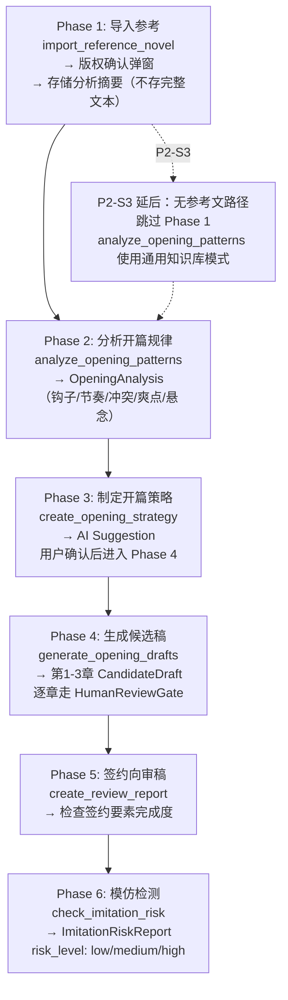

# InkTrace V2.0-P2-06 Opening Agent 详细设计

版本：v1.3 / P2 模块级详细设计候选冻结版（三次修订）
状态：候选冻结（三次修订）
所属阶段：InkTrace V2.0 P2-S2
设计范围：签约向开篇助手（Opening Agent）

依据文档：

- `docs/01_requirements/InkTrace-V2.0-需求规格说明书.md`（R-AI-ENH-02）
- `docs/02_architecture/InkTrace-V2.0-P2-架构设计说明书.md`（§4.6）
- `docs/03_design/InkTrace-V2.0-P1-01-AgentRuntime详细设计.md`
- `docs/03_design/InkTrace-V2.0-P1-03-五Agent职责与编排详细设计.md`

说明：Opening Agent 是 P2 唯一新增的 Agent 类型，复用 P1 Agent Runtime (PPAO) + Tool Facade。本文档不写代码、不修改源码、不生成数据库迁移。

**v1.3 修订记录（2026-06-09）：**
1. §4.2 + §8：AIJob.context.reference_text 标记为 sensitive field，明确禁止出现在 API response、AgentTrace、LLMCallLog、日志中。P2-06 不允许任何 API 返回 reference_text。（问题 1）
2. §6.4 覆盖策略补充：P2-S2 采用方案 A（每 work 单套记录），明确级联规则——重新分析覆盖旧记录，已生成 CandidateDraft 保留不删。（问题 2+4）
3. §7 API 对齐：`GET /strategies` → `GET /strategy`（单数），与 work_id UNIQUE 约束一致。Repository 保持 `get_by_work → 单对象`。（问题 3）
4. §4.1 Tool 表：create_opening_strategy 内部链路补充 `ModelRouter(Kimi, opening_strategy_planner) → OutputValidator → OpeningStrategy(pending_confirm)`。（问题 5）
5. §4.1 + §4.2：check_imitation_risk 明确不依赖完整参考文本——基于 OpeningAnalysis 结构化数据 + CandidateDraft 文本。reference_text 生命周期延长至覆盖整个 OPENING_WORKFLOW Job（Phase 1-6）。（问题 6）
6. §7 新增 §7.0 统一 Workflow 模型：import-reference 创建 AIJob 并返回 `job_id`，后续阶段通过 job_id 共享 AIJob.context。单独 API 若创建新 AgentSession 必须继承同一 context。（问题 7）
7. §8 安全边界新增 3 条：sensitive field 约束、生命周期延长至 Phase 6、统一 Job 模型。

**v1.2 修订记录（2026-06-09）：**
1. §4.1 Tool 表新增 model_role 列，拆分单一 `opening_agent` 为 `opening_analyzer` / `opening_strategy_planner` / `opening_writer` / `opening_risk_checker`（问题 9）。
2. §4.1 补充 `import_reference_novel` 命名说明："import" 非入库全文，仅导入到临时上下文（问题 3）。
3. §4.3 新增 generate_opening_drafts 内部流程：必须走 ContextPack → WritingTask → Writer(DeepSeek) → CandidateDraftService，不绕过 P0/P1 基础设施（问题 8）。
4. §4.4 新增 CandidateDraft 归属规则：每章独立 CandidateDraft + metadata 标记 + 已有正式章节不覆盖（问题 7）。
5. §4.5 新增 Phase 5 审稿委托规则：Opening Agent 调用 ReviewService/Reviewer Agent，不自评自写（问题 12）。
6. §5.1 OpeningAnalysis 扩展：reference_novels 子结构新增 reference_id、source_text_hash、analysis_scope、analysis_summary（问题 4）。
7. §5.2 OpeningStrategy 扩展：新增 target_audience、genre_positioning、opening_hook、first_three_chapter_goal、protagonist_entry、conflict_entry、selling_points、forbidden_similarity_notes、status、ai_suggestion_id 共 11 个字段（问题 5）。
8. §5.3 ImitationRiskReport 扩展：新增 risk_score、risk_dimensions、evidence、decision 字段与判定规则（问题 10）。
9. §6.2 OpeningStrategyRepository 新增 reject 方法。
10. §6.4 DDL 更新：三张表全部匹配扩展后模型字段。
11. §7 API 新增 strategy confirm/reject 端点、强化版权后端校验（`rights_confirmed: bool` 必传）（问题 6+14）。
12. §8 安全边界新增策略未确认禁止生成、审稿独立性约束。
13. §9 测试策略新增 T6-T11 共 6 个用例。

**v1.1 修订记录（2026-06-09）：**
1. "五阶段"→"六阶段"全文统一（标题、1.1、1.2、3.2、3.3、T1）。
2. §5.1 OpeningAnalysis 移除 `opening_strategy` 字段，新增 §5.2 OpeningStrategy 独立模型（strategy_id、confirmed_at 等），generate API 改为传 `strategy_id` 而非 `strategy_text`。
3. §4.2 import_reference_novel 流程修正：完整参考文本存储方案从"内存传入"改为写入 `AIJob.context.reference_text`（临时），Job 完成后强制清理。安全边界表新增"参考文本生命周期"约束行。
4. 新增第六章"Repository 接口与持久化"：OpeningAnalysisRepository / OpeningStrategyRepository / ImitationRiskReportRepository ABC 接口 + 三张表的 DDL。后续章节编号顺延（API→七、安全边界→八、测试→九、代码→十）。
5. §5.1 OpeningAnalysis 新增 `copyright_confirmed_at` 字段；安全边界表明确：已有值则跳过弹窗，无值则强制确认。
6. §3.3 流程图新增"P2-S3 延后：无参考文路径"分支；T2 测试用例标注为 P2-S3 延后项。
7. §10 代码改动面更新：补充 OpeningStrategyRepository、ImitationRiskReportRepository、SQLite 实现、数据库迁移、AIJob 完成钩子。

---

## 一、文档定位与设计范围

### 1.1 文档定位

P2-06 覆盖 Opening Agent 的完整设计：六阶段 Workflow、Agent 权限矩阵、Tool 注册、OpeningAnalysis/OpeningStrategy/ImitationRiskReport 领域模型。

### 1.2 设计范围

- Opening Agent 在 P1 Agent Runtime 中的注册（AgentType.OPENING）。
- 六阶段 Workflow 定义（导入参考→分析开篇规律→制定开篇策略→生成候选稿→签约审稿→模仿检测）。
- 新增 Tool 列表与内部调用链。
- AgentPermissionPolicy 扩展。
- 版权确认弹窗机制。
- ImitationRiskReport 风险等级。
- Repository 接口。

---

## 二、Agent 注册

### 2.1 AgentType 新增

```python
class AgentType(StrEnum):
    MEMORY = "memory"
    PLANNER = "planner"
    WRITER = "writer"
    REVIEWER = "reviewer"
    REWRITER = "rewriter"
    OPENING = "opening"    # P2 新增
```

### 2.2 AgentExecutionProfile

```python
OPENING_PROFILE = AgentExecutionProfile(
    agent_type=AgentType.OPENING,
    capabilities=[
        "story_context_read",
        "reference_analysis",
        "opening_strategy_creation",
        "opening_candidate_generation",
        "imitation_risk_check",
    ],
    # model_role 按 Tool 拆分（见 §4.1），不在 Profile 层设置单一值
    # opening_analyzer / opening_strategy_planner → Kimi
    # opening_writer → DeepSeek
    # opening_risk_checker → Kimi
    default_timeout=600,         # 分析阶段耗时较长
    max_retry=2,
    allowed_tool_names=[
        "get_work_outline", "get_chapter_context",
        "get_story_memory", "get_story_state",
        "build_context_pack", "create_writing_task",
        "create_candidate_draft", "create_review_report",
        "import_reference_novel", "analyze_opening_patterns",
        "generate_opening_drafts", "check_imitation_risk",
        "create_opening_strategy",
        "write_agent_trace", "update_ai_job_progress",
        "record_tool_observation",
    ],
    denied_tool_names=[
        "update_official_chapter_content",
        "create_official_chapter_directly",
        "accept_suggestion_as_user",
        "bypass_human_review_gate",
    ],
    side_effect_level="candidate_write",
)
```

---

## 三、Workflow 定义

### 3.1 WorkflowType 新增

```python
class WorkflowType(StrEnum):
    # ... 已有 ...
    OPENING_WORKFLOW = "opening_workflow"  # P2 新增
```

### 3.2 六阶段 Stage 定义

```python
OPENING_STAGES = [
    WorkflowStageName.OPENING_IMPORT_REFERENCE,    # Phase 1
    WorkflowStageName.OPENING_ANALYZE_PATTERNS,    # Phase 2
    WorkflowStageName.OPENING_CREATE_STRATEGY,     # Phase 3
    WorkflowStageName.OPENING_GENERATE_DRAFTS,     # Phase 4
    WorkflowStageName.OPENING_REVIEW,              # Phase 5
    WorkflowStageName.OPENING_IMITATION_CHECK,     # Phase 6
]
```

### 3.3 六阶段流程

**P2-S2 范围**：仅覆盖有参考小说的完整六阶段路径。无参考小说的"通用知识库"路径不在 P2-S2 范围内，规划为 P2-S3 延后项。



---

## 四、新增 Tool 定义

### 4.1 Tool 列表

| Tool | 功能 | 内部调用链 | model_role |
|---|---|---|---|
| `import_reference_novel` | 导入参考小说到临时上下文 | OpeningAgentService → 版权确认 → AIJob.context 暂存 | `opening_analyzer` (Kimi) |
| `analyze_opening_patterns` | 分析开篇规律 | OpeningAgentService → ModelRouter(Kimi) → OpeningAnalysis | `opening_analyzer` (Kimi) |
| `generate_opening_drafts` | 生成前三章候选稿 | OpeningAgentService → ContextPack → WritingTask → Writer(DeepSeek) → CandidateDraftService | `opening_writer` (DeepSeek) |
| `check_imitation_risk` | 过度模仿检测 | OpeningAgentService → ModelRouter(Kimi) → ImitationRiskReport。不依赖完整参考文本——基于 OpeningAnalysis 结构化模式 + reference_novels 摘要 + forbidden_similarity_notes + CandidateDraft 文本 | `opening_risk_checker` (Kimi) |
| `create_opening_strategy` | 制定开篇策略 | OpeningAgentService → ModelRouter(Kimi, opening_strategy_planner) → OutputValidator → OpeningStrategy(pending_confirm) → AISuggestionService（前端确认入口） | `opening_strategy_planner` (Kimi) |

**命名原则**：所有 Tool 名表达业务用例，不表达"调用模型"（如 `call_opening_model` 禁止）。

**`import_reference_novel` 命名说明**：此处的 "import" 不是入库全文——完整文本不写入任何业务表，仅导入到当前 Job 的临时上下文（`AIJob.context`），Job 结束后清除。"导入"指的是将参考文本导入分析流程，而非持久化存储。

**model_role 拆分**：Opening Agent 不再使用单一 `model_role="opening_agent"`。每个 Tool 根据任务性质路由到不同角色——分析类用 Kimi，写作类用 DeepSeek。这避免了单一路由在实现层的混乱。

### 4.2 import_reference_novel 流程

```python
async def import_reference_novel(self, *, work_id, title, chapters_text):
    # 1. 版权确认：检查 OpeningAnalysis.copyright_confirmed_at
    #    - 已有值 → 跳过弹窗
    #    - 无值 → 前端弹窗"请确认您有权使用这些文本"，确认后填入
    # 2. 存储分析摘要（章节数、字数、开篇结构）到 opening_analyses 表
    # 3. 【冻结】完整文本写入 AIJob.context.reference_text
    #    - 标记为 sensitive field
    #    - 不得出现在 API response、AgentTrace、LLMCallLog、错误日志、调试日志中
    #    - Job 生命周期内有效，Phase 2-6 同一 Job 内任意阶段可访问
    #    - 不写入专用表，不落盘到文件系统
    # 4. Job 完成后（成功/失败/取消）在 finally 钩子中强制清理 reference_text
    # 5. 写入 AgentTrace：opening_reference_imported（不含 reference_text 内容）
```

**⚠️ 临时存储说明**：
- Opening Agent 是异步 Workflow，`import_reference_novel`（Phase 1）和 `analyze_opening_patterns`（Phase 2）是两次独立的 Tool 调用，中间可能间隔数秒。FastAPI 异步环境下不保证同一进程内存，"内存传入"不可行。
- 选择方案 A：写入 `AIJob.context`（已有 JSON 列），不在进程内存中持有大段文本。
- **关键安全约束（冻结）**：
  - `AIJob.context.reference_text` 为 **sensitive field**。
  - **禁止出现在**：API response、AgentTrace、LLMCallLog、错误日志、调试日志、status/get 接口返回中。
  - `reference_text` 生命周期覆盖整个 `OPENING_WORKFLOW` Job（Phase 1-6），直到 Phase 6 完成后在 **finally 钩子**中强制清理，不得残留。
  - 若单独 API（analyze/generate/check）创建新 AgentSession，必须继承同一个 AIJob context，否则不得依赖 reference_text。
  - 清理由 AgentRuntime 在 Job 生命周期钩子中强制执行。
  - P2-06 不允许任何 API 返回 reference_text 内容。

### 4.3 generate_opening_drafts 内部流程

**不绕过 P0/P1 已有的 ContextPack 和 WritingTask。Opening Agent 不能直接把 prompt 发给 ModelRouter 后保存。**

```python
async def generate_opening_drafts(self, *, work_id, analysis_id, strategy_id):
    # 1. 校验 OpeningStrategy.status == "confirmed"，否则拒绝
    # 2. 对 chapter_no ∈ [1, 2, 3] 逐个执行：
    for chapter_no in [1, 2, 3]:
        # 2a. build_context_pack(work_id, opening_strategy, target_chapter_no)
        #     → ContextPack 包含：当前作品设定、已生成的前几章候选稿、开篇策略
        # 2b. create_writing_task(
        #         goal="opening_draft",
        #         target_chapter_no=chapter_no,
        #         strategy_id=strategy_id,
        #         opening_phase=true
        #     )
        # 2c. WritingGenerationService (Writer Agent) 生成文本
        #     使用 model_role="opening_writer" → DeepSeek
        # 2d. CandidateDraftService 保存候选稿：
        #     - metadata.opening_phase = true
        #     - metadata.opening_chapter_no = chapter_no
        #     - metadata.strategy_id = strategy_id
        #     - metadata.analysis_id = analysis_id
        # 2e. 走 HumanReviewGate（与 P1 CandidateDraft 相同流程）
    # 3. 写入 AgentTrace：opening_drafts_generated
```

### 4.4 CandidateDraft 归属规则（冻结）

| 规则 | 说明 |
|------|------|
| 每章一个 CandidateDraft | chapter_no=1/2/3 各一个独立候选稿 |
| 不创建正式 Chapter | Opening Agent 只生成 CandidateDraft，不调用 `create_official_chapter` |
| metadata 标记来源 | `opening_phase=true`, `opening_chapter_no=1/2/3`, `strategy_id`, `analysis_id` |
| 已有正式章节的处理 | 若作品已存在正式第 1-3 章，Opening Agent 只生成候选稿，不覆盖现有章节。用户在 HumanReviewGate 中决定是否 apply |
| apply 流程 | 用户应用候选稿时走标准 CandidateDraft apply / HumanReviewGate（P1 已有），不新增特殊路径 |

### 4.5 Phase 5 审稿委托（冻结）

Phase 5（`create_review_report`）涉及对生成稿的质量评审。**Opening Agent 不自己扮演 Reviewer——它编排 Reviewer Agent 来执行评审。**

```
create_review_report Tool 内部流程：
  1. OpeningAgentService 调用 ReviewService（已有 P1 服务）
  2. ReviewService 使用 Reviewer Agent（已有 P1 Agent，model_role=reviewer → Kimi）
  3. 评审维度：签约要素完成度（钩子强度、人物出场、冲突引入、章尾悬念）
  4. ReviewReport 写入 AgentTrace：opening_review_completed
  5. Opening Agent 只读取评审结果，不做二次评审
```

**设计动机**：Opening Agent 不应自评自写。Reviewer Agent 是独立角色，Opening Agent 作为编排者委托其评审，保持评审独立性。

---

## 五、领域模型

### 5.1 OpeningAnalysis

Phase 2（`analyze_opening_patterns`）产出。**不包含开篇策略**——策略由 Phase 3 单独产出。

| 字段 | 类型 | 说明 |
|---|---|---|
| analysis_id | str | 主键 `oa_{uuid_hex_12}` |
| work_id | str | 作品 ID |
| reference_novels | list[dict] | 参考小说摘要，结构见下方 |
| hook_patterns | list[str] | 钩子模式 |
| rhythm_patterns | dict | 节奏模式 `{avg_chapter_length, hook_density, pacing_curve}` |
| conflict_patterns | list[str] | 冲突引入模式 |
| satisfaction_points | list[str] | 爽点分布 |
| chapter_end_hooks | list[str] | 章尾悬念模式 |
| analysis_scope | str | 分析范围说明（如"分析前 3 章共 15,000 字"） |
| analysis_summary | str | 一句话分析摘要（≤200 字符） |
| copyright_confirmed_at | str \| None | 版权确认时间戳（ISO 8601），null=未确认 |
| created_at | str | 创建时间 |

**reference_novels 子结构**（每条参考小说记录）：

```python
{
    "reference_id": str,        # ref_{uuid_hex_8}，唯一标识一次参考分析
    "title": str,               # 参考小说标题
    "chapter_count": int,       # 分析章节数
    "word_count": int,          # 分析总字数
    "source_text_hash": str,    # SHA-256 原文哈希（不存原文，但可校验"分析的是哪份文本"）
    "analysis_scope": str,      # 分析范围（如"第1-3章"）
    "analysis_summary": str     # 一句话分析摘要
}
```

**设计说明**：`source_text_hash` 保存哈希值不等于保存原文——哈希不可逆推原文，但可用于审计确认"当时的分析基于哪份文本"，在版权争议时有据可查。

### 5.2 OpeningStrategy

Phase 3（`create_opening_strategy`）产出。输出为 AISuggestion，用户确认后写入此模型。**只有 status=confirmed 的策略才能进入 Phase 4 生成候选稿。**

| 字段 | 类型 | 说明 |
|---|---|---|
| strategy_id | str | 主键 `os_{uuid_hex_12}` |
| work_id | str | 作品 ID |
| analysis_id | str | 关联的 OpeningAnalysis ID |
| target_audience | str | 目标读者画像 |
| genre_positioning | str | 类型定位（如"都市悬疑+轻喜剧"） |
| opening_hook | str | 开篇钩子策略（前 500 字抓读者） |
| first_three_chapter_goal | str | 前三章目标：读完第 3 章时读者应产生什么感受/认知 |
| protagonist_entry | str | 主角登场方式与时机 |
| conflict_entry | str | 核心冲突引入时机与方式 |
| selling_points | list[str] | 签约卖点列表 |
| forbidden_similarity_notes | str | 必须避免的模仿点（基于参考分析） |
| strategy_text | str | 策略全文（Markdown，上述字段的结构化文本） |
| status | str | `pending_confirm` / `confirmed` / `rejected` |
| ai_suggestion_id | str | 关联的 AI Suggestion ID |
| confirmed_at | str \| None | 用户确认时间戳 |
| created_at | str | 创建时间 |
| updated_at | str | 更新时间 |

**状态流转**：
```
AI 生成 → pending_confirm
用户确认 → confirmed  （可进入 Phase 4）
用户拒绝 → rejected   （可要求 AI 重新生成）
重新创建策略 → 旧记录被覆盖（UNIQUE + UPSERT，不保留历史）
```

**权威数据源**：`generate_opening_drafts` API 传 `strategy_id`（非 strategy_text），后端从 `OpeningStrategy` 读取。前端不得直接将 strategy_text 字符串塞给 generate API。

### 5.3 ImitationRiskReport

Phase 6（`check_imitation_risk`）产出。**risk_level=high 不阻止 CandidateDraft 保存，但前端必须显著警告，用户 apply 前二次确认。**

| 字段 | 类型 | 说明 |
|---|---|---|
| report_id | str | 主键 `ir_{uuid_hex_12}` |
| work_id | str | 作品 ID |
| risk_level | str | `low` / `medium` / `high` |
| risk_score | float | 0.0-1.0，综合风险评分 |
| risk_dimensions | dict | 多维度评分，见下方 |
| similar_patterns | list[str] | 相似模式自然语言描述 |
| evidence | list[dict] | 证据列表 `[{dimension, description, severity}]` |
| suggestion | str | 修改建议（Markdown） |
| decision | str | `use_as_is` / `modify_and_use` / `rewrite` |
| created_at | str | 创建时间 |

**risk_dimensions 子结构**：
```python
{
    "plot_structure_similarity": float,    # 情节结构相似度 0-1
    "character_setup_similarity": float,   # 人物设定相似度 0-1
    "scene_sequence_similarity": float,    # 场景序列相似度 0-1
    "wording_similarity": float,           # 措辞相似度 0-1
    "hook_similarity": float               # 钩子/爽点套路相似度 0-1
}
```

**decision 判定规则**：
| risk_level | risk_score | decision | 前端行为 |
|---|---|---|---|
| `low` | < 0.3 | `use_as_is` | 无特殊提示 |
| `medium` | 0.3-0.6 | `modify_and_use` | 黄色提示"建议修改后使用" |
| `high` | > 0.6 | `rewrite` | 红色警告，apply 前二次确认弹窗 |

---

## 六、Repository 接口与持久化

### 6.1 OpeningAnalysisRepository

```python
class OpeningAnalysisRepository(ABC):
    @abstractmethod
    async def save(self, analysis: OpeningAnalysis) -> OpeningAnalysis: ...
    # Upsert：analysis_id 存在则 UPDATE，不存在则 INSERT

    @abstractmethod
    async def get_by_work(self, work_id: str) -> OpeningAnalysis | None: ...

    @abstractmethod
    async def get_by_id(self, analysis_id: str) -> OpeningAnalysis | None: ...

    @abstractmethod
    async def update_copyright_confirmed(
        self, analysis_id: str, confirmed_at: str
    ) -> None: ...
```

### 6.2 OpeningStrategyRepository

```python
class OpeningStrategyRepository(ABC):
    @abstractmethod
    async def save(self, strategy: OpeningStrategy) -> OpeningStrategy: ...

    @abstractmethod
    async def get_by_work(self, work_id: str) -> OpeningStrategy | None: ...

    @abstractmethod
    async def get_by_id(self, strategy_id: str) -> OpeningStrategy | None: ...

    @abstractmethod
    async def confirm(self, strategy_id: str, confirmed_at: str) -> None: ...
    # status: pending_confirm → confirmed

    @abstractmethod
    async def reject(self, strategy_id: str, reason: str | None = None) -> None: ...
    # status: pending_confirm → rejected，记录拒绝原因
```

### 6.3 ImitationRiskReportRepository

```python
class ImitationRiskReportRepository(ABC):
    @abstractmethod
    async def save(self, report: ImitationRiskReport) -> ImitationRiskReport: ...

    @abstractmethod
    async def get_by_work(self, work_id: str) -> ImitationRiskReport | None: ...
```

### 6.4 持久化表 DDL

```sql
-- opening_analyses
CREATE TABLE IF NOT EXISTS opening_analyses (
    analysis_id TEXT PRIMARY KEY,
    work_id TEXT NOT NULL UNIQUE,
    reference_novels TEXT NOT NULL DEFAULT '[]',       -- JSON array of {reference_id,title,...,source_text_hash}
    hook_patterns TEXT NOT NULL DEFAULT '[]',           -- JSON array
    rhythm_patterns TEXT NOT NULL DEFAULT '{}',         -- JSON object
    conflict_patterns TEXT NOT NULL DEFAULT '[]',       -- JSON array
    satisfaction_points TEXT NOT NULL DEFAULT '[]',     -- JSON array
    chapter_end_hooks TEXT NOT NULL DEFAULT '[]',       -- JSON array
    analysis_scope TEXT NOT NULL DEFAULT '',
    analysis_summary TEXT NOT NULL DEFAULT '',
    copyright_confirmed_at TEXT DEFAULT NULL,
    created_at TEXT NOT NULL,
    updated_at TEXT NOT NULL
);
CREATE INDEX IF NOT EXISTS idx_opening_analyses_work ON opening_analyses(work_id);

-- opening_strategies
CREATE TABLE IF NOT EXISTS opening_strategies (
    strategy_id TEXT PRIMARY KEY,
    work_id TEXT NOT NULL UNIQUE,
    analysis_id TEXT NOT NULL,
    target_audience TEXT NOT NULL DEFAULT '',
    genre_positioning TEXT NOT NULL DEFAULT '',
    opening_hook TEXT NOT NULL DEFAULT '',
    first_three_chapter_goal TEXT NOT NULL DEFAULT '',
    protagonist_entry TEXT NOT NULL DEFAULT '',
    conflict_entry TEXT NOT NULL DEFAULT '',
    selling_points TEXT NOT NULL DEFAULT '[]',          -- JSON array
    forbidden_similarity_notes TEXT NOT NULL DEFAULT '',
    strategy_text TEXT NOT NULL DEFAULT '',
    status TEXT NOT NULL DEFAULT 'pending_confirm',     -- pending_confirm / confirmed / rejected
    ai_suggestion_id TEXT DEFAULT '',
    confirmed_at TEXT DEFAULT NULL,
    created_at TEXT NOT NULL,
    updated_at TEXT NOT NULL
);
CREATE INDEX IF NOT EXISTS idx_opening_strategies_work ON opening_strategies(work_id);
CREATE INDEX IF NOT EXISTS idx_opening_strategies_status ON opening_strategies(status);

-- imitation_risk_reports
CREATE TABLE IF NOT EXISTS imitation_risk_reports (
    report_id TEXT PRIMARY KEY,
    work_id TEXT NOT NULL UNIQUE,
    risk_level TEXT NOT NULL DEFAULT 'low',             -- low / medium / high
    risk_score REAL NOT NULL DEFAULT 0.0,               -- 0.0-1.0
    risk_dimensions TEXT NOT NULL DEFAULT '{}',          -- JSON object
    similar_patterns TEXT NOT NULL DEFAULT '[]',        -- JSON array
    evidence TEXT NOT NULL DEFAULT '[]',                 -- JSON array of {dimension,description,severity}
    suggestion TEXT NOT NULL DEFAULT '',
    decision TEXT NOT NULL DEFAULT 'use_as_is',         -- use_as_is / modify_and_use / rewrite
    created_at TEXT NOT NULL
);
CREATE INDEX IF NOT EXISTS idx_imitation_risk_reports_work ON imitation_risk_reports(work_id);
```

**覆盖策略（冻结）**：P2-S2 采用方案 A——每个 work_id 仅保留一套最新记录。`work_id` 上均设 UNIQUE 约束。

**重新导入/重新分析时的级联规则**：

| 操作 | 行为 |
|------|------|
| 重新导入参考（新 import-reference） | 新 OpeningAnalysis **覆盖**旧记录（`analysis_id` 更新为新 ID）。旧 `analysis_id` 不再有效 |
| 重新分析（新 analyze） | 同上，覆盖 OpeningAnalysis |
| 重新创建策略（新 create_opening_strategy） | 新 OpeningStrategy 覆盖旧记录（`strategy_id` 更新为新 ID），不保留历史版本 |
| 重新生成候选稿（新 generate） | 新 CandidateDraft 不覆盖旧候选稿——两者并行存在，通过 `opening_chapter_no` + `created_at` 区分代次 |
| ImitationRiskReport 覆盖 | 新报告覆盖旧报告（`report_id` 更新为新 ID） |

**已生成 CandidateDraft 的保留规则**：
- 重新分析/重新生成时，已生成的 CandidateDraft **不删除**，metadata 仍指向当时的 `analysis_id` / `strategy_id`。
- 用户可在 HumanReviewGate 中查看历史候选稿并手动清理。

---

## 七、API 设计

### 7.0 统一 Workflow 模型（冻结）

Opening Workflow 六阶段运行在**同一个 AIJob** 内。所有阶段共享 `AIJob.context`（含 `reference_text`）。

```
用户触发 → 前端调用 POST /import-reference
         → 后端创建 AIJob（OPENING_WORKFLOW），返回 { job_id, analysis_id }
         → 后续 analyze / generate / check 使用同一个 job_id
         → Job 内各阶段自动推进，前端轮询 GET /status
         → Job 完成/失败/取消后 finally 钩子清理 reference_text
```

**关键约束**：`import-reference` 必须创建或绑定一个 `opening_job_id`。Response 返回 `{ analysis_id, job_id }`。后续所有阶段通过 `job_id` 共享同一个 AIJob context。任何单独 API 若创建新 AgentSession，必须继承同一个 AIJob context 或不得依赖 `reference_text`。

### 7.1 端点

```
POST   /api/v2/ai/opening/import-reference
  Request:  { work_id, title, chapters_text[],
              rights_confirmed: bool,                     # 必须为 true
              rights_confirmation_text_version: str }     # 版权声明文本版本号
  Note:     前端弹窗"请确认您有权使用这些文本"→用户勾选确认→提交。
            后端必须校验 rights_confirmed=true，否则返回 400 rights_not_confirmed。
            后端记录 server_confirmed_at 时间戳到 OpeningAnalysis.copyright_confirmed_at。
            前端弹窗只是交互，后端校验才是安全边界。
            后端创建 AIJob（OPENING_WORKFLOW），完整文本写入 AIJob.context.reference_text。
  Response: { analysis_id, job_id }

POST   /api/v2/ai/opening/analyze
  Request:  { work_id, analysis_id, job_id }
  Note:     job_id 必须与 import-reference 返回的一致。Phase 2-6 共享同一 AIJob.context。
  Response: { session_id }  # AgentSession ID，后续轮询

GET    /api/v2/ai/opening/{work_id}/strategy
  Response: { strategy: { strategy_id, status, created_at, ... } | null }
  Note:     每个 work_id 仅保留一套策略（DDL UNIQUE 约束），返回单对象而非列表

POST   /api/v2/ai/opening/strategies/{strategy_id}/confirm
  Request:  {}  # 无额外参数
  Note:     将 OpeningStrategy.status 从 pending_confirm → confirmed。
            只有 confirmed 的策略才能进入 Phase 4 generate。
  Response: { strategy_id, status: "confirmed", confirmed_at }
  或 409 strategy_not_in_pending_state

POST   /api/v2/ai/opening/strategies/{strategy_id}/reject
  Request:  { reason?: str }  # 拒绝原因（可选，用于要求 AI 重新生成）
  Note:     将 OpeningStrategy.status 从 pending_confirm → rejected。
            前端可引导用户填写拒绝原因，触发 AI 重新生成策略。
  Response: { strategy_id, status: "rejected" }

POST   /api/v2/ai/opening/generate
  Request:  { work_id, analysis_id, strategy_id, job_id }
  Note:     后端校验 OpeningStrategy.status=confirmed，否则返回 400 strategy_not_confirmed。
            strategy_id 为权威数据源——后端从 OpeningStrategy 读取策略内容，
            前端不得直接将 strategy_text 字符串塞给 generate API。
            job_id 继承自 import-reference，共享 AIJob.context。
  Response: { session_id }

GET    /api/v2/ai/opening/{work_id}/status
  Response: { phase, status, candidate_draft_ids[], risk_report? }

GET    /api/v2/ai/opening/{work_id}/analysis
  Response: { analysis, strategy, risk_report }

GET    /api/v2/ai/opening/{work_id}/drafts
  Response: { drafts: [{ chapter_no, candidate_draft_id, status }] }
```

---

## 八、安全边界

| 约束 | 实施 |
|---|---|
| 版权确认强制 | 前端弹窗+后端强制校验：API Request 必须包含 `rights_confirmed: true`，后端校验未通过返回 400 `rights_not_confirmed`。前端弹窗只是交互，后端校验才是安全边界 |
| 参考文本不持久化完整内容 | 只存分析摘要到 `opening_analyses` 表。完整文本写入 `AIJob.context.reference_text`（临时） |
| reference_text 为 sensitive field | 禁止出现在 API response、AgentTrace、LLMCallLog、错误日志、调试日志中。P2-06 不允许任何 API 返回 reference_text |
| 参考文本生命周期 | 覆盖整个 OPENING_WORKFLOW Job（Phase 1-6），Job 完成/失败/取消后由 AgentRuntime finally 钩子强制删除，不得残留 |
| 统一 Job 模型 | import-reference 创建 AIJob，analyze/generate/check 使用同一 job_id。单独 API 若创建新 AgentSession 必须继承同一 AIJob.context |
| 策略未确认禁止生成 | `generate_opening_drafts` 后端校验 OpeningStrategy.status=confirmed，否则返回 400 `strategy_not_confirmed` |
| 不自动创建正式章节 | generate_opening_drafts → CandidateDraft，不创建 Chapter。已有正式章节时不覆盖 |
| 风险 high 时标注 | ImitationRiskReport.risk_level=high → 前端显著警告，apply 前二次确认弹窗 |
| formal_write 禁止 | Opening Agent 无任何 formal_write Tool |
| 审稿独立性 | Phase 5 调用 ReviewService/Reviewer Agent，Opening Agent 不自评自写 |

---

## 九、测试策略

| # | 用例 | 验证点 |
|---|---|---|
| T1 | 正常导入→分析→生成 | 六阶段全部完成，返回 3 个 CandidateDraft |
| T2 | 无参考文→通用规则 | 【P2-S3 延后】analyze_opening_patterns 基于通用知识库（无参考文路径不在 P2-S2 范围） |
| T3 | 版权未确认 | import_reference_novel 拒绝执行 |
| T4 | 过度模仿 high | ImitationRiskReport.risk_level=high，前端显示警告 |
| T5 | Agent 不能 formal_write | 权限矩阵单元测试验证 |
| T6 | 策略未确认时 generate 拒绝 | OpeningStrategy.status≠confirmed → generate_opening_drafts 返回 400 strategy_not_confirmed |
| T7 | 版权未确认后端拒绝 | import-reference 请求 rights_confirmed=false → 后端返回 400 rights_not_confirmed |
| T8 | CandidateDraft metadata 标记 | 生成的 CandidateDraft 包含 opening_phase=true, opening_chapter_no, strategy_id, analysis_id |
| T9 | 已有正式章节不覆盖 | 作品已有第 1 章正式 Chapter → Opening Agent 只生成候选稿，不修改正式章节 |
| T10 | ImitationRiskReport high 不阻止保存 | risk_level=high → CandidateDraft 正常保存 → 前端显示红色警告 |
| T11 | Phase 5 委托 Reviewer | create_review_report 内部调用 ReviewService → Reviewer Agent 评审 → Opening Agent 不自评 |

---

## 十、代码改动面

```
新增：
  application/services/ai/opening_agent_service.py
  domain/repositories/ai/opening_analysis_repository.py
  domain/repositories/ai/opening_strategy_repository.py
  domain/repositories/ai/imitation_risk_report_repository.py
  infrastructure/persistence/sqlite_opening_analysis_repo.py
  infrastructure/persistence/sqlite_opening_strategy_repo.py
  infrastructure/persistence/sqlite_imitation_risk_report_repo.py
  presentation/api/routers/v2/ai/opening.py
  frontend/src/components/workspace/OpeningAgentWizard.vue

数据库迁移：
  新增表 opening_analyses, opening_strategies, imitation_risk_reports

修改：
  domain/entities/ai/models.py      # AgentType.OPENING, WorkflowType.OPENING_WORKFLOW, OpeningAnalysis, OpeningStrategy, ImitationRiskReport
  application/services/ai/agent_runtime_service.py  # 注册 OPENING profile
  application/services/ai/agent_workflow.py         # 注册 OPENING_WORKFLOW stages
  application/services/ai/tool_facade.py            # 注册 5 个新 Tool + 权限行
  application/services/ai/ai_job_service.py         # Job 完成钩子：清理 AIJob.context.reference_text
  presentation/api/app.py           # 注册 opening 路由
```
