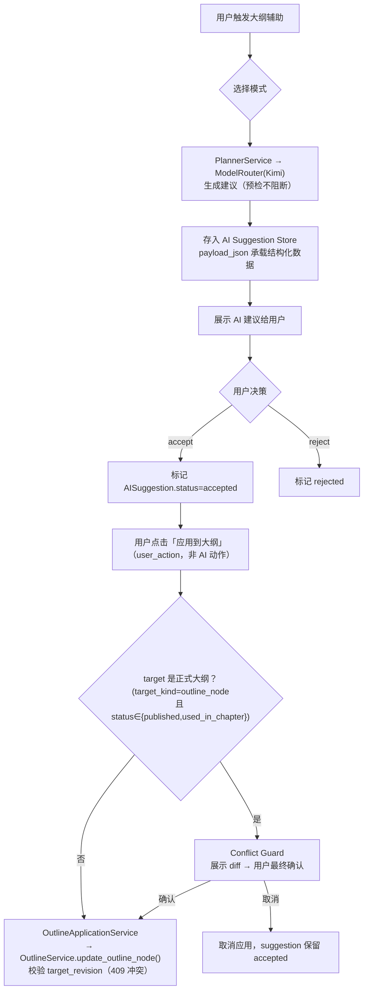

# InkTrace V2.0-P2-07 大纲辅助详细设计

版本：v1.2 / P2 模块级详细设计候选冻结版（二次修订）
状态：候选冻结（二次修订）
所属阶段：InkTrace V2.0 P2-S2
设计范围：AI 辅助大纲润色、扩写、章节细纲建议

依据文档：

- `docs/01_requirements/InkTrace-V2.0-需求规格说明书.md`（R-AI-ENH-03）
- `docs/02_architecture/InkTrace-V2.0-P2-架构设计说明书.md`（§4.7）
- `docs/03_design/InkTrace-V2.0-P1-07-AISuggestion详细设计.md`
- `docs/03_design/InkTrace-V2.0-P1-08-ConflictGuard详细设计.md`

说明：大纲辅助不是独立 Agent，通过 Planner Agent 扩展 + AI Suggestion Store + Conflict Guard 实现。本文档不写代码、不修改源码。

**v1.2 修订记录（2026-06-09）：**
1. §1.3 新增"正式大纲对象边界"：明确复用 V1.1 WritingAsset/OutlineNode，P2-07 不新增正式大纲主表。（问题 1）
2. §4 新增"AI Suggestion Payload 结构化定义"：四种 suggestion 的 payload 字段完整定义。（问题 2）
3. §3 重写流程图与调用链：accept ≠ 自动写正式大纲，需 user_action apply 走 OutlineApplicationService；Agent 不得调用 apply。（问题 3）
4. §2.2 Conflict Guard 触发逻辑修正：从 generate 阶段预检改为 apply 阶段阻断——生成可展示，apply 时强制冲突检测。（问题 4）
5. §1.2 + §2.1 WritingTask 建议明确状态流：AISuggestion → 用户确认 → WritingTaskService 创建 WritingTask(pending_confirm)，确认后才变为 pending 供 Writer 消费。（问题 5）
6. §2.1 明确服务调用链：OutlineAssistService → PlannerService → ModelRouter，不直接调用 ModelRouter。（问题 6）
7. §2.3 新增 prompt_key / model_role / OutputValidator 定义表。（问题 7）
8. §2.1 异步策略优化：润色/扩写同步 ≤30s，章节细纲/WritingTask 异步 AIJob。（问题 8）
9. §1.4 新增持久化说明：不新增业务表，复用 ai_suggestions + writing_tasks。（问题 9）
10. §5 API 请求扩展 target_kind / target_id / target_revision 字段。（问题 10）
11. §6 测试策略扩展至 T1-T11。（问题 11）

**v1.1 修订记录（2026-06-09）：** 见版本历史简表（略，以 v1.2 为准）。

---

## 一、文档定位与设计范围

### 1.1 文档定位

P2-07 覆盖 AI 辅助大纲润色、扩写、章节细纲建议、WritingTask 建议的完整设计。所有输出进入 AI Suggestion Store，**AI 不直接修改正式大纲**——用户必须通过显式 apply 操作（user_action）触发写入。

### 1.2 四种辅助模式

| 模式 | 触发方式 | 输出目标 | 审批流 |
|---|---|---|---|
| 大纲润色 | 用户选中大纲文本 → "AI 润色" | AI Suggestion (outline_polish) | accept/reject → user_action apply |
| 大纲扩写 | 用户在大纲节点 → "AI 扩写" | AI Suggestion (outline_expand) | accept/reject → user_action apply |
| 章节细纲 | 用户在章节 → "生成细纲" | AI Suggestion (chapter_outline_detail) | accept/reject → user_action apply |
| WritingTask 建议 | Planner → "优化 WritingTask" | AI Suggestion (writing_task_suggestion) → 用户确认后 AISuggestionService.accept() 内部创建 WritingTask(pending_confirm) → 用户二次确认 → WritingTask(pending) | accept → 二次确认 → Writer 可消费 |

### 1.3 正式大纲对象边界（冻结）

P2-07 不新增正式大纲主表。复用 V1.1 已有的写作资产体系：

| 对象 | 来源 | 说明 |
|------|------|------|
| OutlineNode | V1.1 WritingAsset（复用） | 大纲节点。字段：outline_node_id, work_id, parent_id, node_type(volume/arc/chapter/scene), title, content, order_index, status(draft/published/used_in_chapter), revision |
| Chapter | V1.1 Chapter（复用） | 章节。章节细纲关联 chapter_id |
| WritingTask | P0/P1 WritingTask（复用） | 写作任务。P2-07 的 WritingTask 建议经用户确认后写入此表 |

**"正式大纲"定义**：`OutlineNode.status ∈ {published, used_in_chapter}` 的节点为正式大纲。其余为草稿或自由文本。

### 1.4 持久化说明（冻结）

- **不新增业务表**。所有 AI 结果存入已有的 `ai_suggestions` 表（`payload_json` 列承载结构化数据）。
- WritingTask 建议经用户确认后，复用 P0/P1 `writing_tasks` 表。
- 大纲节点修改复用 V1.1 WritingAsset 表。

---

## 二、服务接口

### 2.1 OutlineAssistService

**调用链（冻结）**：`OutlineAssistService → PlannerService → ModelRouter`。OutlineAssistService 不直接调用 ModelRouter——通过 PlannerService/Planner Tool 编排，由 Planner 内部使用 ModelRouter。

```python
class OutlineAssistService:
    def __init__(
        self,
        *,
        planner_service,                    # 复用 P1 Planner Agent（编排层，非直接调 LLM）
        ai_suggestion_service,              # 复用 P1
        conflict_guard_service,             # 复用 P1
        ai_job_service,                     # 复用 P0 AIJob
        trace_service,                      # 复用 P1
    ) -> None: ...
    # 注意：不注入 model_router。LLM 调用由 PlannerService 内部管理。

    async def polish_outline(
        self, *,
        work_id: str,
        target_kind: str,                   # "selection" | "outline_node"
        target_id: str | None,              # outline_node_id 或 null
        target_revision: int | None,        # 乐观锁 revision，target_kind=outline_node 时必传
        selected_text: str,
    ) -> str: ...
    # 同步模式（≤30s）：直接调用 PlannerService → ModelRouter(Kimi) 润色
    # → 存入 AISuggestion(type=outline_polish, payload=OutlinePolishPayload)
    # 超时自动转 AIJob 异步

    async def expand_outline(
        self, *,
        work_id: str,
        target_kind: str,                   # "selection" | "outline_node"
        target_id: str | None,
        target_revision: int | None,
        selected_text: str,
        expand_direction: str | None,       # "detail" | "next_level" | "scene"
    ) -> str: ...
    # 同步模式（≤30s），同上

    async def generate_chapter_outline(
        self, *,
        work_id: str,
        chapter_id: str,
        chapter_revision: int,
        goal: str | None,                   # 可选：用户指定的细纲目标
    ) -> str: ...
    # 异步 AIJob 模式：章节细纲调用 LLM 可能耗时 >30s
    # 立即返回 job_id，前端轮询

    async def suggest_writing_task(
        self, *,
        work_id: str,
        chapter_id: str,
        chapter_revision: int,
    ) -> str: ...
    # 异步 AIJob 模式：Planner Agent 生成 WritingTask 建议
    # → 存入 AISuggestion(type=writing_task_suggestion, payload=WritingTaskSuggestionPayload)
    # 用户采纳后 AISuggestionService.accept() 创建 WritingTask(status=pending_confirm)
    # 用户二次确认后 WritingTaskService.confirm() → status=pending（Writer 可消费）
```

**异步策略**：
| 操作 | 模式 | 说明 |
|------|------|------|
| polish_outline | 同步（≤30s），超时转 AIJob | 润色一般较快 |
| expand_outline | 同步（≤30s），超时转 AIJob | 扩写一般较快 |
| generate_chapter_outline | 异步 AIJob | 细纲生成可能耗时 |
| suggest_writing_task | 异步 AIJob | Planner 编排耗时 |

### 2.2 与 Conflict Guard 集成

**两阶段策略（冻结）**：

| 阶段 | 行为 | 说明 |
|------|------|------|
| **生成阶段**（generate） | 做预检，**不阻断**——suggestion 正常存入 Store 并展示 | 即使 target 是正式大纲，用户也应看到 AI 建议 |
| **应用阶段**（apply） | **强制触发** Conflict Guard | 用户点击"应用到大纲"时，检测 target 是否涉及正式大纲节点，是则弹 diff 确认后写入 |

**触发条件（apply 阶段）**：
- `target_kind ∈ {"outline_node", "chapter_outline"}` 且 `OutlineNode.status ∈ {published, used_in_chapter}` → **触发** Conflict Guard
- `target_kind = "selection"` 或 `target_id = null`（自由文本）→ **不触发**
- `OutlineNode.status = "draft"` → **不触发**

```python
# 生成阶段：预检但不阻断
async def polish_outline(self, *, work_id, target_kind, target_id, target_revision, selected_text):
    suggestion = await self._planner_service.generate_polish(...)
    # 预检（仅记录，不阻断）
    if target_kind == "outline_node" and target_id:
        self._precheck_official_outline(target_id)  # 日志记录，不抛异常
    return suggestion

# apply 阶段：由 OutlineApplicationService 执行，强制 Conflict Guard
# （见 §3 调用链）
```

### 2.3 prompt_key / model_role / OutputValidator

| 模式 | prompt_key | model_role | OutputValidator Schema |
|------|-----------|------------|----------------------|
| 大纲润色 | `outline_polish_v1` | `planner` (Kimi) | `outline_polish_schema` |
| 大纲扩写 | `outline_expand_v1` | `planner` (Kimi) | `outline_expand_schema` |
| 章节细纲 | `chapter_outline_detail_v1` | `planner` (Kimi) | `chapter_outline_detail_schema` |
| WritingTask 建议 | `writing_task_suggest_v1` | `planner` (Kimi) | `writing_task_suggestion_schema` |

OutputValidator 校验失败时，沿用 P0 重试策略（max_retry=2）；最终失败不创建 Suggestion，AIJob 标记 failed。

---

## 三、流程



**调用链（冻结）**：

```
用户 apply 操作（user_action，非 Agent 动作）
  → OutlineApplicationService.apply_suggestion(suggestion_id)
     ├─ 1. 校验 suggestion.status == "accepted"
     ├─ 2. 校验 target_kind ≠ "selection" 或 target_id ≠ null，否则返回 400 target_required
     ├─ 3. 校验 target_revision（乐观锁，不一致返回 409）
     ├─ 4. 若 target 是正式大纲 → ConflictGuard.detect_and_record()
     ├─ 5. OutlineService.update_outline_node(target_id, new_content, revision)
     └─ 6. 写入 AgentTrace：outline_suggestion_applied
```

**关键约束**：
- **AI/Agent/Planner 不得调用 apply**。apply 必须走 user_action 门控。
- accept ≠ apply。accept 只是用户认可建议质量，apply 才是写入正式大纲。
- **target_kind=selection 的 suggestion 不允许直接 apply**。调用 apply 时若 `target_kind=selection` 且 `target_id=null`，返回 400 `target_required`。用户必须先选择目标 outline_node 或手动复制文本到大纲编辑区。

---

## 四、AI Suggestion Payload 结构化定义

### 4.1 AISuggestionType 扩展

```python
class AISuggestionType(StrEnum):
    # ... 已有 ...
    OUTLINE_POLISH = "outline_polish"
    OUTLINE_EXPAND = "outline_expand"
    CHAPTER_OUTLINE_DETAIL = "chapter_outline_detail"
    WRITING_TASK_SUGGESTION = "writing_task_suggestion"
```

### 4.2 Payload 定义

所有 payload 存入 `AISuggestion.payload_json`（JSON 列）。每个 payload 均包含 `target_revision`，用于 apply 时的乐观锁校验。

**OutlinePolishPayload**：
```python
{
    "source_text": str,              # 原文
    "polished_text": str,            # 润色后文本
    "diff_summary": str,             # 变更摘要（"优化了3处表达，调整了逻辑顺序"）
    "target_kind": str,              # "selection" | "outline_node"
    "target_id": str | None,         # outline_node_id 或 null
    "target_revision": int | None    # 生成时的节点 revision，apply 时校验
}
```

**OutlineExpandPayload**：
```python
{
    "original_text": str,            # 原文
    "expanded_text": str,            # 扩写后文本
    "expansion_points": list[str],   # 扩写要点（如["增加配角动机", "补充场景描写"]）
    "target_kind": str,              # "selection" | "outline_node"
    "target_id": str | None,         # outline_node_id，统一使用此字段（无单独的 outline_node_id）
    "target_revision": int | None    # 生成时的节点 revision
}
```

**ChapterOutlineDetailPayload**：
```python
{
    "chapter_id": str,               # 目标章节 ID
    "chapter_revision": int,         # 生成时的章节 revision，apply 时校验
    "chapter_goal": str,             # 本章目标
    "scene_beats": list[dict],       # [{beat_no, description, characters_involved, estimated_words}]
    "conflict_points": list[str],    # 冲突点列表
    "ending_hook": str               # 章尾钩子
}
```

**WritingTaskSuggestionPayload**：
```python
{
    "chapter_id": str,
    "chapter_revision": int,         # 生成时的章节 revision
    "task_title": str,
    "task_description": str,
    "target_word_count": int,
    "focus_points": list[str],       # 写作要点
    "suggested_style": str,          # 建议风格
    "context_summary": str           # 上下文摘要
}
```

---

## 五、API 设计

**异步模式 suggestion 生命周期（冻结）**：异步 API 在启动 AIJob 前**先创建** `AISuggestion(status=generating)`，立即返回 `suggestion_id`。AIJob 完成后更新 `payload_json` 和 `status=completed`，失败则 `status=failed`。前端拿到 `suggestion_id` 即可立即轮询，无需等待 Job 创建 suggestion。

```
POST   /api/v2/ai/outline-assist/polish
  Request:  {
              work_id: str,
              target_kind: str,                 # "selection" | "outline_node"
              target_id: str | null,            # outline_node_id，target_kind=outline_node 时必传
              target_revision: int | null,      # 乐观锁，target_kind=outline_node 时必传
              selected_text: str
            }
  Response: { suggestion_id, job_id?, status }
  Note:     同步（≤30s），超时自动转 AIJob 异步，此时返回 job_id。
            status: "completed" → suggestion_id 可直接查询。
            status: "generating" → 前端轮询 GET /api/v2/ai/suggestions/{suggestion_id}
  Poll:     GET /api/v2/ai/suggestions/{suggestion_id}
            Response: { suggestion_id, status, payload: OutlinePolishPayload }

POST   /api/v2/ai/outline-assist/expand
  Request:  {
              work_id: str,
              target_kind: str,
              target_id: str | null,
              target_revision: int | null,
              selected_text: str,
              expand_direction: str | null      # "detail" | "next_level" | "scene"
            }
  Response: { suggestion_id, job_id?, status }
  Poll:     GET /api/v2/ai/suggestions/{suggestion_id}

POST   /api/v2/ai/outline-assist/chapter-outline
  Request:  {
              work_id: str,
              chapter_id: str,
              chapter_revision: int,
              goal: str | null
            }
  Response: { job_id, suggestion_id, status: "generating" }
  Note:     异步 AIJob 模式。
  Poll:     GET /api/v2/ai/suggestions/{suggestion_id}

POST   /api/v2/ai/outline-assist/writing-task
  Request:  {
              work_id: str,
              chapter_id: str,
              chapter_revision: int
            }
  Response: { job_id, suggestion_id, status: "generating" }
  Note:     异步 AIJob 模式。
            用户采纳后 AISuggestionService.accept() 创建 WritingTask(status=pending_confirm)。
            用户二次确认后 WritingTaskService.confirm() → status=pending（Writer 可消费）。
  Poll:     GET /api/v2/ai/suggestions/{suggestion_id}

POST   /api/v2/ai/outline-assist/suggestions/{suggestion_id}/apply
  Request:  { caller_type: str }   # 必须为 "user_action"
  Note:     将已 accepted 的 suggestion 应用到正式大纲。
            后端校验 caller_type，非 "user_action"（如 "agent"/"planner"/"workflow"）返回 403 forbidden。
            校验通过后，OutlineApplicationService 内部校验 target_revision、Conflict Guard、正式大纲写入。
  Response: { success: true }
  或 403 caller_type_forbidden / 409 target_conflict / 400 target_not_accepted / 400 target_required
```

采纳/拒绝走已有 API（`POST /api/v2/ai/suggestions/{id}/accept`、`POST /api/v2/ai/suggestions/{id}/reject`）。apply 是独立端点，与 accept 分离。

---

## 六、测试策略

| # | 用例 | 验证点 |
|---|---|---|
| T1 | 大纲润色正常生成 | 返回优化后文本，存入 AI Suggestion，payload 含 diff_summary |
| T2 | 涉及正式大纲 → apply 时 Conflict Guard | 生成不阻断展示；apply 时触发 Conflict Guard，用户确认后才写入 |
| T3 | 不涉及正式大纲 → apply 不触发 CG | target_kind=selection → 跳过 Conflict Guard |
| T4 | 用户拒绝 → 不写入 | accept=false → 正式大纲不变 |
| T5 | 采纳后 AgentTrace 可追踪 | trace 记录用户 accept + apply 决策 |
| T6 | AI WritingTask 建议需二次确认 | suggest → AISuggestion → accept → WritingTask(pending_confirm) → 用户 confirm → WritingTask(pending) |
| T7 | WritingTask pending_confirm 不被 Writer 消费 | status=pending_confirm 时 Writer 无法获取 → 不会被自动使用 |
| T8 | target_revision 不一致返回 409 | apply 时 revision 不匹配 → 409 target_conflict |
| T9 | OutputValidator schema 失败重试 | schema 校验失败 → 重试 → 最终失败不创建 Suggestion，AIJob failed |
| T10 | Agent/Planner 不能调用 apply | POST /apply 校验 caller_type → caller_type=agent/planner/workflow 返回 403 caller_type_forbidden |
| T12 | target_kind=selection apply 被拒绝 | selection 且 target_id=null → apply 返回 400 target_required |
| T11 | 自由文本润色 accept 不自动写入 | target_kind=selection → accept 仅标记状态，不调用 OutlineService |

---

## 七、代码改动面

```
新增：
  application/services/ai/outline_assist_service.py
  application/services/ai/outline_application_service.py    # apply 门控服务
  presentation/api/routers/v2/ai/outline_assist.py
  domain/validators/outline_suggestion_schemas.py            # 4 个 OutputValidator schema

修改：
  domain/entities/ai/models.py                    # AISuggestionType 追加 4 个枚举值
  domain/entities/ai/suggestion_payloads.py       # 新增 4 个 Payload dataclass
  application/services/ai/ai_suggestion_service.py  # accept()：writing_task_suggestion → 创建 WritingTask(pending_confirm)
  application/services/ai/planner_service.py        # 暴露 generate_outline_* 方法供 OutlineAssistService 调用
  application/services/v1/writing_asset_service.py  # 暴露 update_outline_node() 供 OutlineApplicationService 调用
  application/services/ai/writing_task_service.py   # 新增 confirm_writing_task() 方法
  presentation/api/app.py                         # 注册 outline-assist 路由
```
