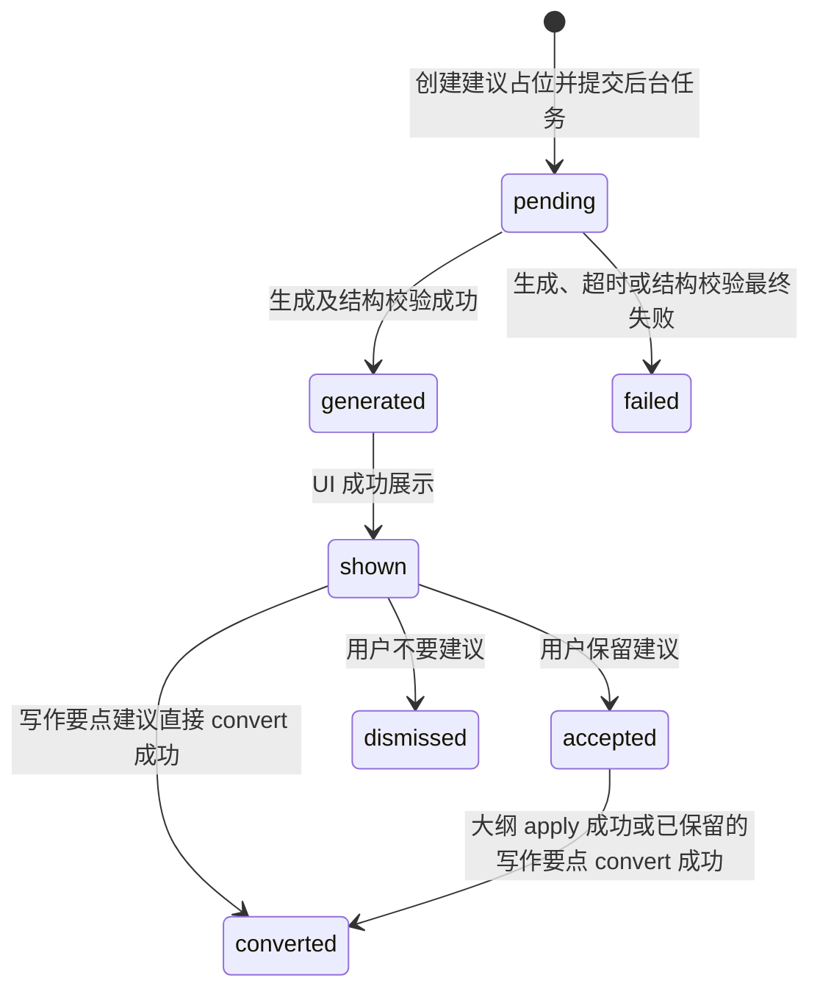

# InkTrace V2.0-P2-07 大纲辅助详细设计

版本：v2.4 / P2 模块级详细设计冻结版（人本化统一口径、可观测性与安全门控边界）
状态：冻结生效
所属阶段：InkTrace V2.0 P2-S2
冻结日期：2026-07-11
设计范围：AI 辅助大纲润色、扩写、章节细纲建议、下一章写作要点建议

依据文档：

- `docs/01_requirements/InkTrace-V2.0-需求规格说明书.md`（R-AI-ENH-03）
- `docs/02_architecture/InkTrace-V2.0-P2-架构设计说明书.md`（§4.7）
- `docs/03_design/InkTrace-V2.0-P1-05-方向推演与章节计划详细设计.md`
- `docs/03_design/InkTrace-V2.0-P1-07-AISuggestion详细设计.md`
- `docs/03_design/InkTrace-V2.0-P1-08-ConflictGuard详细设计.md`
- `docs/03_design/InkTrace-V2.0-P1-11-API与前端集成边界详细设计.md`

本版冻结裁决：

1. 面向普通小说作者，界面只展示四个白话动作，不展示 WritingTask、Agent、Job、Prompt、ContextPack 等技术词。
2. 正式大纲复用 V1.1 已存在的 `WorkOutline` 与 `ChapterOutline`；不新增 `OutlineNode`，不虚构 `published/used_in_chapter` 状态。
3. 所有持久化的 `WorkOutline` / `ChapterOutline` 默认都是受保护的正式资产；AI 结果先进入 AISuggestion，绝不自动覆盖。
4. AISuggestion 完全复用 P1 状态机。生成阶段只使用 `pending → generated/failed`，展示与用户决策继续使用 P1 的 `shown/accepted/dismissed/converted`；禁止新增 `generating/completed/rejected`。
5. `accept` 只把建议标记为 `accepted`，不写正式大纲、不创建 WritingTask。写作要点建议可由用户直接 `convert` 为 `WritingTask(status=pending)`，再由现有 WritingTask 确认入口使其变为 `ready`；不得新增 `pending_confirm`。
6. P2-07 自有 API 共 5 个 POST：4 个生成端点 + 1 个大纲 apply 端点。查询、accept、dismiss、convert 复用 P1 AISuggestion API。
7. apply 强制校验 `caller_type=user_action`、`user_action=true`、非空 `idempotency_key`、`confirm_apply=true`，并使用 `expected_version` 乐观锁。
8. 普通 apply 采用一次明确确认：UI 先展示前后对比，服务端在同一用例内校验版本、写 ConflictGuard 保护记录并保存。只有真实冲突才返回 409 进入冲突处理，任何 HTTP 请求都不得假装挂起等待用户。
9. InkTrace 当前 Local-First 单进程运行形态下，允许在 V1.1 `WritingAssetService` 的作品大纲/章节大纲保存入口增加进程级互斥临界区，使“读取当前版本 → 校验 expected_version → 保存”不可被同进程另一合法写入穿插。该兼容加固不得改变 API、实体、状态、版本递增、`force_override` 或错误码语义，也不得成为绕过 Service 直写 Repository 的理由；多进程部署所需的数据库 CAS 不在 P2-07 范围内。
10. 首次持久化仍保持 V1.1 的 `version=1`。为覆盖首次创建的并发与崩溃恢复歧义，`WritingAssetService` 可提供仅供应用层编排使用的正式大纲存在性与章节归属只读查询：保存入口在进入互斥临界区前记录“调用开始时是否已持久化”，锁内若本调用观察为未持久化、但目标已被并发请求创建，则必须返回既有 `asset_version_conflict`；P2 apply 写前检查点同时记录 `target_was_persisted` 与 `expected_post_write_version`。不得由 P2 服务跨层直读 Repository。
11. P2 apply 调用作品/章节大纲保存入口时，除 `expected_version` 外还必须传入生成基线的 `expected_content_hash`；`WritingAssetService` 在同一个进程级互斥临界区内复核当前完整内容哈希。哈希不匹配仍使用既有 `asset_version_conflict`，不得覆盖；该参数默认 `None`，旧 V1 调用不传时行为不变，`force_override=true` 继续保持既有绕过语义。
12. 四类 Planner 调用必须使用已注册、版本化 Prompt；`PromptRegistry` 缺失或模板缺失时任务失败，禁止退回代码内硬编码 Prompt 后继续冒充原 `prompt_key/version`。
13. 每次模型调用（含结构校验重试和 Provider 失败）必须写 `LLMCallLog`，并向同一 suggestion `trace_id` 严格投影最小 AgentTrace 元数据：prompt key/version、model role、provider/model、schema、request/trace、attempt、token、耗时、status 与安全错误码。模型选择尚未解析时以明确 `unresolved` 表示，token 未知时保存空 usage 对象，不得以空字段伪装齐全。P2 严格模式下 `trace_not_found` 不得被通用 Logger 吞掉。不得记录完整 Prompt、输入大纲、输出建议、ContextPack 或 API Key。
14. 生成开始与成功终态 Trace 是 P2-07 必需检查点；Trace/LLMCallLog 缺失、未注入或写入失败时，AISuggestion 与 AIJob 必须进入 `failed`，不得进入 `generated/completed`。内部稳定错误码为 `P2_OUTLINE_AUDIT_WRITE_FAILED`；不把 error 混入 warning_codes。
15. “设为本章写作计划”（convert）与 WritingTask `pending → ready` 确认都是高风险真实用户门；必须在写任务/改状态前成功写入包含 user_id 的 `user_decision_recorded` 审计事件。两条链路都必须把资源 ID、user_id、规范化 decision_note 组成请求指纹并与幂等键绑定；同 key 不同指纹返回 `P2_IDEMPOTENCY_CONFLICT`。单进程内从幂等检查到状态写入使用互斥临界区。Trace 缺失或写入失败时返回 `503 P2_OUTLINE_AUDIT_WRITE_FAILED`，且任务/建议状态不得前进。
16. `enable_outline_assist=false` 除关闭 P2-07 自有路径外，还必须按实体来源关闭复用的 accept/dismiss/convert 与 WritingTask confirm；不得影响 P1 来源的建议或任务。

---

## 一、产品定位与边界

### 1.1 作者看到什么

作者只需要选择自己想做的事：

| 界面文案 | 内部模式 | 作者得到什么 | 系统最终落点 |
|---|---|---|---|
| **把这段写顺** | `outline_polish` | 不改变故事含义，整理表达和顺序 | AISuggestion；用户确认后可写入作品大纲或章节大纲 |
| **把这段补完整** | `outline_expand` | 补足动机、转折、线索或场景安排 | AISuggestion；用户确认后可写入作品大纲或章节大纲 |
| **生成本章细纲** | `chapter_outline_detail` | 本章目标、场景节拍、冲突点、结尾钩子 | AISuggestion；目标必须是明确的 ChapterOutline |
| **整理本章写作要点** | `writing_task_suggestion` | 一张“这一章该怎么写”的写作卡片，不生成正文 | AISuggestion；convert 后创建待确认 WritingTask |

大纲建议的用户可见按钮统一使用“先留着”“不要这条”“放进大纲”；写作要点建议使用“设为本章写作计划”“确认使用”。内部的 accept、dismiss、apply、convert、WritingTask 只用于代码与审计。

### 1.2 不做什么

- 不生成或写入正式正文。
- 不自动 accept、dismiss、convert、apply。
- 不绕过 DirectionSelection、PlanConfirmation、HumanReviewGate、MemoryReviewGate 或 ConflictGuard。
- 不新增大纲主表、节点状态机或 WritingTask 状态。
- 不把自由文本建议直接写入正式大纲。
- 不提供“一键全部写入”。每次 apply 只处理一个已采纳建议和一个明确目标。

### 1.3 正式大纲对象边界（冻结）

P2-07 只复用现有 V1.1 写作资产：

| `target_kind` | 正式对象 | `target_id` 含义 | 版本字段 | apply 入口 |
|---|---|---|---|---|
| `work_outline` | `WorkOutline` | `work_id` | `WorkOutline.version` | `WritingAssetService.save_work_outline(..., expected_version=...)` |
| `chapter_outline` | `ChapterOutline` | `chapter_id` | `ChapterOutline.version` | `WritingAssetService.save_chapter_outline(..., expected_version=...)` |
| `selection` | 非正式的自由文本片段 | 必须为 `null` | 必须为 `null` | 禁止直接 apply，只能保留建议或由用户手动复制 |

`WorkOutline` 与 `ChapterOutline` 均包含 `content_text`、`content_tree_json`、`version`。二者没有 `status` 字段，因此不得用不存在的 `draft/published/used_in_chapter` 判断是否需要保护：**只要目标是持久化大纲对象，apply 就必须走正式资产保护、ConflictGuard 与 expected_version。**

`selected_text` 只是作者可编辑的 AI 参考文字，不是正式资产基线。启动生成时，服务端必须按 `target_kind/target_id` 读取真实 WorkOutline/ChapterOutline，保存其 `target_revision` 与 `target_content_hash`，并基于完整目标生成可整体替换的候选内容；不得相信客户端 selected_text 来证明正式大纲当前内容。

章节细纲的目标固定为：

```text
target_kind = "chapter_outline"
target_id = chapter_id
target_revision = ChapterOutline.version
```

缺少任一项都不得启动生成，避免建议生成后不知道应该放到哪一章。

### 1.4 数据与日志边界（冻结）

- 不新增业务表；在现有 `AISuggestion` 上新增结构化 `payload: dict`，并由既有 AISuggestion Repository/文件存储负责序列化；WritingTask 与 V1.1 大纲资产继续使用现有存储。
- 完整建议内容只能存在 AISuggestion payload 与用户可见响应中，不进入普通日志或 AgentTrace payload。
- 日志与 Trace 只记录 `suggestion_id`、目标类型/ID、版本、结果引用、摘要哈希、错误码；不得记录完整 Prompt、API Key、ContextPack、正式大纲、正文或完整候选建议。
- `LLMCallLog` 是每次模型调用的成本与调用事实真源；同一次 suggestion 的全部重试共享其 `trace_id`，每次 attempt 使用独立 `request_id`。只保存调用元数据、token/耗时、schema、安全错误码和不可逆内容哈希。
- API 返回遵循 P0-11 通用响应格式；用户可见 `safe_message` 使用中文白话，不暴露内部技术名。

---

## 二、领域状态与应用服务

### 2.1 AISuggestion 状态机复用（冻结）

P2-07 不增加任何 AISuggestion 主状态：



补充规则：

1. 四个生成端点统一异步，先创建 `AISuggestion(status=pending)`，再提交短生命周期 AIJob。
2. 生成完成且 LLMCallLog、成功终态 Trace 均已持久化后，才写 `AISuggestion.payload` 并转为 `generated`、把 AIJob 置为 `completed`；模型、校验或必需可观测性最终失败均转为 `failed`，失败记录保留用于审计与重试。
3. P1 查询服务可能在首次成功展示时把 `generated` 变为 `shown`，前端必须同时把 `generated` 与 `shown` 视为“结果已经可以看”。
4. 大纲建议 apply 成功后不创造 `applied` 状态；AISuggestion 转为 P1 已有的 `converted`，并以 `action.action_status=completed` 和 `action.action_payload_ref` 记录写入结果。
5. `accept` 不触发 apply 或 convert。Agent、workflow、system 均不得代替用户做任何决策。

### 2.2 OutlineAssistService

调用链固定为：

```text
Presentation API
  → OutlineAssistService（用例编排）
  → WritingAssetService 受控只读门面（存在性/章节归属）
  → PlannerService / 受控 Planner Tool
  → PromptRegistry（必需，不允许代码内 fallback）
  → ModelRouter
  → OutputValidator
  → LLMCallLogger / AgentTrace（必需完成检查点）
  → AISuggestionService / AIJobService
```

禁止 API 直连 ModelRouter、Provider 或 Repository；Domain 不依赖 Infrastructure。

```python
class OutlineAssistService:
    async def start_polish(
        self, *, work_id: str, target_kind: str,
        target_id: str | None, target_revision: int | None,
        selected_text: str | None,
    ) -> SuggestionLaunchResult: ...

    async def start_expand(
        self, *, work_id: str, target_kind: str,
        target_id: str | None, target_revision: int | None,
        selected_text: str | None, expand_focus: str | None,
    ) -> SuggestionLaunchResult: ...

    async def start_chapter_outline(
        self, *, work_id: str, target_kind: str,
        target_id: str, target_revision: int,
        chapter_goal: str | None,
    ) -> SuggestionLaunchResult: ...

    async def start_writing_task_suggestion(
        self, *, work_id: str, chapter_id: str,
        target_revision: int,
    ) -> SuggestionLaunchResult: ...
```

`SuggestionLaunchResult` 必须同时给出 `suggestion_id`、`job_id`、`status="pending"` 和轮询提示。输入中的目标 ID、目标版本由服务端读取并校验归属；服务端同时对目标 `content_text + content_tree_json` 计算 `target_content_hash`。`selected_text` 只作为作者给 AI 的局部提示，不参与版本/哈希基线计算。不得让模型自行决定或回填目标。

### 2.3 WritingTask 建议转化（冻结）

写作要点建议沿用 P1 AISuggestion 与 WritingTask 语义：

```text
生成建议（pending → generated/shown）
  → 用户“设为本章写作计划”（复用 P1 convert；不要求先 accept）
  → 创建 WritingTask(status=pending，Writer 不可消费)
  → 用户“确认使用”（复用现有 /writing-tasks/{id}/confirm）
  → WritingTask(status=ready，Writer 才可消费)
```

强制规则：

1. convert 可从 `generated/shown` 直接执行；若用户此前选择了“先留着”，也可从 `accepted` 执行。两条路径都必须是真实 user_action。
2. convert 前必须存在已确认的 ChapterPlan 及其方向/计划引用；缺失时返回 `P2_WRITING_TASK_PREREQUISITE_MISSING`，不得创建残缺任务。
3. convert 使用非空 `idempotency_key`；重复请求只返回同一个 `writing_task_id`。
4. 新任务初始状态只能是现有 `pending`，不得新增 `pending_confirm`。
5. 现有 WritingTask 确认用例对 P2 来源任务执行“校验来源仍有效 → 补全构建 → `pending` 变 `ready`”；确认前 Writer 查询不得取得该任务。
6. AISuggestion 的 `action.action_payload_ref` 保存 `writing_task:{writing_task_id}`，以便审计与恢复。

### 2.4 OutlineApplicationService

只有三个大纲建议类型允许 apply：`outline_polish`、`outline_expand`、`chapter_outline_detail`。`writing_task_suggestion` 必须走 convert，`selection` 必须由用户手动复制或重新选择正式目标。

```python
class OutlineApplicationService:
    def apply_suggestion(
        self, *, suggestion_id: str,
        caller_type: str, user_action: bool, user_id: str,
        idempotency_key: str,
        confirm_apply: bool,
        target_revision: int,
    ) -> OutlineApplyResult: ...
```

`OutlineApplicationService` 只编排门控、ConflictGuard 和 V1.1 `WritingAssetService`。不得直接访问大纲 Repository，不得使用 `force_override=true` 绕过版本检查。

并发边界冻结如下：P2 apply 自身对幂等检查到结果持久化使用单进程临界区；所有合法 V1.1/P2 大纲写入仍统一经过 `WritingAssetService`，其保存入口用同一进程级互斥锁保护既有 `expected_version` 临界区。此处只承诺当前 Local-First 单进程内不会发生检查后并发覆盖，不宣称具备跨进程/跨主机原子 CAS；未来若改变部署形态，必须另立持久层 CAS 设计与迁移任务。

---

## 三、apply 与 ConflictGuard 单次确认协议

### 3.1 用户确认发生在哪里

UI 必须先展示“当前大纲”与“AI 建议”的前后对比。用户点击“放进大纲”后，再显示一句明确后果：

> 确定把这条建议放进大纲吗？当前大纲会被修改，原内容仍可通过版本记录追溯。

只有用户确认后，前端才发送 `confirm_apply=true` 和当时看到的 `target_revision`。`target_revision` 对作品大纲就是 `WorkOutline.version`，对章节大纲就是 `ChapterOutline.version`；应用层将它映射为 WritingAssetService 的 `expected_version`。`confirm_apply` 明确表示 UI 已展示前后对比，并获得用户“放进大纲”的确认。仅有按钮 disabled、toast 或前端状态都不构成安全门控；后端仍须完整校验。

### 3.2 单次 apply 用例顺序（冻结）

```text
1. 校验 caller_type == user_action。
2. 校验 user_action == true。
3. 校验 idempotency_key 非空，并执行请求级幂等检查。
4. 读取 AISuggestion，校验 status == accepted、类型允许 apply、目标明确。
5. 校验 confirm_apply == true，且请求 target_revision == payload.target_revision。
6. 读取当前 WorkOutline/ChapterOutline；当前 version 不等于 target_revision，或当前完整内容哈希不等于 payload.target_content_hash 时，立即 409 并保存 blocking record，不写入。
7. 同步执行 ConflictGuard，创建本次正式资产保护记录；用户的 confirm_apply 可把一般保护记录推进为 acknowledged。
8. 无真实冲突：用 payload 中完整的 `proposed_content_text/proposed_content_tree_json` 做整体替换；写入时再次把 target_revision 映射为 expected_version、把 `target_content_hash` 映射为 `expected_content_hash`，并在 WritingAssetService 同一互斥临界区内复核两者，防止检测后并发覆盖（包括虚拟 v1 已被另一首次保存替换为真实 v1、版本号未变化的情形）。正式写入前的幂等检查点必须记录目标当时是否已持久化，以及按 V1.1 语义预期的写后版本（未持久化为 1，已持久化为 `target_revision + 1`）。
9. 保存成功：先持久化 result_ref、action_status、幂等结果与最小化 Trace，再把保护记录标记为 resolved，返回真实新 version。
10. 发现版本冲突或其他 blocking 冲突：保存 blocking record，返回 409，不写入。
```

写入前的 ConflictGuard/高风险 Trace 失败继续采用 fail-safe：返回 `503 P2_OUTLINE_CONFLICT_CHECK_FAILED` 且不得写入。若正式资产已经保存、幂等结果已经持久化后，仅“保护记录由 acknowledged 收口为 resolved”这一步发生存储异常，则不得再返回“未改动”或诱导用户重试写入；服务端应有限重试收口，仍失败时保留 acknowledged 记录，并在 AISuggestion metadata 标记 `conflict_guard_resolution_pending=true`，同时返回已经发生的真实保存结果。后续同一幂等请求不得重复增加版本。该分支是审计待收口，不得伪装成写入失败，也不得删除保护记录。

若正式资产保存已经成功，但 AISuggestion 完成态/幂等结果持久化失败，同 key 重放只能在以下条件全部成立时认定“写入已经发生”：正式目标当前确实存在于 Repository；当前 version 等于写前检查点的 `expected_post_write_version`；当前正文与树结构精确等于 proposed 快照。任一条件不成立都不得伪造 converted/result_ref，而应继续执行真实保存或按既有版本冲突规则停止。该判定必须分别覆盖：已持久化目标的 proposed 与原基线完全相同（no-op）但实际写入尚未发生；以及首次未持久化目标从虚拟 v1 保存有效非空建议后仍为真实 v1。`proposed_content_text` 继续遵守非空校验，不为测试放宽契约。

正式资产保存映射：

```text
work_outline
  → WritingAssetService.save_work_outline(
        work_id=target_id,
        content_text=proposed_content_text,
        content_tree_json=proposed_content_tree_json,
        expected_version=target_revision,
        expected_content_hash=target_content_hash,
        force_override=False)

chapter_outline
  → WritingAssetService.save_chapter_outline(
        chapter_id=target_id,
        content_text=proposed_content_text,
        content_tree_json=proposed_content_tree_json,
        expected_version=target_revision,
        expected_content_hash=target_content_hash,
        force_override=False)
```

### 3.3 真实冲突的处理

普通成功路径不要求额外的 conflict_record_refs，也不要求作者做第二轮冲突决策。只有检测到真实冲突时才进入冲突处理：

1. 版本冲突：保存 blocking record，返回 `409 P2_OUTLINE_TARGET_CONFLICT`；用户看到“这份大纲刚刚有改动，请刷新后重新生成建议”。旧建议不得强制覆盖，也不得继续 apply。
2. 其他 blocking 冲突：返回 `409 P2_OUTLINE_CONFLICT_REVIEW_REQUIRED`，`error.data` 提供冲突记录引用与安全摘要；本次请求结束且大纲不变。
3. 用户可进入现有冲突处理界面了解或处理真实冲突。处理完成后必须刷新目标、重新生成基于最新版本的建议，再走一次正常的“前后对比 → 放进大纲”流程；不得恢复或续跑旧 HTTP 请求。
4. 版本冲突永远不可通过 override 放行。

ConflictGuard 检测异常采用 fail-safe：返回 `503 P2_OUTLINE_CONFLICT_CHECK_FAILED`，不写入，并允许用户重新尝试 apply。

### 3.4 幂等规则

- 相同 `idempotency_key` + 相同请求体：返回第一次的相同结果，不重复保存、不重复增加版本。
- 相同 key + 不同请求体：返回 `409 P2_IDEMPOTENCY_CONFLICT`。
- blocking/版本冲突响应不代表已写入。用户需刷新并重新生成建议，新的建议自然使用新的 key。
- 服务端不得因为客户端超时而猜测用户意图；客户端应先按原 key查询/重试，再决定是否发新操作。

---

## 四、AISuggestion Payload 与校验

### 4.1 类型扩展

```python
class AISuggestionType(StrEnum):
    # ... P1 已有值保持不变 ...
    OUTLINE_POLISH = "outline_polish"
    OUTLINE_EXPAND = "outline_expand"
    CHAPTER_OUTLINE_DETAIL = "chapter_outline_detail"
    WRITING_TASK_SUGGESTION = "writing_task_suggestion"
```

### 4.2 大纲建议公共字段

三个可 apply 的 payload 都必须包含：

```python
{
    "target_kind": Literal["work_outline", "chapter_outline", "selection"],
    "target_id": str | None,
    "target_revision": int | None,
    "target_content_hash": str,
    "target_content_text": str,
    "target_content_tree_json": object,
    "proposed_content_text": str,
    "proposed_content_tree_json": object,
    "diff_summary": list[str]
}
```

说明：

- `target_content_*` 与 `proposed_*` 是 AISuggestion 业务数据，可用于用户 diff，但不得写入日志/Trace。
- 对正式目标，`target_id/target_revision` 必填；对 `selection` 二者必须为 `null`。`target_revision` 是 API/领域统一名称，保存时才映射成 `expected_version`。
- 正式目标的 `target_content_hash` 必须由服务端对读取到的完整 `content_text + content_tree_json` 计算；客户端传入或作者编辑的 `selected_text` 不得作为基线。
- apply 必须同时匹配 `target_revision` 与 `target_content_hash`，匹配后才允许整体替换；任一不一致都按版本冲突处理。
- `proposed_content_tree_json` 必须通过 V1.1 `content_tree_json` schema 校验；节点 ID、章节引用等结构字段不得由模型随意改写。
- Validator 必须确认输出目标与请求目标完全一致；任何模型输出的目标 ID/版本一律忽略。

### 4.3 模式附加字段

| 类型 | 附加字段 |
|---|---|
| `outline_polish` | `polish_notes: list[str]`；不得擅自新增剧情事实 |
| `outline_expand` | `expansion_points: list[str]`、`expand_focus: str|null` |
| `chapter_outline_detail` | `chapter_goal: str`、`scene_beats: list[{beat_no, description, characters_involved, estimated_words}]`、`conflict_points: list[str]`、`ending_hook: str` |
| `writing_task_suggestion` | `chapter_id`、`target_revision`、`chapter_plan_id`、`task_title`、`writing_goal`、`must_include`、`must_not_include`、`target_word_count`、`tone_guidance`、`required_beats`、`context_summary` |

WritingTask payload 只保存摘要、约束和 safe_ref，不保存完整正文、完整 ContextPack 或完整 Prompt。

为防模型把完整输入回填到 WritingTask，`writing_task_suggestion` 的结构校验同时冻结以下最小数据边界：`task_title` 最多 200 字符；`writing_goal/context_summary` 各最多 1000 字符；`tone_guidance` 最多 500 字符；`must_include/must_not_include` 各最多 20 项、每项最多 300 字符；`required_beats` 最多 30 项、每项最多 300 字符；`target_word_count` 范围为 0～100000。超限按 `output_schema_invalid` 重试/失败，不截断后伪装成功。

### 4.4 Prompt 与 OutputValidator

| 模式 | prompt_key | model_role | Validator |
|---|---|---|---|
| 把这段写顺 | `outline_polish_v1` | `planner` | `outline_polish_schema` |
| 把这段补完整 | `outline_expand_v1` | `planner` | `outline_expand_schema` |
| 生成本章细纲 | `chapter_outline_detail_v1` | `planner` | `chapter_outline_detail_schema` |
| 整理本章写作要点 | `writing_task_suggest_v1` | `planner` | `writing_task_suggestion_schema` |

结构校验失败沿用 P0 最大 2 次重试。每个 attempt 都写一条 LLMCallLog；三次调用共享 suggestion trace_id、各自使用独立 request_id。最终失败把已创建 Suggestion 置为 `failed`，AIJob 置为 `failed`；不得删除已产生的安全审计记录，也不得返回没有 `result_ref` 的 `partial_success`。Prompt 模板缺失、LLMCallLog/必需 Trace 写入失败同样 fail-safe 为 failed，不得静默降级或 completed。

---

## 五、API 设计

P2-07 自有端点固定为以下 5 个 POST。四个生成端点统一返回 `202`；大纲查询和建议决策复用 P1 API。

```text
POST /api/v2/ai/outline-assist/polish
  Request: {
    work_id,
    target_kind: "work_outline" | "chapter_outline" | "selection",
    target_id: string | null,
    target_revision: int | null,
    selected_text: string | null,
    idempotency_key: string
  }
  Response data: { suggestion_id, job_id, status: "pending" }

POST /api/v2/ai/outline-assist/expand
  Request: {
    work_id, target_kind, target_id, target_revision,
    selected_text: string | null,
    expand_focus: string | null,
    idempotency_key: string
  }
  Response data: { suggestion_id, job_id, status: "pending" }

POST /api/v2/ai/outline-assist/chapter-outline
  Request: {
    work_id,
    target_kind: "chapter_outline",
    target_id: chapter_id,
    target_revision: ChapterOutline.version,
    chapter_goal: string | null,
    idempotency_key: string
  }
  Response data: { suggestion_id, job_id, status: "pending" }

POST /api/v2/ai/outline-assist/writing-task
  Request: {
    work_id,
    chapter_id,
    target_revision: ChapterOutline.version,
    idempotency_key: string
  }
  Response data: { suggestion_id, job_id, status: "pending" }

POST /api/v2/ai/outline-assist/suggestions/{suggestion_id}/apply
  Request: {
    caller_type: "user_action",
    user_action: true,
    user_id: string,
    idempotency_key: string,
    confirm_apply: true,
    target_revision: int
  }
  Response data: {
    success: true,
    suggestion_id,
    target_kind,
    target_id,
    previous_version,
    new_version,
    result_ref
  }
```

复用的 P1 端点：

```text
GET  /api/v2/ai/suggestions/{suggestion_id}
POST /api/v2/ai/suggestions/{suggestion_id}/accept
POST /api/v2/ai/suggestions/{suggestion_id}/dismiss
POST /api/v2/ai/suggestions/{suggestion_id}/convert
POST /api/v2/ai/writing-tasks/{writing_task_id}/confirm
POST /api/v2/ai/conflicts/{record_id}/decide
```

轮询规则：`pending` 继续；`generated`、`shown` 或 `failed` 停止生成轮询。禁止等待不存在的 `completed`。

---

## 六、错误码（冻结）

P2-07 新增错误码全部使用 `P2_` 前缀：

| 错误码 | HTTP | 说明 |
|---|---:|---|
| `P2_CALLER_FORBIDDEN` | 403 | caller_type 不是 user_action |
| `P2_USER_ACTION_REQUIRED` | 403 | user_action 不是 true |
| `P2_IDEMPOTENCY_KEY_REQUIRED` | 400 | 缺少幂等键 |
| `P2_IDEMPOTENCY_CONFLICT` | 409 | 同一幂等键对应了不同请求 |
| `P2_OUTLINE_TARGET_REQUIRED` | 400 | 缺少明确的大纲目标或目标版本 |
| `P2_OUTLINE_TARGET_NOT_FOUND` | 404 | 作品大纲或章节大纲不存在/不属于当前作品 |
| `P2_OUTLINE_TARGET_CONFLICT` | 409 | 当前大纲版本或完整内容哈希已变化，禁止覆盖 |
| `P2_OUTLINE_SUGGESTION_NOT_FOUND` | 404 | 建议不存在 |
| `P2_OUTLINE_SUGGESTION_NOT_ACCEPTED` | 409 | 建议尚未由用户保留 |
| `P2_OUTLINE_SUGGESTION_TYPE_UNSUPPORTED` | 400 | selection 或 WritingTask 建议误走大纲 apply |
| `P2_OUTLINE_APPLY_CONFIRMATION_REQUIRED` | 400 | 未携带真实的“放进大纲”确认 |
| `P2_OUTLINE_CONFLICT_REVIEW_REQUIRED` | 409 | 存在 blocking 冲突，需人工处理后重试 |
| `P2_OUTLINE_CONFLICT_CHECK_FAILED` | 503 | apply 前冲突检测失败，fail-safe 阻止写入 |
| `P2_OUTLINE_AUDIT_WRITE_FAILED` | 503 | 生成/convert/confirm 的必需 LLMCallLog 或 AgentTrace 未能持久化；状态不得前进，可安全重试 |
| `P2_WRITING_TASK_PREREQUISITE_MISSING` | 409 | 缺少已确认方向/章节计划，不能创建 WritingTask |

warning 与 error 不得混用；一般正式资产保护记录在用户已确认 diff 后先记为 `acknowledged`，保存成功后在同一用例内记为 `resolved`，不是错误。所有错误都必须提供可执行的中文下一步。

---

## 七、前端流程（作者视角）

1. 作者先选择“作品大纲”或某一章；章节细纲必须先选定章节。
2. 点击四个白话动作之一。面板显示“正在整理，请稍等”，不展示内部执行步骤。
3. 结果出来后，作者看到当前内容与建议内容的对比，以及 1～3 条变化摘要。
4. 大纲类建议可以“先留着”或“不要这条”；先留着不修改任何大纲。
5. 大纲类建议被保留后才出现“放进大纲”。写作要点建议生成后直接出现“设为本章写作计划”，不要求先保留。
6. 写入前再次显示目标（作品大纲/第 N 章）和明确后果；确认后发送 apply。
7. 若大纲已变化，提示“你刚才看到的大纲已经变了，请刷新后再看一次”，不得提供强制覆盖。
8. 若有真实冲突，打开冲突说明；处理完成后刷新大纲并重新生成建议，不继续使用旧建议。
9. 成功后提示“已写入作品大纲”或“已写入第 N 章细纲”，不显示内部状态码。

---

## 八、测试策略（TDD 最低覆盖）

| # | 用例 | 验证点 |
|---|---|---|
| T1 | 四种模式启动生成 | 先创建 AISuggestion(pending)，成功后 generated；无 generating/completed |
| T1a | Prompt Registry 缺失 | 不使用代码内 fallback；AISuggestion/AIJob failed，模型不以伪造版本继续 |
| T1b | LLM 调用追踪 | 每个成功/失败/retry attempt 写 LLMCallLog；同 trace、独立 request、attempt 递增，provider/model/schema/usage/status/error 齐全（无法解析时显式 unresolved/unknown）且无敏感全文；严格模式 trace_not_found 必须失败 |
| T1c | 必需 Trace/LLMCallLog 失败 | AISuggestion/AIJob failed，AIJob 绝不 completed；错误存 generation_error_code，不混入 warning_codes |
| T2 | 生成/结构校验最终失败 | AISuggestion=failed、AIJob=failed，不产生正式写入 |
| T3 | accept 语义 | 只变 accepted，不创建 WritingTask、不保存大纲 |
| T4 | WritingTask convert | generated/shown（或 accepted）的 writing_task_suggestion → 一个 WritingTask(pending)，幂等重复不新增 |
| T5 | WritingTask 确认 | 复用现有确认入口，pending → ready；确认前 Writer 不可消费 |
| T5a | WritingTask 用户门审计 | convert 与 confirm 均先写带 user_id 的高风险 user_decision_recorded；Trace 缺失/失败返回 503，任务、建议与 ready 状态均不前进；同 key 更换 user_id/decision_note 必须幂等冲突 |
| T6 | 缺少已确认计划 convert | 返回 P2_WRITING_TASK_PREREQUISITE_MISSING，不创建任务 |
| T7 | 章节细纲无明确目标 | 缺 target_kind/target_id/target_revision → 400，模型不启动 |
| T8 | selection apply | 返回 P2_OUTLINE_SUGGESTION_TYPE_UNSUPPORTED，正式资产不变 |
| T9 | 三重大纲 apply 门控 | agent/system、user_action=false、空 key 均被拒绝 |
| T10 | 未看 diff 直接 apply | confirm_apply=false → P2_OUTLINE_APPLY_CONFIRMATION_REQUIRED，不写入 |
| T11 | WorkOutline 正常 apply | ConflictGuard 记录 acknowledged → resolved，save_work_outline 使用 expected_version；沿用 V1.1 版本语义（首次持久化保持 v1，已持久化资产更新时 +1） |
| T12 | ChapterOutline 正常 apply | 明确 chapter_id，保护记录 resolved，save_chapter_outline 使用 expected_version；沿用 V1.1 版本语义（首次持久化保持 v1，已持久化资产更新时 +1） |
| T13 | 版本/内容冲突 | version 或完整内容 hash 任一不匹配即保存 blocking record、409 P2_OUTLINE_TARGET_CONFLICT，不允许 force override，不写入；WritingAssetService 锁内必须再次复核两者 |
| T13a | selected_text 被客户端改写 | selected_text 只影响 AI 输入；基线仍来自服务端目标 revision + hash，不能骗过 apply |
| T13b | 单进程并发保存 | 两个相同 expected_version 的合法大纲写入并发到达时只允许一个成功；另一个返回既有 asset_version_conflict，不得静默覆盖；首次未持久化目标也必须满足此规则，同时成功者仍保存为 v1；若首次保存后 version 仍为 v1 但内容 hash 已变，旧 hash 的 P2 写入必须冲突 |
| T14 | 其他 blocking 冲突 | 当次 409 + refs，不写入；处理后须刷新并重新生成，不续跑旧请求 |
| T15 | ConflictGuard 检测失败 | 503 fail-safe，不写入，提供重试 |
| T15a | 保存后保护记录收口失败 | 返回真实已保存 result_ref/new_version，不谎称未改动；记录保持 acknowledged，metadata 标记 conflict_guard_resolution_pending，幂等重试不重复写 |
| T15b | 写后完成态持久化失败 | 同 key 重放须以“目标已持久化 + 预期写后版本 + proposed 快照”三项共同恢复；已有资产 no-op 未写不得误报成功，首次目标有效非空建议已保存为 v1 后不得重复增加版本 |
| T16 | apply 幂等 | 相同 key/请求返回相同 new_version，不重复增加版本 |
| T17 | 错误幂等复用 | 相同 key 不同请求 → 409 P2_IDEMPOTENCY_CONFLICT |
| T18 | 日志安全 | 日志/Trace 无完整 Prompt、ContextPack、大纲、正文、建议内容或 API Key |
| T19 | P0/P1 回归 | HumanReviewGate、MemoryReviewGate、DirectionSelection、PlanConfirmation 行为不变 |
| T20 | Feature Flag 完整关闭 | flag=false 时 P2 自有端点及 P2 来源 accept/dismiss/convert/confirm 均 503；P1 来源复用端点不受影响 |

---

## 九、代码改动面

```text
新增：
  application/services/ai/outline_assist_service.py
  application/services/ai/outline_application_service.py
  presentation/api/routers/v2/ai/outline_assist.py
  domain/validators/outline_suggestion_schemas.py

修改（只追加 P2 分支，不改 P1 既有语义）：
  domain/entities/ai/models.py
    - AISuggestionType 追加 4 个值
    - AISuggestion 新增结构化 payload: dict，由既有存储序列化
  domain/entities/ai/suggestion_payloads.py
    - 新增 4 个 payload dataclass；统一使用 target_revision
  application/services/ai/ai_suggestion_service.py
    - writing_task_suggestion 可由 generated/shown（或 accepted）convert 创建 WritingTask(pending)
    - accept 仍只记录 accepted
  application/services/ai/planning_api_service.py
    - 现有 WritingTask confirm 对 P2 来源任务补充 pending → ready 校验分支
  application/services/ai/planner_service.py
    - 追加 4 个受控生成入口
  presentation/api/app.py
    - 注册 outline-assist 路由

复用且不得旁路/复制：
  application/services/v1/writing_asset_service.py
    - 复用现有 save_work_outline/save_chapter_outline 与 expected_version；只增加 Local-First 单进程互斥临界区、正式大纲存在性/章节归属只读查询及 P2 可选 expected_content_hash 锁内复核，不改变旧 V1 调用的默认保存语义
  application/services/ai/llm_call_logger.py + PromptRegistry + AgentTraceService
    - P2 Planner 必须复用，不得绕过或降级为空实现
  application/services/ai/conflict_guard_service.py
    - 复用检测、记录与用户决策语义；按正式大纲目标追加适配，不削弱既有门控
  P1 AISuggestion / WritingTask / Conflict API
```

P2-07 不新增 Repository 或业务表。若实现发现必须修改 V1.1 保存语义、P1 状态机或安全门控，应立即停止并回到设计裁决，不得用旁路实现。
