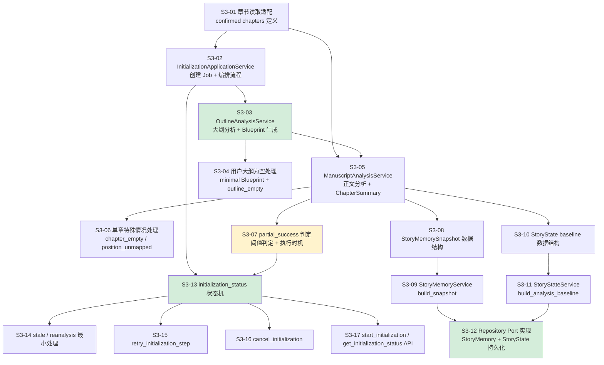
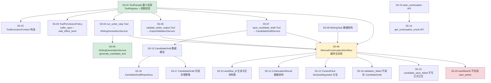
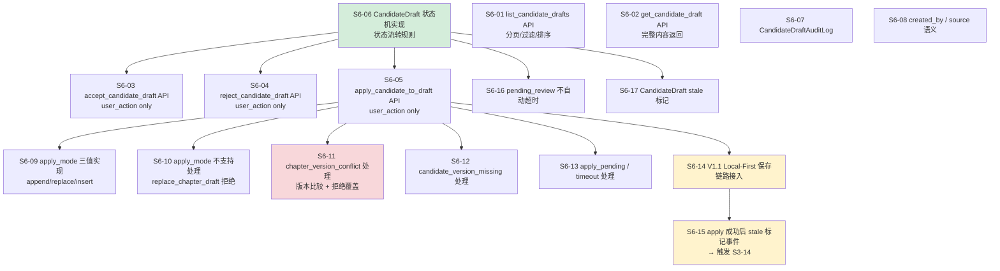

# InkTrace V2.0 P0 — S3 / S5 / S6 阶段细化

版本：v1.0  
用途：开发计划补充细化，仅针对跨模块复杂阶段  
适用范围：S3 初始化分析、S5 续写与 CandidateDraft 生成、S6 HumanReviewGate 与 apply 闭环

---

## 一、S3 初始化分析 — 阶段细化

### 1.1 S3 内部依赖图



**颜色说明**：
- 绿色：S4 可提前依赖的关键输出节点
- 黄色：需要特别关注的判定逻辑节点

---

### 1.2 S3 MVP 节点

| MVP 节点 | 完成条件 | 可以做什么 |
|---|---|---|
| **MVP-1**：S3-03 完成 | 大纲分析可跑通，Blueprint 可生成 | 验证 ModelRouter + PromptTemplate + OutputValidator 全链路 |
| **MVP-2**：S3-05 完成 | 单章正文分析可跑通，ChapterSummary 可生成 | 验证正文分析对照 Blueprint 的逻辑 |
| **MVP-3**：S3-12 完成 | StoryMemory + StoryState 可持久化 | S4 可以启动，开始 ContextPack 开发 |
| **MVP-4**：S3-13 + S3-07 完成 | initialization_status 状态机 + partial_success 判定可用 | S5 可以启动，正式续写闭环可以开发 |
| **S3 全量完成**：S3-17 完成 | Initialization API 可用 | 前端可以接入初始化流程 |

---

### 1.3 S3 跨模块边界检查清单

开发 S3 时，以下边界必须在实现前确认，不能在联调时才发现：

**与 V1.1 的边界（S3-01）**
- [ ] confirmed chapters 的判定字段在 V1.1 数据模型中已明确（不是推断）
- [ ] CandidateDraft / Quick Trial 输出有明确的标识字段可以排除
- [ ] 章节删除后，already-analyzed 的 ChapterSummary 是否需要标记 stale

**与 AIJobSystem 的边界（S3-02 / S3-07）**
- [ ] partial_success 判定由 InitializationApplicationService 执行，不由 AIJobService 执行
- [ ] 每章分析后 InitializationApplicationService 实时更新 Step 状态
- [ ] finalize_initialization 是 initialization_status 写 completed 的唯一出口
- [ ] AIJobService 只提供 mark_step_failed / mark_step_skipped / update_progress，不执行阈值判断

**与 AI 基础设施的边界（S3-03 / S3-05）**
- [ ] OutlineAnalysisService 通过 ModelRouter 调用，不直接调用 Provider SDK
- [ ] ManuscriptAnalysisService 通过 ModelRouter 调用，不直接调用 Provider SDK
- [ ] OutputValidator schema 校验失败最多重试 2 次，Provider 调用失败最多重试 1 次，两套重试机制不叠加超过 Step 总上限 3 次

**与 StoryMemory / StoryState 的边界（S3-09 / S3-11）**
- [ ] StoryMemoryService 不调用 Provider SDK
- [ ] StoryStateService 不调用 Provider SDK
- [ ] StoryState baseline_source 必须是 confirmed_chapter_analysis，不能是 quick_trial / candidate_draft
- [ ] finalize 写 completed 之前必须确认两者已持久化成功

**与 VectorIndex 的边界（S3 → S4-08 / S4-09）**
- [ ] S3 只触发 VectorIndexService，不关心切片和 Embedding 细节
- [ ] VectorIndex 构建失败不阻断 initialization_status = completed
- [ ] VectorIndex 失败必须记录 warning，S3 不能静默忽略

**stale 触发边界（S3-14）**
- [ ] 正文修改触发 stale（V1.1 保存链路通知）
- [ ] 章节新增是否触发 stale — P0 明确声明处理或不处理
- [ ] 章节删除是否触发 stale — P0 明确声明处理或不处理

---

### 1.4 S3 最容易遗漏的实现细节

1. **partial_success 的执行时机**：不是等所有章节分析完再判断，而是 finalize_initialization 时统一判断。但用户每章的 retry/skip 决策是实时的，AIJobService 要实时更新 Step 状态，InitializationApplicationService 要在 finalize 时读取所有 Step 状态做最终判定。

2. **analyzed_chapter_count 的统计口径**：只统计 completed 的章节 Step，不包含 skipped / failed / chapter_empty minimal。这个计数在 S3 里就要确定存在哪里、何时更新。

3. **outline_empty 的传播**：outline_empty = true 必须传递到后续的 ContextPack / WritingTask，让它们能感知到大纲为空的降级状态。S3 要确保这个字段在 OutlineAnalysisResult 和 initialization metadata 中都有记录。

---

## 二、S5 续写与 CandidateDraft 生成 — 阶段细化

### 2.1 S5 内部依赖图



**颜色说明**：
- 绿色：其他任务的基础，必须最先完成
- 黄色：编排核心，依赖最多
- 红色：安全边界，不能遗漏

---

### 2.2 S5 内部开发顺序建议

```
第一批（基础，可并行）：
  S5-01 ToolFacade 最小实现
  S5-08 WritingTask 数据结构
  S5-15 CandidateDraft 数据模型

第二批（依赖第一批）：
  S5-02 ToolExecutionContext
  S5-03 ToolPermissionPolicy
  S5-05 WritingGenerationService
  S5-16 CandidateDraftRepository
  S5-17 内容存储策略

第三批（依赖第二批）：
  S5-04 run_writer_step Tool
  S5-06 validate_writer_output Tool
  S5-07 save_candidate_draft Tool

第四批（编排层，依赖第三批）：
  S5-09 MinimalContinuationWorkflow
  S5-10 workflow_id 生命周期
  S5-11 ContinuationResult
  S5-12 ContextPack blocked/degraded 分支
  S5-18 / S5-19 / S5-20 边界校验

第五批（API 层）：
  S5-13 start_continuation API
  S5-14 get_continuation_result API
```

---

### 2.3 S5 MVP 节点

| MVP 节点 | 完成条件 | 可以做什么 |
|---|---|---|
| **MVP-1**：S5-05 完成 | WritingGenerationService 可调用 ModelRouter 生成文本 | 验证 Writer 调用链路，不涉及 ToolFacade |
| **MVP-2**：S5-09 完成 | Workflow 可跑通一次完整续写，CandidateDraft 可保存 | 后端最小闭环可验证 |
| **MVP-3**：S5-13 完成 | start_continuation API 可用 | 前端可以触发续写，用 job_id 轮询 |
| **S5 全量完成**：S5-20 完成 | 所有安全边界检查通过 | 可以进入 S6 |

---

### 2.4 S5 跨模块边界检查清单

**ToolFacade 与 Application Service 的边界（S5-01 / S5-04 / S5-06 / S5-07）**
- [ ] run_writer_step 是 Tool 名，WritingGenerationService.generate_candidate_text 是内部方法名，两者不混用
- [ ] ToolFacade 调用路径：Workflow → ToolFacade → Application Service，不允许 Workflow 直接调 Service
- [ ] save_candidate_draft Tool 的 side_effect_level = candidate_write，ToolPermissionPolicy 必须校验
- [ ] formal_write 级别的操作在 P0 ToolFacade 中不注册，没有注册就无法调用

**Workflow 与 AIJobSystem 的边界（S5-09）**
- [ ] Workflow 通过 AIJobService 更新 Step 状态，不直接操作 Job 数据
- [ ] cancel 后 Workflow 必须检查 Job 状态，不继续调用后续 Tool
- [ ] validation_failed 后 Workflow 不调用 save_candidate_draft（S5-18 的保障）

**CandidateDraft 与正式正文的边界（S5-15 / S5-19）**
- [ ] CandidateDraft 存储在独立表 / 集合，不写入 V1.1 章节正文表
- [ ] candidate_save_failed 时不触发任何正式正文操作
- [ ] CandidateDraft 创建时记录 chapter_revision / content_version（apply 时版本对比需要这个字段）

**ContextPack 与 Writer 的边界（S5-12）**
- [ ] ContextPack blocked 时不调用 run_writer_step
- [ ] ContextPack degraded + allow_degraded = false 时不调用 run_writer_step
- [ ] ContextPack degraded + allow_degraded = true 时继续，ContinuationResult 携带 degraded warning

**安全边界（S5-20）**
- [ ] accept / apply / reject 没有对应的 Tool，不在 ToolRegistry 中注册
- [ ] Workflow 的 caller_type = workflow，ToolPermissionPolicy 对 formal_write 操作返回 permission_denied
- [ ] 普通日志不记录完整 CandidateDraft 内容 / 完整 Prompt / 完整 ContextPack

---

### 2.5 S5 最容易遗漏的实现细节

1. **workflow_id 与 job_id 的关系**：正式续写路径 workflow_id 与 job_id 一对一，Quick Trial 有 workflow_id 但 job_id 可为空。这个映射关系要在 S5-10 明确，前端 get_continuation_result 需要用 workflow_id 查询。

2. **validate_writer_output 重试重新生成而不是重新校验**：校验失败后重试目标是重新调用 run_writer_step 生成新内容，不是对同一输出重复校验。这个逻辑在 S5-09 的 Workflow 编排里必须正确实现。

3. **CandidateDraft 的 chapter_revision / content_version 字段**：这两个字段在 S5 保存时写入，S6 的 apply 时需要读取做版本对比。如果 S5 遗漏写入，S6 的 chapter_version_conflict 检测就无法工作。

4. **ToolFacade P0 最小实现与完整实现的边界**：S5 可以先做最小 ToolFacade（只有 P0 白名单 Tool，权限矩阵简化），完整 ToolAuditLog 可以在 S5-07 后补充。但 ToolPermissionPolicy 的 caller_type 校验和 formal_write 禁止必须在 MVP-1 就到位，不能延后。

---

## 三、S6 HumanReviewGate 与 apply 闭环 — 阶段细化

### 3.1 S6 内部依赖图



**颜色说明**：
- 绿色：其他任务的基础，必须最先完成
- 黄色：跨模块集成节点，风险最高
- 红色：安全边界，不能遗漏

---

### 3.2 S6 内部开发顺序建议

```
第一批（基础，可并行）：
  S6-06 CandidateDraft 状态机实现（其他任务都依赖）
  S6-07 CandidateDraftAuditLog
  S6-08 created_by / source 语义

第二批（只读 API，依赖第一批）：
  S6-01 list_candidate_drafts API
  S6-02 get_candidate_draft API

第三批（写操作 API，依赖第一批）：
  S6-03 accept_candidate_draft API
  S6-04 reject_candidate_draft API
  S6-16 pending_review 不自动超时

第四批（apply 核心，依赖第三批 + V1.1）：
  S6-09 apply_mode 三值实现
  S6-10 apply_mode 不支持处理
  S6-11 chapter_version_conflict 处理
  S6-12 candidate_version_missing 处理
  S6-13 apply_pending / timeout 处理
  S6-14 V1.1 Local-First 保存链路接入

第五批（收尾，依赖第四批）：
  S6-05 apply_candidate_to_draft API（组装以上全部）
  S6-15 apply 成功后 stale 标记事件
  S6-17 CandidateDraft stale 标记
```

---

### 3.3 S6 MVP 节点

| MVP 节点 | 完成条件 | 可以做什么 |
|---|---|---|
| **MVP-1**：S6-06 完成 | 状态机可用，状态流转有单元测试 | 后续所有 API 开发有明确状态规则支撑 |
| **MVP-2**：S6-03 + S6-04 完成 | accept / reject 可用 | 验证 user_action 校验，HumanReviewGate 基础流程可跑 |
| **MVP-3**：S6-14 完成 | V1.1 Local-First 保存链路接入可用 | 最重要的集成点，apply 主路径可验证 |
| **MVP-4**：S6-05 完成 | apply 完整路径可用（含冲突检测） | P0 最小闭环完整跑通 |
| **S6 全量完成**：S6-15 + S6-17 完成 | stale 事件传播可用 | S3 的 stale/reanalysis 联动可验证 |

---

### 3.4 S6 跨模块边界检查清单

**与 V1.1 Local-First 保存链路的边界（S6-14）**
- [ ] apply 写入的目标是章节草稿区（chapter draft），不是已确认的章节正文
- [ ] apply 传入的 content_version 与 V1.1 乐观锁的 version 字段是同一个字段
- [ ] V1.1 的 409 冲突响应与 chapter_version_conflict 错误码的映射关系已明确
- [ ] apply 失败时 V1.1 不回滚已有正文（保持不变），不会静默覆盖

**与 S3 stale 机制的边界（S6-15）**
- [ ] apply 成功后的正文变更通知路径已明确（事件？直接调用？）
- [ ] 谁负责接收这个通知并触发 S3-14 的 stale 标记
- [ ] 通知失败时 apply 结果不回滚，stale 标记可以延后或异步

**user_action 校验边界（S6-03 / S6-04 / S6-05）**
- [ ] API 层根据入口类型注入 caller_type = user_action，前端不传入
- [ ] workflow / system / quick_trial 调用 accept / apply / reject 时返回 permission_denied
- [ ] 这三个操作没有对应的 Tool，不在 ToolFacade ToolRegistry 中注册

**CandidateDraft 状态与正式正文的边界（S6-06 / S6-14）**
- [ ] accepted 状态不等于已写入正式正文
- [ ] applied 状态只在 apply 成功写入草稿区后才标记
- [ ] apply 失败后 CandidateDraft 状态保持 accepted，不标记 applied

**apply_mode 边界（S6-09 / S6-10）**
- [ ] replace_chapter_draft / whole_chapter_replace 在 S6-10 明确返回 apply_mode_not_supported，不是静默处理
- [ ] append_to_chapter_end 不需要 selection_range / cursor_position，传了也忽略还是报错需要明确
- [ ] replace_selection 和 insert_at_cursor 缺少位置信息时返回 apply_target_missing

---

### 3.5 S6 最容易遗漏的实现细节

1. **apply 成功的判定时机**：apply 成功的唯一标志是 V1.1 Local-First 保存链路确认写入，不是 CandidateDraft 状态变成 applied。applied 状态必须在保存链路返回成功后才能写入，不能提前标记。

2. **chapter_version 字段的来源**：S6-11 的版本对比需要 CandidateDraft 生成时的 content_version，这个字段是在 S5-07（save_candidate_draft）时写入的。如果 S5 遗漏了这个字段，S6 的冲突检测就没有比较基准，需要在 S5 验收时确认。

3. **多个 pending_review 并存的处理**：同一章节可以有多个 pending_review 状态的 CandidateDraft 并存，list API 全部返回，用户选择操作其中一个。不需要限制只有一个 pending_review，也不需要自动将旧的标记为 superseded（S6-16）。

4. **stale 标记的触发链路**：apply 成功 → 正文变更 → 触发 S3-14 的 stale 逻辑 → 已有 CandidateDraft 标记 stale（S6-17）。这条链路跨越 S6 和 S3 两个阶段，必须在 S6 开发前确认事件传递的实现方式（直接调用 / 事件总线 / 后台任务），不能在联调时才讨论。

---

## 四、三阶段汇总对比

| 维度 | S3 初始化 | S5 续写生成 | S6 apply 闭环 |
|---|---|---|---|
| **任务数** | 17 | 20 | 17 |
| **最高风险点** | partial_success 执行时机 | validate 失败重新生成（不是重新校验） | apply 成功时机与 applied 状态标记 |
| **最关键集成点** | S3-12（StoryMemory/StoryState 持久化） | S5-09（Workflow 编排全流程） | S6-14（V1.1 Local-First 接入） |
| **MVP 可联调节点** | S3-12 完成后 S4 可启动 | S5-09 完成后后端闭环可验证 | S6-14 完成后最小闭环可跑通 |
| **跨阶段依赖** | → S4 读取 StoryMemory/StoryState | → S6 读取 CandidateDraft chapter_version | → S3 stale 标记 + S5 状态更新 |
| **最容易漏的字段** | analyzed_chapter_count 统计口径 | chapter_revision / content_version 写入时机 | applied 标记时机（保存链路返回后） |

---

## 五、开发启动检查清单

在正式开始 S3 / S5 / S6 任何一个阶段之前，确认以下事项：

### 启动 S3 前
- [ ] V1.1 confirmed chapters 判定方式已在 S0-05 确认
- [ ] partial_success 判定由 InitializationApplicationService 执行已与团队对齐
- [ ] VectorIndex 失败不阻断 completed 这条规则已在代码层面有对应实现路径

### 启动 S5 前
- [ ] S3-13（initialization_status 状态机）已可用，S5 可以检查 initialization_not_completed
- [ ] S4（ContextPack ready/degraded/blocked）已可用
- [ ] ToolFacade P0 最小实现范围已明确（哪些 Tool 必须在 S5 完成，哪些可延后）
- [ ] CandidateDraft 的 chapter_revision / content_version 字段已确认在 S5-07 写入

### 启动 S6 前
- [ ] S5-15（CandidateDraft 数据模型）已确认含 chapter_revision / content_version
- [ ] V1.1 Local-First 保存链路的接入接口在 S0-04 已确认
- [ ] apply 成功后 stale 事件的传递方式（直接调用 / 事件）已与 S3 模块开发者对齐
