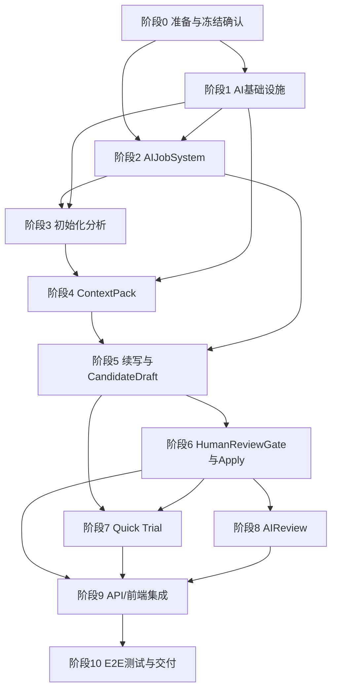

# InkTrace V2.0 P0 开发计划

版本：v1.0  
状态：P0 开发计划  
创建日期：2026-05-09  
依据：InkTrace V2.0 P0 详细设计（P0-总纲 + P0-01 ~ P0-11，已冻结/候选冻结）

---

## 一、文档定位

本文档是 InkTrace V2.0 P0 的开发计划与任务拆分文档。

本文档基于已冻结 / 候选冻结的 P0 详细设计，将 P0 能力拆分为 10 个可开发、可验证、可独立回归的阶段。每个阶段包含任务表、依赖关系、输入输出和验收标准。

本文档不重新设计、不写代码、不改源码、不生成数据库迁移、不拆到代码函数级别。

---

## 二、开发目标与最小闭环

### 2.1 P0 目标

完成"AI 初始化 + 单章受控续写"的最小闭环，在 V1.1 非 AI 写作工作台基础上接入受控 AI 能力，保持 V1.1 Local-First 正文保存链路不变。

### 2.2 最小闭环

```text
导入 / 已有作品章节
→ AI Settings 配置 Provider / model_role
→ 初始化分析
→ StoryMemory / StoryState 最小快照
→ ContextPack 构建
→ 续写生成 CandidateDraft
→ HumanReviewGate 人工确认
→ apply_candidate_to_draft 写入章节草稿
→ 可选 AIReview 辅助审阅
```

### 2.3 核心约束

1. 先跑通 P0 最小闭环，不优先做 P1/P2/P3
2. 不做完整 Agent Runtime
3. 不做五 Agent Workflow
4. 不做自动连续续写队列
5. 不做成本看板 / 分析看板
6. 不做正文 token streaming
7. 不做复杂 Knowledge Graph
8. 不做复杂多路召回融合
9. 不做完整 AI Suggestion / Conflict Guard
10. 不做整章静默覆盖 / AI 自动 apply

---

## 三、开发拆分原则

1. **先基础设施，再业务闭环**：先完成 AI Settings / ModelRouter / AIJobSystem，再构建初始化→续写→人工确认闭环
2. **先后端最小链路，再前端完整体验**：后端 API 可用后前端再接入
3. **先同步 / 轮询可用，再考虑 SSE 状态事件**：SSE 为可选增强
4. **先最小 ContextPack，再增强 VectorRecall**：VectorRecall 可降级，不影响最小闭环
5. **先 CandidateDraft 生成与 apply，再做 AIReview**：AIReview 是辅助能力，可延后
6. **每个阶段都可独立验证**：有明确输入、输出、验收标准
7. **每个阶段都可独立回归测试**：不破坏已完成阶段
8. **不把"可选"任务当作 P0 必须阻塞项**：明确区分 P0-必须 / P0-重要 / P0-可选

---

## 四、阶段总览

| 阶段 | 名称 | 核心交付 | 优先级 | 预计任务数 |
|---|---|---|---|---|
| S0 | 准备与冻结确认 | 开发基线、分支、风险登记 | P0-必须 | 6 |
| S1 | AI 基础设施最小实现 | Provider 配置、ModelRouter、LLMCallLog | P0-必须 | 14 |
| S2 | AIJobSystem 最小实现 | Job/Step 状态机、轮询 API | P0-必须 | 12 |
| S3 | 初始化分析最小闭环 | 大纲分析、正文分析、StoryMemory/StoryState | P0-必须 | 17 |
| S4 | ContextPack 最小构建 | ContextPackService、ready/degraded/blocked | P0-必须 | 14 |
| S5 | 续写与 CandidateDraft 生成 | Workflow、Writer、CandidateDraft 保存 | P0-必须 | 20 |
| S6 | HumanReviewGate 与 apply 闭环 | accept/apply/reject、Local-First 接入 | P0-必须 | 17 |
| S7 | Quick Trial 最小实现 | Quick Trial、保存为候选稿 | P0-重要 | 11 |
| S8 | AIReview 最小实现 | AIReviewService、ReviewResult、异步 Job | P0-重要 | 15 |
| S9 | API / 前端集成与轮询体验 | 全链路前端接入、轮询策略、错误展示 | P0-重要 | 14 |
| S10 | E2E 测试、回归与冻结交付 | 端到端验收、安全审计、发布检查 | P0-必须 | 14 |

---

## 五、阶段依赖关系图



说明：

- S1 和 S2 可部分并行（AIJobSystem 只需 Provider 配置可用即可开始）
- S7（Quick Trial）和 S8（AIReview）可在 S6 完成后并行
- S4（ContextPack）的硬依赖是 S3 中 StoryMemory/StoryState 的可读取能力（S3-08~S3-12），不要求 S3 全部完成即可启动；但进入 S5 前 S3 的初始化状态机/partial_success/stale 规则必须可用
- S3（初始化）中的 StoryMemory/StoryState 持久化结构在 S3 中完成，S4 读取即可；VectorRecall 可先降级实现

---

## 六、阶段 0：准备与冻结确认

**目标**：确认 P0 详细设计已冻结，确认开发基线，登记风险。

**前置条件**：无。

| 任务编号 | 任务名称 | 类型 | 依赖 | 输入 | 输出 | 验收标准 | 优先级 |
|---|---|---|---|---|---|---|---|
| S0-01 | 设计文档冻结确认 | Design Sync | 无 | P0-总纲 + P0-01 ~ P0-11 | 冻结确认记录 | 所有 P0 文档标为冻结/候选冻结；确认 `_001` 文档不作为开发依据 | P0-必须 |
| S0-02 | 开发分支确认 | Design Sync | S0-01 | 当前 master 分支状态 | 开发分支策略 | 确认从 master 拉出 `feature/v2-p0` 分支；确认分支保护规则 | P0-必须 |
| S0-03 | 当前项目结构梳理 | Design Sync | S0-02 | 源码目录 | 项目结构文档 | 确认 `presentation/`、`application/`、`domain/`、`infrastructure/` 目录结构；确认新建 `backend/` 与现有代码的关系 | P0-必须 |
| S0-04 | 现有 Local-First 保存链路确认 | Design Sync | S0-02 | V1.1 Chapter/Session 源码 | Local-First 接口确认 | 确认 Chapter 草稿保存、version 乐观锁、409 冲突处理的现有实现；确认 apply_candidate_to_draft 接入点 | P0-必须 |
| S0-05 | 现有章节 / 作品数据结构确认 | Design Sync | S0-02 | V1.1 Work/Chapter 数据模型 | 数据模型清单 | 确认 work_id、chapter_id、chapter_order、content_version 等关键字段存在；确认 confirmed chapters 的判定方式 | P0-必须 |
| S0-06 | 风险点登记 | Design Sync | S0-01 ~ S0-05 | 全量设计文档 + 现有代码 | 风险登记表 | 至少覆盖 Provider 稳定性、初始化成本、ContextPack token 超预算、apply 版本冲突、日志安全 5 类风险 | P0-必须 |

**交付物**：

1. P0 开发基线说明（含冻结文档清单、分支策略、目录结构）
2. P0 任务拆分总表（即本文档）
3. 不进入开发的 P1/P2 范围清单（见第二十一章）

---

## 七、阶段 1：AI 基础设施最小实现

**目标**：能配置 Provider / model_role，通过 ModelRouter 调用模型，记录 LLMCallLog，支持 PromptTemplate 和 OutputValidation。

**前置条件**：S0 完成。

**对应文档**：P0-01 AI 基础设施、P0-11 AI Settings API。

| 任务编号 | 任务名称 | 类型 | 依赖 | 输入 | 输出 | 验收标准 | 优先级 |
|---|---|---|---|---|---|---|---|
| S1-01 | AISettings 数据模型与 Repository | Backend | S0-04 | P0-01 5.2/5.3/5.5 | AISettingsStore、AISettingsRepositoryPort | 可持久化 provider_name、encrypted_api_key、default_model、timeout、base_url、last_test_status、last_test_at | P0-必须 |
| S1-02 | API Key 加密存储 | Infrastructure | S1-01 | P0-01 5.4 | 加密/解密工具 | API Key 加密写入、解密读取；普通日志不记录 API Key | P0-必须 |
| S1-03 | ModelRoleConfig 数据模型 | Backend | S1-01 | P0-01 5.6 | ModelRoleConfig 持久化 | 支持 model_role → provider/model 映射的 CRUD；12 个默认 model_role 可写入 | P0-必须 |
| S1-04 | 默认 model_role 映射初始化 | Backend | S1-03 | P0-01 5.6 默认映射表 | 默认配置写入 | outline_analyzer/manuscript_analyzer/memory_extractor/planner/writing_task_builder/reviewer 默认 Kimi；writer/rewriter/polisher/dialogue_writer/scene_generator/quick_trial_writer 默认 DeepSeek | P0-必须 |
| S1-05 | ProviderPort 接口定义 | Backend | 无 | P0-01 6.1/6.2/6.3 | ProviderPort 抽象接口 | 定义 ProviderRequest/ProviderResponse 标准结构；定义 test_connection 方法 | P0-必须 |
| S1-06 | Kimi Provider Adapter | Infrastructure | S1-05 | P0-01 6.4 | KimiProviderAdapter | 封装 Kimi SDK/HTTP；实现 ProviderPort；统一处理 auth_failed/timeout/rate_limited/unavailable | P0-必须 |
| S1-07 | DeepSeek Provider Adapter | Infrastructure | S1-05 | P0-01 6.5 | DeepSeekProviderAdapter | 封装 DeepSeek SDK/HTTP；实现 ProviderPort；统一处理 auth_failed/timeout/rate_limited/unavailable | P0-必须 |
| S1-08 | ModelRouter | Backend | S1-03, S1-05 | P0-01 7.1/7.2/7.3 | ModelRouter 实现 | 根据 model_role 读取 ModelRoleConfig 选择 provider/model；model_role 未配置返回 model_role_invalid；不被 Workflow/Agent 直接调用 | P0-必须 |
| S1-09 | PromptTemplate 管理 | Backend | 无 | P0-01 8.1~8.8 | PromptRegistryService、PromptTemplateFileStore | 支持 prompt_key/prompt_version 加载 YAML/JSON；绑定 model_role 和 output_schema_key；至少包含 outline_analysis_p0、manuscript_chapter_analysis_p0、memory_extract_p0、continuation_writer_p0、quick_trial_writer_p0、review_candidate_p0 | P0-必须 |
| S1-10 | OutputValidationService | Backend | 无 | P0-01 9.1~9.8 | OutputValidationService、Pydantic schema registry | 根据 output_schema_key 校验输出；schema 缺失返回 output_schema_missing；校验失败返回 output_schema_invalid | P0-必须 |
| S1-11 | LLMCallLog 数据模型与写入 | Backend | S1-08 | P0-01 10.1~10.8 | LLMCallLog、LLMCallLogger、LLMCallLogStore | 记录 prompt_key/prompt_version/model_role/provider/model/token_usage/elapsed_ms/error_code；不记录完整 Prompt/正文/API Key | P0-必须 |
| S1-12 | test_provider_connection | Backend | S1-06, S1-07, S1-08 | P0-01 5.7 | test_provider_connection 用例 | 通过 ModelRouter.test_connection 调用 ProviderPort；写回 last_test_status/last_test_at；不创建 CandidateDraft/ReviewReport/StoryMemory | P0-必须 |
| S1-13 | Provider 调用重试策略 | Backend | S1-08 | P0-01 9.5 | RetryPolicy 最小实现 | timeout/rate_limited/unavailable 可重试最多 1 次；auth_failed/key_missing/disabled 不重试；不突破 Step 总上限 | P0-必须 |
| S1-14 | get_ai_settings / update_ai_settings API | API | S1-01, S1-03, S1-12 | P0-11 9.1/9.2 | AI Settings API | get_ai_settings 返回 model_role_configs 不返回 API Key 明文；update_ai_settings 支持写入 model_role_configs；model_role 不存在返回 model_role_invalid | P0-必须 |

**阶段验收标准**：

- get_ai_settings 不返回 API Key 明文
- test_provider_connection 可返回 last_test_status / last_test_at
- model_role = writer 能路由到配置模型
- model_role = reviewer 能路由到配置模型
- Provider auth_failed 不 retry
- timeout / rate_limited / unavailable 按 P0-01 retry
- 普通日志不记录 API Key / Prompt 全文 / 正文全文

---

## 八、阶段 2：AIJobSystem 最小实现

**目标**：提供统一 Job / Step 状态机，支持异步任务查询、取消、重试，迟到结果 ignored。

**前置条件**：S1 完成（只需 AI Settings 可读取即可，可与 S1 后段并行）。

**对应文档**：P0-02 AIJobSystem、P0-11 AIJob API。

| 任务编号 | 任务名称 | 类型 | 依赖 | 输入 | 输出 | 验收标准 | 优先级 |
|---|---|---|---|---|---|---|---|
| S2-01 | AIJob / AIJobStep 数据模型 | Backend | S0-05 | P0-02 5.1~5.6、6.1~6.6 | AIJob、AIJobStep 领域对象 | Job 含 id/work_id/job_type/status/progress；Step 含 id/job_id/step_type/status/attempt_count | P0-必须 |
| S2-02 | AIJobRepository 实现 | Repository | S2-01 | P0-02 9.1~9.4 | AIJobRepositoryAdapter | 支持 CRUD、按 work_id 查询、按 status 查询；Repository Port 与 Adapter 分离 | P0-必须 |
| S2-03 | AIJobService | Application Service | S2-02 | P0-02 8.1~8.4 | AIJobService | 实现 create_job/start_job/update_progress/mark_step_completed/mark_step_failed/mark_step_skipped | P0-必须 |
| S2-04 | Job 状态机 | Backend | S2-03 | P0-02 5.4/5.5 | Job 状态流转逻辑 | queued→running→completed/failed/cancelled；running→paused→running；failed→queued(retry) | P0-必须 |
| S2-05 | Step 状态机 | Backend | S2-03 | P0-02 6.4/6.5 | Step 状态流转逻辑 | pending→running→completed/failed/skipped；running→paused→running；failed→running(retry) | P0-必须 |
| S2-06 | AIJobAttempt 记录 | Backend | S2-03 | P0-02 7.1~7.6 | AIJobAttempt 模型与记录 | 记录 attempt_no/request_id/trace_id/provider/model/model_role/status/error_code/llm_call_log_id；不保存完整 Prompt/正文/API Key | P0-必须 |
| S2-07 | retry_job / retry_step | Backend | S2-04, S2-05 | P0-02 11.4 | retry 逻辑 | retry_job 复用原 Job 不新建；retry_step 只重试指定 failed Step；不超过 attempt 上限 | P0-必须 |
| S2-08 | cancel_job | Backend | S2-04 | P0-02 11.3 | cancel 逻辑 | cancel 后迟到 ProviderResponse 不得推进 Step/创建 CandidateDraft/创建 ReviewReport | P0-必须 |
| S2-09 | pause / resume | Backend | S2-04 | P0-02 11.1/11.2 | pause/resume 逻辑 | pause_requested 后当前调用返回不自动启动下一步；resume 从未完成 Step 继续 | P0-必须 |
| S2-10 | 服务重启恢复策略 | Backend | S2-04 | P0-02 12.1~12.3 | 重启恢复逻辑 | running Job 标记 paused(reason=service_restarted)；queued/paused/failed/completed/cancelled 保持原状态 | P0-必须 |
| S2-11 | can_retry / can_skip 派生 | Backend | S2-04, S2-05 | P0-02 6.2 | can_retry/can_skip 计算逻辑 | 基于 step_type/status/job_status/policy 动态计算 | P0-必须 |
| S2-12 | get_job_status / get_job_steps API | API | S2-03 | P0-11 11.1/11.2 | AIJob API | 返回 job_id/job_type/status/progress/can_retry/can_cancel/can_skip；Step 含 step_id/step_name/status/attempt_no；Response 可携带 polling_hint | P0-必须 |

**阶段验收标准**：

- 创建 Job 后可查询状态
- Step 状态可推进
- cancel 后迟到结果不会推进 JobStep
- retry 超过上限返回 retry_limit_exceeded
- get_job_status / get_job_steps 可支撑前端轮询
- 普通日志不记录敏感内容

---

## 九、阶段 3：初始化分析最小闭环

**目标**：用户能启动初始化，系统能分析章节，生成最小 StoryMemorySnapshot / StoryState baseline，返回 initialization_status，初始化完成后正式续写入口可用。

**前置条件**：S1（AI 基础设施）、S2（AIJobSystem）完成。

**对应文档**：P0-03 初始化流程、P0-04 StoryMemory/StoryState、P0-11 Initialization API。

| 任务编号 | 任务名称 | 类型 | 依赖 | 输入 | 输出 | 验收标准 | 优先级 |
|---|---|---|---|---|---|---|---|
| S3-01 | 章节读取适配 | Backend | S0-05 | V1.1 Chapter 数据 | confirmed chapters 读取接口 | 读取已确认章节正文、chapter_id、chapter_order；排除 CandidateDraft/Quick Trial/未保存草稿 | P0-必须 |
| S3-02 | InitializationApplicationService | Application Service | S2-03, S3-01 | P0-03 4.1~4.4、5.1~5.5 | InitializationApplicationService | 创建 ai_initialization Job；编排 outline_analysis → manuscript_chapter_analysis 流程 | P0-必须 |
| S3-03 | OutlineAnalysisService | Application Service | S1-08, S1-09, S1-10 | P0-03 7.1~7.8 | OutlineAnalysisService | 使用 model_role=outline_analyzer 调用 ModelRouter；生成 OutlineAnalysisResult/OutlineStoryBlueprint；不覆盖用户原始大纲 | P0-必须 |
| S3-04 | 用户大纲为空处理 | Application Service | S3-03 | P0-03 7.4 | minimal OutlineStoryBlueprint | 大纲为空不导致初始化失败；生成 minimal 蓝图标记 outline_empty=true；warnings 含 outline_empty | P0-必须 |
| S3-05 | ManuscriptAnalysisService | Application Service | S3-03 | P0-03 8.1~8.9 | ManuscriptAnalysisService | 使用 model_role=manuscript_analyzer 调用 ModelRouter；按章节分析；生成 ChapterSummary/character_state_delta/setting_fact_delta/foreshadow_candidate_delta；必须读取 OutlineStoryBlueprint | P0-必须 |
| S3-06 | 单章特殊情况处理 | Application Service | S3-05 | P0-03 8.9 | chapter_empty/position_unmapped 处理 | chapter_empty 生成 minimal ChapterSummary 标记 chapter_empty=true 不计入 success；position_unmapped 继续分析记 warning | P0-必须 |
| S3-07 | partial_success 判定 | Application Service | S3-05, S3-06 | P0-03 9.1~9.5 | final_partial_success_check | 大纲分析必须成功；章节分析成功率>=80%；最近3章必须成功；阈值未满足写 failed/paused；finalize_initialization 统一判定 | P0-必须 |
| S3-08 | StoryMemorySnapshot 数据结构 | Backend | S3-05 | P0-04 5.1~5.7 | StoryMemorySnapshot 领域对象 | 含 current_story_summary/character_states/setting_facts/foreshadow_candidates/unresolved_questions；source=initialization_analysis | P0-必须 |
| S3-09 | StoryMemoryService | Application Service | S3-08 | P0-04 7.1~7.6 | StoryMemoryService | build_snapshot 聚合 ChapterAnalysisResult；持久化通过 StoryMemoryRepositoryPort；不调用 Provider SDK | P0-必须 |
| S3-10 | StoryState baseline 数据结构 | Backend | S3-05 | P0-04 6.1~6.6 | StoryState analysis_baseline 领域对象 | 含 current_story_phase/active_characters/active_conflicts/active_foreshadows/recent_key_events；source=confirmed_chapter_analysis | P0-必须 |
| S3-11 | StoryStateService | Application Service | S3-10 | P0-04 8.1~8.6 | StoryStateService | build_analysis_baseline 基于 confirmed_chapter_analysis；持久化通过 StoryStateRepositoryPort；不调用 Provider SDK | P0-必须 |
| S3-12 | Repository Port 实现 | Repository | S3-08, S3-10 | P0-04 9.1~9.4 | StoryMemoryRepositoryPort、StoryStateRepositoryPort、Infrastructure Adapter | save_snapshot/get_latest_snapshot_by_work/mark_snapshot_stale；save_analysis_baseline/get_latest_analysis_baseline_by_work/mark_story_state_stale | P0-必须 |
| S3-13 | initialization_status 状态机 | Backend | S3-02, S3-07 | P0-03 5.1~5.5 | initialization_status 流转 | not_started→outline_analyzing→outline_completed→manuscript_analyzing→memory_building→state_building→vector_indexing→completed；stale→manuscript_analyzing(reanalysis)→completed | P0-必须 |
| S3-14 | stale / reanalysis 最小处理 | Backend | S3-13, S3-09, S3-11 | P0-03 15.1~15.3 | stale 标记与 reanalysis 触发 | 章节修改/新增/删除标记 stale；修改最近3章正式续写 blocked；reanalysis 成功回 completed | P0-必须 |
| S3-15 | retry_initialization_step | Backend | S2-07, S3-02 | P0-03 10.3、P0-11 10.3 | retry_initialization_step | 不创建新 Job；返回原 job_id/step_id/attempt_no/status；前端用原 job_id 轮询 | P0-必须 |
| S3-16 | cancel_initialization | Backend | S2-08, S3-02 | P0-03 10.3 | cancel_initialization | cancel 后不得继续写 StoryMemory/StoryState/VectorIndex；迟到结果 ignored | P0-必须 |
| S3-17 | start_initialization / get_initialization_status API | API | S3-02, S3-13 | P0-11 10.1/10.2 | Initialization API | start_initialization 返回 job_id；get_initialization_status 返回 initialization_status/analyzed_chapter_count/total_chapter_count；initialization_in_progress 时拒绝重复启动 | P0-必须 |

**阶段验收标准**：

- 空作品不能初始化，返回 work_empty
- 初始化中再次启动返回 initialization_in_progress
- 初始化完成后 status = completed
- partial_success 由 P0-03 判定，AIJobService 不执行阈值判断
- analyzed_chapter_count 只统计成功分析章节
- 失败不破坏用户正文
- stale 后重新分析成功可回 completed
- 正式续写在 initialization_not_completed 时 blocked

---

## 十、阶段 4：ContextPack 最小构建

**目标**：能基于当前章节、StoryMemory、StoryState 构建 ContextPack，支持 ready/degraded/blocked 判定。VectorRecall 可先做降级实现（无 RAG 层时 degraded）。

**前置条件**（三层依赖）：

- **S4 开发启动依赖**（满足即可开始编码）：S3-08 / S3-09 / S3-10 / S3-11 / S3-12 完成。StoryMemorySnapshot / StoryState baseline 数据结构 + Service + Repository Port 已实现，可被 ContextPackService 读取。S1（ModelRouter）必须已完成。
- **S4 初始化状态集成测试依赖**（S4 内部 blocked/degraded/stale 判定逻辑需要，但不阻塞 S4 启动）：S3-07（partial_success 判定）、S3-13（initialization_status 状态机）、S3-14（stale/reanalysis 基本规则）、S3-17（start_initialization / get_initialization_status API）。这些在 S4 开发期间并行补齐即可，S4 可先用 mock/stub 状态值驱动 ContextPackStatus 判定逻辑开发。
- **进入 S5 的门禁**（必须满足，否则正式续写闭环无法验证）：S4 基础构建完成（S4-01~S4-14），并且 S3-07 / S3-13 / S3-14 已可用。partial_success 未实现时不得进行正式联调 —— ContextPack blocked/degraded 最终判定依赖真实的 initialization_status 和 StoryMemory/StoryState stale_status。

**对应文档**：P0-04 StoryMemory/StoryState、P0-05 VectorRecall、P0-06 ContextPack、P0-11 Continuation API 相关部分。

| 任务编号 | 任务名称 | 类型 | 依赖 | 输入 | 输出 | 验收标准 | 优先级 |
|---|---|---|---|---|---|---|---|
| S4-01 | ContextPackService | Application Service | S3-08, S3-09, S3-10, S3-11, S3-12 | P0-06 8.1~8.3 | ContextPackService | build_context_pack 接收 ContextPackBuildRequest；读取 StoryMemorySnapshot/StoryState baseline；返回 ContextPackSnapshot | P0-必须 |
| S4-02 | ContextPackSnapshot DTO | Backend | 无 | P0-06 7.1~7.4 | ContextPackSnapshot 数据结构 | 含 context_pack_id/status/source_story_memory_snapshot_id/source_story_state_id/vector_recall_status/context_items/token_budget/estimated_token_count/warnings | P0-必须 |
| S4-03 | ContextPackStatus 判定 | Backend | S4-01 | P0-06 5.1 | ready/degraded/blocked 判定逻辑 | StoryMemory/StoryState 缺失→blocked；stale 影响最近3章或目标章节→blocked；stale 仅影响较早章节→degraded | P0-必须 |
| S4-04 | Required Item 规则 | Backend | S4-01 | P0-06 6.4、7.3 | required/priority 判定 | 按 continuation_mode 决定 required item；continue_chapter 时 current_chapter required；expand_scene 时 current_selection 高优先级 | P0-必须 |
| S4-05 | TokenBudgetPolicy 最小实现 | Backend | S4-01 | P0-06 上下文裁剪（总纲 3.6/4.4） | TokenBudgetPolicy | 按优先级裁剪；必选层超预算→blocked；可选层超预算→trimmed→degraded | P0-必须 |
| S4-06 | continuation_mode 支持 | Backend | S4-01 | P0-06 6.4 | continue_chapter/expand_scene/rewrite_selection | 三值均可用；空默认为 continue_chapter；未知降级为 degraded+continue_chapter 保守策略 | P0-必须 |
| S4-07 | query_text 构造 | Backend | S4-01 | P0-06 8.1、P0-05 8.2 | query_text 生成 | 基于 WritingTask/StoryState/target_chapter 生成；构造失败→degraded+skipped RAG | P0-必须 |
| S4-08 | VectorRecallService 最小接口 | Backend | 无 | P0-05 8.1~8.5 | VectorRecallService | recall 接收 RecallQuery 返回 RecallResult 列表；无索引时返回空/degraded | P0-必须 |
| S4-09 | VectorIndex chunk/embedding 最小结构 | Backend | S0-05 | P0-05 5.1~5.4、6.1~6.2 | ChapterChunk、ChunkEmbedding 数据模型 | chunk 来自 confirmed chapters；含 chunk_id/work_id/chapter_id/chapter_order/chunk_index/text_excerpt/index_status/stale_status | P0-必须 |
| S4-10 | EmbeddingProviderPort | Backend | 无 | P0-05 6.3~6.5 | EmbeddingProviderPort 接口 | 定义 embed_text/embed_batch 方法；不硬编码具体 Provider | P0-必须 |
| S4-11 | VectorRecall 不可用时 degraded 处理 | Backend | S4-01, S4-08 | P0-06 5.1/8.1 | 降级逻辑 | VectorRecall 不可用/失败→vector_recall_status=degraded；ContextPack degraded；不单独导致 blocked | P0-必须 |
| S4-12 | StoryMemory/StoryState 缺失时 blocked | Backend | S4-01 | P0-06 5.1 | blocked 判定 | StoryMemorySnapshot 缺失→blocked；StoryState baseline 缺失→blocked；source != confirmed_chapter_analysis→blocked | P0-必须 |
| S4-13 | allow_degraded 规则 | Backend | S4-01 | P0-06 6.1 | allow_degraded 处理 | allow_degraded=true 时 degraded 可继续带 warning；allow_degraded=false 时 degraded→blocked，error_code=degraded_not_allowed | P0-必须 |
| S4-14 | ContextPack 日志安全 | Security | S4-01 | P0-06 7.4 | 日志脱敏 | 普通日志不记录完整 ContextPack 正文；不记录完整 user_instruction/query_text/RecallResult text_excerpt | P0-必须 |

**阶段验收标准**：

- StoryMemory/StoryState 缺失时 ContextPack blocked
- VectorRecall 不可用不会单独 blocked
- allow_degraded = true 时 degraded 可继续
- allow_degraded = false 时 degraded blocked
- ContextPack 不记录完整正文到普通日志
- continuation_mode 影响 required item 和优先级

---

## 十一、阶段 5：MinimalContinuationWorkflow 与 CandidateDraft 生成

**目标**：用户能触发正式续写，系统构建 ContextPack，Writer 生成候选内容，保存 CandidateDraft（不直接写正式正文）。

**前置条件**：S2（AIJobSystem）、S4（ContextPack）完成。

**对应文档**：P0-07 ToolFacade、P0-08 MinimalContinuationWorkflow、P0-09 CandidateDraft、P0-11 Continuation API。

**内部执行顺序**（S5 任务拆为 MVP 和 Full 两批）：

**S5-MVP（必须优先完成，是正式续写最小闭环的核心）**：

1. S5-08 WritingTask 数据结构
2. S5-15 CandidateDraft 数据模型
3. S5-16 CandidateDraftRepository
4. S5-17 CandidateDraft 内容存储策略
5. S5-05 WritingGenerationService
6. S5-06 validate_writer_output 校验逻辑
7. S5-07 save_candidate_draft 最小保存用例（CandidateDraftService + Repository，不必等完整 ToolFacade 封装）
8. S5-09 MinimalContinuationWorkflow
9. S5-11 ContinuationResult 数据结构
10. S5-12 ContextPack blocked/degraded 分支处理
11. S5-13 start_continuation API
12. S5-14 get_continuation_result API
13. S5-18 validation_failed 不保存 CandidateDraft
14. S5-19 candidate_save_failed 不写正式正文
15. S5-20 workflow/AI 不伪造 user_action

**S5-Full（可在 MVP 跑通后补全）**：

1. S5-01 ToolFacade 完整权限矩阵
2. S5-02 ToolExecutionContext 完整审计字段
3. S5-03 ToolPermissionPolicy 完整规则
4. S5-04 run_writer_step Tool 完整封装
5. S5-07 save_candidate_draft Tool 的完整审计 / side_effect_level 封装
6. S5-10 workflow_id 完整生命周期

> **关键**：save_candidate_draft **能力本身不能延后** —— CandidateDraftService / Repository / 最小保存用例是 S5-MVP 必须项。能延后的只是完整 ToolFacade 权限矩阵和审计增强封装。

| 任务编号 | 任务名称 | 类型 | 依赖 | 输入 | 输出 | 验收标准 | 优先级 |
|---|---|---|---|---|---|---|---|
| S5-01 | ToolFacade 最小实现 | Application Service | S4-01 | P0-07 2.1~4.4、7.1~7.6、10.1 | CoreToolFacade | ToolRegistry 注册 P0 白名单 Tool；校验 ToolExecutionContext/caller_type/side_effect_level；formal_write 禁止 | P0-必须 |
| S5-02 | ToolExecutionContext 构造 | Backend | S5-01 | P0-07 5.1~5.4 | ToolExecutionContext | 含 work_id/job_id/step_id/writing_task_id/workflow_id/request_id/trace_id/caller_type/is_quick_trial | P0-必须 |
| S5-03 | ToolPermissionPolicy | Backend | S5-01 | P0-07 6.1~7.5 | 权限校验 | caller_type 校验；side_effect_level 校验；formal_write 禁止；allowed_callers 白名单 | P0-必须 |
| S5-04 | run_writer_step Tool 实现 | Application Service | S5-01, S1-08 | P0-07 11.1~11.3 | run_writer_step → WritingGenerationService.generate_candidate_text | Tool 名 run_writer_step 不是 Provider 直连；提交 model_role=writer；默认 DeepSeek 不硬编码 | P0-必须 |
| S5-05 | WritingGenerationService | Application Service | S1-08, S1-09, S1-10 | P0-08 12.1~12.4 | WritingGenerationService | generate_candidate_text 接收 ContextPackSnapshot/WritingTask；通过 ModelRouter 调用 Provider；通过 OutputValidator 校验输出；不创建 CandidateDraft | P0-必须 |
| S5-06 | validate_writer_output Tool 实现 | Application Service | S5-01, S1-10 | P0-07 10.1、P0-08 13.1~13.2 | validate_writer_output → OutputValidationService | 校验 Writer 输出；非空/合理长度/无 Provider 错误文本；schema 校验失败最多重试 2 次 | P0-必须 |
| S5-07 | save_candidate_draft Tool 实现 | Application Service | S5-01 | P0-07 10.1、P0-09 8.1~8.4 | save_candidate_draft → CandidateDraftService | side_effect_level=candidate_write；记录生成时 chapter_revision/content_version；idempotency_key 必填 | P0-必须 |
| S5-08 | WritingTask 数据结构 | Backend | 无 | P0-08 5.1~5.5 | WritingTask 领域对象 | 含 writing_task_id/work_id/target_chapter_id/continuation_mode/user_instruction/model_role；metadata 不长期保存完整 user_instruction | P0-必须 |
| S5-09 | MinimalContinuationWorkflow | Application Service | S2-03, S5-01 | P0-08 8.1~8.4 | MinimalContinuationWorkflow | 编排 create_writing_task→create_ai_job→build_context_pack→check_context_pack_status→run_writer_step→validate_writer_output→save_candidate_draft→finalize；不直接调用 ModelRouter/Provider SDK | P0-必须 |
| S5-10 | workflow_id 生成与生命周期 | Backend | S5-09 | P0-08 7.2 | workflow_id 管理 | 正式路径 workflow_id 与 job_id 一对一；Quick Trial 仍生成 workflow_id 但 job_id 可空；贯穿 ToolExecutionContext/ToolAuditLog/ContinuationResult | P0-必须 |
| S5-11 | ContinuationResult 数据结构 | Backend | 无 | P0-08 6.2/6.3 | ContinuationResult DTO | 含 workflow_id/job_id/writing_task_id/candidate_draft_id/status/warnings；status 含 completed_with_candidate/degraded_completed/blocked/failed/validation_failed/candidate_save_failed | P0-必须 |
| S5-12 | ContextPack blocked/degraded 分支处理 | Backend | S5-09, S4-03 | P0-08 10.1~10.4 | blocked/degraded 处理 | blocked→不调用 run_writer_step；degraded+allow_degraded=true→继续带 warning；degraded+allow_degraded=false→blocked | P0-必须 |
| S5-13 | start_continuation API | API | S5-09 | P0-11 12.1 | start_continuation API | 接收 work_id/target_chapter_id/continuation_mode/user_instruction/allow_degraded；返回 workflow_id/job_id/writing_task_id；非流式 | P0-必须 |
| S5-14 | get_continuation_result API | API | S5-09 | P0-11 12.2 | get_continuation_result API | 返回 ContinuationResult；candidate_draft_id 完成时有值 | P0-必须 |
| S5-15 | CandidateDraft 数据模型 | Backend | 无 | P0-09 5.1~5.5 | CandidateDraft 领域对象 | 含 candidate_draft_id/work_id/target_chapter_id/source/status/content_text 或 content_ref/content_summary/chapter_revision/content_version/stale_status | P0-必须 |
| S5-16 | CandidateDraftRepository | Repository | S5-15 | P0-09（Repository 无独立章节，按 5.1 字段设计） | CandidateDraftRepositoryPort + Adapter | save/get/list/update_status；list 支持 work_id/target_chapter_id/status/source/stale_status 过滤 | P0-必须 |
| S5-17 | CandidateDraft 内容存储策略 | Infrastructure | S5-15 | P0-09 5.2 | content_text 或 content_ref 实现 | 支持持久化候选稿正文或 content_ref；HumanReviewGate 可读取完整内容；普通日志不记录完整内容 | P0-必须 |
| S5-18 | validation_failed 不保存 CandidateDraft | Backend | S5-09 | P0-08 13.1 | 校验拒绝逻辑 | Writer 输出校验失败不调 save_candidate_draft；重试耗尽→validation_failed 不写 CandidateDraft | P0-必须 |
| S5-19 | candidate_save_failed 不写正式正文 | Backend | S5-07 | P0-09 8.3 | 保存失败处理 | save_candidate_draft 失败→candidate_save_failed；不写正式正文；不更新 StoryMemory/StoryState/VectorIndex | P0-必须 |
| S5-20 | workflow/AI 不伪造 user_action | Security | S5-01, S5-07 | P0-09 3.3 | user_action 校验 | accept/apply/reject 不作为 Tool 暴露；Workflow 不调 accept/apply/reject；ToolFacade 校验 caller_type | P0-必须 |

**阶段验收标准**：

- start_continuation 默认非流式，返回 job_id/workflow_id/writing_task_id
- ContextPack blocked 时不调用 Writer
- Writer 只生成 CandidateDraft
- CandidateDraft 不属于正式正文
- CandidateDraft 不进入 StoryMemory/StoryState/VectorIndex/ContextPack
- completed_with_candidate 不代表正式正文更新
- 普通日志不记录完整 CandidateDraft/Prompt/ContextPack
- workflow/AI 不能伪造 user_action

---

## 十二、阶段 6：HumanReviewGate 与 apply 闭环

**目标**：用户可以查看候选稿、accept/reject、apply 到章节草稿。apply 必须走 V1.1 Local-First 保存链路。

**前置条件**：S5（CandidateDraft 可保存）完成。

**对应文档**：P0-09 CandidateDraft 与 HumanReviewGate、P0-11 CandidateDraft API、V1.1 Local-First 保存链路。

| 任务编号 | 任务名称 | 类型 | 依赖 | 输入 | 输出 | 验收标准 | 优先级 |
|---|---|---|---|---|---|---|---|
| S6-01 | list_candidate_drafts API | API | S5-16 | P0-09 7.3、P0-11 13.1 | list_candidate_drafts API | 支持 cursor+limit 或 page+page_size；默认 page_size=20 最大 100；超限截断+warning；支持 work_id/target_chapter_id/status/source/stale_status/review_status/created_at range 过滤；默认按 created_at desc 排序；只返回摘要不返回完整内容 | P0-必须 |
| S6-02 | get_candidate_draft API | API | S5-16 | P0-09 7.1、P0-11 13.2 | get_candidate_draft API | 返回完整内容或 content_ref；candidate 不存在返回 candidate_not_found；内容清理不可用返回 candidate_content_unavailable | P0-必须 |
| S6-03 | accept_candidate_draft API | API | S5-16 | P0-09 11.1~11.3 | accept_candidate_draft API | 只能 user_action；pending_review→accepted；stale→accepted 带 warning；rejected/applied 拒绝；不写正式正文 | P0-必须 |
| S6-04 | reject_candidate_draft API | API | S5-16 | P0-09 13.1~13.3 | reject_candidate_draft API | 只能 user_action；pending_review/stale→rejected；不写正式正文；可选记录拒绝原因 | P0-必须 |
| S6-05 | apply_candidate_to_draft API | API | S5-16, S0-04 | P0-09 12.1~12.7、P0-11 13.4 | apply_candidate_to_draft API | 只能 user_action；accepted→applied；同步短操作可转轻量异步；同步超时建议 10s~15s；走 V1.1 Local-First 保存链路 | P0-必须 |
| S6-06 | CandidateDraft 状态机实现 | Backend | S5-15 | P0-09 6.1~6.5 | CandidateDraft 状态流转 | pending_review→accepted→applied；pending_review→rejected；pending_review/accepted→stale；stale→accepted(with warning) | P0-必须 |
| S6-07 | CandidateDraftAuditLog | Backend | S5-15 | P0-09 19.2 | CandidateDraftAuditLog | 记录 audit_id/candidate_draft_id/work_id/from_status/to_status/review_decision/user_id/request_id/trace_id；不记录完整候选稿内容 | P0-必须 |
| S6-08 | created_by / source 语义实现 | Backend | S5-15 | P0-09 5.3 | source/created_by 区分 | source=minimal_continuation_workflow 时 created_by=workflow_id；source=quick_trial_saved_by_user 时 created_by=user_id；不混用 | P0-必须 |
| S6-09 | apply_mode 三值实现 | Backend | S6-05 | P0-09 12.2 | append_to_chapter_end/replace_selection/insert_at_cursor | append 不需要 selection_range/cursor_position；replace 需要 selection_range 否则 apply_target_missing；insert 需要 cursor_position 否则 apply_target_missing | P0-必须 |
| S6-10 | apply_mode 不支持处理 | Backend | S6-05 | P0-09 12.2 | replace_chapter_draft/whole_chapter_replace 拒绝 | 返回 apply_mode_not_supported；P0 不支持整章替换/静默覆盖 | P0-必须 |
| S6-11 | chapter_version_conflict 处理 | Backend | S6-05, S0-04 | P0-09 12.5 | 冲突检测与拒绝 | apply 时比较当前章节 content_version 与 CandidateDraft 生成时版本；不匹配→chapter_version_conflict；不自动覆盖用户正文 | P0-必须 |
| S6-12 | candidate_version_missing / mismatch 处理 | Backend | S6-05 | P0-09 12.4/12.5 | 版本缺失处理 | replace_selection/insert_at_cursor 缺少版本→candidate_version_missing 拒绝 apply；append_to_chapter_end 可在 warning 下允许 | P0-必须 |
| S6-13 | apply_pending / apply_timeout / apply_failed 处理 | Backend | S6-05 | P0-11 13.4 | 异步 apply 降级 | 同步超时可转轻量异步→status=apply_pending+job_id；apply_failed 复用 local_first_save_failed 或独立返回；apply 失败不标记 applied | P0-必须 |
| S6-14 | V1.1 Local-First 保存链路接入 | Integration | S6-05, S0-04 | V1.1 Chapter 保存接口 | apply 写入章节草稿 | 传入 target_chapter_id/content_text/apply_mode/content_version；版本一致→写入草稿区→返回 success；版本冲突→返回 chapter_version_conflict | P0-必须 |
| S6-15 | apply 成功后 stale 标记事件 | Integration | S6-05, S3-14 | P0-09 12.7 | 正文变更事件 | apply 成功后返回 apply_result_ref/applied_chapter_id/request_id/trace_id；事件通知下游 stale 标记；保存失败不发出成功事件 | P0-必须 |
| S6-16 | pending_review 不自动超时 | Backend | S6-06 | P0-09 5.4 | 生命周期管理 | pending_review 不因时间流逝自动变 rejected/applied/deleted；多个 pending_review 共存全部可查询 | P0-必须 |
| S6-17 | CandidateDraft stale 标记 | Backend | S3-14, S5-16 | P0-09 16.4 | mark_candidate_stale | ContextPack 生成后 StoryMemory/StoryState 变更→可标记 stale；目标章节被修改→可标记 stale；stale 接受带 stale_context_warning | P0-必须 |

**阶段验收标准**：

- accepted 不等于 applied
- accept / apply / reject 只能 user_action
- apply 失败不得标记 applied
- apply 成功前不得标记 applied
- chapter_version_conflict 不自动覆盖正文
- replace_chapter_draft / whole_chapter_replace P0 不支持
- list 默认不返回完整内容
- get_candidate_draft 才返回完整内容或 content_ref
- apply 成功后正文变更事件能触发 stale 标记

---

## 十三、阶段 7：Quick Trial 最小实现

**目标**：用户可以发起 Quick Trial，默认不保存 CandidateDraft，不影响正式初始化/Job/Context 状态。用户可明确保存 Quick Trial 为 CandidateDraft。

**前置条件**：S5（续写与 CandidateDraft 生成）完成，S6（apply）可并行不阻塞。

**对应文档**：P0-08 Quick Trial 部分、P0-09 Quick Trial 保存、P0-11 Quick Trial API。

| 任务编号 | 任务名称 | 类型 | 依赖 | 输入 | 输出 | 验收标准 | 优先级 |
|---|---|---|---|---|---|---|---|
| S7-01 | quick_trial_continuation API | API | S5-09 | P0-11 12.3 | quick_trial_continuation API | caller_type=quick_trial；不创建正式 continuation Job；返回 trial_result_ref；candidate_draft_id 默认空 | P0-重要 |
| S7-02 | model_role = quick_trial_writer | Backend | S1-08, S5-05 | P0-08 5.4 | Quick Trial Writer 调用 | 使用 quick_trial_writer→默认 DeepSeek；不硬编码 Provider | P0-重要 |
| S7-03 | Quick Trial Context 构建 | Backend | S4-01 | P0-06 6.3 | Quick Trial ContextPack | 可缺少 StoryMemory/StoryState；使用临时上下文；标记 context_insufficient/degraded_context；stale 时标记 stale_context | P0-重要 |
| S7-04 | context_insufficient / degraded_context warning | Backend | S7-01, S7-03 | P0-08 15.3 | warning 标记 | trial_result_ref 含 context_insufficient/degraded_context | P0-重要 |
| S7-05 | stale_context warning | Backend | S7-03, S3-14 | P0-08 15.3 | stale 标记 | stale 状态下 Quick Trial→额外标记 stale_context | P0-重要 |
| S7-06 | trial_result_ref / transient output ref | Backend | S7-01 | P0-11 12.3 | 临时输出引用 | Quick Trial 输出仅作为 transient output；不持久化 CandidateDraft | P0-重要 |
| S7-07 | 轻量 quick_trial job（可选） | Backend | S2-03 | P0-08 15.1 | quick_trial Job | job_type=quick_trial；不混入正式 continuation Job/AIJobStep；P0 可先不做 | P0-可选 |
| S7-08 | save_quick_trial_as_candidate | Backend | S5-07 | P0-09 17.2、P0-11 12.4 | save_quick_trial_as_candidate | 必须 user_action+idempotency_key；source=quick_trial_saved_by_user；保存后仍需 HumanReviewGate；不自动 apply | P0-重要 |
| S7-09 | idempotency_key 强制 | Backend | S7-08 | P0-09 9.2 | 幂等校验 | 缺失 idempotency_key→idempotency_key_missing 拒绝保存 | P0-重要 |
| S7-10 | Quick Trial 隔离验证 | Integration | S7-01~S7-09 | P0-08 15.3 | 隔离测试 | Quick Trial 不更新正式 AIJobStep；不改变 initialization_status；不使正式续写入口可用；不更新 StoryMemory/StoryState/VectorIndex | P0-重要 |
| S7-11 | HumanReviewGate 复用 | Integration | S6-03, S6-04, S6-05 | P0-09 17.2 | Quick Trial CandidateDraft 进入 HumanReviewGate | 保存为候选稿后复用 accept/reject/apply 流程；不自动 apply | P0-重要 |

**阶段验收标准**：

- Quick Trial 默认不创建正式 continuation Job
- Quick Trial 默认不保存 CandidateDraft
- Quick Trial 不更新正式 AIJobStep
- Quick Trial 不改变 initialization_status
- Quick Trial 输出标记 context_insufficient / degraded_context
- save_quick_trial_as_candidate 必须 user_action + idempotency_key
- 保存后仍需 HumanReviewGate，不自动 apply

---

## 十四、阶段 8：AIReview 最小实现

**目标**：用户可以对 CandidateDraft 发起 AIReview，生成 AIReviewResult，HumanReviewGate 可展示 ReviewResult。AIReview failed 不阻断用户 accept/reject/apply。

**前置条件**：S6（HumanReviewGate 可用）完成。

**对应文档**：P0-10 AIReview、P0-11 AIReview API。

| 任务编号 | 任务名称 | 类型 | 依赖 | 输入 | 输出 | 验收标准 | 优先级 |
|---|---|---|---|---|---|---|---|
| S8-01 | AIReviewRequest / AIReviewResult 数据结构 | Backend | 无 | P0-10 5.1~5.5、6.1~6.5 | AIReviewResult、AIReviewItem、AIReviewStatus、AIReviewSeverity、AIReviewCategory | review_result_id/candidate_draft_id/review_target_type/review_status/overall_severity/summary/items/warnings/stale_status | P0-重要 |
| S8-02 | AIReviewService | Application Service | S1-08, S1-09, S1-10 | P0-10 7.1~7.4 | AIReviewService | review_candidate_draft 主路径；不直接调用 Provider SDK；不改变 CandidateDraft.status | P0-重要 |
| S8-03 | AIReviewRepository | Repository | S8-01 | P0-10 13.3 | AIReviewRepositoryPort + Adapter | save_review_result/get_review_result/list_review_results/find_by_idempotency_key/save_review_audit_log；不保存完整 Review Prompt | P0-重要 |
| S8-04 | start_review_candidate_draft API | API | S8-02, S2-03 | P0-11 14.1 | start_review_candidate_draft API | 默认 user_action；创建轻量 AIJob；返回 review_job_created 或 review_result_pending+job_id；非流式 | P0-重要 |
| S8-05 | get_review_result API | API | S8-03 | P0-11 14.2 | get_review_result API | 返回 review_result_id/candidate_draft_id/review_status/overall_severity/summary/items；stale 检测→stale_review_result warning | P0-重要 |
| S8-06 | list_review_results API | API | S8-03 | P0-11 14.3 | list_review_results API | 支持 candidate_draft_id/work_id/target_chapter_id 过滤；默认 created_at desc；返回轻量摘要 | P0-重要 |
| S8-07 | cancel_review_job API | API | S2-08 | P0-11 14.1 | cancel_review_job API | cancel 后迟到 AIReviewResult 不持久化为 completed | P0-重要 |
| S8-08 | model_role = reviewer 默认 Kimi | Backend | S1-08 | P0-10 12.1 | Reviewer 模型调用 | 使用 reviewer→默认 Kimi；不硬编码 Provider；reviewer 默认 Kimi 不改变 AIReview 边界 | P0-重要 |
| S8-09 | Review Context 构建 | Backend | S8-02 | P0-10 11.1~11.4 | Review Context 组装 | 优先 CandidateDraft 内容→metadata/warnings→StoryState/StoryMemory 摘要→ContextPack safe refs；不等于正式 ContextPack | P0-重要 |
| S8-10 | review_context_token_budget 策略 | Backend | S8-02 | P0-10 11.4 | token budget 裁剪 | Review Context 不超过正式 ContextPack 50% 或配置值；超预算按优先级裁剪→trimmed→completed_with_warnings；无法安全裁剪→blocked→review_context_token_budget_exceeded | P0-重要 |
| S8-11 | allow_degraded = false 处理 | Backend | S8-02 | P0-10 6.3 | degraded 阻断 | allow_degraded=false 且 Review Context degraded→不调用 Review 模型→blocked/skipped；error_code=review_context_degraded_not_allowed | P0-重要 |
| S8-12 | stale_review_result 检测 | Backend | S8-02, S8-05 | P0-10 5.1.1 | stale 检测 | CandidateDraft 被标记 stale/被 superseded/内容变化→stale_review_result warning；不改变 CandidateDraft.status | P0-重要 |
| S8-13 | review_stale_unknown 处理 | Backend | S8-05 | P0-10 5.1.1 | 无法判断 stale | 返回 review_stale_unknown warning；不阻断用户操作 | P0-重要 |
| S8-14 | AIReviewAuditLog | Backend | S8-02 | P0-10 17.2 | AIReviewAuditLog | 记录 review_result_id/candidate_draft_id/work_id/review_status/overall_severity/request_id/trace_id/caller_type/trigger_source；不记录完整 CandidateDraft/Review Prompt | P0-重要 |
| S8-15 | review_result_save_failed 处理 | Backend | S8-03 | P0-10 16.1 | 持久化失败处理 | review_result_save_failed 不影响 CandidateDraft.status；不阻断 HumanReviewGate | P0-重要 |

**阶段验收标准**：

- AIReviewResult 不改变 CandidateDraft.status
- AIReview failed 不阻断 HumanReviewGate
- AIReview 不写 StoryMemory/StoryState/VectorIndex/ContextPack
- Review Context 不等于正式 ContextPack
- Review Context 超预算可 trimmed/blocked
- stale_review_result 只 warning，不阻断操作
- 普通日志不记录 Review Prompt/CandidateDraft 完整内容

---

## 十五、阶段 9：API / 前端集成与轮询体验

**目标**：前端能完整调用 P0 AI 能力，轮询、错误展示、状态展示、安全 payload 可用（不做正文 token stream）。

**前置条件**：S6（apply 闭环）完成，S7（Quick Trial）和 S8（AIReview）建议完成。

**对应文档**：P0-11 API 与集成边界（全量）。

| 任务编号 | 任务名称 | 类型 | 依赖 | 输入 | 输出 | 验收标准 | 优先级 |
|---|---|---|---|---|---|---|---|
| S9-01 | AI Settings 前端页面 | Frontend | S1-14 | AI Settings API | AI Settings 页面 | Provider 配置表单；model_role_configs 展示/编辑；API Key 只写不读脱敏展示；连接测试按钮与结果展示 | P0-重要 |
| S9-02 | Initialization 状态前端 | Frontend | S3-17 | Initialization API | 初始化向导/进度面板 | 启动初始化→进度展示→completed/failed；stale 提示；重试/取消入口 | P0-重要 |
| S9-03 | Job 状态轮询前端 | Frontend | S2-12 | AIJob API | 轮询组件 | 使用 polling_hint 调整轮询频率；短任务 1.5s~2s 初始→30s 后退避 3s→120s 不自动判定失败；长任务 3s~5s→2min 后退避 8s~10s→10min 不自动判定失败 | P0-重要 |
| S9-04 | Continuation 入口前端 | Frontend | S5-13, S5-14 | Continuation API | 续写触发按钮/状态 | initialization 未 completed 时禁用；触发→显示进度→完成后展示 candidate_draft_id 链接 | P0-重要 |
| S9-05 | CandidateDraft 列表/详情前端 | Frontend | S6-01, S6-02 | CandidateDraft API | 候选稿列表/详情组件 | list 分页/过滤；摘要展示(content_summary/word_count/warnings/stale_status)；详情展示完整内容；状态标签(pending_review/accepted/rejected/applied/stale) | P0-重要 |
| S9-06 | HumanReviewGate 操作前端 | Frontend | S6-03, S6-04, S6-05 | accept/reject/apply API | 人工确认操作组件 | accept→确认风险提示→成功；reject→可选原因→成功；apply→选择 apply_mode→成功；冲突提示 chapter_version_conflict | P0-重要 |
| S9-07 | Apply 结果展示前端 | Frontend | S6-05 | apply API | apply 结果/错误展示 | 同步成功→applied 状态更新；apply_pending→轮询 job；冲突→展示版本差异 | P0-重要 |
| S9-08 | Quick Trial 入口前端 | Frontend | S7-01, S7-08 | Quick Trial API | Quick Trial 组件 | 输入 instruction→触发→展示 trial 输出(标记 context_insufficient/degraded_context)；保存为候选稿按钮(idempotency_key 生成) | P0-重要 |
| S9-09 | AIReview 展示前端 | Frontend | S8-04, S8-05, S8-06 | AIReview API | 审阅报告面板 | 触发 review→展示 overall_severity/summary/items；stale_review_result warning；review failed 不阻断 accept/reject/apply | P0-重要 |
| S9-10 | polling_hint 前端使用 | Frontend | S2-12 | polling_hint 字段 | 轮询频率自适应 | 解析 next_poll_after_ms/max_poll_interval_ms；前端不 <1s 高频轮询；前端停止轮询不取消 Job | P0-重要 |
| S9-11 | SSE 安全状态事件（可选） | Frontend | S2-12 | SSE 事件白名单（P0-11 6.3） | SSE 状态事件推送 | P0 可选；如实现只推送白名单事件(job_started/step_progress/candidate_ready/warning 等)；不推送 token stream/正文/Prompt/API Key | P0-可选 |
| S9-12 | 错误码 safe_message 前端展示 | Frontend | S1-14, S2-12, S3-17, S5-13, S6-01~S6-05, S7-01, S8-04 | 全量 API 错误响应 | 错误提示组件 | 统一展示 safe_message；不展示内部 detail；retryable 根据错误码显示重试按钮 | P0-重要 |
| S9-13 | request_id / trace_id 前端展示或日志关联 | Frontend | S1-14, S2-12 | request_id/trace_id | 调试信息展示 | 可在错误详情/调试面板展示 request_id/trace_id 用于排查 | P0-重要 |
| S9-14 | idempotency_key 前端生成与传递 | Frontend | S5-13, S6-05, S7-08 | idempotency_key 规范 | 前端幂等 key 管理 | save_quick_trial_as_candidate 生成 UUID；apply 生成 apply_request_id；不包含正文/Prompt/API Key | P0-重要 |

**阶段验收标准**：

- 前端不得小于 1s 高频轮询
- 短任务/长任务按 P0-11 轮询策略
- 前端停止轮询不取消 Job
- SSE 不推 token stream
- 错误响应不显示敏感 detail
- 用户能完整跑通：初始化 → 续写 → 候选稿 → 人工确认 → apply

---

## 十六、阶段 10：端到端测试、回归与冻结交付

**目标**：验证 P0 最小闭环完整可用，验证错误路径和安全日志，确认不破坏现有 V1.1 编辑能力。

**前置条件**：S1~S9 全部完成。

| 任务编号 | 任务名称 | 类型 | 依赖 | 输入 | 输出 | 验收标准 | 优先级 |
|---|---|---|---|---|---|---|---|
| S10-01 | E2E 用例设计与执行 | Test | S9-14 | P0 全量设计文档 | E2E 测试用例集 | 至少覆盖：初始化→续写→候选稿→accept→apply 完整路径；Quick Trial→保存为候选稿→apply 路径；AIReview 辅助路径 | P0-必须 |
| S10-02 | 单元测试清单与执行 | Test | S1~S8 | 各模块源码 | 单元测试报告 | ModelRouter 路由正确性；Job/Step 状态机正确性；CandidateDraft 状态机正确性；OutputValidation 正确性；retry/cancel/stale 逻辑正确性 | P0-必须 |
| S10-03 | 集成测试清单与执行 | Test | S1~S8 | 各模块接口 | 集成测试报告 | Provider→ModelRouter→Application Service 全链路；ContextPack→Writer→CandidateDraft 全链路；apply→Local-First 保存链路 | P0-必须 |
| S10-04 | 模型调用 mock 测试 | Test | S1-13 | Mock Provider | Mock 测试用例 | auth_failed 不 retry；timeout retry 1 次；schema 校验失败 retry 2 次；超过上限 failed | P0-必须 |
| S10-05 | Provider 异常测试 | Test | S1-13 | 真实/模拟 Provider 异常 | 异常处理报告 | Key 未配置→provider_key_missing；鉴权失败→provider_auth_failed；超时→provider_timeout(可 retry)；限流→provider_rate_limited(可 retry) | P0-必须 |
| S10-06 | retry / cancel / stale 场景测试 | Test | S2-07, S2-08, S3-14, S6-17 | retry/cancel/stale 实现 | 异常场景测试报告 | cancel 后迟到结果 ignored；retry 不重复创建 CandidateDraft；stale 后 reanalysis 成功回 completed | P0-必须 |
| S10-07 | Local-First 保存链路回归 | Test | S6-14, S0-04 | V1.1 现有功能 | 回归测试报告 | V1.1 正文编辑/保存/导入/导出不受影响；409 冲突检测正常；Local-First 草稿保存正常 | P0-必须 |
| S10-08 | 日志安全检查 | Security | S1~S9 全部 | 日志输出 | 安全审计报告 | 普通日志不记录 API Key/完整正文/完整 Prompt/完整 CandidateDraft/完整 ContextPack/完整 Review Prompt；idempotency_key 可记录 hash 不记录原文 | P0-必须 |
| S10-09 | API 错误码回归 | Test | S1-14 ~ S8-15 | 全量 API | 错误码测试报告 | 统一格式 error_code/safe_message/retryable/request_id/trace_id；P0-11 附录 B 错误码覆盖 | P0-必须 |
| S10-10 | 轮询压力简单验证 | Test | S9-03 | 轮询组件 | 压力测试报告 | 多 Job 并发轮询不导致后端过载；polling_hint 生效；前端 <1s 高频轮询被阻止 | P0-必须 |
| S10-11 | 手工验收脚本 | Test | S9-14 | P0 验收标准汇总 | 手工验收报告 | 至少一个真实作品完成初始化；至少一个章节生成 CandidateDraft；CandidateDraft 可 apply 到章节草稿；AIReview 可生成 ReviewResult | P0-必须 |
| S10-12 | P0 发布检查清单 | Docs | S10-01~S10-11, S10-13 | 全量测试报告 | 发布检查清单 | 所有 P0-必须 任务完成；无 P0 阻塞 bug；安全审计通过；V1.1 回归通过 | P0-必须 |
| S10-13 | partial_success 阈值判定场景测试 | Test | S3-07, S3-06 | P0-03 9.1~9.5 | partial_success 测试报告 | 覆盖：大纲失败不得 partial_success；章节成功率低于 80% 阈值；最近 3 章失败；最后一章失败；chapter_empty minimal 不计入 analyzed_chapter_count；skipped/failed 不计入 analyzed_chapter_count；finalize_initialization 统一执行判定；retry 成功后可重新判定；partial_success 不破坏用户正文 | P0-必须 |
| S10-14 | 任务编号与阶段任务数一致性检查 | Docs | S0-01~S10-13 | 全量任务编号 | 编号一致性检查报告 | 无跳号；无重复编号；阶段总览（第四章）、任务表（第六~十六章）、附录 A 数量一致；最小闭环（第十七章）和可延后任务（第十八章）引用的编号均存在 | P0-必须 |

**阶段验收标准**：

- 至少一个真实作品可完成初始化
- 至少一个章节可生成 CandidateDraft
- CandidateDraft 可 apply 到章节草稿
- AIReview 可生成 ReviewResult
- Provider 错误不泄露敏感信息
- API Key 不出现在日志和 Response
- P0 不影响原有编辑/保存能力
- P0 最小闭环可重复执行

---

## 十七、最小闭环必须完成任务

以下任务构成 P0 最小可运行闭环，必须优先完成：

| 序号 | 任务 | 所属阶段 | 说明 |
|---|---|---|---|
| 1 | S1-01~S1-14 | S1 | AI Settings / ModelRouter / Provider 调用最小可用 |
| 2 | S2-01~S2-12 | S2 | AIJob 状态查询 / cancel / retry |
| 3 | S3-01~S3-17 | S3 | 初始化分析 + StoryMemory / StoryState 最小快照 |
| 4 | S4-01~S4-14 | S4 | ContextPack ready / degraded / blocked |
| 5 | S5-01~S5-20 | S5 | start_continuation + Writer 生成 CandidateDraft |
| 6 | S6-01~S6-17 | S6 | list/get CandidateDraft + apply 到章节草稿 |
| 7 | S6-14 | S6 | Local-First 保存链路接入 |
| 8 | S9-01 | S9 AI Settings 前端页面 | Provider 配置 / model_role_configs / 连接测试入口 |
| 9 | S9-02 | S9 Initialization 状态前端 | 启动初始化 → 进度展示 → completed/failed；stale 提示 |
| 10 | S9-03 | S9 Job 状态轮询前端 | polling_hint 自适应；短任务/长任务退避策略 |
| 11 | S9-04 | S9 Continuation 入口前端 | 续写触发按钮/状态；initialization 未 completed 时禁用 |
| 12 | S9-05 | S9 CandidateDraft 列表/详情前端 | 分页/过滤/摘要/详情；完整内容展示 |
| 13 | S9-06 | S9 HumanReviewGate 操作前端 | accept/reject/apply 操作；风险提示；冲突展示 |
| 14 | S9-07 | S9 Apply 结果展示前端 | apply_pending 轮询；成功/冲突/失败状态展示 |
| 15 | S9-12 | S9 错误码 safe_message 前端展示 | 统一错误提示组件；retryable 重试按钮 |
| 16 | S9-13 | S9 request_id / trace_id 前端展示或日志关联 | 调试面板展示 request_id/trace_id |
| 17 | S9-14 | S9 idempotency_key 前端生成与传递 | UUID 生成；不包含正文/Prompt/API Key |
| 18 | S10-01~S10-14 | S10 | E2E 验收 + 安全审计 + V1.1 回归 |

S9-08（Quick Trial 入口）、S9-09（AIReview 展示）、S9-11（SSE）可在最小闭环跑通后补全，不作为 MVP 阻塞项。

---

## 十八、可延后任务

以下任务不影响 P0 最小闭环，可在闭环跑通后再做：

| 序号 | 任务 | 所属阶段 | 延后原因 |
|---|---|---|---|
| 1 | S7-01~S7-11 | S7 Quick Trial | Quick Trial 是降级能力，可在正式续写闭环后做 |
| 2 | S8-01~S8-15 | S8 AIReview | AIReview 是辅助审阅，不是续写必需步骤 |
| 3 | S9-11 | S9 SSE | SSE 可选，轮询优先 |
| 4 | S4-08~S4-10 | S4 VectorRecall 完整实现 | VectorRecall 可先做最小空实现或降级实现 |
| 5 | S5-01~S5-04、S5-10 | S5 ToolFacade 完整权限矩阵 / 审计增强 / ToolExecutionContext 完整字段 | 完整 ToolFacade 权限矩阵 / 审计增强可延后；但 CandidateDraftService / Repository / save_candidate_draft 用例本身是 S5-MVP 必须项（见 S5 内部执行顺序），不得延后 |
| 6 | S1-09 中的 list_available_models / get_prompt_template_info | S1 | P0-11 标记为可选 API |
| 7 | S8-07 的 review_chapter_draft | S8 | P0-10 标记为 P0 可选 |
| 8 | S7-07 | S7 轻量 quick_trial job | P0 可先做同步短路径 |

---

## 十九、P0-MVP 优先落地切片

### 19.1 目标

先跑通正式续写主闭环（初始化 → ContextPack → Writer → CandidateDraft → apply），不包含 Quick Trial、AIReview、SSE、完整 VectorRecall。MVP 跑通后再补全 S7/S8/S9 增强。

### 19.2 MVP 切片定义

| 切片 | 名称 | 包含任务 | 可验证结果 |
|---|---|---|---|
| MVP-1 | AI Settings + ModelRouter | S1-01~S1-14 | 配置一个 Provider → 通过 ModelRouter 调用模型 → LLMCallLog 可查 |
| MVP-2 | AIJobSystem + 轮询 | S2-01~S2-12 | 创建 Job → 推进 Step → cancel 后迟到结果 ignored → 前端可轮询 |
| MVP-3 | 初始化分析 + StoryMemory/StoryState | S3-01~S3-12 | 启动初始化 → 大纲分析 → 正文分析 → StoryMemorySnapshot/StoryState baseline 已持久化 |
| MVP-4 | ContextPack（无完整 VectorRecall 也能 ready/degraded/blocked） | S4-01~S4-07, S4-11~S4-14 | ContextPackService 可构建；StoryMemory/State 缺失→blocked；degraded 带 warning；allow_degraded 规则可用；VectorRecall 先做空实现返回 degraded |
| MVP-5 | start_continuation → Writer → CandidateDraft | S5-MVP（见 S5 内部执行顺序） | 触发续写 → ContextPack 构建 → Writer 生成候选文本 → CandidateDraft 保存为 pending_review |
| MVP-6 | list/get CandidateDraft → apply → Local-First | S6-01~S6-17 | 列表查看候选稿 → accept → apply → 写入章节草稿 → chapter_version_conflict 提示 |
| MVP-7 | 最小前端入口 + E2E | S9-01~S9-07, S9-12~S9-14, S10-01~S10-03, S10-07, S10-08, S10-11 | 用户可在前端跑通：配置 Provider → 初始化 → 续写 → 候选稿查看 → apply |

### 19.3 MVP 明确不包含

以下能力不在 MVP 范围内，MVP 跑通后按需补全：

- Quick Trial 完整实现（S7-01~S7-11）
- AIReview 完整实现（S8-01~S8-15）
- SSE（S9-11）
- 完整 VectorRecall / Embedding / reindex（S4-08~S4-10）
- review_chapter_draft（S8 中可选）
- list_available_models（S1 中可选）
- get_prompt_template_info（S1 中可选）
- 成本看板 / 分析看板 / A/B 测试 / 自动模型路由

### 19.4 MVP 完成后补全路径

```text
MVP 全部跑通
→ S3-13~S3-17（初始化状态机 / stale / API）
→ S4-08~S4-10（VectorRecall / Embedding / reindex）
→ S5-Full（ToolFacade 完整权限/审计）
→ S7（Quick Trial）
→ S8（AIReview）
→ S9-08~S9-11（Quick Trial 前端 / AIReview 前端 / SSE 可选）
→ S10-04~S10-06, S10-09~S10-10, S10-12~S10-14（完整测试覆盖）
```

---

## 二十、风险与回滚策略

| 风险 | 影响 | 缓解措施 | 回滚策略 |
|---|---|---|---|
| Provider 不稳定（Kimi/DeepSeek 不可用或限流） | 初始化/续写/AIReview 全部不可用 | Provider retry 策略（P0-01）；Quick Trial 降级可用；V1.1 编辑不受影响 | 关闭 AI 功能入口；V1.1 独立运行 |
| Kimi/DeepSeek 输出格式不稳定 | OutputValidation 失败率高，任务频繁 failed | schema 校验失败最多重试 2 次；Prompt 可附加 schema 修复提示 | 降级为非结构化输出模式（仅对非关键分析）；或暂停该 model_role 调用 |
| OutputValidation 失败率高 | 初始化成功率低，CandidateDraft 无法生成 | 提高重试次数上限（需评估成本）；改进 Prompt schema 提示 | 降低 schema 严格度（P1）；允许人工介入修正 |
| 初始化长文本成本高 | 单次初始化 token 消耗大 | 按章节分批分析；用户可选择分析范围 | 限制初始化 scope；默认仅分析最近 N 章 |
| ContextPack token 超预算 | 正式续写 blocked，用户体验差 | TokenBudgetPolicy 裁剪；提示用户缩小上下文范围 | allow_degraded=true 降级续写；Quick Trial 临时替代 |
| VectorRecall 质量不稳定 | 召回片段不相关或噪音大 | Embedding 模型调优；score_threshold 过滤；top_k 限制 | 降级为无 RAG 层 degraded ContextPack |
| apply 到 Local-First 保存链路版本冲突 | apply 失败，用户需手动处理 | apply 前校验 content_version；冲突→不自动覆盖，展示版本差异 | 用户手动合并后重新 apply 或放弃该候选稿 |
| 前端轮询压力过高 | 后端负载增加，用户体验差 | polling_hint 返回 next_poll_after_ms；前端退避策略；限制最小轮询间隔 1s | 关闭高频轮询客户端；强制最低间隔 |
| 日志误记敏感内容 | API Key/正文泄露 | 日志脱敏检查（S10-08）；API Key write-only；CandidateDraft 日志摘要化 | 日志清理；修复脱敏逻辑 |
| CandidateDraft 状态机实现错误 | 候选稿状态混乱，apply 误操作 | S6-06 状态机单元测试；状态流转表格驱动测试 | 修复状态机；数据迁移修正错误状态 |
| Quick Trial 与正式续写混淆 | 用户误以为 Quick Trial 输出已保存 | Quick Trial 输出明确标记 context_insufficient；candidate_draft_id 默认空；UI 区分展示 | 前端增加确认弹窗和区分样式 |
| AIReview 被误当作门控 | 用户以为必须通过 AIReview 才能 accept | AIReview failed 不阻断 HumanReviewGate；UI 明确"审阅仅供辅助" | 移除 AIReview 阻断逻辑 |

---

## 二十一、P0 不做事项清单

以下能力在 P0 开发期间**不得进入开发范围**：

1. **不做完整 Agent Runtime**（无 AgentSession/AgentStep/AgentObservation/AgentTrace）
2. **不做五 Agent Workflow**（无 Planner/Critic/Memory Agent 多 Agent 协作）
3. **不做自动连续续写队列**（单次续写完成后不自动触发下一轮）
4. **不做正文 token streaming**（P0 默认非流式，不实现 SSE token stream）
5. **不做复杂 Knowledge Graph**（无实体关系图谱、无图遍历推理）
6. **不做 Citation Link**（无逐句引用溯源）
7. **不做 @ 标签引用系统**（无结构化上下文引用标签）
8. **不做成本看板**（无 token 成本聚合/预算告警/Provider 成本分析）
9. **不做分析看板**（无写作质量分析/风格统计/剧情分析看板）
10. **不做 A/B 测试**（无 Prompt 版本 A/B 实验）
11. **不做自动模型路由**（无基于成本/质量/延迟的动态 Provider 切换）
12. **不做复杂多租户 RBAC**（单用户模式，无组织/角色/权限矩阵）
13. **不做完整 AI Suggestion / Conflict Guard**（无 AI 自动建议、无冲突自动检测与修复）
14. **不做整章静默覆盖**（replace_chapter_draft/whole_chapter_replace P0 不支持）
15. **不做 AI 自动 apply**（apply 必须 user_action）
16. **不做 AI 自动修改正式正文**（AI 只能生成 CandidateDraft）

---

## 二十二、交付与验收总清单

### 22.1 后端交付物

| 交付物 | 对应阶段 | 验收方式 |
|---|---|---|
| AI Settings 配置与查询 API | S1 | API 测试 |
| ModelRouter + Provider 调用 | S1 | 单元测试 + 集成测试 |
| PromptTemplate 管理 | S1 | 文件加载测试 |
| OutputValidationService | S1 | Schema 校验测试 |
| LLMCallLog | S1 | 日志写入/查询测试 |
| AIJob / AIJobStep 状态机 | S2 | 状态机单元测试 |
| retry / cancel / pause / resume | S2 | 场景测试 |
| 初始化分析流程 | S3 | E2E 测试 |
| StoryMemorySnapshot / StoryState baseline | S3 | 数据写入/读取测试 |
| ContextPackService | S4 | 构建/状态测试 |
| VectorRecallService 最小实现 | S4 | 召回测试（可降级） |
| MinimalContinuationWorkflow | S5 | Workflow 集成测试 |
| ToolFacade + Tool 权限 | S5 | 权限矩阵测试 |
| CandidateDraft CRUD | S5 | Repository 测试 |
| accept / reject / apply API | S6 | API 测试 |
| V1.1 Local-First 接入 | S6 | 集成测试 |
| Quick Trial API | S7 | API 测试 |
| AIReviewService + API | S8 | API 测试 |

### 22.2 前端交付物

| 交付物 | 对应阶段 | 验收方式 |
|---|---|---|
| AI Settings 页面 | S9 | 手工验收 |
| 初始化向导/进度面板 | S9 | 手工验收 |
| 续写入口 + 进度展示 | S9 | 手工验收 |
| CandidateDraft 列表/详情/操作 | S9 | 手工验收 |
| HumanReviewGate（accept/reject/apply） | S9 | 手工验收 |
| Quick Trial 入口 + 保存 | S9 | 手工验收 |
| AIReview 面板 | S9 | 手工验收 |
| 轮询组件 + 错误展示 | S9 | 手工验收 |

### 22.3 测试交付物

| 交付物 | 对应阶段 | 验收方式 |
|---|---|---|
| 单元测试报告 | S10 | 覆盖率检查 |
| 集成测试报告 | S10 | 场景覆盖检查 |
| E2E 测试用例集 | S10 | 用例评审 |
| Provider 异常测试报告 | S10 | 异常覆盖检查 |
| retry/cancel/stale 场景测试报告 | S10 | 边界覆盖检查 |
| V1.1 回归测试报告 | S10 | 回归通过 |
| 安全审计报告 | S10 | 日志检查 + 脱敏验证 |
| 手工验收脚本 + 报告 | S10 | 最小闭环可跑通 |
| P0 发布检查清单 | S10 | 全部 P0-必须 完成 |

---

## 附录 A：任务编号索引

| 阶段 | 任务数 | 编号范围 |
|---|---|---|
| S0 准备与冻结确认 | 6 | S0-01 ~ S0-06 |
| S1 AI 基础设施 | 14 | S1-01 ~ S1-14 |
| S2 AIJobSystem | 12 | S2-01 ~ S2-12 |
| S3 初始化分析 | 17 | S3-01 ~ S3-17 |
| S4 ContextPack | 14 | S4-01 ~ S4-14 |
| S5 续写与 CandidateDraft | 20 | S5-01 ~ S5-20 |
| S6 HumanReviewGate 与 apply | 17 | S6-01 ~ S6-17 |
| S7 Quick Trial | 11 | S7-01 ~ S7-11 |
| S8 AIReview | 15 | S8-01 ~ S8-15 |
| S9 API/前端集成 | 14 | S9-01 ~ S9-14 |
| S10 E2E 测试与交付 | 14 | S10-01 ~ S10-14 |
| **合计** | **154** | |

---

## 附录 B：P0 详细设计文档与阶段对应关系

| 设计文档 | 主要涉及阶段 |
|---|---|
| P0-总纲 | S0（全量参考） |
| P0-01 AI 基础设施 | S1 |
| P0-02 AIJobSystem | S2 |
| P0-03 初始化流程 | S3 |
| P0-04 StoryMemory/StoryState | S3, S4 |
| P0-05 VectorRecall | S4 |
| P0-06 ContextPack | S4, S5 |
| P0-07 ToolFacade 与权限 | S5 |
| P0-08 MinimalContinuationWorkflow | S5, S7 |
| P0-09 CandidateDraft/HumanReviewGate | S5, S6, S7 |
| P0-10 AIReview | S8 |
| P0-11 API 与集成边界 | S1~S9（全量 API 参考） |
