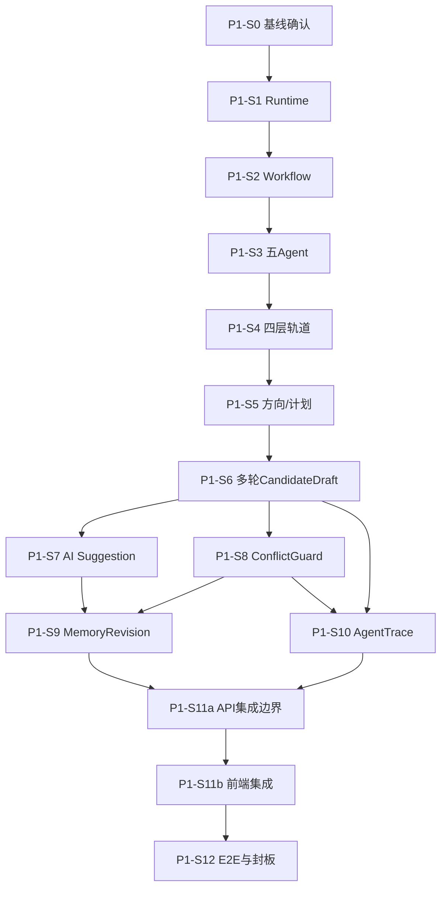

# InkTrace V2.0 P1 开发计划
版本：v1.0  
状态：P1 开发计划（基于已封板/候选冻结详细设计）  
创建日期：2026-05-15  
依据：
- `docs/03_design/InkTrace-V2.0-P1-详细设计总纲.md`
- `docs/03_design/InkTrace-V2.0-P1-实施唯一依据清单.md`
- `docs/03_design/InkTrace-V2.0-P1-01-AgentRuntime详细设计.md`
- `docs/03_design/InkTrace-V2.0-P1-02-AgentWorkflow详细设计.md`
- `docs/03_design/InkTrace-V2.0-P1-03-五Agent职责与编排详细设计.md`
- `docs/03_design/InkTrace-V2.0-P1-04-四层剧情轨道详细设计.md`
- `docs/03_design/InkTrace-V2.0-P1-05-方向推演与章节计划详细设计.md`
- `docs/03_design/InkTrace-V2.0-P1-06-多轮CandidateDraft迭代详细设计.md`
- `docs/03_design/InkTrace-V2.0-P1-07-AISuggestion详细设计.md`
- `docs/03_design/InkTrace-V2.0-P1-08-ConflictGuard详细设计.md`
- `docs/03_design/InkTrace-V2.0-P1-09-StoryMemoryRevision与MemoryReviewGate详细设计.md`
- `docs/03_design/InkTrace-V2.0-P1-10-AgentTrace与可观测性详细设计.md`
- `docs/03_design/InkTrace-V2.0-P1-11-API与前端集成边界详细设计.md`
- `docs/03_design/InkTrace-V2.0-P1-UI-界面与交互设计.md`
- `docs/03_design/InkTrace-DESIGN.md`

---

## 一、文档定位
本文档用于把 P1 已冻结设计转化为可执行开发阶段计划，覆盖：
1. 阶段划分与依赖。
2. 每阶段目标、输入输出、验收标准。
3. 跨模块联调顺序与风险控制。

本文档不做：
1. 不重写详细设计。
2. 不拆到函数级代码任务。
3. 不引入 P2 功能。

---

## 二、P1 开发目标与范围
### 2.1 开发目标
在 P0 最小闭环基础上，完成 P1“完整但受控”的智能体写作闭环：
1. AgentRuntime（单步执行语义）可用。
2. AgentWorkflow（多 Agent 编排语义）可用。
3. 五 Agent 职责与权限闭环可用。
4. 四层剧情轨道、方向推演、章节计划、多轮候选稿、建议、冲突守卫、记忆修订、追踪观测、API/前端边界全链路打通。

### 2.2 必须保持的红线
1. AI 不自动写正式正文。
2. AI 不自动 apply CandidateDraft。
3. AI 不自动 approve/reject/apply MemoryRevision。
4. Agent 不伪造 user_action，不持有 formal_write。
5. Presentation API 不直连 ToolFacade/Provider/Repository。
6. 默认轮询优先，SSE 仅可选增强。

### 2.3 阶段交付前置策略（调试/API/追踪）
1. 每个阶段交付时，必须同步提供最小调试入口或内部 API 验证入口，确保该阶段可独立验证。
2. `P1-S11a` 负责统一 11 组 API 收口与边界一致性。
3. `P1-S11b` 负责前端最小入口打通与轮询主路径落地。
4. AgentTrace 基础贯穿字段从 `P1-S1` 起预留：`request_id / trace_id / session_id / step_id`。
5. `P1-S10` 再完整落地：TraceStore、Metrics、Alerts、UI 查询、留存与降级策略。

---

## 三、阶段总览

| 阶段 | 名称 | 核心交付 | 优先级 |
|---|---|---|---|
| P1-S0 | 基线与封板确认 | 依据清单、分支策略、风险登记 | P1-必须 |
| P1-S1 | Runtime 核心落地 | AgentSession/AgentStep/PPAO/RuntimeService | P1-必须 |
| P1-S2 | Workflow 编排落地 | Stage/Decision/Transition/Policy/Checkpoint | P1-必须 |
| P1-S3 | 五 Agent 职责与权限落地 | Agent 输入输出、Tool 权限矩阵、交接规则 | P1-必须 |
| P1-S4 | 四层剧情轨道落地 | Master/Volume/Sequence/Immediate Window | P1-必须 |
| P1-S5 | 方向推演与章节计划落地 | Direction/Plan/WritingTask 双门控 | P1-必须 |
| P1-S6 | 多轮 CandidateDraft 迭代落地 | Version 链、selected/accepted/applied 三指针 | P1-必须 |
| P1-S7 | AI Suggestion 落地 | Suggestion 类型、决策、转化边界 | P1-重要 |
| P1-S8 | ConflictGuard 落地 | 冲突检测、blocking 策略、apply 前强检 | P1-必须 |
| P1-S9 | MemoryRevision/MemoryReviewGate 落地 | 记忆建议审批、Revision 应用与审计 | P1-必须 |
| P1-S10 | AgentTrace/可观测性落地 | Trace/Audit/Metrics/Alerts/脱敏 | P1-重要 |
| P1-S11a | API 集成边界落地 | 11 组 API、三重门控、幂等与错误码边界 | P1-必须 |
| P1-S11b | 前端集成落地 | UI 入口打通、轮询主路径、SSE 回退 | P1-必须 |
| P1-S12 | E2E 联调与封板验收 | 全链路回归、性能/安全/一致性验收 | P1-必须 |

---

## 四、阶段依赖关系

---

## 五、分阶段计划（可执行）

## 5.1 P1-S0：基线与封板确认
目标：
1. 固化 P1 实施依据与不做边界。
2. 建立阶段验收与回归入口。

交付：
1. 依据清单生效（无后缀文档唯一依据）。
2. 风险登记表（阻塞/主要/次要）。
3. P1 测试分层目录与命名规范。

验收：
1. 在仓库开发入口文档（`README` 或 `docs/README`）新增并合入“`_001.md` 为历史归档、不得作为实现依据”的明确标注。
2. 所有参与开发成员完成一次“P1 实施唯一依据清单”签收确认（记录到阶段验收简报）。

---

## 5.2 P1-S1：AgentRuntime 核心落地（对齐 P1-01）
目标：
1. 实现 AgentSession、AgentStep、AgentObservation、RuntimeService。
2. 实现 PPAO 单步推进与状态机。

交付：
1. Runtime 核心模型与服务。
2. waiting_for_user / cancelled / ignored_late_result 规则。
3. Runtime 与 AIJob 映射关系（投影，不替代业务真源）。
4. 预留 AgentTrace 贯穿字段：`request_id / trace_id / session_id / step_id`。

验收：
1. caller_type=agent 禁止 user_action 专属动作。
2. partial_success 最低原则成立（必须有可交付 result_ref）。

---

## 5.3 P1-S2：AgentWorkflow 编排落地（对齐 P1-02）
目标：
1. 实现 WorkflowDefinition/Run/Stage/Decision/Transition/Policy/Checkpoint。
2. 固化多门控编排顺序。

交付：
1. continuation_workflow / revision_workflow 主链路可跑通。
2. direction_selection_waiting / chapter_plan_confirm_waiting / human_review_waiting / memory_review_waiting 可恢复。

验收：
1. DirectionSelection/PlanConfirmation/HumanReviewGate/MemoryReviewGate 不可自动跳过。
2. max_revision_rounds 生效，禁止无限循环。

---

## 5.4 P1-S3：五 Agent 职责与权限落地（对齐 P1-03）
目标：
1. 五 Agent 输入输出、step 序列、Tool 权限矩阵落地。
2. side_effect_level 与 formal_write_forbidden 生效。

交付：
1. AgentExecutionProfile、AgentToolPermission、AgentResultRef 规范实现。
2. safe_ref/result_ref 交接链路可追踪。

验收：
1. Agent 不直连 Provider/ModelRouter/Repository/DB。
2. Agent 不输出完整 Prompt/ContextPack/正文。

---

## 5.5 P1-S4：四层剧情轨道落地（对齐 P1-04）
目标：
1. 落地 Master/Volume/Sequence/Immediate Window 四层结构与状态。
2. blocked/degraded/ready 判定可用于 ContextPack 与规划。

交付：
1. 轨道模型、继承规则、占位策略。
2. Master Arc 缺失默认 blocked 生效。

验收：
1. Volume/Sequence/Immediate 缺失可 degraded 且含 warning_codes。
2. 不引入可视化复杂图谱编辑器（P2）。

---

## 5.6 P1-S5：方向推演与章节计划（对齐 P1-05）
目标：
1. DirectionProposal A/B/C 生成与用户选择门控。
2. ChapterPlan 生成与用户确认门控。
3. WritingTask 受确认约束后进入 Writer。

交付：
1. DirectionSelection 与 PlanConfirmation 双门控。
2. DirectionPlanSnapshot 与 WritingTask 关联链。

验收：
1. 未确认方向不可启动 Writer。
2. 未确认计划不可启动 Writer。

---

## 5.7 P1-S6：多轮 CandidateDraft 迭代（对齐 P1-06）
目标：
1. CandidateDraft 容器 + CandidateDraftVersion 版本链落地。
2. selected/accepted/applied 三指针规则落地。

交付：
1. ReviewReport/ReviewIssue 驱动 RewriteRequest。
2. max_revision_rounds 默认值落地（按冻结口径）。

验收：
1. accepted != applied 保持成立。
2. apply 仍经 HumanReviewGate 且需 user_action。

---

## 5.8 P1-S7：AI Suggestion（对齐 P1-07）
目标：
1. AISuggestion 类型体系、决策与转化落地。
2. 与 ReviewIssue/ConflictGuard/MemoryUpdateSuggestion 边界落实。

交付：
1. pending→generated→shown→accepted/dismissed/converted... 状态机。
2. convert 到 RewriteInstruction 或门控跳转。

验收：
1. AI Suggestion 不自动执行。
2. risk_warning 不可转自动动作。

---

## 5.9 P1-S8：ConflictGuard（对齐 P1-08）
目标：
1. 冲突检测模型、类型、严重度、处理流程落地。
2. apply 前强制检测落地。

交付：
1. ConflictGuardRecord/Item/Evidence/Resolution/Decision。
2. blocking/warning/info 策略执行。

验收：
1. blocking 未处理时 apply 受限。
2. apply_version_conflict 不可 override（继承 P0 409 语义）。

---

## 5.10 P1-S9：StoryMemoryRevision 与 MemoryReviewGate（对齐 P1-09）
目标：
1. MemoryUpdateSuggestion 正式实体与审批门控落地。
2. StoryMemoryRevision/StoryStateRevision 可审计可回滚。

交付：
1. approve/edit_and_approve/reject/defer + apply 流程。
2. before/after 摘要、版本校验、冲突预检。

验收：
1. `approve / edit_and_approve / reject / defer` 四条路径均有自动化用例（正向）。
2. `before_summary / after_summary` 在 revision 转化与 apply 结果中正确生成并可追溯（正向）。
3. 目标版本冲突（StoryMemory / StoryState）时 apply 被正确阻断且不写正式资产（正向+反向）。
4. MemoryReviewGate 独立于 HumanReviewGate（安全红线）。
5. AI 不自动 approve/reject/apply memory revision（安全红线）。

---

## 5.11 P1-S10：AgentTrace / 可观测性（对齐 P1-10）
目标：
1. Session/Step/Detail 三层追踪视图与审计事件落地。
2. 脱敏、留存、降级、告警策略落地。

交付：
1. AgentTraceEvent、ToolCallTrace、ObservationTrace、UserDecisionTrace。
2. Trace 写入失败降级 + 关键审计失败 fail-safe。
3. TraceStore、Metrics、Alerts、UI 查询、留存与降级策略完整落地。

验收：
1. 不记录完整 Prompt/ContextPack/正文/API Key。
2. ignored_late_result 与 duplicate_ignored 规则生效。

---

## 5.12 P1-S11a：API 集成边界落地（对齐 P1-11）
目标：
1. 11 组 API 资源边界落地。
2. caller_type/user_action/idempotency 三重门控在 API 层落地。

交付：
1. caller_type + user_action + idempotency_key 三重门控。
2. CandidateDraft 主路径、ConflictGuard、MemoryRevision、Trace 查询入口。
3. 错误码分层与 safe_message 规则落地。

验收：
1. 所有门控动作具备三重校验与幂等冲突返回。
2. API 层不直连 ToolFacade/Provider/Repository。
3. AgentTrace detail 仅开发者/高级权限可见。

---

## 5.13 P1-S11b：前端集成落地（对齐 P1-UI + DESIGN）
目标：
1. 前端最小入口可用并与 API 对齐。
2. 轮询主路径稳定，SSE 可选增强可自动回退。

交付：
1. 三栏写作台下 AI/审阅/冲突/记忆入口打通。
2. 轮询状态机与终态停止策略落地。
3. SSE 开关可控且不可用时自动回退轮询。

验收：
1. 前端 11 类入口具备最小可用流（list/detail/action）。
2. 轮询主路径通过冒烟和异常回退用例。
3. SSE 关闭不影响主流程，开启失败自动回退。

---

## 5.14 P1-S12：E2E 联调与封板验收
目标：
1. 完成跨模块联调、回归、封板报告。
2. 输出 P1 开发完成验收报告，确认是否进入 P2 设计/开发。

交付：
1. E2E 用例覆盖：方向选择→计划确认→候选生成→审稿修订→冲突检测→人工 apply→记忆审批→追踪审计。
2. 安全红线回归：无自动 apply、无 formal_write、无敏感泄露。

验收：
1. 所有 P1-01~P1-11 验收项至少 1 条自动化回归。
2. 无阻塞缺陷进入封板。

---

## 六、测试与验收策略
### 6.1 测试分层
1. Domain/Application 单元测试：状态机、门控、策略判定。
2. API 集成测试：权限、幂等、错误码、脱敏响应。
3. E2E 场景测试：跨模块主链路。

### 6.2 强制验收门槛
1. user_action 门控动作 100% 覆盖正反例。
2. apply/approve 类高风险动作覆盖幂等与冲突分支。
3. 关键安全红线必须有自动化用例。

### 6.3 无法运行测试时的处理
1. 必须在阶段报告中记录“未执行项 + 原因 + 风险影响”。
2. 不得以“默认通过”代替测试结论。
3. 阻塞级测试未通过/未执行时，不允许阶段验收通过。

---

## 七、风险登记（P1）

| 风险 | 影响 | 缓解措施 | 是否阻塞 |
|---|---|---|---|
| 多门控状态机交叉复杂 | 流程异常、误跳步 | 先落地统一状态图与转移表，E2E 先行 | 是 |
| caller_type 实现漂移 | 安全边界破坏 | API/Service 双重校验 + 审计 | 是 |
| Candidate 版本并发写入 | selected/accepted/applied 指针错乱 | 判重键+幂等键+并发仲裁规则 | 是 |
| ConflictGuard 误判/漏判 | 错误阻断或放行 | 分级策略+人工确认+可追溯证据 | 否 |
| ConflictGuard 审批时软提示与 apply 时硬阻断边界混淆 | 审批体验被误阻断或 apply 放行异常 | 在 S8/S9 联调前召开专项对齐会，冻结“审批阶段返回值处理”与“apply 阶段阻断处理”两套语义 | 是 |
| 记忆修订覆盖冲突 | 正式资产污染 | apply 前版本校验+ConflictGuard 预检 | 是 |
| Trace 存储压力 | 查询抖动、成本增加 | 分层留存+降级+归档策略 | 否 |
| SSE 环境不稳定 | 前端状态抖动 | 轮询主路径 + SSE 自动回退 | 否 |

---

## 八、里程碑建议

| 里程碑 | 包含阶段 | 出口标准 |
|---|---|---|
| M1：运行内核可用 | S0~S3 | S0~S3 各阶段强制验收项全部通过、无阻塞缺陷、阶段验收简报已提交 |
| M2：写作主链路可用 | S4~S6 | S4~S6 强制验收项全部通过、主路径与关键反向用例通过、无阻塞缺陷 |
| M3：治理与安全可用 | S7~S10 | S7~S10 强制验收项全部通过，审计/脱敏/门控红线自动化回归通过 |
| M4：产品集成可用 | S11a~S12 | API+前端最小闭环全部通过，E2E 回归通过，封板报告与风险闭环完成 |

---

## 九、P1 不做事项（重申）
1. 不引入 P2 自动连续续写队列。
2. 不引入正文 token streaming。
3. 不引入成本/分析看板。
4. 不引入自动修复、自动批量记忆更新。
5. 不引入复杂知识图谱产品化。
6. 不引入绕过人类门控的自动执行动作。

---

## 十、最终建议
1. 先按 M1→M2→M3→M4 顺序执行，避免跨阶段并发过多导致门控错配。
2. 每阶段结束输出“阶段验收简报”（通过/风险/阻塞/下一阶段入口）。
3. 任何涉及 user_action 边界变更，必须先回写设计文档再改代码。
