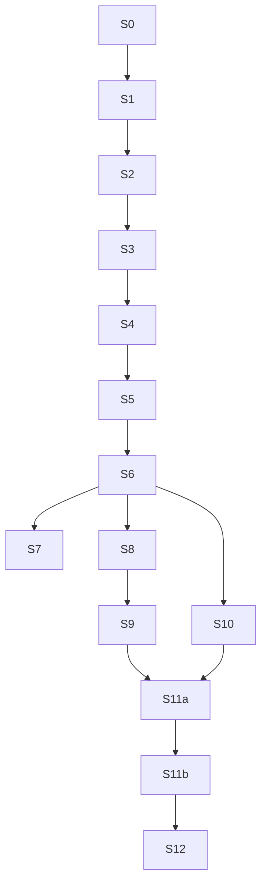

# InkTrace V2.0 P1 开发计划

版本：v2.0  
状态：执行版（基于 P1 全部封板详细设计）  
日期：2026-05-27

依据文档：
- `docs/03_design/InkTrace-V2.0-P1-详细设计总纲.md`
- `docs/03_design/InkTrace-V2.0-P1-01-AgentRuntime详细设计.md`
- `docs/03_design/InkTrace-V2.0-P1-02-AgentWorkflow详细设计.md`
- `docs/03_design/InkTrace-V2.0-P1-03-五Agent职责与编排详细设计.md`
- `docs/03_design/InkTrace-V2.0-P1-04-四层剧情轨道详细设计.md`
- `docs/03_design/InkTrace-V2.0-P1-05-方向推演与章节计划详细设计.md`
- `docs/03_design/InkTrace-V2.0-P1-06-多轮CandidateDraft迭代详细设计.md`
- `docs/03_design/InkTrace-V2.0-P1-07-AISuggestion详细设计.md`
- `docs/03_design/InkTrace-V2.0-P1-08-ConflictGuard详细设计.md`
- `docs/03_design/InkTrace-V2.0-P1-09-StoryMemoryRevision与MemoryReviewGate详细设计.md`
- `docs/03_design/InkTrace-V2.0-P1-10-AgentTrace与可观测性详细设计.md`
- `docs/03_design/InkTrace-V2.0-P1-11-API与前端集成边界详细设计.md`
- `docs/03_design/InkTrace-V2.0-P1-UI-界面与交互设计.md`
- `docs/03_design/InkTrace-DESIGN.md`

---

## 一、计划目标

1. 在不破坏 P0 安全边界的前提下，完成 P1 全链路能力落地。
2. 落地五大门控边界：DirectionSelection、PlanConfirmation、HumanReviewGate、ConflictGuard、MemoryReviewGate。
3. 落地“给人用优先”交互：作者任务路径清晰、技术参数后置、中文任务文案。
4. 形成可验收、可回归、可观测的 P1 交付版本。

---

## 二、强制红线

1. AI 不自动写正式正文。
2. AI 不自动 accept/reject/apply CandidateDraft。
3. AI 不自动 approve/reject/apply MemoryRevision。
4. Agent/workflow/system 不得伪造 user_action。
5. Agent 不得 formal_write。
6. Presentation API 不得直连 ToolFacade/Provider/Repository。
7. 不泄露完整 Prompt/ContextPack/正文/API Key。
8. 不引入 P2 功能。

---

## 三、阶段总览

| 阶段 | 名称 | 交付主题 | 是否阻塞后续 |
|---|---|---|---|
| S0 | 封板基线确认 | 依据锁定、术语统一、验收模板 | 是 |
| S1 | AgentRuntime | Session/Step/PPAO/attempt/waiting_for_user | 是 |
| S2 | AgentWorkflow | Stage/Decision/Transition/Policy/Checkpoint | 是 |
| S3 | 五Agent职责与权限 | 五Agent输入输出、Tool权限、safe_ref交接 | 是 |
| S4 | 四层剧情轨道 | Master/Volume/Sequence/Immediate Window + blocked/degraded | 是 |
| S5 | 方向推演与章节计划 | Direction/Plan/WritingTask 双确认门 | 是 |
| S6 | 多轮CandidateDraft | Version链、selected/accepted/applied 三指针 | 是 |
| S7 | AI Suggestion | 建议层、转化层、门控边界 | 否 |
| S8 | ConflictGuard | 冲突检测、严重度、apply前强检 | 是 |
| S9 | MemoryRevision | MemorySuggestion/Revision/MemoryReviewGate | 是 |
| S10 | AgentTrace可观测性 | Trace/Audit/Metrics/Alerts/留存降级 | 是 |
| S11a | API集成边界 | 11组API收口、三重门控、错误码 | 是 |
| S11b | 前端最小集成 | 三栏入口打通、轮询主路径、SSE回退 | 是 |
| S12 | E2E联调与验收 | 全链路回归、封板报告、P2入口判断 | 是 |

---

## 四、关键依赖

```mermaid
graph TD
  S0 --> S1 --> S2 --> S3 --> S4 --> S5 --> S6
  S6 --> S7
  S6 --> S8 --> S9
  S6 --> S10
  S9 --> S11a
  S10 --> S11a --> S11b --> S12
```

---

## 五、分阶段执行与验收

### S0 封板基线确认

交付：
1. P1 正式文档依据清单冻结。
2. `*_001.md` 明确历史归档，不作为实现依据。
3. 阶段验收模板与缺陷分级模板。

强制验收：
1. 术语表冻结（CandidateDraft、apply、accept、reject、degraded、blocked、waiting_for_user）。
2. 开发入口文档明确 DDD + Clean Architecture + TDD。

### S1 AgentRuntime

交付：
1. AgentSession/AgentStep/Observation 模型与状态推进。
2. waiting_for_user、cancelled、ignored_late_result 行为。
3. request_id/trace_id/session_id/step_id 贯穿字段预留。

强制验收：
1. caller_type=agent 禁止 user_action 专属动作。
2. partial_success 必须存在可交付 result_ref。

### S2 AgentWorkflow

交付：
1. Stage/Transition/Decision/Policy/Checkpoint。
2. 五门控等待态与恢复态。
3. max_revision_rounds 防无限循环。

强制验收：
1. waiting_for_user 不得自动跳过。
2. skip/retry/cancel/resume 行为与文档一致。

### S3 五Agent职责与权限

交付：
1. Memory/Planner/Writer/Reviewer/Rewriter 职责边界。
2. Tool 权限矩阵与 side_effect_level。
3. safe_ref/result_ref 交接链。

强制验收：
1. Agent 不直接访问 Provider/Repository/DB。
2. Agent 不输出完整 Prompt/ContextPack/正文。

### S4 四层剧情轨道

交付：
1. Master/Volume/Sequence/Immediate Window 数据模型。
2. 缺失判定：Master 缺失 blocked，其余缺失 degraded+warning。

强制验收：
1. ContextPack/Planner/Writer 读取轨道约束一致。
2. 不引入轨道可视化图谱编辑器（P2）。

### S5 方向推演与章节计划

交付：
1. DirectionProposal + DirectionSelection。
2. ChapterPlan + PlanConfirmation。
3. WritingTask 构建与写作前置。

强制验收：
1. 未确认方向不得进入 Writer。
2. 未确认计划不得进入 Writer。

### S6 多轮 CandidateDraft

交付：
1. CandidateDraft 容器 + CandidateDraftVersion 版本链。
2. selected_version_id / accepted_version_id / applied_version_id。
3. rewrite/review 迭代规则。

强制验收：
1. accepted != applied。
2. apply 必须 user_action + idempotency_key + 版本校验。

### S7 AI Suggestion

交付：
1. Suggestion 类型体系、状态机、转化规则。
2. 与 ReviewIssue/ConflictGuard/MemoryUpdateSuggestion 边界。

强制验收：
1. 建议不自动执行。
2. convert/accept/dismiss 权限与语义一致。

### S8 ConflictGuard

交付：
1. 冲突类型、严重度、记录模型。
2. 生成后异步检测 + apply 前强制检测。

强制验收：
1. blocking 未处理不得 apply。
2. apply_version_conflict 不可 override。
3. 审批阶段软提示、apply阶段硬阻断边界独立。

### S9 StoryMemoryRevision / MemoryReviewGate

交付：
1. MemoryUpdateSuggestion、StoryMemoryRevision、StoryStateRevision。
2. approve/edit_and_approve/reject/defer + apply 闭环。

强制验收（正向 + 红线）：
1. 四条正向路径均有自动化用例。
2. before/after 摘要与版本校验逻辑可回溯。
3. 版本冲突时阻断 apply 且不写正式资产。
4. MemoryReviewGate 与 HumanReviewGate 语义独立。
5. AI 不自动 approve/reject/apply。

### S10 AgentTrace / 可观测性

交付：
1. Session/Step/Detail 三层视图。
2. UserDecisionTrace、Audit-level Event、告警与降级策略。
3. 留存策略：Detail 默认 90 天可配置，Audit/UserDecision 长期保留。

强制验收：
1. 关键审计事件写失败：高风险 user_action fail-safe 阻断。
2. duplicate_ignored 判重键规则生效。

### S11a API 集成边界

交付：
1. 11 组 API 资源收口与边界一致性。
2. caller_type + user_action + idempotency_key 三重门控。
3. 错误码分层与 safe_message 统一。

强制验收：
1. Presentation API 不得直连 ToolFacade/Provider/Repository。
2. 门控动作全部具备三重校验与幂等冲突返回。

### S11b 前端最小集成

交付：
1. 三栏写作台与右侧工作区入口打通。
2. 轮询主路径 + SSE 可选回退。
3. AI 设置“作者模式”入口。

强制验收（给人用）：
1. 用户 60 秒内完成“分析模型 + 写作模型”配置并测试连接。
2. 用户 120 秒内完成“生成候选→审阅→应用”主流程。
3. 主路径不要求理解 Provider/role/base_url/timeout。

### S12 E2E 联调与封板验收

交付：
1. 全链路 E2E 回归（方向→计划→候选→审阅→冲突→apply→记忆审批→追踪）。
2. 安全红线回归报告。
3. 输出 P1 开发完成验收报告，确认是否进入 P2 设计/开发。

强制验收：
1. S0~S11b 所有强制项通过。
2. 无 blocker 缺陷。

---

## 六、测试策略（TDD 强制）

1. 每阶段必须覆盖：正常路径、错误路径、边界路径、权限门控路径、安全红线路径。
2. 先写失败测试，再写完整实现，再重构。
3. 无法运行测试时，必须提交“原因 + 命令 + 风险 + 人工补跑清单”，不得宣称阶段通过。

---

## 七、风险登记

| 风险 | 影响 | 缓解措施 | 阻塞级 |
|---|---|---|---|
| 门控边界混淆 | 误放行/误阻断 | 门控顺序专项联调（S8/S9/S11a） | 是 |
| Candidate 版本并发 | 指针错乱 | 幂等键 + 判重键 + 并发仲裁 | 是 |
| 审计丢失 | 无法追责 | 高风险动作 fail-safe + critical alert | 是 |
| Trace 膨胀 | 查询抖动 | 分层留存 + 归档 + 降级 | 否 |
| SSE 不稳定 | 状态抖动 | 轮询主路径 + 自动回退 | 否 |
| 用户不可理解 | 功能可用但难用 | 作者模式入口 + 中文任务文案 + 可用性验收 | 是 |

---

## 八、里程碑与量化出口

| 里程碑 | 阶段范围 | 出口标准 |
|---|---|---|
| M1 运行内核可用 | S0~S3 | 各阶段强制验收项通过，无 blocker，阶段简报提交 |
| M2 创作主链路可用 | S4~S6 | 主路径+关键反例通过，无 blocker |
| M3 治理与安全可用 | S7~S10 | 冲突/记忆/追踪红线回归通过 |
| M4 产品集成可用 | S11a~S12 | API+前端+E2E 全量通过，封板报告完成 |

---

## 九、P1 不做事项

1. 不引入 P2 自动连续续写队列。
2. 不引入正文 token streaming。
3. 不引入成本/分析看板。
4. 不引入自动修复、自动批量记忆更新。
5. 不引入复杂知识图谱产品化。

---

## 十、执行结论

1. 本计划可直接执行，阶段依赖与验收标准已量化。
2. 若任一红线被触发，必须停止并回到文档裁决流程。
3. 开发过程中仅允许在不改变冻结业务语义前提下细化实现参数。

