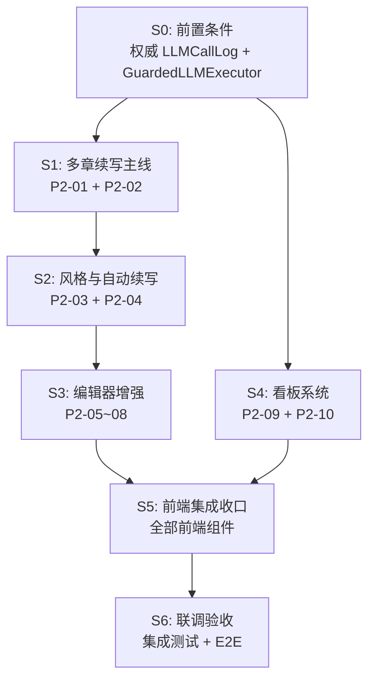

# InkTrace V2.0 P2 开发计划

版本：v1.6 / P2 全量收口执行版（小白作者与功能开关裁决已同步）
日期：2026-07-13
状态：P2-04 方案 A 已本地封版；P2 其余模块进入全量收口，完成前不得宣称 P2 发布验收完成

依据文档：

- `docs/02_architecture/InkTrace-V2.0-P2-架构设计说明书.md`
- `docs/03_design/InkTrace-V2.0-P2-01-多章续写详细设计.md`
- `docs/03_design/InkTrace-V2.0-P2-02-CitationLink详细设计.md`
- `docs/03_design/InkTrace-V2.0-P2-03-StyleDNA详细设计.md`
- `docs/03_design/InkTrace-V2.0-P2-04-自动续写队列详细设计.md`
- `docs/03_design/InkTrace-V2.0-P2-05-AtMention详细设计.md`
- `docs/03_design/InkTrace-V2.0-P2-06-开篇助手详细设计.md`
- `docs/03_design/InkTrace-V2.0-P2-07-大纲辅助详细设计.md`
- `docs/03_design/InkTrace-V2.0-P2-08-选区改写详细设计.md`
- `docs/03_design/InkTrace-V2.0-P2-09-成本看板详细设计.md`（v1.3 冻结版：未知费用/分币种 + 只读查询 Port + 受控预算写）
- `docs/03_design/InkTrace-V2.0-P2-10-分析看板详细设计.md`（v1.2 终版：2 服务拆分 + recompute 端点）
- `docs/03_design/InkTrace-V2.0-P2-11-API与前端集成边界详细设计.md`（v2.5 冻结版：“接着写”入口契约已同步）
- `docs/03_design/InkTrace-V2.0-P2-12-UI集成与交互设计说明书.md`（v2.4 冻结版：“接着写”作者体验已同步）

---

## 一、计划目标

1. 在不破坏 P0/P1 安全边界和 V1.1 写作链路的前提下，完成 P2 全部 10 个模块能力落地。
2. 落地 9 重停止条件（自动续写队列）和三级预算体系（AI 用量与预算）。
3. 落地 Citation Link 校验、Style DNA 提取、编辑器增强（Mention / Opening / Outline Assist / Selection Rewrite）。
4. 落地“AI 用量与预算”和分析看板两个独立页面，并在 SettingsCenter 保留预算/费用设置。
5. 形成可验收、可回归、可观测的 P2 交付版本。
6. 所有用户界面按零基础小说作者设计：白话短路径、技术细节下沉、明确说明是否影响正文。
7. 设置中心提供受控“写作助手”开关；前后端以统一能力状态为准，普通作者不操作环境变量。

---

## 二、强制红线（违反即阻断）

1. AI 不自动写正式正文。
2. AI 不自动 accept/reject/apply CandidateDraft。
3. Agent/workflow/system 不得伪造 user_action。
4. Agent 不得 formal_write。
5. Presentation API 不得直连 ToolFacade/Provider/Repository。
6. 不泄露完整 Prompt/ContextPack/正文/API Key。
7. **P2-04 自动续写队列不自动 apply**（所有 apply 动作必须有 user_action trace）。
8. **P2-09/10 看板不产生新 AI 调用**（纯本地统计聚合）。
9. **P2-10 仅分析已确认章节正文**（不读取 CandidateDraft 正文、Workbench 草稿）。
10. 不引入 P3 功能（多用户协作、云端同步、发布管理等）。

---

## 三、实施方法与交付纪律

1. 严格执行 DDD + Clean Architecture + TDD。
2. 每阶段必须包含：需求对齐、领域模型、应用编排、接口边界、测试资产、验收证据。
3. 每阶段交付时同步提供 API 验证入口和测试覆盖报告。
4. Feature Flag 从 S1 开始贯穿：未启用模块返回 503；P2-09 的看板 Flag 只关闭看板查询，预算门控与 SettingsCenter 预算/价格设置始终可用。
5. P0 前置补字段在 S0 完成，阻塞所有后续阶段。
6. 功能开关采用系统可用性与作者偏好两层控制；作者偏好不得覆盖系统禁用或绕过任何业务门控。

---

## 四、阶段总览

| 阶段 | 名称 | 交付主题 | 是否阻塞后续 | 预估工作量 |
|---|---|---|---|---|
| **S0** | 前置条件 | P0 LLMCallLog 权威事实 + 统一预算调用内核 + 基线确认 | ✅ 阻塞全部 | 中 |
| **S1** | 多章续写主线 | P2-01 Multi-Chapter + P2-02 Citation Link | ✅ 阻塞 S2 | 中 |
| **S2** | 风格与自动续写 | P2-03 Style DNA + P2-04 Auto Queue | ✅ 阻塞 S3（P2-04 依赖 S1；P2-03 实体被 S3 的 Opening/Selection Rewrite 引用） | 大 |
| **S3** | 编辑器增强 | P2-05 Mention + P2-06 Opening + P2-07 Outline Assist + P2-08 Selection Rewrite | ❌ | 大 |
| **S4** | 看板系统 | P2-09 Cost Dashboard + P2-10 Analysis Dashboard | ❌ | 中 |
| **S5** | 前端集成收口 | P2-11 全部前端组件 + Store + 路由 + Feature Flag | ❌ | 中 |
| **S6** | 联调验收 | 集成测试 + E2E + 封板报告 | ✅ 发布前置 | 中 |

---

## 五、关键依赖

---

## 六、分阶段执行与验收

### S0 前置条件（阻塞全部 P2）

#### 背景

P2-09 AI 用量与预算依赖权威 SQLite `llm_call_logs`。当前基线还需补完整 scope、usage/cost 状态、采用引用和不可变摘要，改为 insert-only，并把 JSONL 降为诊断副本；所有生产调用还需统一贯穿 LLMCallScope。旧 `estimated_cost=0.0 + {}` 必须解释为 unknown。P2-10 仍依赖 `candidate_drafts` 的 `applied_at/status`。这些必须在 S4 前验证完成。

#### 交付清单

| # | 任务 | 文件 | 验证方式 |
|---|---|---|---|
| S0-1 | 补 `job_id/run_id/adoption_target_ref/usage_status/cost_status/cost_source/canonical_digest`，冻结 LLMCallScope | `domain/entities/ai/models.py`、`cost_entities.py` | 新旧记录兼容；作品级生产调用 work/job 必填 |
| S0-2 | SQLite LLMCallLog 改 insert-if-absent 权威写；JSONL 降为可选副本；冲突隔离与历史 reconcile | 既有 LLMCallLog Store + 迁移脚本 | 相同摘要幂等、不同摘要冲突；禁止 ON CONFLICT UPDATE |
| S0-3 | 区分 Provider 未调用真零与已发出后 usage/log unknown；权威写失败阻止 completed/CandidateDraft | `llm_call_logger.py`、AIJob/Agent 调用装配 | 故障注入集成测试 |
| S0-4 | `llm_call_logs` 向后兼容 DDL/索引与 retention watermark；保护当前月和活跃/可重试范围 | 数据库迁移与清理任务 | 清理后返回 complete/retention_limited，不破坏当前预算 |
| S0-5 | `candidate_drafts` 表确认含 `applied_at`、`revision_count` 字段（若缺失则补）。**若该表属于 P0/P1 既有表，迁移必须保持向后兼容：旧数据 `applied_at` 默认 NULL，`revision_count` 默认 0** | 数据库迁移脚本 | 集成测试 |
| S0-6 | P2 Feature Flag 基础设施（前端配置文件 + 路由守卫） | `frontend/src/config/p2FeatureFlags.js` | 手动验证：修改 flag 后入口可见/不可见 |
| S0-7 | P2 Feature Flag 后端中间件；冻结 cost-dashboard 与 cost-budget/cost-prices 的例外路由 | `presentation/api/middleware/p2_feature_flag.py` | 看板 false 仅查询 503，预算/价格设置仍可访问 |
| S0-8 | P2 分支基线确认 + 文档依据冻结 | — | Review |
| S0-9 | 冻结并实现 BudgetPolicy/CostUsage/UsageProjection、纯 Domain BudgetGuard、TokenEstimatorPort、PriceResolverService 基础内核 | P2-09 §3~6 对应 Domain/Application/Port | 纯领域表驱动测试 + 价格解析测试 |
| S0-10 | 实现 BudgetGateService + GuardedLLMExecutor + ProviderAttemptGuard；ModelRouter 每个首选/retry/fallback 解析精确模型后单独门控，并把现有 P0/P1 生产调用全部切入 | ModelRouter + Application composition roots | 不同 fallback 价格集成测试；连接测试唯一排除；依赖不得 optional |
| S0-11 | 建立 cost_budgets/model_price_policies 的只读/基础持久化能力；默认无预算时 allow，但仍写不可变价格/用量事实 | Repository/Adapter/兼容 DDL | 无预算正常调用；有预算服务端投影门控 |

#### 强制验收

- [ ] 所有新增 LLMCallLog 字段可正常读写，job/run 范围可精确查询。
- [ ] `estimated_cost` 由 `LLMCallLogger` 按调用时快照计算，不依赖调用方手动传入。
- [ ] `price_snapshot_json` 记录调用时的输入/输出价格、币种、来源与 captured_at；缺失时 cost_status=unknown。
- [ ] 旧空快照 0 元不显示为免费，不使用当前 ModelRouter 价格回算。
- [ ] 同 request_id 完全相同可幂等；usage/快照/范围不同不得 ON CONFLICT 覆盖原成本事实。
- [ ] SQLite 是权威事实，JSONL 不参与查询/预算；Provider 结果落库失败时不创建 CandidateDraft、不标 completed。
- [ ] 当前月、非终态/暂停/可重试 Job、活跃 AutoQueueRun 和 completion_pending 审计不被清理。
- [ ] Domain BudgetGuard 无 I/O；BudgetGate/GuardedLLMExecutor 已成为现有生产模型调用必经路径，连接测试是唯一排除项。
- [ ] 服务端以 TokenEstimator + `LLMRequest.max_tokens` 计算投影；客户端不能提交 projected usage/cost。
- [ ] `candidate_drafts` 表具备 `applied_at` 和 `revision_count` 字段。
- [ ] Feature Flag 基础设施就绪，P2 页面入口默认 `false`；成本看板 flag 不作为预算门控开关。
- [ ] 后端中间件：普通模块 flag=false 返回 503；`enable_cost_dashboard=false` 只关闭 `/cost-dashboard/*`，不关闭预算门控或 Settings API。

---

### S1 多章续写主线（P2-01 + P2-02）

#### 背景

P2-01（多章续写）是 P2 的核心编排层，在 P1 AgentWorkflow 之上封装逐章推进、章间状态更新和 advance API。P2-02（Citation Link）在每次续写/修订后自动提取并校验引用关系。

S1 的交付物被 S2（自动续写队列）直接依赖，必须先完成。

#### 交付清单

| # | 任务 | 文件 | 验证方式 |
|---|---|---|---|
| **领域层** ||||
| S1-1 | MultiChapterSession、MultiChapterStatus 实体与枚举 | `domain/entities/ai/models.py` | 单元测试 |
| S1-2 | CitationLink、CitationStatus 实体与枚举 | `domain/entities/ai/models.py` | 单元测试 |
| S1-3 | MultiChapterSessionRepository（ABC） | `domain/repositories/ai/multi_chapter_session_repository.py` | — |
| S1-4 | CitationLinkRepository（ABC） | `domain/repositories/ai/citation_link_repository.py` | — |
| **基础设施层** ||||
| S1-5 | SQLite 持久化实现 | `infrastructure/persistence/sqlite_multi_chapter_session_repo.py`、`sqlite_citation_link_repo.py` | 集成测试 |
| S1-6 | DDL：`multi_chapter_sessions` 表 + `citation_links` 表 | 数据库迁移脚本 | 集成测试 |
| **应用层** ||||
| S1-7 | MultiChapterContinuationService（start/advance/pause/resume/cancel） | `application/services/ai/multi_chapter_service.py` | 单元测试 + 集成测试 |
| S1-8 | CitationLinkService（extract/verify/batch） | `application/services/ai/citation_link_service.py` | 单元测试 + 集成测试 |
| **表现层** ||||
| S1-9 | API 路由 `/api/v2/ai/multi-chapter/*` | `presentation/api/routers/v2/ai/multi_chapter.py` | API 集成测试 |
| S1-10 | API 路由 `/api/v2/ai/citations/*`（含 verify） | `presentation/api/routers/v2/ai/citations.py` | API 集成测试 |
| S1-11 | `app.py` 注册路由 | `presentation/api/app.py` | 启动验证 |

#### 强制验收

- [ ] `advance` 端点校验 `caller_type=user_action`（反向测试：agent/system 调用被拒）。
- [ ] 章间 StoryState 更新仅为 candidate state（不调 `formal_write`）。
- [ ] Citation 校验失败时 `citation.status = unverified`，不阻断续写。
- [ ] P2-01 生产模型调用复用 S0 GuardedLLMExecutor，贯穿 work/job/session/step；可决策结果预分配 adoption_target_ref。
- [ ] 所有测试通过（`pytest tests/ -k "multi_chapter or citation"`）。

#### 正向测试（最低要求）

| # | 用例 | 预期 |
|---|---|---|
| T1 | 创建多章续写会话 → 生成首章候选稿 | MultiChapterSession.status = RUNNING |
| T2 | advance 推进到下一章 | current_index 递增，上一章 CandidateDraft 保留 |
| T3 | 续写完成后 Citation 自动提取 | citation_links 表有记录 |
| T4 | Citation 校验通过 → status = verified | — |

#### 反向测试（最低要求）

| # | 用例 | 预期 |
|---|---|---|
| T5 | agent 调用 advance | 403 P2_CALLER_FORBIDDEN |
| T6 | Citation 源文本哈希不匹配 | 400 P2_CITATION_SOURCE_HASH_MISMATCH |
| T7 | 取消多章续写 → 已生成 CandidateDraft 不删除 | CandidateDraft 仍在 |

---

### S2 风格与自动续写（P2-03 + P2-04）

#### 背景

P2-03（Style DNA）允许用户上传标杆文本，通过 `model_role=style_extractor` 经 S0 `GuardedLLMExecutor` 提取结构化文风特征，不绑定具体供应商。P2-04（自动续写队列）在 P2-01 之上封装受控逐章编排和 9 重停止条件。

P2-04 依赖 P2-01（S1）的 `MultiChapterContinuationService`，必须在 S1 完成后执行。P2-03 可与 P2-04 并行开发。

#### 交付清单

| # | 任务 | 文件 | 验证方式 |
|---|---|---|---|
| **领域层** ||||
| S2-1 | StyleProfile、StyleProfileStatus、StyleProfileSourceType 实体与枚举 | `domain/entities/ai/models.py` | 单元测试 |
| S2-2 | AutoQueueConfig（含预算提醒/revision）、AutoQueueRun（含预算快照）、StopRecord、StopCondition/Severity/StopEvaluationResult.should_pause | `domain/entities/ai/models.py` | 单元测试 |
| S2-3 | StyleProfileRepository（ABC） | `domain/repositories/ai/style_profile_repository.py` | — |
| S2-4 | AutoQueueConfigRepository + AutoQueueRunRepository（ABC） | `domain/repositories/ai/auto_queue_config_repository.py`、`auto_queue_run_repository.py` | — |
| **基础设施层** ||||
| S2-5 | 已冻结 Repository 的 SQLite 持久化实现 | `infrastructure/persistence/sqlite_style_profile_repo.py`、`sqlite_auto_queue_config_repo.py`、`sqlite_auto_queue_run_repo.py` | 集成测试 |
| S2-6 | DDL：`style_profiles` 表 + `auto_queue_configs` 表 + `auto_queue_runs` 表 | 数据库迁移脚本 | 集成测试 |
| **应用层** ||||
| S2-7 | StyleDNAExtractionService（extract/confirm/disable/get_active） | `application/services/ai/style_dna_extraction_service.py` | 单元测试（mock GuardedLLMExecutor） |
| S2-8 | AutoContinuationQueueService（start/pause/resume/stop/user_confirm_continue） | `application/services/ai/auto_queue_service.py` | 单元测试 + 集成测试 |
| S2-9 | StopConditionEvaluator（9 条件评估） | `application/services/ai/stop_condition_evaluator.py` | 单元测试 |
| **表现层** ||||
| S2-10 | API 路由 `/api/v2/ai/style-dna/*` | `presentation/api/routers/v2/ai/style_dna.py` | API 集成测试 |
| S2-11 | API 路由 `/api/v2/ai/auto-queues/*` | `presentation/api/routers/v2/ai/auto_queues.py` | API 集成测试 |
| S2-12 | `app.py` 注册路由 | `presentation/api/app.py` | 启动验证 |

#### 强制验收

- [ ] `confirm` 端点校验 `caller_type=user_action`。
- [ ] `confirm-continue` 端点校验 `caller_type=user_action`（反向测试：agent 调用被拒）。
- [ ] 每章候选稿就绪后固定进入 `WAITING_USER_DECISION`；没有新的真实 `confirm-continue` 不得生成下一章。
- [ ] 自动队列不自动 apply（所有 apply 动作有 user_action trace）。
- [ ] 停止后 CandidateDraft 全部保留。
- [ ] 不定义 continuous 模式、`queue_mode` 字段或连续推进开关；blocking 后不得推进。
- [ ] 自动队列启动、每次下游调用和显式恢复均经 BudgetGate；确定超限 stop，unknown/check_failed 只 PAUSED。
- [ ] `consumed_tokens` 只由 LLMCallLog 重建；显式恢复通过检查后才追加新的预算快照。
- [ ] Style DNA `extract` 低置信度（<500 字）时 `confidence < 0.5` + `low_confidence_reason`。
- [ ] 所有测试通过（`pytest tests/ -k "style_dna or auto_queue"`）。

#### 正向测试（最低要求）

| # | 用例 | 预期 |
|---|---|---|
| T1 | 上传标杆文本 → extract → PENDING_CONFIRM | StyleProfile 已创建 |
| T2 | confirm → ACTIVE | 旧 ACTIVE → ARCHIVED，新 → ACTIVE |
| T3 | 逐章确认 → 每章暂停于 WAITING_USER_DECISION | 用户真实 confirm-continue 后才继续 |
| T4 | 未确认时禁止自动推进 | 审稿通过后仍不创建下一章调用 |
| T5 | 达到目标章数 → COMPLETED | stop_reason=target_chapters_reached |
| T6 | AI 用量确定超限 → BUDGET_EXCEEDED | 队列停止，CandidateDraft 保留 |

#### 反向测试（最低要求）

| # | 用例 | 预期 |
|---|---|---|
| T7 | agent 调用 confirm-continue | 403 |
| T8 | 连续 2 章 blocking → 停止 | stop_reason=blocking_review_consecutive |
| T9 | 用户手动停止 | stop_reason=user_manual_stop |
| T10 | 启动校验：目标章节数为 0 → 拒绝 | 422 `auto_queue_target_chapters_required` |
| T11 | 用量 unknown/预算查询失败 | PAUSED，无 BUDGET_EXCEEDED StopRecord |
| T12 | 调整预算后显式恢复 | 最新策略检查通过并追加快照才恢复；保存本身不恢复 |

---

### S3 编辑器增强（P2-05 + P2-06 + P2-07 + P2-08）

#### 背景

四个编辑器增强模块可并行开发（彼此无直接依赖）。它们都依赖 P0/P1 已有的 AgentRuntimeService、ToolFacade、CandidateDraft 和 AI Suggestion 基础设施。

**S3 对 S2 的依赖**：P2-06（Opening）的 ImitationRiskReport 和 P2-08（Selection Rewrite）的风格一致性检查可能引用 P2-03 StyleProfile 实体定义，但不需要 StyleDNAExtractionService 已完成。S3 可在 S2 领域模型冻结后启动，不等待 S2 全部 Service 实现。

#### 交付清单

| # | 模块 | 任务 | 新增文件（领域/应用/基础设施/API） |
|---|---|---|---|
| S3-1 | P2-05 | MentionService + ChapterMentionRepository + SQLite + API | `mention_service.py`、`chapter_mention_repository.py`、`sqlite_chapter_mention_repo.py`、`mentions.py` |
| S3-2 | P2-06 | OpeningAgentService + 已冻结 Repository/SQLite/API | 文件边界以 P2-06 与 P2-11 v2.5 附录为准 |
| S3-3 | P2-07 | OutlineAssistService + OutlineApplicationService + validators + API | `outline_assist_service.py`、`outline_application_service.py`、`outline_suggestion_schemas.py`、`outline_assist.py` |
| S3-4 | P2-08 | SelectionRewriteService + Repository + SQLite + validators + API | `selection_rewrite_service.py`、`selection_rewrite_repository.py`、`sqlite_selection_rewrite_repo.py`、`selection_rewrite_schema.py`、`selection_rewrite.py` |
| S3-5 | 全部 | `app.py` 注册本阶段路由 + 向后兼容 DDL | `app.py`、迁移脚本；数量以模块详细设计为准 |

> 注：P2-07（Outline Assist）无独立 Repository——复用 AISuggestion Repository、WritingTask 与 V1.1 WritingAssetService。AISuggestion 新增结构化 `payload: dict` 并由既有文件存储序列化；不新增业务表。追加 4 个 `AISuggestionType` 枚举值。

#### S3 通用强制验收

- [ ] 所有 `apply` 类端点校验真实用户动作。Outline Assist apply 额外强制 `caller_type=user_action`、`user_action=true`、非空 `idempotency_key`、`confirm_apply=true`，并将统一的 `target_revision` 映射为 WritingAssetService `expected_version`。
- [ ] P2-07 生成时从服务端正式资产计算 `target_content_hash`；`selected_text` 仅作为 AI 输入。apply 同时校验 revision + hash，匹配后才整体替换。
- [ ] P2-07 普通成功路径在同一 apply 用例内完成 ConflictGuard 保护记录 acknowledged → resolved；真实冲突保存 blocking record、409 且不写入，用户刷新后重新生成。
- [ ] P2-06 Opening Agent 不新增独立正式正文 apply 端点（CandidateDraft apply 走 P0/P1 标准路径）。
- [ ] P2-05 Mentions API 不直接触发 LLM 调用。
- [ ] P2-08 异步模式：后台执行，HTTP 不阻塞，前端轮询状态。
- [ ] P2-06/07/08 生产模型调用全部经 GuardedLLMExecutor；不得新增直连 ModelRouter/Provider 路径。
- [ ] 所有测试通过（`pytest tests/ -k "mention or opening or outline_assist or selection_rewrite"`）。

#### 各模块正向/反向测试（最低各 2 个）

| 模块 | 正向 | 反向 |
|---|---|---|
| P2-05 | 创建 Mention → 持久化；查询章节 Mentions | agent 调用创建 Mention（403） |
| P2-06 | analyze → strategy → confirm；reject → 策略失效 | 未确认策略调用 generate（400） |
| P2-07 | 章节细纲：明确 ChapterOutline 目标 → suggestion → 先留着 → confirm_apply → apply；写作要点：suggestion → convert → WritingTask(pending) → confirm → ready | agent/system apply 被拒；缺 confirm_apply 被拒；revision/hash 冲突 409 不写；accept 不创建 WritingTask |
| P2-08 | 选区改写 → 异步生成 → 候选 Diff → apply | 选区为空（400）；源文本哈希不匹配（409） |

---

### S4 看板系统（P2-09 + P2-10）

#### 背景

两个看板都不产生新 AI 调用。P2-09 的成本查询纯只读，但预算配置是经过真实用户门、幂等与审计的受控写；P2-10 仍是查询 + 计算缓存。P2-09 依赖 S0 中补齐并正确解释的 `llm_call_logs` 字段。两个模块可并行开发（无直接依赖）。

#### 交付清单

| # | 模块 | 任务 | 新增文件 |
|---|---|---|---|
| S4-1 | P2-09 | LLMCallScope、Cost/Budget/Price 枚举和值对象；usage/cost/history 三种完整度 | `domain/entities/ai/cost_entities.py` |
| S4-2 | P2-09 | 只读成本/采用状态 Port；预算、AutoQueue、价格目录、手动价格、TokenEstimator、Audit、Mutation UoW Ports | P2-09 §4/§12 的 Port 文件 |
| S4-3 | P2-09 | SQLite 成本查询 Adapter + CostDashboardQueryService（summary/trend/details/task-cost） | `llm_call_log_cost_query_port.py`、`sqlite_llm_call_log_cost_query_adapter.py`、`cost_dashboard_query_service.py` |
| S4-4 | P2-09 | 在 S0 价格内核上完善官方目录、CostPricePolicyService 手动价格查询/设置与 Decimal 快照 | `cost_price_policy_service.py`、`price_resolver_service.py`、price Repository/Adapter |
| S4-5 | P2-09 | 在 S0 预算内核上接全 initialization/monthly/auto_queue 三类策略、usage/history 完整度与 P2-04 快照 | `budget_guard.py`、`budget_gate_service.py`、AutoQueue Adapter |
| S4-6 | P2-09 | 审计 S1~S3 新增生产调用均使用 GuardedLLMExecutor；补 adoption_target_ref 与 run scope，故障时阻止结果进入候选/正式链路 | 各 Application composition root |
| S4-7 | P2-09 | CostBudgetService/CostPricePolicyService + CostControlMutation UoW + AgentTrace audit；预算/价格/AutoQueue 配置原子回执 | 对应 Service/Port/Adapter/迁移 |
| S4-8 | P2-09 | P2-04 适配：确定超限 stop，indeterminate 通过 `should_pause` 进入既有 PAUSED；启动/恢复预算快照 | `stop_condition_evaluator.py`、`auto_queue_service.py`、AutoQueue DDL |
| S4-9 | P2-09 | API：cost-dashboard + cost-budget + cost-prices；无 DELETE，看板 Flag 只控制查询 | `cost_dashboard.py`、`cost_budget.py`、`cost_prices.py` |
| S4-10 | P2-10 | AnalysisMetric 实体与维度返回结构 | `domain/entities/ai/analysis_entities.py` |
| S4-11 | P2-10 | AnalysisMetricRepository + SQLite 实现 + DDL | `analysis_metric_repository.py`、`sqlite_analysis_metric_repo.py`、迁移脚本 |
| S4-12 | P2-10 | 分析常量、QueryService、RefreshService 与已冻结 API | P2-10 详细设计文件边界 |
| S4-13 | 全部 | `app.py` 注册本阶段路由 | `app.py`；路由数量以 P2-11 v2.5 为准 |

#### 强制验收

- [ ] CostDashboardQueryService 只做 SELECT，不写 `llm_call_logs`，不调用 ModelRouter/Provider。
- [ ] 旧空快照费用为 unknown；混合币种分开返回；summary/trend 都含 usage/cost/history 完整度和未知调用数。
- [ ] PriceResolver 优先级、手动价格未来生效和 Decimal 计算正确；历史绝不回算。
- [ ] Domain BudgetGuard 不做 I/O；BudgetGateService 负责事实/投影；所有生产模型调用经 GuardedLLMExecutor，连接测试除外。
- [ ] 预算/价格/AutoQueue 设置只允许真实 user_action；pre audit、原子 UoW、completion_pending 重放闭环可恢复。
- [ ] auto_queue 限额只写既有 AutoQueueConfig，不在 cost_budgets 复制。
- [ ] BudgetGuard 正确区分 determined exceeded 与 indeterminate；unknown/check_failed 不得伪装 BUDGET_EXCEEDED。
- [ ] StopEvaluationResult 的 `should_pause` 为向后兼容默认 false；indeterminate 只 PAUSED、不创建预算超限 StopRecord。
- [ ] `enable_cost_dashboard=false` 时看板查询 503，预算仍门控且 cost-budget/cost-prices 可访问。
- [ ] AnalysisDashboardQueryService 不调用 ModelRouter / Provider / embedding。
- [ ] P2-09 Detail 只读投影 adoption_state；`adoption_rate` 从 `candidate_drafts` 聚合且仍由 P2-10 独占。
- [ ] 大作品（>30 万字）读取 `analysis_metrics` 缓存，API 返回 `source: "cached"`。
- [ ] 风格一致性无 StyleProfile 时降级为全章均值 + `warning: "no_active_style_profile"`。
- [ ] 所有测试通过（`pytest tests/ -k "cost_dashboard or cost_budget or budget_guard or analysis_dashboard"`）。

#### 正向测试（最低要求）

| # | 用例 | 预期 |
|---|---|---|
| T1 | 查询作品 summary/trend/details | 分组、日趋势、月份、known/unknown 与分币种正确 |
| T2 | upsert/disable 预算与手动价格 | 普通保存一次确认；关闭预算二次确认；幂等重复不重复写 |
| T3 | check_budget：用量 < 阈值 / 到提醒阈值 | allow / warn，warning 不作为 error |
| T4 | check_budget：确定超限 | allowed=false；公开 P2_BUDGET_EXCEEDED；内部 budget_exceeded |
| T5 | 分析看板写作统计 | chapter_word_counts 按 index 排序 |
| T6 | 无 StyleProfile 时风格一致性 | drift_index 基于全章均值，warning 非空 |
| T7 | 大作品手动 recompute → 轮询 status | 202 → running → completed |

#### 反向测试（最低要求）

| # | 用例 | 预期 |
|---|---|---|
| T8 | 章节未确认 → 分析看板不统计 | word_count = 0 |
| T9 | 小作品调用 recompute | 400（无需异步重算） |
| T10 | stale=true → API 返回 stale=true + 旧数据 | 数据不丢失 |
| T11 | 旧 `estimated_cost=0 + {}` / usage 缺失 | API cost=null、unknown，不显示免费 |
| T12 | CNY + USD | 分币种返回，禁止直接相加；成本预算判定 indeterminate |
| T13 | task-cost 未传或多传 scope | 400 P2_COST_SCOPE_REQUIRED / 422 P2_COST_SCOPE_CONFLICT |
| T14 | agent/system 或缺 user_action/user_id/key 修改预算 | 403/400，预算不变 |
| T15 | 同 key 不同请求、expected_updated_at 过期 | 409，预算不变 |
| T16 | 写前审计失败 | 503 P2_BUDGET_AUDIT_WRITE_FAILED，预算不变 |
| T17 | 提高预算 | 原 paused/stopped 任务不自动恢复，须用户再次确认 |
| T18 | Provider 前本地失败 / Provider 已发出后 usage 缺失 | 前者零调用；后者 unknown 并阻断后续预算调用 |
| T19 | 官方价缺失→作品手动价→全局手动价 | 按精确优先级捕获未来快照；不回算旧记录 |
| T20 | 资源事务提交后 post 审计失败 | 返回首次结果 + completion_pending；同 key 只补审计 |
| T21 | 看板 Flag=false | 看板查询 503；预算继续执行，预算/价格设置可访问 |
| T22 | 全部生产调用路径扫描/集成 | 只通过 GuardedLLMExecutor；连接测试是唯一排除项 |
| T23 | 当前月/活跃 run 清理 | 不删除；历史跨 retention 水位返回 retention_limited |

---

### S5 前端集成收口（P2-11）

#### 背景

S5 集中交付全部前端组件、Store、路由和 Feature Flag 联动。S1~S4 已完成后端 API，S5 前端可基于真实 API 开发。

#### 交付清单

| # | 模块 | 交付物 | 依据 |
|---|---|---|---|
| S5-1 | P2-01/02 | `MultiChapterPanel.vue`（Drawer）+ `useMultiChapterStore.js` + `CitationPopover` 引用浮层 | P2-12 §3.1~3.2 |
| S5-2 | P2-03 | `StyleDNAConfigPanel.vue`（独立配置页；具体路由以现有设置路由体系为准，例如 `/works/:workId/style` 或 `/settings/ai/style-dna`）+ `useStyleDNAStore.js` + 路由注册 | P2-12 §3.3 |
| S5-3 | P2-04 | `AutoQueuePanel.vue`（"AI 助手"聚合 Tab 子视图）+ `useAutoQueueStore.js`（进度条 + 停止通知 + 逐章确认操作） | P2-12 §3.4 |
| S5-4 | P2-05 | `MentionPopup.vue` + `MentionHighlight.vue` + `MentionTooltip.vue` + `useMentionDetector.js` + `useMentionStore.js` | P2-12 §4.1 |
| S5-5 | P2-06 | `OpeningAgentWizard.vue`（4 步 Modal）+ `useOpeningStore.js` | P2-12 §4.2 |
| S5-6 | P2-07 | `OutlineAssistPanel.vue`（"AI 助手"聚合 Tab 子视图）+ SuggestionCard + `useOutlineAssistStore.js` | P2-12 §4.3 |
| S5-7 | P2-08 | `SelectionRewriteToolbar.vue`（浮动）+ `SelectionRewriteDiffModal.vue` + `useSelectionRewrite.js` + `useSelectionRewriteStore.js` | P2-12 §4.4 |
| S5-8 | P2-09 | `CostDashboard.vue` + 查询/预算 Store；SettingsCenter `AICostSettings.vue` + 费用设置 Store | P2-12 v2.4 §5.1~5.2 |
| S5-9 | P2-10 | `AnalysisDashboard.vue`（独立路由页 `/works/:workId/analysis`，6 Tab）+ `useAnalysisDashboardStore.js` | P2-12 §5.3 |
| S5-10 | P2-11 | 路由注册（cost / analysis / settings section / style-dna）+ `p2FeatureFlags.js` + Feature Flag 守卫 | P2-11 v2.5 + P2-12 v2.4 §8 |
| S5-11 | P2-12 | `RightWorkspacePanel.vue` → "AI 助手"聚合 Tab（自动续写 + 大纲辅助 + 开篇助手子视图）+ FeatureDisabled 页面 + 后端 P2_FEATURE_DISABLED 前端处理 | P2-12 §2.2 |
| S5-12 | P2-12 | `PureTextEditor.vue` Mention 注入 + `StatusBar.vue` 自动续写进度指示器 | P2-12 §2.1 |

#### 强制验收

- [ ] Feature Flag `false` 的普通模块入口不可见、API 503；成本看板 false 时 Settings 预算/价格仍可访问。
- [ ] 直接访问未启用路由时显示"这个功能暂未开启"（FeatureDisabled 页面）。
- [ ] 成本看板/分析看板不要求 Provider 已配置（`requiresProviderConfigured: false`）。
- [ ] AI 用量与预算首屏先显示预计费用、月度剩余预算和当前预算状态；GET 不承诺“可以开始”，Token/模型名称/模型服务下沉到次级明细。
- [ ] unknown 费用不显示 0 元/免费，混合币种分别显示；逐条采用状态使用中文且不显示内部 ID/错误码。
- [ ] 普通预算保存不弹二次确认；关闭预算保护必须二次确认；写失败保留原设置，提高预算不自动恢复任务。
- [ ] 月度金额默认、token 保护收进更多设置并以“万 AI 用量”展示；global/work 来源和并发草稿恢复可见。
- [ ] 费用估算明确只影响未来；历史缺价、当前缺价、查询失败使用不同恢复入口。
- [ ] 预算状态同时使用图标、文字和具体用量，不只依赖颜色；趋势、进度条、Modal、字段错误和 live region 可访问。
- [ ] 发起 LLM 调用的功能（多章续写/自动续写/选区改写等）检查 Provider 可用性。
- [ ] RightWorkspacePanel 使用"AI 助手"聚合 Tab，不新增多个独立 P2 Tab。
- [ ] AutoQueuePanel 固定显示“等待你确认”，不提供连续模式或“无需每章确认”入口。
- [ ] AutoQueuePanel 停止后展示 `stop_reason` + 差异化操作按钮（预算/blocking/手动）。
- [ ] 分析看板无 StyleProfile 时展示降级结果 + "前往配置 StyleDNA"入口。
- [ ] 分析看板 `stale=true` 时展示黄色提示条 + "点击重新统计"按钮。
- [ ] 分析看板 AI 使用分析 Tab 展示免责声明："AI 常见词汇仅统计出现频率，不代表文本一定由 AI 生成"。
- [ ] 所有用户可见文案为中文白话（按钮、提示、状态文案不出现英文技术术语）。
- [ ] 所有前端测试通过（`cd frontend && npm test`）。

---

### S6 联调验收

#### 背景

全链路联调，验证 P2 所有模块与 P0/P1/V1.1 体系的兼容性。

#### 交付清单

| # | 任务 |
|---|---|
| S6-1 | P2 全量后端集成测试（`tests/integration/test_p2_*.py`） |
| S6-2 | P2 全量前端 E2E 测试（`tests/e2e/p2/`） |
| S6-3 | V1.1 回归测试（写作/保存/导入/导出不受 P2 影响） |
| S6-4 | P0/P1 回归测试（AgentRuntime/Workflow/ToolFacade 不受 P2 影响） |
| S6-5 | 性能测试：>30 万字作品分析看板批量计算耗时（目标：单次全量 6 维度重算 ≤ 30s；SQLite 环境下 50 万字作品 ≤ 60s） |
| S6-6 | 安全红线全量核查（见 §七） |
| S6-7 | P2 封板报告 |

#### 强制验收

- [ ] P2-01~P2-10 各模块详细设计中定义的全部 API 端点均可正常调用（以各模块详细设计和 P2-11 路由注册清单为准）。
- [ ] P2 全部前端页面可正常渲染（含 Feature Flag 全开和全关两种模式）。
- [ ] V1.1 写作主链路不受影响（手动回归）。
- [ ] P0/P1 AI 续写/审稿/AgentRuntime 不受影响（自动化回归）。
- [ ] 9 重停止条件 + 三级预算 全部可触发并正确停止。
- [ ] 安全红线全部通过（见 §七）。

---

## 七、P2 安全红线全量核查清单

以下红线在 S6 联调验收时逐项核查：

| # | 红线 | 核查方法 |
|---|---|---|
| 1 | AI 不自动写正式正文 | 代码审计：无 `formal_write` 在 Agent/Workflow 路径 |
| 2 | AI 不自动 accept/reject/apply CandidateDraft | 代码审计 + 测试：apply 路径 caller_type=user_action |
| 3 | Agent/workflow/system 不伪造 user_action | 测试：agent/system caller 调用 user_action 端点 → 403 |
| 4 | P2-04 自动队列不自动 apply | 测试：队列运行完成后 CandidateDraft 未被 apply |
| 5 | P2-04 停止后 CandidateDraft 全部保留 | 测试：停止后 candidate_drafts 表仍有记录 |
| 6 | P2-04 章间不写正式 StoryState | 代码审计：无 `story_state_service.update_official` 调用 |
| 7 | P2-09/10 不产生新 AI 调用 | 代码审计：无 ModelRouter/Provider 调用 |
| 8 | P2-09 不存/不展示 API Key、完整 Prompt、ContextPack、正文或候选稿 | 代码审计：查询字段、日志、Trace 与预算表均无敏感内容 |
| 9 | P2-10 仅分析已确认章节 | 代码审计：不读取 CandidateDraft.content 和 EditSession |
| 10 | P2-05 Mention API 不触发 LLM 调用 | 代码审计 |
| 11 | P2-06 Opening 不新增独立 apply 端点 | 代码审计：CandidateDraft apply 走标准路径 |
| 12 | P2-09 CostDashboardQueryService 纯 SELECT | 代码审计 + 测试 |
| 13 | P2-10 不标注"AI 生成嫌疑" | 代码审计：AI 词汇统计结果无判断性标注 |
| 14 | P2-09 预算写不能被 agent/system/旧 AutoQueue 入口旁路 | 权限、幂等、审计失败与预算不变测试 |
| 15 | P2-09 提高/关闭预算不自动恢复任务或越过其他确认门 | 集成测试 + Trace 审计 |
| 16 | 生产 ModelRouter 调用不能绕过 GuardedLLMExecutor | composition root 扫描 + 路径集成测试 |
| 17 | Provider 结果未写入权威 LLMCallLog 时不能产出 CandidateDraft/完成状态 | 故障注入测试 |
| 18 | 看板关闭不能关闭预算保护或设置入口 | Feature Flag 集成测试 |

---

## 八、文件改动面汇总（全量预估）

> **文件、端点、表与 Store 数量不在计划中硬编码**：全部以各模块冻结详细设计和 P2-11 v2.5 附录为准，避免设计演进后旧合计误导实现。

| 层 | 新增 | 修改 |
|---|---|---|
| `domain/entities/ai/` | cost_entities.py、analysis_entities.py、suggestion_payloads.py（追加） | models.py（追加枚举和实体） |
| `domain/repositories/ai/` | 各模块冻结的 Repository/Query/Audit/UoW Ports | — |
| `domain/validators/` | outline_suggestion_schemas.py、selection_rewrite_schema.py | — |
| `infrastructure/persistence/` | 各模块冻结的 SQLite Adapter/UoW | — |
| `application/services/ai/` | 各模块冻结的 Service/Evaluator/Guard/Constants | llm_call_logger.py、agent_runtime_service.py、agent_workflow.py、tool_facade.py、context_pack_service.py、chapter_service.py、style_dna_extraction_service.py |
| `presentation/api/routers/v2/ai/` | 以 P2-11 路由清单为准 | — |
| `presentation/api/routers/v2/` | mentions.py | — |
| `presentation/api/middleware/` | p2_feature_flag.py | — |
| `presentation/api/` | — | app.py（按 P2-11 注册 router） |
| `frontend/src/views/` | CostDashboard.vue、AnalysisDashboard.vue、StyleDNAConfigPanel.vue | — |
| `frontend/src/components/workspace/` | 各模块冻结组件 + FeatureDisabled.vue | PureTextEditor.vue、RightWorkspacePanel.vue、StatusBar.vue |
| `frontend/src/composables/` | useMentionDetector.js、useSelectionRewrite.js | — |
| `frontend/src/stores/` | 各模块冻结 Store | — |
| `frontend/src/config/` | p2FeatureFlags.js | — |
| `frontend/src/router/` | — | index.js（按 P2-11 增加路由与 Feature Flag 守卫） |
| 数据库迁移 | 以各模块冻结 DDL 与 P0 兼容补丁为准 | — |
| 测试 | 与改动模块同域的 TDD 测试资产 | — |

---

## 九、风险与缓解

| 风险 | 概率 | 影响 | 缓解 |
|---|---|---|---|
| P0 LLMCallLog 补字段引入回归 | 中 | 高 | S0 独立阶段，全量回归测试覆盖 |
| P2-04 Auto Queue 与 P2-01 Multi-Chapter 耦合过紧 | 中 | 高 | S1→S2 严格串行，S1 完成后冻结接口再进入 S2 |
| P2-05~08 四个模块并行开发导致合并冲突 | 高 | 中 | S3 启动前在 `models.py` 中预划分各模块的实体区块（注释标记）；独立 Router + Service 文件；app.py 注册收口在 S5。S3 期间 `models.py` 的修改采用先到先得 + review 合并策略 |
| P2-10 分析看板 >30 万字批量计算性能 | 中 | 中 | S4 中做性能基准测试，必要时调整阈值或增加索引 |
| 前端 Mention 注入破坏 PureTextEditor 编辑器稳定性 | 中 | 高 | 通过 composable hook 非破坏性注入；S5 做编辑器回归测试 |
| 某条生产模型调用漏接 GuardedLLMExecutor | 中 | 高 | composition root 静态扫描 + 全路径预算集成测试，依赖禁止 optional |
| LLMCallLog 双写或清理导致预算错误放行 | 中 | 高 | SQLite insert-only 权威源、JSONL 仅副本、当前月/活跃范围保护与 retention 水位 |
| 设置写成功但审计/回执部分失败 | 低 | 高 | pre audit + 资源/receipt 原子 UoW + completion_pending 幂等收口 |
| 缺价或混币让小白无法理解为何暂停 | 中 | 中 | 月度金额优先、错误原因分流、Settings 费用估算未来生效说明、token 保护作为替代 |
