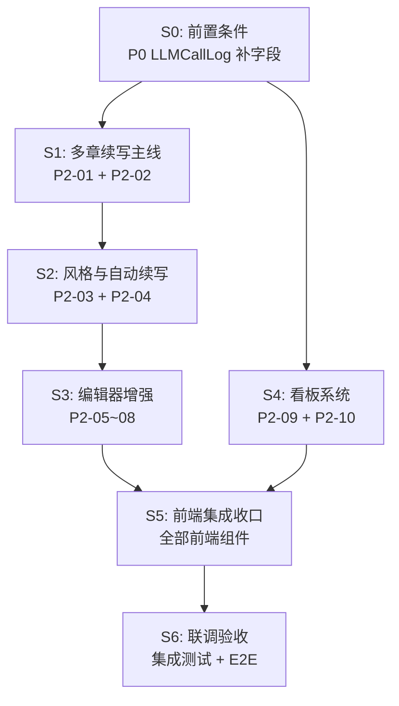

# InkTrace V2.0 P2 开发计划

版本：v1.1 / 封板执行版（对齐 P2-09~P2-12 审查终版）
日期：2026-06-09

依据文档：

- `docs/02_architecture/InkTrace-V2.0-P2-架构设计说明书.md`
- `docs/03_design/InkTrace-V2.0-P2-01-多章续写详细设计.md`
- `docs/03_design/InkTrace-V2.0-P2-02-CitationLink详细设计.md`
- `docs/03_design/InkTrace-V2.0-P2-03-StyleDNA详细设计.md`
- `docs/03_design/InkTrace-V2.0-P2-04-自动续写队列详细设计.md`
- `docs/03_design/InkTrace-V2.0-P2-05-AtMention详细设计.md`
- `docs/03_design/InkTrace-V2.0-P2-06-开篇助手详细设计.md`
- `docs/03_design/InkTrace-V2.0-P2-07-大纲辅助详细设计.md`
- `docs/03_design/InkTrace-V2.0-P2-08-选区改写详细设计.md`
- `docs/03_design/InkTrace-V2.0-P2-09-成本看板详细设计.md`（v1.2 终版：3 服务拆分 + cost-budget 路由 + price_snapshot）
- `docs/03_design/InkTrace-V2.0-P2-10-分析看板详细设计.md`（v1.2 终版：2 服务拆分 + recompute 端点）
- `docs/03_design/InkTrace-V2.0-P2-11-API与前端集成边界详细设计.md`（v1.2 终版：11 组路由 + Feature Flag + 文件清单对齐）
- `docs/03_design/InkTrace-V2.0-P2-12-UI集成与交互设计说明书.md`（v1.1 终版：AI 助手聚合 Tab + 统一交互状态 + 用户确认规范）

---

## 一、计划目标

1. 在不破坏 P0/P1 安全边界和 V1.1 写作链路的前提下，完成 P2 全部 10 个模块能力落地。
2. 落地 9 重停止条件（自动续写队列）和三级预算体系（成本看板）。
3. 落地 Citation Link 校验、Style DNA 提取、编辑器增强（Mention / Opening / Outline Assist / Selection Rewrite）。
4. 落地成本看板和分析看板两个独立看板系统。
5. 形成可验收、可回归、可观测的 P2 交付版本。

---

## 二、强制红线（违反即阻断）

1. AI 不自动写正式正文。
2. AI 不自动 accept/reject/apply CandidateDraft。
3. Agent/workflow/system 不得伪造 user_action。
4. Agent 不得 formal_write。
5. Presentation API 不得直连 ToolFacade/Provider/Repository。
6. 不泄露完整 Prompt/ContextPack/正文/API Key。
7. **P2-04 自动续写队列不自动 apply**（所有 apply 动作必须有 user_action trace）。
8. **P2-09/10 看板不产生新 AI 调用**（纯本地统计聚合）。
9. **P2-10 仅分析已确认章节正文**（不读取 CandidateDraft 正文、Workbench 草稿）。
10. 不引入 P3 功能（多用户协作、云端同步、发布管理等）。

---

## 三、实施方法与交付纪律

1. 严格执行 DDD + Clean Architecture + TDD。
2. 每阶段必须包含：需求对齐、领域模型、应用编排、接口边界、测试资产、验收证据。
3. 每阶段交付时同步提供 API 验证入口和测试覆盖报告。
4. Feature Flag 从 S1 开始贯穿：每个模块独立开关，未启用模块返回 503。
5. P0 前置补字段在 S0 完成，阻塞所有后续阶段。

---

## 四、阶段总览

| 阶段 | 名称 | 交付主题 | 是否阻塞后续 | 预估工作量 |
|---|---|---|---|---|
| **S0** | 前置条件 | P0 LLMCallLog 补字段 + 基线确认 | ✅ 阻塞全部 | 小 |
| **S1** | 多章续写主线 | P2-01 Multi-Chapter + P2-02 Citation Link | ✅ 阻塞 S2 | 中 |
| **S2** | 风格与自动续写 | P2-03 Style DNA + P2-04 Auto Queue | ✅ 阻塞 S3（P2-04 依赖 S1；P2-03 实体被 S3 的 Opening/Selection Rewrite 引用） | 大 |
| **S3** | 编辑器增强 | P2-05 Mention + P2-06 Opening + P2-07 Outline Assist + P2-08 Selection Rewrite | ❌ | 大 |
| **S4** | 看板系统 | P2-09 Cost Dashboard + P2-10 Analysis Dashboard | ❌ | 中 |
| **S5** | 前端集成收口 | P2-11 全部前端组件 + Store + 路由 + Feature Flag | ❌ | 中 |
| **S6** | 联调验收 | 集成测试 + E2E + 封板报告 | ✅ 发布前置 | 中 |

---

## 五、关键依赖

---

## 六、分阶段执行与验收

### S0 前置条件（阻塞全部 P2）

#### 背景

P2-09 成本看板完全依赖 `llm_call_logs` 表。当前 P0 `LLMCallLog` 实体缺失 5 个关键字段（`work_id`、`session_id`、`step_id`、`estimated_cost`、`price_snapshot_json`）。P2-10 分析看板也依赖 `candidate_drafts` 表的 `applied_at` / `status` 字段。这些必须在 P2 启动前补齐。

#### 交付清单

| # | 任务 | 文件 | 验证方式 |
|---|---|---|---|
| S0-1 | LLMCallLog 实体补 `work_id`、`session_id`、`step_id` 字段 | `domain/entities/ai/models.py` | 单元测试：新建 LLMCallLog 可设置新字段 |
| S0-2 | LLMUsage 补 `estimated_cost`、`price_snapshot_json` 字段 | `domain/entities/ai/models.py` | 单元测试 |
| S0-3 | LLMCallLogger.record() 计算 `estimated_cost` + 写入 `price_snapshot_json` | `application/services/ai/llm_call_logger.py` | 单元测试：模拟调用后 LLMCallLog 含 estimated_cost |
| S0-4 | `llm_call_logs` 表 DDL 迁移（补列） | 数据库迁移脚本 | 集成测试：查询新列存在 |
| S0-5 | `candidate_drafts` 表确认含 `applied_at`、`revision_count` 字段（若缺失则补）。**若该表属于 P0/P1 既有表，迁移必须保持向后兼容：旧数据 `applied_at` 默认 NULL，`revision_count` 默认 0** | 数据库迁移脚本 | 集成测试 |
| S0-6 | P2 Feature Flag 基础设施（前端配置文件 + 路由守卫） | `frontend/src/config/p2FeatureFlags.js` | 手动验证：修改 flag 后入口可见/不可见 |
| S0-7 | P2 Feature Flag 后端中间件（拦截未启用模块的 API 请求，返回 503 + P2_FEATURE_DISABLED） | `presentation/api/middleware/p2_feature_flag.py` | 集成测试：flag=false 时 API 返回 503 |
| S0-8 | P2 分支基线确认 + 文档依据冻结 | — | Review |

#### 强制验收

- [ ] 所有新增 LLMCallLog 字段可正常读写。
- [ ] `estimated_cost` 由 `LLMCallLogger` 自动计算，不依赖调用方手动传入。
- [ ] `price_snapshot_json` 记录调用时的输入/输出价格快照。
- [ ] `candidate_drafts` 表具备 `applied_at` 和 `revision_count` 字段。
- [ ] Feature Flag 基础设施就绪，所有 P2 模块默认 `false`。
- [ ] 后端中间件：flag=false 的模块 API 返回 `503` + `error_code: "P2_FEATURE_DISABLED"`（防止绕过前端 Flag 直接调 API）。

---

### S1 多章续写主线（P2-01 + P2-02）

#### 背景

P2-01（多章续写）是 P2 的核心编排层，在 P1 AgentWorkflow 之上封装逐章推进、章间状态更新和 advance API。P2-02（Citation Link）在每次续写/修订后自动提取并校验引用关系。

S1 的交付物被 S2（自动续写队列）直接依赖，必须先完成。

#### 交付清单

| # | 任务 | 文件 | 验证方式 |
|---|---|---|---|
| **领域层** ||||
| S1-1 | MultiChapterSession、MultiChapterStatus 实体与枚举 | `domain/entities/ai/models.py` | 单元测试 |
| S1-2 | CitationLink、CitationStatus 实体与枚举 | `domain/entities/ai/models.py` | 单元测试 |
| S1-3 | MultiChapterSessionRepository（ABC） | `domain/repositories/ai/multi_chapter_session_repository.py` | — |
| S1-4 | CitationLinkRepository（ABC） | `domain/repositories/ai/citation_link_repository.py` | — |
| **基础设施层** ||||
| S1-5 | SQLite 持久化实现 | `infrastructure/persistence/sqlite_multi_chapter_session_repo.py`、`sqlite_citation_link_repo.py` | 集成测试 |
| S1-6 | DDL：`multi_chapter_sessions` 表 + `citation_links` 表 | 数据库迁移脚本 | 集成测试 |
| **应用层** ||||
| S1-7 | MultiChapterContinuationService（start/advance/pause/resume/cancel） | `application/services/ai/multi_chapter_service.py` | 单元测试 + 集成测试 |
| S1-8 | CitationLinkService（extract/verify/batch） | `application/services/ai/citation_link_service.py` | 单元测试 + 集成测试 |
| **表现层** ||||
| S1-9 | API 路由 `/api/v2/ai/multi-chapter/*`（6 端点） | `presentation/api/routers/v2/ai/multi_chapter.py` | API 集成测试 |
| S1-10 | API 路由 `/api/v2/ai/citations/*`（5 端点，含 verify） | `presentation/api/routers/v2/ai/citations.py` | API 集成测试 |
| S1-11 | `app.py` 注册路由 | `presentation/api/app.py` | 启动验证 |

#### 强制验收

- [ ] `advance` 端点校验 `caller_type=user_action`（反向测试：agent/system 调用被拒）。
- [ ] 章间 StoryState 更新仅为 candidate state（不调 `formal_write`）。
- [ ] Citation 校验失败时 `citation.status = unverified`，不阻断续写。
- [ ] 所有测试通过（`pytest tests/ -k "multi_chapter or citation"`）。

#### 正向测试（最低要求）

| # | 用例 | 预期 |
|---|---|---|
| T1 | 创建多章续写会话 → 生成首章候选稿 | MultiChapterSession.status = RUNNING |
| T2 | advance 推进到下一章 | current_index 递增，上一章 CandidateDraft 保留 |
| T3 | 续写完成后 Citation 自动提取 | citation_links 表有记录 |
| T4 | Citation 校验通过 → status = verified | — |

#### 反向测试（最低要求）

| # | 用例 | 预期 |
|---|---|---|
| T5 | agent 调用 advance | 403 P2_CALLER_FORBIDDEN |
| T6 | Citation 源文本哈希不匹配 | 400 P2_CITATION_SOURCE_HASH_MISMATCH |
| T7 | 取消多章续写 → 已生成 CandidateDraft 不删除 | CandidateDraft 仍在 |

---

### S2 风格与自动续写（P2-03 + P2-04）

#### 背景

P2-03（Style DNA）允许用户上传标杆文本，通过 `model_role=style_extractor` 直接调用 Kimi 提取结构化文风特征。P2-04（自动续写队列）在 P2-01 之上封装无人值守逐章编排和 9 重停止条件。

P2-04 依赖 P2-01（S1）的 `MultiChapterContinuationService`，必须在 S1 完成后执行。P2-03 可与 P2-04 并行开发。

#### 交付清单

| # | 任务 | 文件 | 验证方式 |
|---|---|---|---|
| **领域层** ||||
| S2-1 | StyleProfile、StyleProfileStatus、StyleProfileSourceType 实体与枚举 | `domain/entities/ai/models.py` | 单元测试 |
| S2-2 | AutoQueueConfig、AutoQueueRun、AutoQueueStopRecord、StopCondition/StopSeverity/StopEvaluationResult | `domain/entities/ai/models.py` | 单元测试 |
| S2-3 | StyleProfileRepository（ABC） | `domain/repositories/ai/style_profile_repository.py` | — |
| S2-4 | AutoQueueConfigRepository + AutoQueueRunRepository（ABC） | `domain/repositories/ai/auto_queue_config_repository.py`、`auto_queue_run_repository.py` | — |
| **基础设施层** ||||
| S2-5 | SQLite 持久化实现（3 个 repo） | `infrastructure/persistence/sqlite_style_profile_repo.py`、`sqlite_auto_queue_config_repo.py`、`sqlite_auto_queue_run_repo.py` | 集成测试 |
| S2-6 | DDL：`style_profiles` 表 + `auto_queue_configs` 表 + `auto_queue_runs` 表 | 数据库迁移脚本 | 集成测试 |
| **应用层** ||||
| S2-7 | StyleDNAExtractionService（extract/confirm/disable/get_active） | `application/services/ai/style_dna_extraction_service.py` | 单元测试（mock ModelRouter） |
| S2-8 | AutoContinuationQueueService（start/pause/resume/stop/user_confirm_continue） | `application/services/ai/auto_queue_service.py` | 单元测试 + 集成测试 |
| S2-9 | StopConditionEvaluator（9 条件评估） | `application/services/ai/stop_condition_evaluator.py` | 单元测试 |
| **表现层** ||||
| S2-10 | API 路由 `/api/v2/ai/style-dna/*`（5 端点） | `presentation/api/routers/v2/ai/style_dna.py` | API 集成测试 |
| S2-11 | API 路由 `/api/v2/ai/auto-queues/*`（8 端点） | `presentation/api/routers/v2/ai/auto_queues.py` | API 集成测试 |
| S2-12 | `app.py` 注册路由 | `presentation/api/app.py` | 启动验证 |

#### 强制验收

- [ ] `confirm` 端点校验 `caller_type=user_action`。
- [ ] `confirm-continue` 端点校验 `caller_type=user_action`（反向测试：agent 调用被拒）。
- [ ] 自动队列不自动 apply（所有 apply 动作有 user_action trace）。
- [ ] 停止后 CandidateDraft 全部保留。
- [ ] 连续候选模式下 blocking 仍然暂停。
- [ ] Style DNA `extract` 低置信度（<500 字）时 `confidence < 0.5` + `low_confidence_reason`。
- [ ] 所有测试通过（`pytest tests/ -k "style_dna or auto_queue"`）。

#### 正向测试（最低要求）

| # | 用例 | 预期 |
|---|---|---|
| T1 | 上传标杆文本 → extract → PENDING_CONFIRM | StyleProfile 已创建 |
| T2 | confirm → ACTIVE | 旧 ACTIVE → ARCHIVED，新 → ACTIVE |
| T3 | 安全模式逐章确认 → 每章暂停于 WAITING_USER_DECISION | — |
| T4 | 连续候选模式自动推进 | 审稿通过后自动下一章 |
| T5 | 达到目标章数 → COMPLETED | stop_reason=target_chapters_reached |
| T6 | Token 超限 → BUDGET_EXCEEDED | 队列停止，CandidateDraft 保留 |

#### 反向测试（最低要求）

| # | 用例 | 预期 |
|---|---|---|
| T7 | agent 调用 confirm-continue | 403 |
| T8 | 连续 2 章 blocking → 停止 | stop_reason=blocking_review_consecutive |
| T9 | 用户手动停止 | stop_reason=user_manual_stop |
| T10 | 启动校验：目标章数/字数/预算全为 0 → 拒绝 | 422 |

---

### S3 编辑器增强（P2-05 + P2-06 + P2-07 + P2-08）

#### 背景

四个编辑器增强模块可并行开发（彼此无直接依赖）。它们都依赖 P0/P1 已有的 AgentRuntimeService、ToolFacade、CandidateDraft 和 AI Suggestion 基础设施。

**S3 对 S2 的依赖**：P2-06（Opening）的 ImitationRiskReport 和 P2-08（Selection Rewrite）的风格一致性检查可能引用 P2-03 StyleProfile 实体定义，但不需要 StyleDNAExtractionService 已完成。S3 可在 S2 领域模型冻结后启动，不等待 S2 全部 Service 实现。

#### 交付清单

| # | 模块 | 任务 | 新增文件（领域/应用/基础设施/API） |
|---|---|---|---|
| S3-1 | P2-05 | MentionService + ChapterMentionRepository + SQLite + API（4 端点） | `mention_service.py`、`chapter_mention_repository.py`、`sqlite_chapter_mention_repo.py`、`mentions.py` |
| S3-2 | P2-06 | OpeningAgentService + 3 Repository + SQLite（3 个）+ API（5 端点） | `opening_agent_service.py`、`opening_analysis_repository.py` + `opening_strategy_repository.py` + `imitation_risk_report_repository.py` + 3 SQLite、`opening.py`。**3 个 Repository 已与 P2-11 v1.2 附录对齐** |
| S3-3 | P2-07 | OutlineAssistService + OutlineApplicationService + validators（4 schema）+ API（4 端点） | `outline_assist_service.py`、`outline_application_service.py`、`outline_suggestion_schemas.py`、`outline_assist.py` |
| S3-4 | P2-08 | SelectionRewriteService + SelectionRewriteRepository + SQLite + validators + API（4 端点） | `selection_rewrite_service.py`、`selection_rewrite_repository.py`、`sqlite_selection_rewrite_repo.py`、`selection_rewrite_schema.py`、`selection_rewrite.py` |
| S3-5 | 全部 | `app.py` 注册 4 组路由 + DDL（3 张新表） | `app.py`、迁移脚本 |

> 注：P2-07（Outline Assist）无独立 Repository——复用 `ai_suggestion_service` / `writing_task_service` / `writing_asset_service`。DDL 复用 `ai_suggestions` 表（需追加 4 个 `AISuggestionType` 枚举值）。

#### S3 通用强制验收

- [ ] 所有 `apply` 类端点校验 `caller_type=user_action`（Opening strategy confirm/reject、Outline Assist apply、Selection Rewrite apply）。
- [ ] P2-06 Opening Agent 不新增独立正式正文 apply 端点（CandidateDraft apply 走 P0/P1 标准路径）。
- [ ] P2-05 Mentions API 不直接触发 LLM 调用。
- [ ] P2-08 异步模式：后台执行，HTTP 不阻塞，前端轮询状态。
- [ ] 所有测试通过（`pytest tests/ -k "mention or opening or outline_assist or selection_rewrite"`）。

#### 各模块正向/反向测试（最低各 2 个）

| 模块 | 正向 | 反向 |
|---|---|---|
| P2-05 | 创建 Mention → 持久化；查询章节 Mentions | agent 调用创建 Mention（403） |
| P2-06 | analyze → strategy → confirm；reject → 策略失效 | 未确认策略调用 generate（400） |
| P2-07 | generate_chapter_outline → suggestion → apply → WritingTask(pending_confirm) | apply 前 WritingTask 不存在 |
| P2-08 | 选区改写 → 异步生成 → 候选 Diff → apply | 选区为空（400）；源文本哈希不匹配（409） |

---

### S4 看板系统（P2-09 + P2-10）

#### 背景

两个看板模块均为纯只读聚合系统，不产生新 AI 调用。P2-09 依赖 S0 中补齐的 `llm_call_logs` 字段。两个模块可并行开发（无直接依赖）。

#### 交付清单

| # | 模块 | 任务 | 新增文件 |
|---|---|---|---|
| S4-1 | P2-09 | CostBudget 实体 + BudgetCheckResult + CostSummary + CostDetail | `domain/entities/ai/cost_entities.py` |
| S4-2 | P2-09 | CostBudgetRepository（ABC）+ SQLite 实现 + DDL | `cost_budget_repository.py`、`sqlite_cost_budget_repo.py`、迁移脚本 |
| S4-3 | P2-09 | CostDashboardQueryService（3 个查询方法） | `cost_dashboard_query_service.py` |
| S4-4 | P2-09 | CostBudgetService（CRUD + check_budget） | `cost_budget_service.py` |
| S4-5 | P2-09 | BudgetGuard（3 个拦截方法） | `budget_guard.py` |
| S4-6 | P2-09 | API：cost-dashboard（3 端点）+ cost-budget（4 端点） | `cost_dashboard.py`、`cost_budget.py` |
| S4-7 | P2-10 | AnalysisMetric 实体 + 6 个维度返回结构 | `domain/entities/ai/analysis_entities.py` |
| S4-8 | P2-10 | AnalysisMetricRepository（ABC）+ SQLite 实现 + DDL | `analysis_metric_repository.py`、`sqlite_analysis_metric_repo.py`、迁移脚本 |
| S4-9 | P2-10 | STOP_WORDS_ZH / AI_SIGNAL_WORDS / CLIFFHANGER_WORDS 常量 | `analysis_dashboard_constants.py` |
| S4-10 | P2-10 | AnalysisDashboardQueryService（6 个维度查询） | `analysis_dashboard_query_service.py` |
| S4-11 | P2-10 | AnalysisMetricRefreshService（recompute_all/recompute_stale/mark_stale） | `analysis_metric_refresh_service.py` |
| S4-12 | P2-10 | API：analysis-dashboard（8 端点：6 维度查询 + `POST /recompute` + `GET /recompute/status`）。**recompute 端点定义见 P2-10 v1.2 §7** | `analysis_dashboard.py` |
| S4-13 | 全部 | `app.py` 注册 3 组路由 | `app.py` |

#### 强制验收

- [ ] CostDashboardQueryService 只做 SELECT（不写 `llm_call_logs`）。
- [ ] CostBudgetService `check_budget` 返回 `BudgetCheckResult`，不执行暂停。
- [ ] BudgetGuard 三个 check 方法正确区分 job_type 映射。
- [ ] AnalysisDashboardQueryService 不调用 ModelRouter / Provider / embedding。
- [ ] `adoption_rate` 从 `candidate_drafts` 聚合（P2-10 为权威源，P2-09 CostSummary 不含此字段——P2-09 v1.2 已移除）。
- [ ] 大作品（>30 万字）读取 `analysis_metrics` 缓存，API 返回 `source: "cached"`。
- [ ] 风格一致性无 StyleProfile 时降级为全章均值 + `warning: "no_active_style_profile"`。
- [ ] 所有测试通过（`pytest tests/ -k "cost_dashboard or cost_budget or budget_guard or analysis_dashboard"`）。

#### 正向测试（最低要求）

| # | 用例 | 预期 |
|---|---|---|
| T1 | 查询作品成本 summary | by_provider/by_model/by_role 分组正确 |
| T2 | upsert 预算配置 | UNIQUE(work_id, budget_type) 不冲突 |
| T3 | check_budget：用量 < 阈值 | allowed=true, action=allow |
| T4 | check_budget：用量 > 阈值 | allowed=false, action=block |
| T5 | 分析看板写作统计 | chapter_word_counts 按 index 排序 |
| T6 | 无 StyleProfile 时风格一致性 | drift_index 基于全章均值，warning 非空 |
| T7 | 大作品手动 recompute → 轮询 status | 202 → running → completed |

#### 反向测试（最低要求）

| # | 用例 | 预期 |
|---|---|---|
| T8 | 章节未确认 → 分析看板不统计 | word_count = 0 |
| T9 | 小作品调用 recompute | 400（无需异步重算） |
| T10 | stale=true → API 返回 stale=true + 旧数据 | 数据不丢失 |

---

### S5 前端集成收口（P2-11）

#### 背景

S5 集中交付全部前端组件、Store、路由和 Feature Flag 联动。S1~S4 已完成后端 API，S5 前端可基于真实 API 开发。

#### 交付清单

| # | 模块 | 交付物 | 依据 |
|---|---|---|---|
| S5-1 | P2-01/02 | `MultiChapterPanel.vue`（Drawer）+ `useMultiChapterStore.js` + `CitationPopover` 引用浮层 | P2-12 §3.1~3.2 |
| S5-2 | P2-03 | `StyleDNAConfigPanel.vue`（独立配置页；具体路由以现有设置路由体系为准，例如 `/works/:workId/style` 或 `/settings/ai/style-dna`）+ `useStyleDNAStore.js` + 路由注册 | P2-12 §3.3 |
| S5-3 | P2-04 | `AutoQueuePanel.vue`（"AI 助手"聚合 Tab 子视图）+ `useAutoQueueStore.js`（进度条 + 停止通知 + 安全/连续模式切换） | P2-12 §3.4 |
| S5-4 | P2-05 | `MentionPopup.vue` + `MentionHighlight.vue` + `MentionTooltip.vue` + `useMentionDetector.js` + `useMentionStore.js` | P2-12 §4.1 |
| S5-5 | P2-06 | `OpeningAgentWizard.vue`（4 步 Modal）+ `useOpeningStore.js` | P2-12 §4.2 |
| S5-6 | P2-07 | `OutlineAssistPanel.vue`（"AI 助手"聚合 Tab 子视图）+ SuggestionCard + `useOutlineAssistStore.js` | P2-12 §4.3 |
| S5-7 | P2-08 | `SelectionRewriteToolbar.vue`（浮动）+ `SelectionRewriteDiffModal.vue` + `useSelectionRewrite.js` + `useSelectionRewriteStore.js` | P2-12 §4.4 |
| S5-8 | P2-09 | `CostDashboard.vue`（独立路由页 `/works/:workId/cost`）+ `useCostDashboardStore.js` + `useCostBudgetStore.js` | P2-12 §5.1 |
| S5-9 | P2-10 | `AnalysisDashboard.vue`（独立路由页 `/works/:workId/analysis`，6 Tab）+ `useAnalysisDashboardStore.js` | P2-12 §5.2 |
| S5-10 | P2-11 | 路由注册（cost / analysis / style-dna）+ `p2FeatureFlags.js` + Feature Flag 守卫 | P2-11 v1.2 + P2-12 §8 |
| S5-11 | P2-12 | `RightWorkspacePanel.vue` → "AI 助手"聚合 Tab（自动续写 + 大纲辅助 + 开篇助手子视图）+ FeatureDisabled 页面 + 后端 P2_FEATURE_DISABLED 前端处理 | P2-12 §2.2 |
| S5-12 | P2-12 | `PureTextEditor.vue` Mention 注入 + `StatusBar.vue` 自动续写进度指示器 | P2-12 §2.1 |

#### 强制验收

- [ ] Feature Flag `false` 的模块：入口不可见，API 返回 503 + `P2_FEATURE_DISABLED`。
- [ ] 直接访问未启用路由时显示"这个功能暂未开启"（FeatureDisabled 页面）。
- [ ] 成本看板/分析看板不要求 Provider 已配置（`requiresProviderConfigured: false`）。
- [ ] 发起 LLM 调用的功能（多章续写/自动续写/选区改写等）检查 Provider 可用性。
- [ ] RightWorkspacePanel 使用"AI 助手"聚合 Tab，不新增多个独立 P2 Tab。
- [ ] AutoQueuePanel 安全模式显示"等待你确认" + 连续模式显示"无需每章确认"。
- [ ] AutoQueuePanel 停止后展示 `stop_reason` + 差异化操作按钮（预算/blocking/手动）。
- [ ] 分析看板无 StyleProfile 时展示降级结果 + "前往配置 StyleDNA"入口。
- [ ] 分析看板 `stale=true` 时展示黄色提示条 + "点击重新统计"按钮。
- [ ] 分析看板 AI 使用分析 Tab 展示免责声明："AI 常见词汇仅统计出现频率，不代表文本一定由 AI 生成"。
- [ ] 所有用户可见文案为中文白话（按钮、提示、状态文案不出现英文技术术语）。
- [ ] 所有前端测试通过（`cd frontend && npm test`）。

---

### S6 联调验收

#### 背景

全链路联调，验证 P2 所有模块与 P0/P1/V1.1 体系的兼容性。

#### 交付清单

| # | 任务 |
|---|---|
| S6-1 | P2 全量后端集成测试（`tests/integration/test_p2_*.py`） |
| S6-2 | P2 全量前端 E2E 测试（`tests/e2e/p2/`） |
| S6-3 | V1.1 回归测试（写作/保存/导入/导出不受 P2 影响） |
| S6-4 | P0/P1 回归测试（AgentRuntime/Workflow/ToolFacade 不受 P2 影响） |
| S6-5 | 性能测试：>30 万字作品分析看板批量计算耗时（目标：单次全量 6 维度重算 ≤ 30s；SQLite 环境下 50 万字作品 ≤ 60s） |
| S6-6 | 安全红线全量核查（见 §七） |
| S6-7 | P2 封板报告 |

#### 强制验收

- [ ] P2-01~P2-10 各模块详细设计中定义的全部 API 端点均可正常调用（以各模块详细设计和 P2-11 路由注册清单为准）。
- [ ] P2 全部前端页面可正常渲染（含 Feature Flag 全开和全关两种模式）。
- [ ] V1.1 写作主链路不受影响（手动回归）。
- [ ] P0/P1 AI 续写/审稿/AgentRuntime 不受影响（自动化回归）。
- [ ] 9 重停止条件 + 三级预算 全部可触发并正确停止。
- [ ] 安全红线全部通过（见 §七）。

---

## 七、P2 安全红线全量核查清单

以下红线在 S6 联调验收时逐项核查：

| # | 红线 | 核查方法 |
|---|---|---|
| 1 | AI 不自动写正式正文 | 代码审计：无 `formal_write` 在 Agent/Workflow 路径 |
| 2 | AI 不自动 accept/reject/apply CandidateDraft | 代码审计 + 测试：apply 路径 caller_type=user_action |
| 3 | Agent/workflow/system 不伪造 user_action | 测试：agent/system caller 调用 user_action 端点 → 403 |
| 4 | P2-04 自动队列不自动 apply | 测试：队列运行完成后 CandidateDraft 未被 apply |
| 5 | P2-04 停止后 CandidateDraft 全部保留 | 测试：停止后 candidate_drafts 表仍有记录 |
| 6 | P2-04 章间不写正式 StoryState | 代码审计：无 `story_state_service.update_official` 调用 |
| 7 | P2-09/10 不产生新 AI 调用 | 代码审计：无 ModelRouter/Provider 调用 |
| 8 | P2-09 不存 API Key | 代码审计：cost_budgets 表无 key 相关列 |
| 9 | P2-10 仅分析已确认章节 | 代码审计：不读取 CandidateDraft.content 和 EditSession |
| 10 | P2-05 Mention API 不触发 LLM 调用 | 代码审计 |
| 11 | P2-06 Opening 不新增独立 apply 端点 | 代码审计：CandidateDraft apply 走标准路径 |
| 12 | P2-09 CostDashboardQueryService 纯 SELECT | 代码审计 + 测试 |
| 13 | P2-10 不标注"AI 生成嫌疑" | 代码审计：AI 词汇统计结果无判断性标注 |

---

## 八、文件改动面汇总（全量预估）

> **端点数与 Store 数**：P2 各模块的 API 端点和 Pinia Store 数量以各模块详细设计和 P2-11 v1.2 附录文件清单为准。开发实施时以本计划的分阶段交付清单为准，P2-11 仅维护路由注册边界信息。

| 层 | 新增 | 修改 |
|---|---|---|
| `domain/entities/ai/` | cost_entities.py、analysis_entities.py、suggestion_payloads.py（追加） | models.py（追加枚举和实体） |
| `domain/repositories/ai/` | 12 个新 Repository ABC | — |
| `domain/validators/` | outline_suggestion_schemas.py、selection_rewrite_schema.py | — |
| `infrastructure/persistence/` | 12 个新 SQLite 实现 | — |
| `application/services/ai/` | 16 个新 Service / Evaluator / Guard / Constants | llm_call_logger.py（estimated_cost 计算）、agent_runtime_service.py、agent_workflow.py、tool_facade.py、context_pack_service.py、chapter_service.py、style_dna_extraction_service.py |
| `presentation/api/routers/v2/ai/` | 10 个新路由文件 | — |
| `presentation/api/routers/v2/` | mentions.py（1 个） | — |
| `presentation/api/middleware/` | p2_feature_flag.py（1 个，S0-7） | — |
| `presentation/api/` | — | app.py（注册 11 个 router） |
| `frontend/src/views/` | CostDashboard.vue、AnalysisDashboard.vue、StyleDNAConfigPanel.vue | — |
| `frontend/src/components/workspace/` | 9 个新 Vue 组件 + FeatureDisabled.vue | PureTextEditor.vue、RightWorkspacePanel.vue、StatusBar.vue |
| `frontend/src/composables/` | useMentionDetector.js、useSelectionRewrite.js | — |
| `frontend/src/stores/` | 11 个新 Pinia Store | — |
| `frontend/src/config/` | p2FeatureFlags.js | — |
| `frontend/src/router/` | — | index.js（新增 3 条路由 + Feature Flag 守卫） |
| 数据库迁移 | 10 张新表 + 3 张 P0 表补列 | — |
| 测试 | 11 个新测试文件 | — |

---

## 九、风险与缓解

| 风险 | 概率 | 影响 | 缓解 |
|---|---|---|---|
| P0 LLMCallLog 补字段引入回归 | 中 | 高 | S0 独立阶段，全量回归测试覆盖 |
| P2-04 Auto Queue 与 P2-01 Multi-Chapter 耦合过紧 | 中 | 高 | S1→S2 严格串行，S1 完成后冻结接口再进入 S2 |
| P2-05~08 四个模块并行开发导致合并冲突 | 高 | 中 | S3 启动前在 `models.py` 中预划分各模块的实体区块（注释标记）；独立 Router + Service 文件；app.py 注册收口在 S5。S3 期间 `models.py` 的修改采用先到先得 + review 合并策略 |
| P2-10 分析看板 >30 万字批量计算性能 | 中 | 中 | S4 中做性能基准测试，必要时调整阈值或增加索引 |
| 前端 Mention 注入破坏 PureTextEditor 编辑器稳定性 | 中 | 高 | 通过 composable hook 非破坏性注入；S5 做编辑器回归测试 |
