# InkTrace V2.0 概要设计说明书

版本：v2.0-architecture-draft  
依据文档：`docs/01_requirements/InkTrace-V2.0-需求规格说明书.md`  
输出时间：2026-05-08  
设计范围：V2.0 长篇小说 AI 写作智能体工作台概要设计

***

## 一、设计目标与范围

### 1.1 设计目标

InkTrace V2.0 在 V1.1 非 AI 创作工作台基础上接入受控 AI 写作智能体系统。

概要设计目标：

- 保持 V1.1 Local-First 正文保存链路不变。
- 保持正式正文、正式资产、正式 Story Memory 的用户确认边界不变。
- 建立 Core 与 Agent 的清晰隔离。
- 建立 Core Application Tool Facade，作为 Agent 调用 Core 的唯一受控入口。
- 支撑 AI 初始化、Story Memory、Context Pack、Candidate Draft、AI Review、AI Suggestion、Conflict Guard、Agent Trace 等核心能力。
- 支撑 P0 / P1 / P2 分阶段落地。

### 1.2 与 V1.1 的关系

V1.1 已提供：

- Workbench 作品与章节。
- 正文 Local-First 保存。
- 结构化资产：大纲、时间线、伏笔、人物卡。
- 手动保存与乐观锁冲突处理。
- Workbench / Legacy 隔离。

V2.0 只在 Workbench 域之上增加 AI 能力。V2.0 不改变 V1.1 正式正文保存语义，不改变正式资产的人工维护边界。

### 1.3 本文档范围

本文档只做概要设计：

- 不写代码。
- 不生成数据库迁移。
- 不做字段级 API 设计。
- 不做详细数据库结构设计。
- 不调整现有 V1.1 源码。

### 1.4 分阶段概要边界

| 阶段 | 概要目标 | 主要能力 |
|---|---|---|
| P0 | 最小 AI 写作闭环 | AI Settings、Provider、Model Router、AI Job、初始化、P0 最小 Story Memory、Context Pack、Writing Task、单章 Candidate Draft、基础 AI Review |
| P1 | 核心智能体工作流 | Agent Workflow、五类 Agent、四层剧情轨道、A/B/C 方向、章节计划、多轮候选稿、AI 建议区、Conflict Guard、Memory Revision、Agent Trace |
| P2 | 增强能力 | 多章续写、自动连续队列、Style DNA、Citation Link、@ 标签、Opening Agent、大纲辅助、选区改写、成本看板、分析看板 |

***

## 二、总体架构视图

### 2.1 总体架构说明

V2.0 架构分为两个核心部分：

- InkTrace Core：承载 DDD 领域模型、正式业务规则、正式数据边界、Application Services、Repository Ports、Infrastructure Adapters。
- InkTrace Agent：承载 AI Orchestration，负责 Perception → Planning → Action → Observation 的智能体运行循环。

Agent 不直接访问数据库、Provider、Embedding、Vector DB、文件系统、Repository、Domain 或正式资产。Agent 只能通过 Core Application Tool Facade 调用受控业务能力。

### 2.2 总体架构图

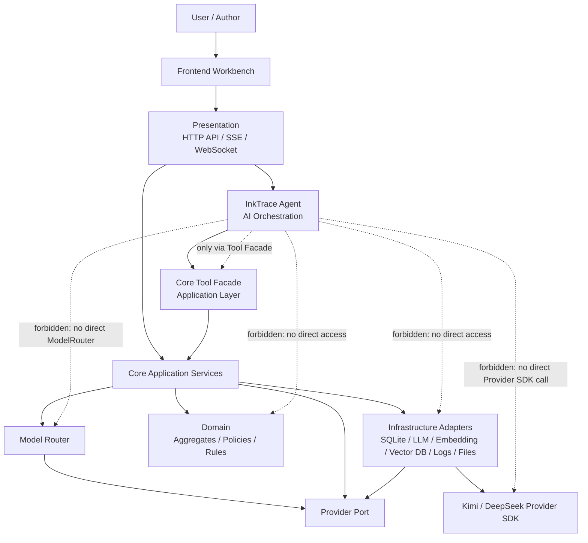

### 2.3 单向依赖原则

- Presentation 依赖 Application。
- Application 依赖 Domain 与 Application Ports / Interfaces。
- Infrastructure 实现 Repository / Provider / Embedding / Vector 等 Ports。
- Agent 依赖 Core Application Tool Facade。
- Agent 不直接依赖 Model Router。
- Agent 不直接依赖 Infrastructure。
- Agent 不直接调用 Kimi / DeepSeek Provider SDK。
- Model Router 由 Core Application Service 调用，并通过 Provider Port 连接 Infrastructure Provider Adapter。
- Agent 不反向成为 Core 的业务真源。
- Tool Facade 是 Core Application 的受控用例入口，不是 Presentation API。

***

## 三、Clean Architecture 分层说明

### 3.1 Presentation 层

职责：

- HTTP API。
- SSE / WebSocket。
- 前端入口。
- 请求认证、请求参数适配、响应格式适配。
- 不承载 Tool 业务语义。

输入：

- 用户请求。
- 前端事件。
- AI Job 查询。

输出：

- API 响应。
- SSE / WebSocket 事件。
- 前端所需 DTO。

P0 / P1 / P2 归属：

- P0：AI 初始化入口、候选稿入口、任务进度入口。
- P1：Agent Workflow、AI 建议区、剧情轨道入口。
- P2：自动续写、@ 引用、Opening Agent、分析看板入口。

### 3.2 Application 层

职责：

- Core Application Services。
- Tool Facade。
- Application Ports / Interfaces。
- Use Case 编排。
- Human Review Gate。
- Conflict Guard。
- Context Pack 构建。
- Candidate Draft 创建。
- AI Suggestion 创建。
- Story Memory Update Suggestion 创建。
- Job 编排。

输入：

- Presentation 请求。
- Agent Tool 调用。
- Job 调度事件。

输出：

- 受控业务结果。
- 候选稿。
- 建议。
- 审稿报告。
- Agent Trace 记录。

Application 通过 Ports 调用外部能力，不直接依赖 Infrastructure 具体实现。Model Router、ContextPackService、Prompt Registry 均属于 Core Application / AI Infrastructure 的受控能力，不能被 Agent 直接调用。

### 3.3 Domain 层

职责：

- 正式业务规则。
- 聚合边界。
- 正式数据约束。
- Human Review Gate Policy。
- Conflict Guard Policy。
- AgentPermissionPolicy。
- CandidateDraft 状态规则。
- StoryMemoryRevision 规则。

Domain 不负责：

- 调用 LLM。
- 拼 Prompt。
- 访问数据库。
- 执行 Agent 循环。

### 3.4 Infrastructure 层

职责：

- SQLite。
- Repository Adapters。
- LLM Provider Adapters。
- Embedding Adapter。
- Vector DB Adapter。
- 文件读取。
- 日志。
- API Key 安全存储。

Infrastructure 不负责：

- 判定 AI 是否可以写正式数据。
- 决定候选稿是否合并。
- 承载 Agent 业务权限。

Infrastructure 实现 Application Ports / Interfaces。Infrastructure 可组装 Domain 对象，但 Domain 不依赖 Infrastructure。

### 3.5 Agent Orchestration 位置

Agent 是 AI Orchestration 模块，不是 Domain，不是 Infrastructure，也不是传统 Presentation。Agent 更像“非人类用户的自动化入口 / 应用层编排客户端”。

Agent 可以独立模块化，但不能成为绕过 Core 的第二套业务系统。

### 3.6 Tool Facade 归属

Tool Facade 属于 Core Application 层。

CoreToolFacade 是 Application 层独立门面服务，不内嵌在 Minimal Continuation Workflow 中。Minimal Continuation Workflow 只能依赖 CoreToolFacade；CoreToolFacade 再调用 WritingTaskService、ContextPackService、WritingGenerationService、CandidateDraftService、ReviewService、AIJobService 等 Application Services。P1 Agent Runtime 复用同一个 CoreToolFacade，不另建工具入口。

原因：

- Tool 暴露的是用例级能力，不是 HTTP 传输能力。
- Tool 必须执行 Core 的正式业务规则和权限策略。
- Tool 必须封装 Application Services。
- Tool HTTP API 只能是未来跨进程传输适配，不是 Tool 本体。

ContextPackService 属于 Core Application。Agent 只能通过 `build_context_pack` Tool 请求构建 Context Pack，不能自行读取章节、大纲、Story Memory、Vector DB 后拼接上下文。

Prompt Registry 属于 Core Application / AI Infrastructure。Agent 使用 `prompt_key` 与 `prompt_version`，Prompt 输出必须绑定 schema。Prompt 不能承载越权业务规则，业务边界必须由 Domain Policy 与 Application Service 约束。

### 3.7 Clean Architecture 分层图

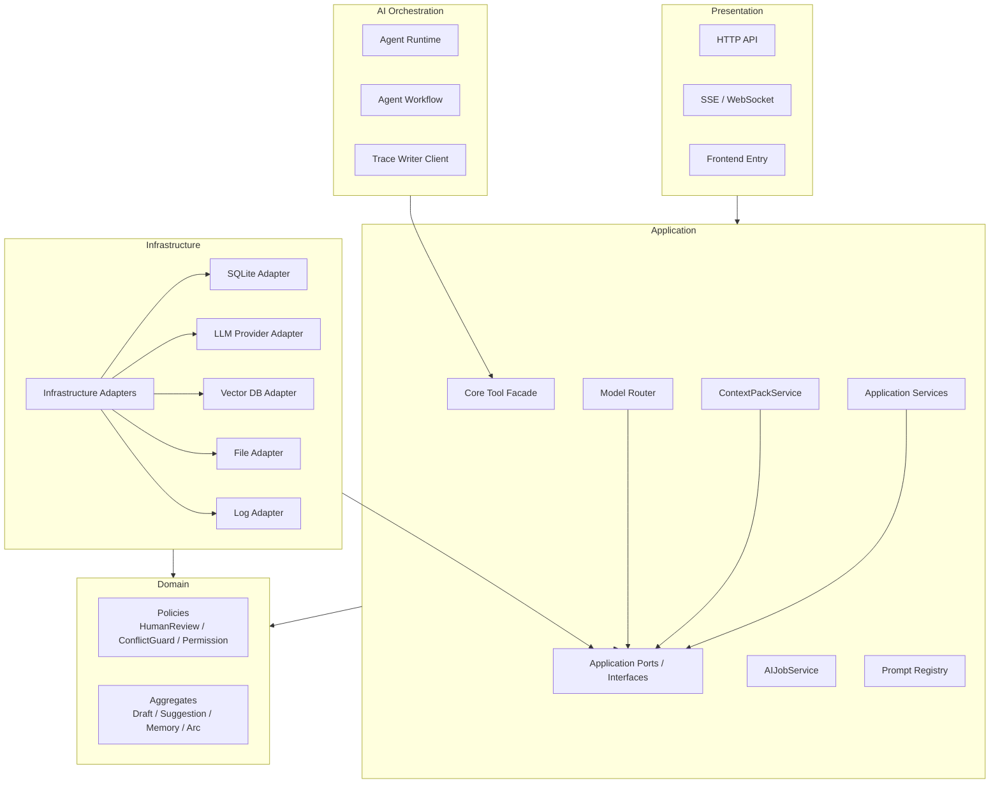

***

## 四、Core + Agent 关系设计

### 4.1 Agent 是否可以独立

P1 起，Agent 可以作为独立模块：

- 独立维护 Agent Runtime。
- 独立维护 Agent Session。
- 独立维护 Agent Step。
- 独立维护 Agent Trace 编排。
- 独立维护 Agent Workflow。

P0 不实现完整 Agent Runtime。P0 只实现 Minimal Continuation Workflow，可使用 Lightweight AgentRunContext / WorkflowRunContext 记录最小单章续写编排上下文。P0 必须遵守 Agent 边界和 Tool Facade 调用方式，但不要求完整 Perception → Planning → Action → Observation 循环，不要求完整 AgentSession / AgentStep / AgentObservation。

但 Agent 不可以成为独立业务系统：

- 不拥有正式正文写入权。
- 不拥有正式资产写入权。
- 不拥有正式 Story Memory 写入权。
- 不直接访问数据库。
- 不直接调用 Infrastructure。

### 4.2 Agent 为什么不是另一个 DDD 域

Agent 负责“如何执行 AI 工作流”，不是“正式小说业务事实”的所有者。

正式小说业务事实仍属于 Core Domain：

- Work。
- Chapter。
- Asset。
- CandidateDraft。
- AISuggestion。
- StoryMemory。
- StoryArc。
- HumanReviewGate。
- ConflictGuard。

Agent 只能通过 Tool Facade 申请读取、生成、建议或请求人工确认。

### 4.3 同进程与未来跨进程

P0 可采用同进程调用：

- Minimal Continuation Workflow 作为后端内部编排用例。
- WorkflowRunContext 记录本次续写所需的临时上下文。
- WorkflowRunContext 通过 Core Tool Facade 调用受控能力。

未来可扩展为跨进程：

- Agent Service 独立部署。
- Tool Facade 通过 HTTP / RPC 传输适配暴露。
- Tool HTTP API 只是传输层 Adapter，不改变 Tool Facade 的 Application 层归属。

### 4.4 Candidate Draft 接受边界

`accept_candidate_draft` / `apply_candidate_to_draft` 不是 Agent Tool。

用户点击接受候选稿后，由 Presentation 调用 Core Application 的 `accept_candidate_draft` / `apply_candidate_to_draft` 用例。该用例将候选稿内容放入当前章节草稿区，后续保存继续走 V1.1 Local-First 保存链路。

Agent 无权调用 `accept_candidate_draft`，无权伪造用户确认。Tool Facade 可以提供 `request_human_review`、`create_candidate_draft`、`create_candidate_version`，但不提供 `accept_candidate_as_user`。

### 4.5 Core + Agent 依赖图

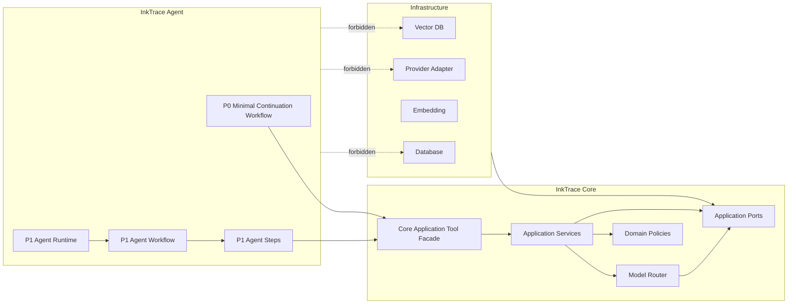

***

## 五、Agent Runtime 概要设计

### 5.1 P0 / P1 Runtime 分层说明

P0 不实现完整 Agent Runtime。P0 采用 Minimal Continuation Workflow，使用 Lightweight AgentRunContext / WorkflowRunContext 承载单章续写所需的最小编排状态。

P0 允许使用 Writer-like step 与 Reviewer-like step，但它们只是单章续写流程中的最小步骤，不是完整 Agent。

P1 才引入完整 Agent Runtime、AgentSession、AgentStep、AgentObservation、AgentTrace 与完整 Perception → Planning → Action → Observation 循环。

| 对象 | 用途 | 阶段 |
|---|---|---|
| ToolResult | Tool Facade 调用结果 | P0 |
| WorkflowRunContext / Lightweight AgentRunContext | P0 单章续写最小编排上下文 | P0 |
| AgentSession | 一次完整 Agent 任务的会话容器 | P1 |
| AgentStep | Agent 执行中的单个步骤 | P1 |
| AgentObservation | 对 Tool / Model / User 结果的观察记录 | P1 |
| AgentResult | Agent Workflow 的最终输出 | P1 |
| AgentTrace | 全链路执行轨迹 | P1 |

### 5.2 P1 完整运行模型

Agent Runtime 采用 Perception → Planning → Action → Observation。

Perception：

- 感知用户任务。
- 感知当前章节。
- 感知作品大纲。
- 感知 Story Memory。
- 感知 Story State。
- 感知剧情轨道。
- 感知候选稿。
- 感知审稿历史。

Planning：

- 生成执行计划。
- 生成 Writing Task。
- 生成章节计划。
- 生成 Tool 调用顺序。
- 选择 Agent Workflow。

Action：

- 调用 Core Tool Facade。
- 通过受控工具触发 Model Router。
- 生成候选稿。
- 生成审稿报告。
- 生成 AI 建议。
- 生成记忆更新建议。

Observation：

- 检查 Tool Result。
- 检查模型输出。
- 检查 schema 校验结果。
- 检查审稿结果。
- 检查错误状态。
- 检查用户反馈。
- 决定继续、修订、暂停、失败或等待用户确认。

### 5.3 Agent Runtime 对象

| 对象 | 用途 | 阶段 |
|---|---|---|
| WorkflowRunContext / Lightweight AgentRunContext | P0 单章续写最小编排上下文 | P0 |
| AgentSession | 一次用户 AI 任务的会话容器 | P1 |
| AgentStep | Agent 执行中的单个步骤 | P1 |
| AgentObservation | 对 Tool / Model / User 结果的观察记录 | P1 |
| AgentResult | Agent Workflow 的最终输出 | P1 |
| ToolResult | Tool Facade 调用结果 | P0 |
| AgentTrace | 全链路执行轨迹 | P1 |

### 5.4 Agent 状态

Agent 状态：

- idle。
- perceiving。
- planning。
- acting。
- observing。
- waiting_for_user。
- paused。
- failed。
- completed。

### 5.5 PPAO 循环图

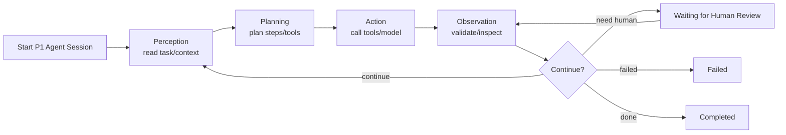

PPAO 循环图描述 P1 完整 Agent Runtime。P0 Minimal Continuation Workflow 不要求实现完整循环。

***

## 六、Tool Facade 概要设计

### 6.1 Tool Facade 职责

Tool Facade 是 Agent 调用 Core 的唯一受控入口。

职责：

- 封装 Core Application Services。
- 暴露用例级安全工具。
- 执行 Tool 权限校验。
- 执行 Human Review Gate。
- 执行 Conflict Guard。
- 隐藏 Repository、数据库、Provider、Vector DB 细节。
- 返回结构化 Tool Result。
- Tool Facade 只负责工具注册、权限校验、参数适配、调用 Application Service、包装 ToolResult、记录 forbidden / observation。
- Tool Facade 不承载核心业务逻辑，不成为 CRUD 后门或上帝服务。

### 6.2 Tool 分类

Read Tools：

- `get_work_outline`
- `get_chapter_context`
- `get_story_memory`
- `get_story_state`
- `get_story_arcs`
- `search_related_memories`

Build Tools：

- `build_context_pack`
- `create_writing_task`

Safe Write Tools：

- `create_candidate_draft`
- `create_review_report`
- `create_ai_suggestion`
- `create_memory_update_suggestion`

Trace / Job Tools：

- `write_agent_trace`
- `request_human_review`
- `update_ai_job_progress`
- `record_tool_observation`

Forbidden Tools：

- `update_official_chapter_content`
- `overwrite_character_asset`
- `delete_asset`
- `create_official_chapter_directly`
- `update_story_memory_directly`
- `accept_suggestion_as_user`
- `bypass_human_review_gate`
- `call_llm_provider_directly`
- `access_database_directly`
- `access_vector_db_directly`

Forbidden Tools 不是实际注册的工具。Forbidden Tools 是禁止清单和安全说明，用于说明 Agent 永远不能获得的能力。

### 6.3 Tool 权限边界

Tool Facade 只能暴露安全用例级工具，不暴露危险写操作。

Agent 不能：

- 写正式正文。
- 覆盖正式资产。
- 创建正式章节。
- 直接更新正式 Story Memory。
- 伪造用户采纳。
- 绕过 Human Review Gate。
- 调用 Provider SDK。

落地机制：

- 第一层：Tool Registry 只注册允许工具。
- 第二层：AgentPermissionPolicy 按 Agent 类型校验可调用工具。
- 第三层：Core Application Service 执行 Human Review Gate / Conflict Guard。

未注册工具、越权工具、危险写操作必须返回 forbidden。forbidden 结果需要写入 AgentTrace 或安全日志。

`accept_candidate_draft` / `apply_candidate_to_draft` 不属于 Agent Tool。用户接受候选稿时，由 Presentation 调用 Core Application 用例完成，Agent 不参与用户确认后的正式应用动作。

### 6.4 Tool Facade 结构图

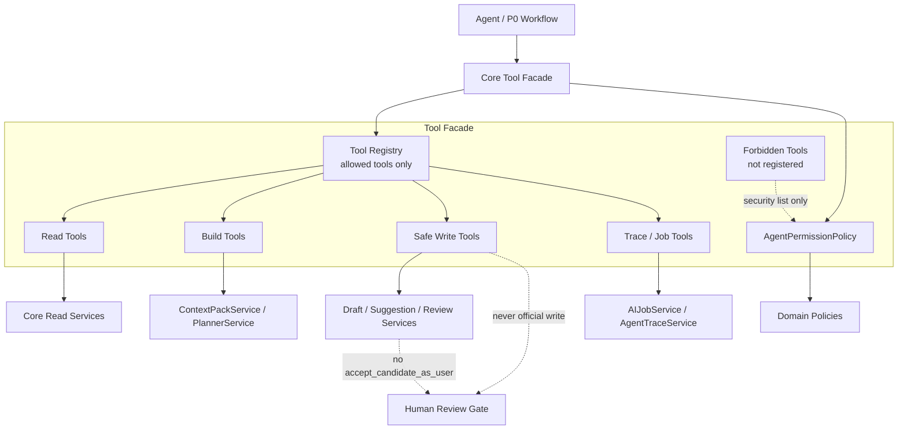

***

## 七、核心子系统概要设计

### 7.1 AI Infrastructure

职责：

- 统一 Provider 抽象。
- 统一 Model Router。
- 管理 Prompt Registry。
- 校验结构化输出。
- 记录 LLM Call Log。
- 管理 AI Settings。

输入：

- Agent 或 Application 的模型角色请求。
- Prompt key。
- Context Pack。
- Model options。

输出：

- 模型输出。
- 结构化校验结果。
- 调用日志。
- 成本记录。

关系：

- Agent 不直接调用 Provider。
- Agent 通过 Tool Facade 触发 Application 用例。
- Application 通过 Model Router 调用 Provider Adapter。
- Prompt Registry 属于 Core Application / AI Infrastructure。
- Agent 只使用 `prompt_key` / `prompt_version`。
- Prompt 输出必须绑定 schema，并经过 Output Validator。
- Prompt 不承载越权业务规则，正式边界由 Domain Policy / Application Service 约束。

阶段：

- P0 完成 Provider、Model Router、Prompt Registry、Output Validator、AI Settings、调用日志。
- P1 增加 Agent Trace 深度关联。
- P2 增加成本看板与高级配置。

### 7.2 AI Job System

职责：

- 执行长任务。
- 管理 Job 与 Job Step。
- 管理进度、暂停、继续、取消、失败重试。
- 支持跳过失败章节、重新分析某章、重新构建记忆。

输入：

- 大纲分析任务。
- 正文分析任务。
- 摘要生成任务。
- 人物/伏笔提取任务。
- 向量索引构建任务。

输出：

- Job 状态。
- Job Step 结果。
- 进度事件。
- 失败原因。

阶段：

- P0 支撑初始化长任务。
- P1 支撑 Agent Workflow 长流程。
- P2 支撑自动续写队列。

### 7.3 Story Memory

职责：

- 维护小说长期记忆。
- 支撑 Context Pack。
- 支撑审稿与规划。
- 维护 Story Memory Revision。

StoryMemory 与 StoryState 同属 Story Memory 子系统，但职责不同：

- StoryMemory：长期记忆，包含章节摘要、全书当前进度、角色状态、伏笔、设定、记忆版本。
- StoryState：当前状态锁，包含当前地点、在场角色、当前阶段、禁止事项、当前上下文约束。

概要设计不将二者混为万能 MemoryService。详细设计阶段再决定是否拆分 StoryMemoryService 与 StoryStateService。

P0 最小记忆：

- 章节摘要。
- 全书当前进度摘要。
- 主要角色状态。
- 当前 Story State。
- 基础伏笔候选。
- 基础设定事实。
- 向量索引。

P1 完整记忆：

- 阶段摘要。
- 卷摘要。
- 完整角色状态。
- 剧情事件。
- 时间线。
- 伏笔状态。
- 地点。
- 风格画像。
- Story Memory Revision。

### 7.4 Vector Recall

职责：

- 正文切片。
- Embedding。
- Vector Index。
- RAG 召回。
- 索引更新与重建。

输入：

- 章节正文。
- 当前章节上下文。
- Writing Task。
- 查询条件。

输出：

- Top-K 相关片段。
- 来源章节与位置。
- 相似度信息。

阶段：

- P0 建立初始索引和 Top-K 召回。
- P1 接入 Attention Filter 与审稿。
- P2 接入 Citation Link。

### 7.5 Context Pack

职责：

- 构建 AI 使用的上下文情报包。
- 管理 Token Budget。
- 执行 Attention Filter。
- 执行四层剧情轨道保底。
- 生成 Context Snapshot。

ContextPackService 属于 Core Application。Agent 只能通过 Tool Facade 的 `build_context_pack` 请求构建 Context Pack。Agent 不能自行读取章节、大纲、Story Memory、Vector DB 并拼接上下文。

输入：

- work_id。
- chapter_id。
- operation_type。
- 选区范围。
- Writing Task。
- 目标模型。

输出：

- Context Pack。
- Token 明细。
- 裁剪记录。
- 引用来源。

P0：

- 使用当前章节、最近摘要、Story State、Writing Task、基础记忆、RAG 召回。
- 四层轨道使用最小占位：全书当前进度摘要、当前 Story State、最近章节摘要。

P1：

- 升级为完整四层剧情轨道。

### 7.6 Agent Workflow

职责：

- 编排 Memory Agent、Planner Agent、Writer Agent、Reviewer Agent、Rewriter Agent。
- 维护 Agent Session、Step、Observation、Trace。

Agent 职责：

- Memory Agent：负责大纲分析、正文分析、章节摘要、记忆更新建议。
- Planner Agent：负责方向推演、章节计划、Writing Task。
- Writer Agent：负责候选稿生成。
- Reviewer Agent：负责审稿报告。
- Rewriter Agent：负责候选稿修订。

P0 不要求完整 Memory Agent Runtime，但 P0 的大纲分析、正文分析必须为 P1 Memory Agent 预留扩展点。

阶段：

- P0 可先由 Application 用例完成最小续写编排。
- P1 完整引入 Agent Workflow。
- P2 增加 Opening Agent 与自动续写队列。

### 7.7 Candidate Draft

职责：

- 隔离 AI 写作结果与正式正文。
- 管理候选稿版本。
- 支持用户反馈。
- 支持接受、编辑后接受、插入、替换、丢弃、重新生成。
- 支持 P0 最小拒绝理由追踪：discarded / rejected 时允许记录 reject_reason_text，可为空；reject_reason_code 作为可选扩展方向。
- P0 不做拒绝理由统计分析；P1 可扩展 reason_code 统计、质量分析与 Prompt 优化闭环。

输入：

- Writer Agent 输出。
- Rewriter Agent 输出。
- 用户反馈。

输出：

- Candidate Draft。
- Candidate Draft Version。
- 用户决策。

阶段：

- P0 支持单章候选稿。
- P1 支持多轮候选稿迭代。
- P2 支持多章候选稿队列。

### 7.8 AI Review

职责：

- 生成审稿报告。
- 识别 Review Issue。
- 支持 Rewriter 修订。

审稿维度：

- 人物一致性。
- 设定冲突。
- 时间线冲突。
- 伏笔误用。
- 风格漂移。
- AI 味。
- Writing Task 完成度。
- 四层剧情轨道偏离。

阶段：

- P0 基础审稿。
- P1 完整审稿与 Rewriter 修订。
- P2 签约向审稿。

### 7.9 AI Suggestion / Conflict Guard

职责：

- 保存 AI 建议。
- 处理引用建议占位。
- 检测正式资产冲突。
- 执行 Human Review Gate。

输入：

- Memory Agent 提取结果。
- Reviewer Agent 建议。
- Planner Agent 计划建议。

输出：

- AI Suggestion。
- ConflictGuardRecord。
- 用户采纳 / 拒绝 / 编辑后采纳结果。

阶段：

- P1 完整落地。
- P2 接入 @ 引用和 Citation Link。

### 7.10 Plot Arc

职责：

- 维护四层剧情轨道。
- 支撑方向推演、章节计划、续写、审稿和自动续写停止条件。

四层轨道：

- Master Arc：全文弧。
- Volume / Act Arc：卷 / 大段落弧。
- Sequence Arc：剧情波次 / 小段落弧。
- Immediate Window：临近窗口。

阶段：

- P0 只保留最小占位。
- P1 完整实现。

***

## 八、关键业务流程概要

### 8.1 作品 AI 初始化流程

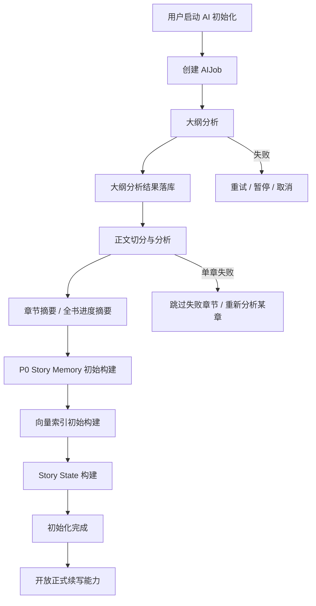

### 8.2 快速试写降级流程

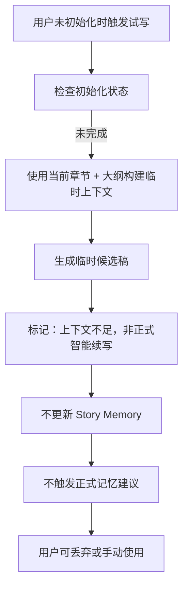

Quick Trial 不是正式续写，不等于初始化完成，不改变“正式续写必须初始化完成”的主规则。Quick Trial 只能使用当前章节、当前选区、用户输入的大纲或作品原始大纲等临时上下文；结果只能进入 Candidate Draft 或临时候选区；不得更新 Story Memory、正式 StoryState 或正式 Memory Update Suggestion，不作为正式续写质量验收依据，不绕过 Human Review Gate。

### 8.3 单章候选续写流程

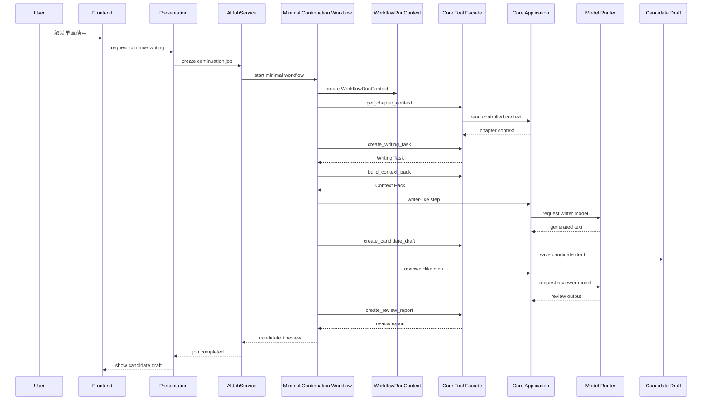

P0 的 writer-like step 与 reviewer-like step 只是 Minimal Continuation Workflow 的最小流程步骤，不是完整 Agent Runtime。P1 才升级为 AgentOrchestrator → MemoryAgent → PlannerAgent → WriterAgent → ReviewerAgent → RewriterAgent。

### 8.4 P1 Agent Workflow 流程

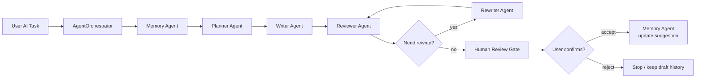

### 8.5 Candidate Draft 接受流程

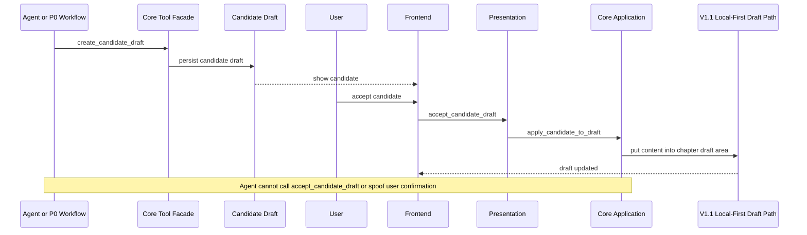

### 8.6 AI Suggestion / Conflict Guard 流程

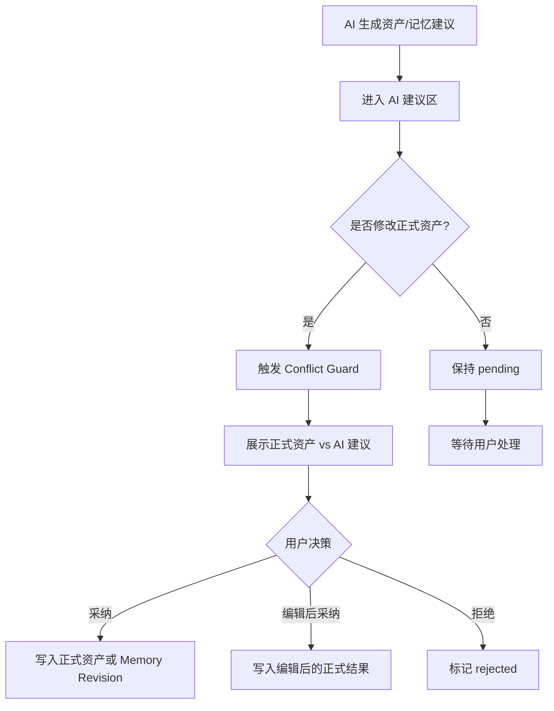

### 8.7 AI Job 状态机

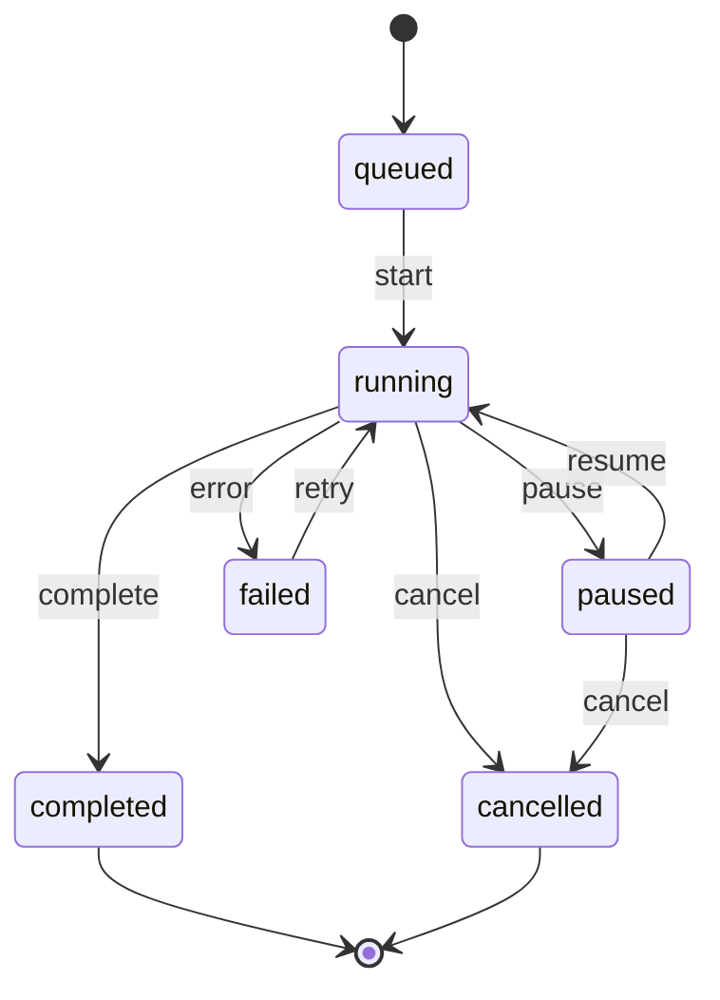

### 8.8 Candidate Draft 状态流转

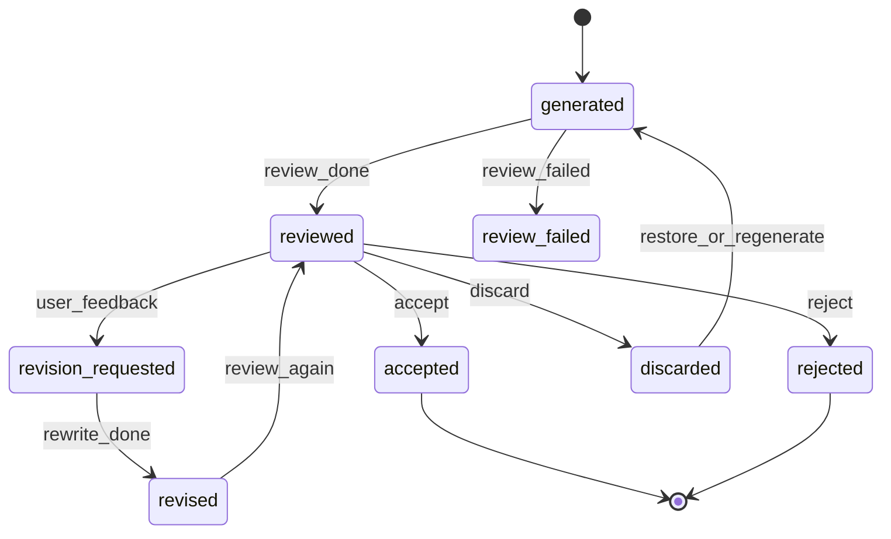

### 8.9 四层剧情轨道结构图

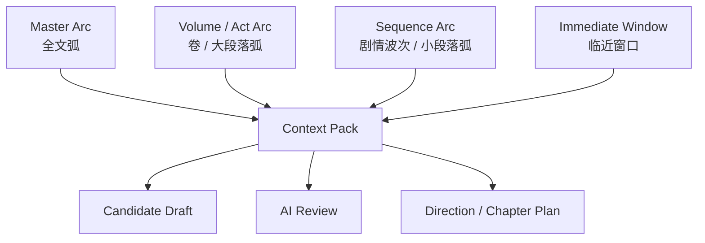

***

## 九、领域对象概要

### 9.1 核心领域对象

| 对象 | 用途 | 阶段 |
|---|---|---|
| AIJob | AI 长任务根对象 | P0 |
| AIJobStep | AI 长任务步骤 | P0 |
| WorkflowRunContext / Lightweight AgentRunContext | P0 最小单章续写编排上下文 | P0 |
| StoryMemory | 小说长期记忆 | P0/P1 |
| StoryMemoryRevision | 记忆正式更新版本 | P1 |
| StoryState | 当前故事状态锁 | P0 |
| ChapterSummary | 章节摘要 | P0 |
| StoryArc | 剧情轨道 | P1 |
| ContextPack | 上下文情报包 | P0 |
| WritingTask | 写作任务 | P0 |
| CandidateDraft | 候选稿 | P0 |
| CandidateDraftVersion | 候选稿版本 | P1 |
| ReviewReport | 审稿报告 | P0 |
| ReviewIssue | 审稿问题 | P1 |
| AISuggestion | AI 建议 | P1 |
| ConflictGuardRecord | 冲突保护记录 | P1 |
| AgentSession | 完整 Agent 会话 | P1 |
| AgentStep | 完整 Agent 步骤 | P1 |
| AgentObservation | 完整 Agent 观察记录 | P1 |
| AgentTrace | Agent 执行轨迹 | P1 |
| VectorChunk | 向量切片 | P0 |
| VectorIndexEntry | 向量索引条目 | P0 |

### 9.2 概念类图

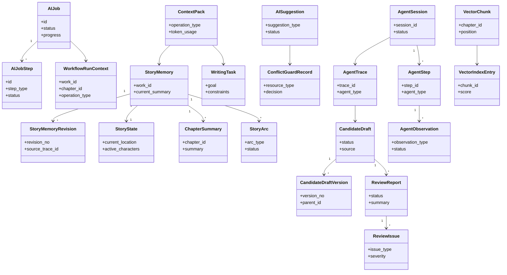

***

## 十、前端产品模块概要

### 10.1 AI Settings 页面

职责：

- 配置 Kimi / DeepSeek Key。
- 测试连接。
- 配置模型角色。
- 配置 temperature、max tokens、timeout。
- 配置预算与本地 Embedding 开关。

阶段：

- P0 落地基础配置。
- P2 增加成本看板联动。

### 10.2 作品 AI 初始化向导

职责：

- 引导用户执行大纲分析。
- 引导用户执行正文分析。
- 展示初始化条件与完成状态。

阶段：

- P0。

### 10.3 初始化进度面板

职责：

- 展示 AI Job 状态。
- 展示大纲分析、正文切分、章节摘要、人物提取、伏笔提取、向量索引构建进度。
- 支持暂停、继续、取消、失败重试。

阶段：

- P0。

### 10.4 写作页 AI 续写入口

职责：

- 触发单章候选续写。
- 检查初始化状态。
- 未初始化时提示快速试写降级。

阶段：

- P0。

### 10.5 快速试写入口

职责：

- 在未初始化时允许临时试写。
- 明确标记“上下文不足，非正式智能续写”。
- 不更新 Story Memory。

阶段：

- P0。

### 10.6 Candidate Draft 候选稿区

职责：

- 展示候选稿。
- 展示版本与来源。
- 展示审稿摘要。
- 支持接受、编辑后接受、插入、替换、丢弃、重新生成。

阶段：

- P0 基础候选稿。
- P1 多轮版本关系。
- P2 多章队列展示。

### 10.7 审稿报告面板

职责：

- 展示审稿摘要。
- 展示 Review Issue。
- 展示人物、设定、时间线、伏笔、风格、AI 味、Writing Task、剧情轨道偏离检查结果。

阶段：

- P0 基础审稿。
- P1 完整审稿。

### 10.8 AI 建议区

职责：

- 展示人物、事件、伏笔、设定、时间线、摘要、引用建议。
- 支持采纳、拒绝、编辑后采纳。

阶段：

- P1。

### 10.9 Conflict Guard 对比弹窗

职责：

- 展示正式资产与 AI 建议差异。
- 防止 AI 静默覆盖用户资产。

阶段：

- P1。

### 10.10 Agent Trace 查看面板

职责：

- 展示 trace_id。
- 展示 Agent 步骤。
- 展示 Prompt 版本、Context Pack 摘要、模型、输出、用户决策。

阶段：

- P1。

### 10.11 P1 剧情方向推演面板

职责：

- 展示 A/B/C 剧情方向。
- 展示风险点、伏笔使用、未来 3-5 章预估。
- 支持用户选择或重新生成。

阶段：

- P1。

### 10.12 P1 四层剧情轨道面板

职责：

- 展示 Master Arc、Volume / Act Arc、Sequence Arc、Immediate Window。
- 展示当前阶段位置与下一步推进方向。

阶段：

- P1。

### 10.13 P2 @ 引用和 Opening Agent 入口占位

职责：

- 为 @ 引用联想、高亮、悬停摘要保留入口。
- 为 Opening Agent 签约向开篇助手保留入口。

阶段：

- P2。

***

## 十一、错误处理与降级概要

| 场景 | 处理策略 | V1.1 是否受影响 |
|---|---|---|
| Provider Key 未配置 | 对应 AI 能力不可用，提示配置 | 不影响 |
| Provider 超时 | 任务失败或重试，记录错误 | 不影响 |
| 模型输出不符合 schema | Output Validator 拒绝，任务 retry / failed | 不影响 |
| Job 中断 | 保留 Job 状态，支持继续或重试 | 不影响 |
| 服务重启 | running Job 标记为 failed 或 paused | 不影响 |
| 向量索引未完成 | Context Pack 降级，不使用 RAG 层 | 不影响 |
| Context Pack 缺关键上下文 | 返回 blocked 或降级试写 | 不影响 |
| Story State 缺失 | 正式续写阻断或提示上下文不足 | 不影响 |
| 审稿失败 | 候选稿标记未审稿，按阶段策略处理 | 不影响 |
| 候选稿生成中断 | 保留临时候选片段 | 不影响 |
| AI 建议与正式资产冲突 | 进入 Conflict Guard | 不影响 |
| Local-First 保存冲突 | 沿用 V1.1 409 处理 | 不影响 |
| 快速试写降级 | 标记非正式智能续写，不更新记忆 | 不影响 |
| AI 不可用 | AI 入口置灰或提示 | V1.1 仍可用 |

***

## 十二、安全、隐私与成本概要

### 12.1 API Key

- API Key 必须加密存储或使用平台安全机制存储。
- 普通日志不得记录 API Key。
- 连接测试失败时标记 Provider 不可用。

### 12.2 日志脱敏

- 普通日志不得记录完整正文。
- 普通日志不得记录完整 Prompt。
- 普通日志不得记录完整草稿。
- 诊断日志导出必须脱敏。

### 12.3 Agent Trace 隐私级别

Agent Trace 默认记录：

- trace_id。
- Agent 类型。
- Prompt key 与版本。
- Context Pack 摘要。
- 引用 ID。
- 输出摘要。
- 用户决策。

完整 Prompt、完整 Context Pack、完整正文片段是否保存，进入详细设计确认。

### 12.4 成本追踪

- 记录 provider、model、role、prompt tokens、completion tokens、耗时、错误、成本、用户是否采纳。
- 支持单作品初始化预算。
- 支持单次自动续写队列预算。
- 支持月度预算。
- 超预算必须暂停并等待用户确认。

### 12.5 自动续写成本停止条件

自动续写队列遇到以下条件必须停止：

- 达到指定章数。
- 达到指定字数。
- 当前剧情阶段结束。
- 审稿发现严重冲突。
- 伏笔提前揭示。
- 连续修订失败。
- 成本上限。
- 模型失败。
- 用户手动停止。

### 12.6 用户清理能力

用户可清理：

- AI Trace。
- 调试信息。
- 失败 Job 记录。
- 丢弃候选稿。
- 过期 AI 建议。

***

## 十三、分阶段实施建议

### 13.1 P0 概要落地范围

设计重点：

- 建立 AI Infrastructure。
- 建立 AI Job System。
- 建立 P0 最小 Story Memory。
- 建立 Context Pack 最小可用版本。
- 建立 Candidate Draft 隔离层。
- 建立基础 AI Review。
- 建立 Agent-ready 的 Minimal Continuation Workflow。
- 使用 WorkflowRunContext 承载 P0 最小编排状态。
- 保证 Human Review Gate 与 V1.1 Local-First 不被破坏。

P0 不是完整 Agent Runtime。P0 不实现 AgentSession、AgentStep、AgentObservation 与完整 PPAO 循环。P0 必须通过 Core Tool Facade 调用受控能力，为 P1 Agent Runtime 预留扩展点。

P0 需要进入详细设计的模块：

- AI Settings。
- Provider 抽象与 Model Router。
- Prompt Registry。
- Output Validator。
- AI Job System。
- 大纲分析与正文分析 Job。
- P0 Story Memory。
- ContextPackService。
- Candidate Draft。
- AI Review 基础能力。

### 13.2 P1 扩展范围

设计重点：

- 引入完整 Agent Runtime。
- 引入 AgentSession、AgentStep、AgentObservation、AgentTrace。
- 引入完整 Perception → Planning → Action → Observation 循环。
- 完成五类 Agent Workflow。
- 完成四层剧情轨道。
- 完成 A/B/C 剧情方向和章节计划。
- 完成 AI 建议区与 Conflict Guard。
- 完成 Story Memory Revision。
- 完成 Agent Trace。

P1 需要进入详细设计的模块：

- Agent Runtime。
- AgentPermissionPolicy。
- Tool Facade 权限矩阵。
- P0 Minimal Continuation Workflow 到 P1 Agent Runtime 的演进方式。
- Story Arc。
- Planner Agent。
- Reviewer / Rewriter Agent。
- AI Suggestion Store。
- Conflict Guard。
- Memory Revision。
- Agent Trace。

### 13.3 P2 扩展范围

设计重点：

- 多章续写。
- 受控自动连续续写队列。
- Style DNA。
- Citation Link。
- @ 标签引用。
- Opening Agent。
- 成本看板。
- 分析看板。

P2 需要进入详细设计的模块：

- 自动续写队列。
- 多章 Candidate Draft。
- Style DNA 提取。
- Citation Link 元数据。
- `chapter_mentions` 与 @ 引用交互。
- Opening Agent。
- 成本看板。
- 分析看板。

### 13.4 后续详细设计优先级

建议优先级：

1. Tool Facade 与权限边界。
2. AI Job System。
3. P0 Story Memory 与 Context Pack。
4. Candidate Draft 与 Human Review Gate。
5. Provider / Model Router / Prompt Registry。
6. AI Review。
7. P0 Minimal Continuation Workflow 到 P1 Agent Runtime 的演进。
8. Story Arc。
9. AI Suggestion / Conflict Guard。
10. Vector Recall。
